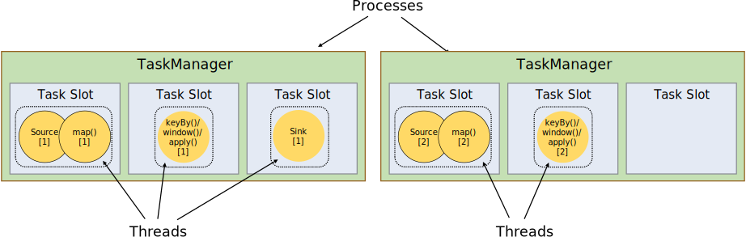
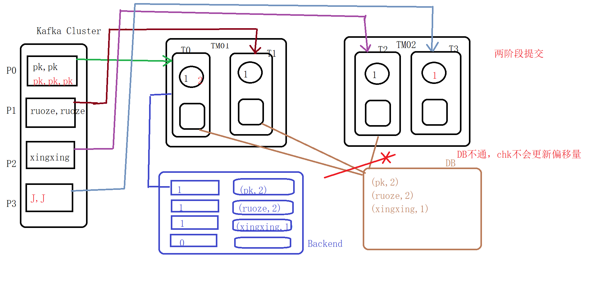

# 1 简介

## 技术公众号

- flink技术社区
- datafuntalk
- hbase中文社区

## 流式系统3大目标

容错性

数据一致性

偏移量管理（Kafka）


# 2 部署

## 环境准备(本地开发)

- out of the box：OOTB 开箱即用
- [镜像下载](https://mirrors.tuna.tsinghua.edu.cn/apache)

```shell
# 第一种创建项目的方式：
mvn archetype:generate \
-DarchetypeGroupId=org.apache.flink \
-DarchetypeArtifactId=flink-quickstart-java \
-DarchetypeVersion=1.12.4 \
-DarchetypeCatalog=local
```

- yarn

```shell
./bin/flink run ./examples/batch/WordCount.jar \
-input hdfs://hadoop000:8020/LICENSE-2.0.txt \
-output hdfs://hadoop000:8020/wordcount-result.txt

./bin/flink run -m yarn-cluster -yn 1 ./examples/batch/WordCount.jar

# 非yarn
./bin/flink run examples/streaming/SocketWindowWordCount.jar --port 9000
./bin/flink run -c 类名 -s hdfs://hadoop000:8020:/path/to/chk-80 xxx.jar # 状态恢复计算
```

- pom

```xml
<properties>
  <maven.compiler.source>1.8</maven.compiler.source>
  <maven.compiler.target>1.8</maven.compiler.target>
  <encoding>UTF-8</encoding>
  <scala.binary.version>2.12</scala.binary.version>
  <scala.version>2.12.10</scala.version>
  <flink.version>1.12.0</flink.version>
  <hadoop.version>3.2.2</hadoop.version>
  <mysql.version>5.1.28</mysql.version>
  <scalikejdbc.version>3.4.0</scalikejdbc.version>
  <junit.version>4.12</junit.version>
  <log4j.version>2.12.1</log4j.version>
</properties>

<repositories>
  <repository>
    <id>aliyun</id>
    <url>http://maven.aliyun.com/nexus/content/groups/public</url>
  </repository>
</repositories>

<dependencyManagement>
  <dependencies>
    <!--Flink整合Scala的依赖： 并不需要单独导入Scala，因为这个依赖中已经间接引入了-->
    <dependency>
      <groupId>org.apache.flink</groupId>
      <artifactId>flink-streaming-scala_${scala.binary.version}</artifactId>
      <version>${flink.version}</version>
    </dependency>

    <dependency>
      <groupId>org.apache.flink</groupId>
      <artifactId>flink-clients_${scala.binary.version}</artifactId>
      <version>${flink.version}</version>
    </dependency>

    <!-- These dependencies are excluded from the application JAR by default. -->
    <dependency>
      <groupId>org.apache.logging.log4j</groupId>
      <artifactId>log4j-slf4j-impl</artifactId>
      <version>${log4j.version}</version>
      <scope>runtime</scope>
    </dependency>
    <dependency>
      <groupId>org.apache.logging.log4j</groupId>
      <artifactId>log4j-api</artifactId>
      <version>${log4j.version}</version>
      <scope>runtime</scope>
    </dependency>
    <dependency>
      <groupId>org.apache.logging.log4j</groupId>
      <artifactId>log4j-core</artifactId>
      <version>${log4j.version}</version>
      <scope>runtime</scope>
    </dependency>
  </dependencies>
</dependencyManagement>
```

- log4j2.properties

```properties
rootLogger.level = INFO
rootLogger.appenderRef.console.ref = ConsoleAppender

appender.console.name = ConsoleAppender
appender.console.type = CONSOLE
appender.console.layout.type = PatternLayout
appender.console.layout.pattern = %d{HH:mm:ss,SSS} %-5p %-60c %x - %m%n
```

## 配置[#](https://nightlies.apache.org/flink/flink-docs-release-1.12/deployment/config.html)

```yml
# Web参数
org.apache.flink.configuration.WebOptions

# org.apache.flink.configuration
# java.io.tmpdir: [/tmp]
org.apache.flink.configuration.ConfigConstants

# 常用配置
jobmanager.rpc.address           # master节点的地址
jobmanager.heap.mb  jobmanager   # 节点可用的内存
taskmanager.heap.mb taskmanager  # 节点可用的内存
taskmanager.numberOfTaskSlots    # 每个机器可用的cpu个数
parallelism.default              # 任务的并行度
taskmanager.tmp.dirs             # taskmanager的临时数据存储目录

# ON YARN是企业级用的最多的方式
-n taskmanager的数量
-jm jobmanager的内存
-tm taskmanager的内存
```

- 全局参数设置

```scala
import org.apache.flink.api.java.utils.ParameterTool

val env = StreamExecutionEnvironment.getExecutionEnvironment
val parameters = ParameterTool.fromPropertiesFile(args(0))

env.getConfig.setGlobalJobParameters()
```


# Flink编程模型

- 大数据处理的流程:

​	MapReduce：input -> map(reduce) -> output
​	Storm:  input -> Spout/Bolt -> output
​	Spark: input -> transformation/action --> output
​	Flink:  input ->  transformation/sink --> output

- [DataSet](https://ci.apache.org/projects/flink/flink-docs-release-1.8/dev/batch/) and DataStream特点
  	immutable
  	批处理：DataSet
  	流处理：DataStream
- Flink编程模型
  	1）获取执行环境
  	2）获取数据
  	3）transformation
  	4）sink
  	5）触发执行


## Task SubTask

- Task任务
  - 是一个阶段多个相同功能的subtask的集合（TaskSet）
  - hash 和 rebalance产生


- SubTas
  - Flink任务执行的最小单元


- [执行计划可视化](https://flink.apache.org/visualizer/)

```scala
val env = StreamExecutionEnvironment.createLocalEnvironmentWithWebUI()
env.setParallelism(3)
val stream: DataStream[String] = env.socketTextStream("localhost", 9527)
stream.flatMap(_.split(","))
  .slotSharingGroup("big-slot")
  .map((_,1))
  .keyBy(0)  // shuffle ==> Spark: 2stage  Flink:task
  .sum(1).print()

println(env.getExecutionPlan)  // 生成执行计划json
env.execute("task")
```


### [Tasks and Operator Chains](https://nightlies.apache.org/flink/flink-docs-release-1.10/concepts/runtime.html)

For distributed execution, Flink *chains* operator subtasks together into *tasks*. Each task is executed by one thread. Chaining operators together into tasks is a useful optimization: it reduces the overhead of thread-to-thread handover and buffering, and increases overall throughput while decreasing latency. The chaining behavior can be configured; see the [chaining docs](https://nightlies.apache.org/flink/flink-docs-release-1.10/dev/stream/operators/#task-chaining-and-resource-groups) for details.

The sample dataflow in the figure below is executed with five subtasks, and hence with five parallel threads.


### Flink如何划分Task

1. 并行度发送变化
2. keyBy等算子
3. startNewChain 开启一个新chain
4. disableChaining 当前算子操作单独出来（切分复杂算子）
5. SubTask = 并行度

```scala
val stream: DataStream[String] = env.socketTextStream("localhost", 9527)

println(stream.parallelism)
stream.flatMap(_.split(",")).filter(!_.startsWith("a")).startNewChain().disableChaining()
  .map((_,1))
  .keyBy(0)  // shuffle ==> Spark: 2stage  Flink:task
  .sum(1).print()
```

#### slot槽

- 不指定，为default

- 不同task下的 subtask可以运行在同一个slot ==> pipeline

- 同一task下的 subtask不能运行在一个slot下
- 如果slot资源不足，会一直处于create状态，维持5分钟，整个job会挂掉


### Job Managers, Task Managers, Clients

The Flink runtime consists of two types of processes:

- The **JobManagers** (also called *masters*) coordinate the distributed execution. They schedule tasks, coordinate checkpoints, coordinate recovery on failures, etc.

  There is always at least one Job Manager. A high-availability setup will have multiple JobManagers, one of which one is always the *leader*, and the others are *standby*.

- The **TaskManagers** (also called *workers*) execute the *tasks* (or more specifically, the subtasks) of a dataflow, and buffer and exchange the data *streams*.

  There must always be at least one TaskManager.

The JobManagers and TaskManagers can be started in various ways: directly on the machines as a [standalone cluster](https://nightlies.apache.org/flink/flink-docs-release-1.10/ops/deployment/cluster_setup.html), in containers, or managed by resource frameworks like [YARN](https://nightlies.apache.org/flink/flink-docs-release-1.10/ops/deployment/yarn_setup.html) or [Mesos](https://nightlies.apache.org/flink/flink-docs-release-1.10/ops/deployment/mesos.html). TaskManagers connect to JobManagers, announcing themselves as available, and are assigned work.

The **client** is not part of the runtime and program execution, but is used to prepare and send a dataflow to the JobManager. After that, the client can disconnect, or stay connected to receive progress reports. The client runs either as part of the Java/Scala program that triggers the execution, or in the command line process `./bin/flink run ...`


## Task Slots and Resources

Each worker (TaskManager) is a *JVM process*, and may execute one or more subtasks in separate threads. To control how many tasks a worker accepts, a worker has so called **task slots** (at least one).

Each *task slot* represents a fixed subset of resources of the TaskManager. A TaskManager with three slots, for example, will dedicate 1/3 of its managed memory to each slot. Slotting the resources means that a subtask will not compete with subtasks from other jobs for managed memory, but instead has a certain amount of reserved managed memory. Note that no CPU isolation happens here; currently slots only separate the managed memory of tasks.

By adjusting the number of task slots, users can define how subtasks are isolated from each other. Having one slot per TaskManager means each task group runs in a separate JVM (which can be started in a separate container, for example). Having multiple slots means more subtasks share the same JVM. Tasks in the same JVM share TCP connections (via multiplexing) and heartbeat messages. They may also share data sets and data structures, thus reducing the per-task overhead.



By default, Flink allows subtasks to share slots even if they are subtasks of different tasks, so long as they are from the same job. The result is that one slot may hold an entire pipeline of the job. Allowing this *slot sharing* has two main benefits:

- A Flink cluster needs exactly as many task slots as the highest parallelism used in the job. No need to calculate how many tasks (with varying parallelism) a program contains in total.
- It is easier to get better resource utilization. Without slot sharing, the non-intensive *source/map()* subtasks would block as many resources as the resource intensive *window* subtasks. With slot sharing, increasing the base parallelism in our example from two to six yields full utilization of the slotted resources, while making sure that the heavy subtasks are fairly distributed among the TaskManagers.


The APIs also include a *[resource group](https://nightlies.apache.org/flink/flink-docs-release-1.10/dev/stream/operators/#task-chaining-and-resource-groups)* mechanism which can be used to prevent undesirable slot sharing.

As a rule-of-thumb, a good default number of task slots would be the number of CPU cores. With hyper-threading, each slot then takes 2 or more hardware thread contexts.


## Programs and Dataflows

The basic building blocks of Flink programs are **streams** and **transformations**. (Note that the DataSets used in Flink’s DataSet API are also streams internally – more about that later.) Conceptually a *stream* is a (potentially never-ending) flow of data records, and a *transformation* is an operation that takes one or more streams as input, and produces one or more output streams as a result.

When executed, Flink programs are mapped to **streaming dataflows**, consisting of **streams** and transformation **operators**. Each dataflow starts with one or more **sources** and ends in one or more **sinks**. The dataflows resemble arbitrary **directed acyclic graphs** *(DAGs)*. Although special forms of cycles are permitted via *iteration* constructs, for the most part we will gloss over this for simplicity.


## [Parallel Dataflows](https://nightlies.apache.org/flink/flink-docs-release-1.10/concepts/programming-model.html)

Programs in Flink are inherently parallel and distributed. During execution, a *stream* has one or more **stream partitions**, and each *operator* has one or more **operator subtasks**. The operator subtasks are independent of one another, and execute in different threads and possibly on different machines or containers.

The number of operator subtasks is the **parallelism** of that particular operator. The parallelism of a stream is always that of its producing operator. Different operators of the same program may have different levels of parallelism.


Streams can transport data between two operators in a *one-to-one* (or *forwarding*) pattern, or in a *redistributing* pattern:

- **One-to-one** streams (for example between the *Source* and the *map()* operators in the figure above) preserve the partitioning and ordering of the elements. That means that subtask[1] of the *map()* operator will see the same elements in the same order as they were produced by subtask[1] of the *Source* operator.
- **Redistributing** streams (as between *map()* and *keyBy/window* above, as well as between *keyBy/window* and *Sink*) change the partitioning of streams. Each *operator subtask* sends data to different target subtasks, depending on the selected transformation. Examples are *keyBy()* (which re-partitions by hashing the key), *broadcast()*, or *rebalance()* (which re-partitions randomly). In a *redistributing* exchange the ordering among the elements is only preserved within each pair of sending and receiving subtasks (for example, subtask[1] of *map()* and subtask[2] of *keyBy/window*). So in this example, the ordering within each key is preserved, but the parallelism does introduce non-determinism regarding the order in which the aggregated results for different keys arrive at the sink.

Details about configuring and controlling parallelism can be found in the docs on [parallel execution](https://nightlies.apache.org/flink/flink-docs-release-1.10/dev/parallel.html).


## 案例

### Scala

- Stream

```scala
import org.apache.flink.streaming.api.scala.{DataStream, StreamExecutionEnvironment}
import org.apache.flink.api.scala._

/**
 Flink中并行度的问题
 * 1) env
 * 2) source
 * 3) transformation
 * 4) sink
 *
 * fromCollection/socketTextStream/fromElement 单并行度
 */
val environment = StreamExecutionEnvironment.getExecutionEnvironment
val text: DataStream[String] = environment.socketTextStream("hadoop000", 9527)

 /**
  * 业务处理
  * 2) 获取数据源
  * 3) transformation
  * 4) sink
  */
text.flatMap(_.toLowerCase.split(","))
.map(x => WC(x,1))  // 单词 ==> (单词，1)
.keyBy(_.word)
.sum("cnt")
.print()  // 在Flink中就是一个最简单的sink
.setParallelism(2)

// 5) 执行 Trigger
environment.execute("StreamingWCApp")
```

- batch

```scala
val environment = ExecutionEnvironment.getExecutionEnvironment
val text: DataSet[String] = environment.readTextFile("data/wc.data")

text.flatMap(_.toLowerCase.split(","))
  .map((_,1))
  .groupBy(0)  // tuple(单词，1)
  .sum(1)
  .print()  // 在Flink中就是一个最简单的sink
```

### Java

```java
StreamExecutionEnvironment environment = StreamExecutionEnvironment.getExecutionEnvironment();

DataStreamSource<String> stream = environment.socketTextStream("localhost", 9527);
stream.flatMap((String line, Collector<String> outer) -> {
  Arrays.stream(line.split(",")).forEach(outer::collect);
}).returns(Types.STRING)
  .map(x -> Tuple2.of(x, 1)).returns(Types.TUPLE(Types.STRING, Types.INT))
  .keyBy(x -> x.f0)
  .sum(1)
  .print();

environment.execute("StreamingWCAppJava");
```


# [Basic API Concepts](https://ci.apache.org/projects/flink/flink-docs-release-1.8/dev/api_concepts.html#basic-api-concepts)

## Function

### 1 map

```scala
// MapFunction
public interface MapFunction<T> extends Function, Serializable {}
```

- 自定义map

```scala
// 方式1
val stream = environment.socketTextStream("hadoop000", 9527)

stream.transform("dataMap", new StreamMap(new MapFunction[String,Int] {
  override def map(value: String): Int = value.toInt * 10
})).print()

environment.execute("TransformationApp")
```

```scala
// 方式2
class DataStreamMap extends AbstractStreamOperator[Int] with OneInputStreamOperator[String,Int] {
  override def processElement(element: StreamRecord[String]): Unit = {
    val result = element.getValue.toInt * 10
    val value = new StreamRecord(result)
    
    output.collect(value)
  }
}

// 运行代码 main
val stream = environment.socketTextStream("hadoop000", 9527)
stream.transform("datamap_new", new DataStreamMap).print()
environment.execute("TransformationApp")
```

### 2 Filter

```scala
// FilterFunction
public interface FilterFunction<T> extends Function, Serializable {}
```

- 自定义filter

```scala
class DataStreamFlatMap extends AbstractStreamOperator[String] with OneInputStreamOperator[String,String] {
  override def processElement(element: StreamRecord[String]): Unit = {
    val splits = element.getValue.split(",")
    splits.filter(_ != "pk").map(x => {
      output.collect(element.replace(x))
    })
  }
}
```

### 3 flatMap

```scala
// FlatMapFunction
public interface FlatMapFunction<T, O> extends Function, Serializable {}
```

### 4 RichFunction

- 有生命周期
- open => xxx => close

```scala
public interface RichFunction extends Function {
  void open(Configuration parameters) throws Exception;
  void close() throws Exception;
}
```
- RichFilterFunction

```scala
// 代码1
class DataRichFilter(traffics:Double) extends RichFilterFunction[Access]{

  override def open(parameters: Configuration): Unit = {
    println("~~~~~~~~~~~~DataRichFilter.open~~~~~~~~~~~~~")  // open数与并行度有关
  }

  override def filter(value: Access): Boolean = {
    println("~~~~~~~~~~~~DataRichFilter.filter~~~~~~~~~~~~~")
    value.traffics > traffics
  }

  override def getRuntimeContext: RuntimeContext = super.getRuntimeContext

  override def close(): Unit = super.close()
}

// 代码2
import com.flink.domain.Domain.Access
import org.apache.flink.api.common.functions.FilterFunction
import org.apache.flink.streaming.api.scala.{DataStream, StreamExecutionEnvironment}
import org.apache.flink.api.scala._

object ByKeyApp {
  def main(args: Array[String]): Unit = {
    val environment = StreamExecutionEnvironment.getExecutionEnvironment
    environment.setParallelism(3)
    val stream = environment.readTextFile("data/access.log")
    val accessStream = stream.map(x => {
      val splits = x.split(",")
      Access(splits(0).trim.toLong, splits(1).trim, splits(2).trim.toDouble)
    })

    accessStream.filter(new DataRichFilter(5000)).print()

    environment.execute("StreamingWCApp")
  }
}

// 代码3
case class Access(time:Long, domain:String, traffics:Double)
```

### 5 coMap

- connect
  - 不同的数据类型  就支持2个流   **两个流可以共享state**
- union
  - 相同的数据类型  可以支持多流(>=2个流)

```scala
val stream1: DataStream[String] = environment.socketTextStream("hadoop000", 9527)
val stream2: DataStream[Int] = environment.socketTextStream("hadoop000", 9528).map(_.toInt)

val connected: ConnectedStreams[String, Int] = stream1.connect(stream2)
connected.map(new CoMapFunction[String, Int, String] {
  // 对第1个流处理
  override def map1(value: String): String = value.toUpperCase()
  // 对第2个流处理
  override def map2(value: Int): String = value * 10 + ""
}).print()
```

### 6 keyBy

```scala
val stream = environment.readTextFile("data/traffics.txt")
stream.map(x => {
    val splits = x.split(",")
    (splits(0), splits(1), splits(2).toLong)
  })
  .keyBy(0, 1)                                                             // 方式1

  .keyBy(x => (x._1, x._2))                                                // 方式2

  .keyBy(new KeySelector[(String,String,Long),(String,String)] {           // 方式3 KeySelector
    override def getKey(value: (String, String, Long)): (String, String) = {
      (value._1, value._2)
    }
  })
  .sum(2).print()

// 案例2
stream.map(x => {
      val splits = x.split(",")
      ProvinceCityTraffics(splits(0), splits(1), splits(2).toLong)
    })
		.keyBy(x => (x.province, x.city))
		.keyed.sum("traffics").print()
```

### 7 reduce

```scala
val stream = environment.socketTextStream("hadoop000", 9527)
val keyed: KeyedStream[(String, Int), String] = stream.flatMap(_.split(","))
	.map((_, 1))
	.keyBy(x => x._1)

val result: DataStream[(String, Int)] = keyed.reduce((x, y) => (x._1, x._2 + y._2))
result.print()
```

### 8 partition分区

```scala
class DataPartitioner extends Partitioner[String] {
  override def partition(key: String, numPartitions: Int): Int = {
    if("ruozedata.com" == key) {
      0
    } else if("ruoze.ke.qq.com" == key) {
      1
    } else {
      2
    }
  }
}

// 自定义分区
environment.addSource(new AccessSource)
        .map(x => (x.domain, x))
        .partitionCustom(new DataPartitioner, 0)
        .map(x => {
          println("current thread id is:" + Thread.currentThread().getId + " , value is:" + x)
          x._2
        }).print()
```


### SideOutput

```scala
// 大于39度的人sideoutput输出: pk,1000,37.6
  val stream: DataStream[Temperature] = environment.socketTextStream("localhost", 9527).map(x => {
    val splits = x.split(",")
    Temperature(splits(0).trim, splits(1).trim.toLong, splits(2).toFloat)
  }).process(new TemperatureProcessor(39.9f))

  stream.print("正常的")
  stream.getSideOutput(new OutputTag[(String, Long, Float)]("high")).print("高的")
  environment.execute("WindowFunctionApp")

}

class TemperatureProcessor(threshold: Float) extends ProcessFunction[Temperature,Temperature] {
  override def processElement(value: Temperature, ctx: ProcessFunction[Temperature, Temperature]#Context, out: Collector[Temperature]): Unit = {
    if (value.temperature <= threshold) {
      out.collect(value)
    } else  {
      // 不符合预期的就通过side output方式输出
      ctx.output(new OutputTag[(String, Long, Float)]("high"), (value.name, value.time, value.temperature))
    }
  }
}

case class Temperature(name:String, time:Long, temperature: Float)
```


## Source

- fromCollection/socketTextStream/fromElements 是单并行度
- fromParallelCollection/generateSequence/readTextFile  是多并行度

- SourceFunction 是单并行度的，如果你设置多并行度，报错
- ParallelSourceFunction/RichParallelSourceFunction 是多并行度的


```scala
object Domain {
  case class Access(time:Long, domain:String, traffics:Double)

  case class Student(id:Int, name:String, age:Int)

  case class ProvinceCityTraffics(province:String, city:String, traffics:Long)
}

// main
val environment: StreamExecutionEnvironment = StreamExecutionEnvironment.getExecutionEnvironment
val stream = environment.addSource(new AccessSource) //.setParallelism(3)
println(stream.parallelism)
val filterStream = stream.filter(_.traffics > 200)
println(filterStream.parallelism)
filterStream.print()

environment.execute("SourceApp")
```

### SourceFunction

```scala
import com.flink.domain.Domain.Access
import org.apache.flink.streaming.api.functions.source.SourceFunction
import scala.util.Random

class AccessSource extends SourceFunction[Access]{
  var running = true

  override def run(ctx: SourceFunction.SourceContext[Access]): Unit = {
    val random = new Random()
    val domains = Array("data.com", "big.ke.qq.com", "github.com/data")

    while (running) {
      val ts = System.currentTimeMillis()
      1.to(10).map(x => {
        ctx.collect(Access(ts, domains(random.nextInt(domains.length)), random.nextInt(1000) + x))
      })
      Thread.sleep(5000)
    }
  }

  override def cancel(): Unit = {
    running = false
  }
}
```

### ParallelSourceFunction

```scala
import org.apache.flink.streaming.api.functions.source.{ParallelSourceFunction, SourceFunction}
import scala.util.Random

class AccessSourceV2 extends ParallelSourceFunction[Access]{
  var running = true

  override def run(ctx: SourceFunction.SourceContext[Access]): Unit = {
    val random = new Random()
    val domains = Array("data.com", "big.ke.qq.com", "github.com/data")

    while (running) {
      val ts = System.currentTimeMillis()
      1.to(10).map(x => {
        ctx.collect(Access(ts, domains(random.nextInt(domains.length)), random.nextInt(1000) + x))
      })
      Thread.sleep(5000)
    }
  }

  override def cancel(): Unit = {
    running = false
  }
}
```

### RichParallelSourceFunction

```scala
import org.apache.flink.configuration.Configuration
import org.apache.flink.streaming.api.functions.source.{ParallelSourceFunction, RichParallelSourceFunction, SourceFunction}
import scala.util.Random

class AccessSourceV3 extends RichParallelSourceFunction[Access]{
  var running = true

  override def open(parameters: Configuration): Unit = {
    println("==AccessSourceV3 open invoked==>")
  }

  override def run(ctx: SourceFunction.SourceContext[Access]): Unit = {
    println(getRuntimeContext.getIndexOfThisSubtask + "==run invoked==>")

    val random = new Random()
    val domains = Array("data.com", "big.ke.qq.com", "github.com/data")

    while (running) {
      val ts = System.currentTimeMillis()
      1.to(10).map(x => {
        ctx.collect(Access(ts, domains(random.nextInt(domains.length)), random.nextInt(1000) + x))
      })
      Thread.sleep(5000)
    }
  }

  override def cancel(): Unit = {
    running = false
  }
}
```

### MySQLSource

```scala
import java.sql.{Connection, PreparedStatement}

import com.flink.domain.Domain.Student
import com.flink.utils.MySQLUtils
import org.apache.flink.configuration.Configuration
import org.apache.flink.streaming.api.functions.source.{RichSourceFunction, SourceFunction}

class MySQLSource extends RichSourceFunction[Student]{
  var connection:Connection = _
  var pstmt:PreparedStatement = _

  override def open(parameters: Configuration): Unit = {
    connection = MySQLUtils.getConnection()
    pstmt = connection.prepareStatement("select * from student")
  }

  override def close(): Unit = {
    MySQLUtils.closeConnection(connection, pstmt)
  }

  override def run(ctx: SourceFunction.SourceContext[Student]): Unit = {
    val rs = pstmt.executeQuery()
    while(rs.next()) {
      val id = rs.getInt("id")
      val name = rs.getString("name")
      val age = rs.getInt("age")
      ctx.collect(Student(id, name, age))
    }
  }

  override def cancel(): Unit = ???
}
```

- MySQL工具类

```scala
import java.sql.{Connection, DriverManager, PreparedStatement}

object MySQLUtils {
  def getConnection() = {
    Class.forName("com.mysql.jdbc.Driver")
    DriverManager.getConnection("jdbc:mysql://hadoop000:3306/test", "root", "xxxxx")
  }
  
  def closeConnection(connection:Connection): Unit = {
    if(null != connection) connection.close()
  }

  def closeConnection(connection: Connection, pstmt:PreparedStatement): Unit = {
    if(pstmt != null) pstmt.close()
    if(connection != null) connection.close()
  }
}
```

## Sink

- RichSinkFunction<T>  
  - T就是你要写入对象的类型
- 重写方法
  - Open/close  生命周期方法
  - invoke 每条记录执行一次

```scala
val res = environment.readTextFile("data/access.log")
              .map(x => {
                val splits = x.split(",")
                (splits(1).trim, splits(2).trim.toDouble)
              }).keyBy(x => x._1).sum(1)  //(String,Double)

res.addSink(new DataMySQLSink)

environment.execute("SinkApp")
```

### MySQLSink

```scala
class DataMySQLSink extends RichSinkFunction[(String,Double)] {
  var connection:Connection = _
  var insertPsmt:PreparedStatement = _
  var updatePstmt:PreparedStatement = _

  override def open(parameters: Configuration): Unit = {
    connection = MySQLUtils.getConnection()
    insertPsmt = connection.prepareStatement("insert into data_traffic(domain, traffic) values(?,?)")
    updatePstmt = connection.prepareStatement("update data_traffic set traffic=? where domain=?")
  }

  override def close(): Unit = {
    if(insertPsmt != null) insertPsmt.close()
    if(updatePstmt != null) updatePstmt.close()
    if(connection != null) connection.close()
  }

  // Window
  override def invoke(value: (String, Double)): Unit = {
    println(".....invoke invoked....." + value._1 + "===> " + value._2)

    updatePstmt.setDouble(1, value._2)
    updatePstmt.setString(2, value._1)
    updatePstmt.execute()

    if(updatePstmt.getUpdateCount == 0) {
      insertPsmt.setString(1, value._1)
      insertPsmt.setDouble(2, value._2)
      insertPsmt.execute()
    }
  }
}
```

- insert与update合二为一

```sql
# 如果unique key为domain，当domain重复，更新traffic，否则insert
insert into data_traffic(domain, traffic) values(?,?) on duplicate key update traffic=?
```


### RedisSink

```scala
val res = environment.readTextFile("data/access.log")
            .map(x => {
              val splits = x.split(",")
              (splits(1).trim, splits(2).trim.toDouble)
            }).keyBy(x => x._1).sum(1)  //(String,Double)

  val conf = new FlinkJedisPoolConfig.Builder()
    .setDatabase(6)
    .setHost("ruozedata001").setPort(16379).build()
  res.addSink(new RedisSink[(String, Double)](conf, new RedisExampleMapper))
```

- pom

```xml
<dependency>
  <groupId>org.apache.bahir</groupId>
  <artifactId>flink-connector-redis_2.11</artifactId>
  <version>1.0</version>
</dependency>

<!-- 方式二 Jedis 自行构建RichSinkFunction -->
<dependency>
    <groupId>redis.clients</groupId>
    <artifactId>jedis</artifactId>
    <version>3.7.1</version>
</dependency>
```


### consoleSink

```scala
class DataConsoleSink extends RichSinkFunction[String] {

  var subTaskId:Int = _

  override def open(parameters: Configuration): Unit = {
    subTaskId = getRuntimeContext.getIndexOfThisSubtask
  }

  override def invoke(value: String, context: SinkFunction.Context): Unit = {
    println(subTaskId+1 + ">>>>>>" + value)
  }
}
```

### KafkaSink

```scala
/**
 * 离线： hdfs==>etl==>hdfs  分层  数据交换载体：HDFS
 * 实时： kafka==>etl==>kafka  分层  数据交换载体：kafka
 */
val environment = StreamExecutionEnvironment.createLocalEnvironmentWithWebUI(new Configuration())
val stream = environment.socketTextStream("localhost", 9527)

val brokers = "hadoop000:9092"
val topic = "flink01"
val myProducer = new FlinkKafkaProducer[String](brokers, topic, new SimpleStringSchema()) // fault-tolerance

stream.addSink(myProducer)
environment.execute("SinkApp")
```


## StreamSet API

- SourceFunction for non-parallel sources
- ParallelSourceFunction for parallel sources
- RichParallelSourceFunction for custom parallel sources


## DataSet&DataStream API

- 1) 熟悉两套API：DataSet/DataStream   Java/Scala
  - MapReduce ==> Hive  SQL	
  - Spark ==> Spark SQL
  - Flink ==> SQL
- 2) Flink是支持批处理/流处理，如何做到API层面的统一	
  - ==> Table & SQL API  关系型API
  - Everybody knows SQL

### 异步Asynchronous I/O[#](https://nightlies.apache.org/flink/flink-docs-release-1.10/dev/stream/operators/asyncio.html#asynchronous-i-o-for-external-data-access)

#### The need for Asynchronous I/O Operations

When interacting with external systems (for example when enriching stream events with data stored in a database), one needs to take care that communication delay with the external system does not dominate the streaming application’s total work.

Naively accessing data in the external database, for example in a `MapFunction`, typically means **synchronous** interaction: A request is sent to the database and the `MapFunction` waits until the response has been received. In many cases, this waiting makes up the vast majority of the function’s time.

Asynchronous interaction with the database means that a single parallel function instance can handle many requests concurrently and receive the responses concurrently. That way, the waiting time can be overlayed with sending other requests and receiving responses. At the very least, the waiting time is amortized over multiple requests. This leads in most cased to much higher streaming throughput.


*Note:* Improving throughput by just scaling the `MapFunction` to a very high parallelism is in some cases possible as well, but usually comes at a very high resource cost: Having many more parallel MapFunction instances means more tasks, threads, Flink-internal network connections, network connections to the database, buffers, and general internal bookkeeping overhead.

#### Prerequisites

As illustrated in the section above, implementing **proper asynchronous I/O to a database (or key/value store) requires a client to that database that supports asynchronous requests**. Many popular databases offer such a client.

In the absence of such a client, one can try and turn a synchronous client into a limited concurrent client by creating multiple clients and handling the synchronous calls with a thread pool. However, this approach is usually less efficient than a proper asynchronous client.

#### Async I/O API

Flink’s Async I/O API allows users to use asynchronous request clients with data streams. The API handles the integration with data streams, well as handling order, event time, fault tolerance, etc.

Assuming one has an asynchronous client for the target database, three parts are needed to implement a stream transformation with asynchronous I/O against the database:

- An implementation of `AsyncFunction` that dispatches the requests
- A *callback* that takes the result of the operation and hands it to the `ResultFuture`
- Applying the async I/O operation on a DataStream as a transformation


```scala
// 公共代码
object Domain {

  case class AccessLog(domain:String, userId:String, time:String)

  case class AccessLogV2(time:String, domain:String, province:String, city:String)
}
```

#### 案例1 http

```scala
import java.util.concurrent.TimeUnit
import com.alibaba.fastjson.JSON
import etl.bean.Domain.AccessLogV2
import etl.utils.Keys
import org.apache.flink.api.scala._
import org.apache.flink.configuration.Configuration
import org.apache.flink.runtime.concurrent.Executors
import org.apache.flink.streaming.api.scala.async.{ResultFuture, RichAsyncFunction}
import org.apache.flink.streaming.api.scala.{AsyncDataStream, StreamExecutionEnvironment}
import org.apache.http.client.config.RequestConfig
import org.apache.http.client.methods.HttpGet
import org.apache.http.impl.nio.client.{CloseableHttpAsyncClient, HttpAsyncClients}
import org.apache.http.util.EntityUtils
import scala.concurrent.{ExecutionContext, Future}
/**
 * 1) open: 创建Client
 * 2) close: 释放资源操作
 * 3) asyncInvoke: 完成业务逻辑
 *   resultFutureRequested: Future[OUT]
 *   resultFutureRequested.onSuccess中case的匹配类型与Future[OUT]一致
 *   匹配的业务逻辑中resultFuture.complete(Iterable(DataStream中真正的数据类型))
 * 4) 主方法中：AsyncDataStream(同步流, 自定义实现类, 超时时间, 时间的单位)
 **/
object HttpETLAsyncApp {
    def main(args: Array[String]): Unit = {
        val env = StreamExecutionEnvironment.getExecutionEnvironment
        env.setParallelism(1)

        // 2022-07-10 18:10:13,222.55.57.83,google.com,00000002
        val stream = env.socketTextStream("localhost", 9527)
        val result = AsyncDataStream.unorderedWait(stream, new DataAsyncHttpRequest, 1000, TimeUnit.MILLISECONDS)
        result.print()
        env.execute(getClass.getCanonicalName)
    }
}

class DataAsyncHttpRequest extends RichAsyncFunction[String, AccessLogV2] {

    implicit lazy val executor: ExecutionContext = ExecutionContext.fromExecutor(Executors.directExecutor())
    var httpClient:CloseableHttpAsyncClient = _

    override def open(parameters: Configuration): Unit = {
        val requestConfig = RequestConfig.custom().setSocketTimeout(5000).setConnectTimeout(5000).build()

        httpClient = HttpAsyncClients.custom().setMaxConnTotal(20).setDefaultRequestConfig(requestConfig).build()
        httpClient.start()
    }

    override def close() = {
        if(null != httpClient) httpClient.close()
    }

    override def asyncInvoke(input: String, resultFuture: ResultFuture[AccessLogV2]): Unit = {
        val splits = input.split(",")
        val time = splits(0)
        val ip = splits(1)
        val domain = splits(2)
        var province = "-"
        var city = "-"
        val url = s"https://restapi.amap.com/v3/ip?ip=$ip&output=json&key=${Keys.password}"

        try {
            val httpGet = new HttpGet(url)
            val future  = httpClient.execute(httpGet, null)

            val resultFutureRequested: Future[(String, String)] = Future {
                val response = future.get()
                val status = response.getStatusLine.getStatusCode
                val entity = response.getEntity
                if (status == 200) {
                    val result = EntityUtils.toString(entity)
                    val json = JSON.parseObject(result)
                    province = json.getString("province")
                    city = json.getString("city")
                }
                (province, city)
            }

            resultFutureRequested.onSuccess {
                case (province, city) => resultFuture.complete(Iterable(AccessLogV2(time, domain, province, city)))
            }
        } catch {
            case e: Exception => e.printStackTrace()
        } finally {}
    }
}
```

- pom

```xml
<dependency>
  <groupId>org.apache.httpcomponents</groupId>
  <artifactId>httpasyncclient</artifactId>
  <version>4.1.4</version>
</dependency>
```


#### 案例2 MySQL

```scala
import java.sql.{Connection, PreparedStatement, ResultSet}
import java.util
import java.util.concurrent.{Callable, ExecutorService, TimeUnit}
import com.alibaba.druid.pool.DruidDataSource
import org.apache.flink.api.common.functions.RichMapFunction
import org.apache.flink.api.scala._
import org.apache.flink.configuration.Configuration
import org.apache.flink.runtime.concurrent.Executors
import org.apache.flink.streaming.api.scala.{AsyncDataStream, DataStream, StreamExecutionEnvironment}
import org.apache.flink.streaming.api.scala.async.{ResultFuture, RichAsyncFunction}
import scala.concurrent.duration.TimeUnit
import scala.concurrent.{ExecutionContext, Future}

object UserDomainMappingAsyncApp {
    def main(args: Array[String]): Unit = {
        val env = StreamExecutionEnvironment.getExecutionEnvironment
        env.setParallelism(1)

        // 2022-07-10 18:10:13,222.55.57.83,google.com,00000002
        val stream = env.socketTextStream("localhost", 9527)
        val result  = AsyncDataStream.unorderedWait(stream, new AsyncMySQLRequest, 1000, TimeUnit.MILLISECONDS)
        result.print()

        env.execute(getClass.getCanonicalName)
    }
}
```

- 主要

```scala
class AsyncMySQLRequest extends RichAsyncFunction[String, String] {

    implicit lazy val executor: ExecutionContext = ExecutionContext.fromExecutor(Executors.directExecutor())

    var executorService: ExecutorService = null  // 并发
    var dataSource: DruidDataSource = null

    override def open(parameters: Configuration): Unit = {
        executorService = util.concurrent.Executors.newFixedThreadPool(20)

        dataSource = new DruidDataSource()
        dataSource.setDriverClassName("com.mysql.jdbc.Driver")
        dataSource.setUsername("root")
        dataSource.setPassword("Weareme@123")
        dataSource.setUrl("jdbc:mysql://localhost:3306/test?useSSL=false")
        dataSource.setInitialSize(5)
        dataSource.setMinIdle(10)
        dataSource.setMaxActive(20)
    }

    override def close(): Unit = {
        if(null != dataSource) dataSource.close()
        if(null != executorService) executorService.shutdown()
    }

    override def asyncInvoke(input: String, resultFuture: ResultFuture[String]): Unit = {
        val future: util.concurrent.Future[String] = executorService.submit(new Callable[String] {
            override def call(): String = query(input.split(",")(2))
        })

        val resultFutureRequested: Future[String]  =  Future{
            future.get()
        }

        resultFutureRequested.onSuccess {
            case result: String => resultFuture.complete(Iterable(result))
        }
    }

    def query(domain:String) = {
        var connection:Connection = null
        var pstmt:PreparedStatement = null
        var rs:ResultSet = null
        val sql = "select user_id from user_domain_mapping where domain=?"
        var result = "-"
        try{
            connection = dataSource.getConnection
            pstmt = connection.prepareStatement(sql)
            pstmt.setString(1, domain)
            rs = pstmt.executeQuery()
            if(rs.next()) {
                result = rs.getString(1)
            }

        } finally {
            if(null!=rs) rs.close()
            if(null!=pstmt) pstmt.close()
            if(null!=connection) connection.close()
        }
        result
    }
}
```

- pom

```xml
<dependency>
  <groupId>com.alibaba</groupId>
  <artifactId>druid</artifactId>
  <version>1.1.20</version>
</dependency>
```


## Table API & SQL

Apache Flink features two relational APIs - the Table API and SQL - for unified stream and batch processing. The Table API is a language-integrated query API for Scala and Java that allows the composition of queries from relational operators such as selection, filter, and join in a very intuitive way. Flink’s SQL support is based on [Apache Calcite](https://calcite.apache.org/) which implements the SQL standard. Queries specified in either interface have the same semantics and specify the same result regardless whether the input is a batch input (DataSet) or a stream input (DataStream).

The Table API and the SQL interfaces are tightly integrated with each other as well as Flink’s DataStream and DataSet APIs. You can easily switch between all APIs and libraries which build upon the APIs. For instance, you can extract patterns from a DataStream using the [CEP library](https://ci.apache.org/projects/flink/flink-docs-release-1.10/dev/libs/cep.html) and later use the Table API to analyze the patterns, or you might scan, filter, and aggregate a batch table using a SQL query before running a [Gelly graph algorithm](https://ci.apache.org/projects/flink/flink-docs-release-1.10/dev/libs/gelly) on the preprocessed data.

文档看[1.10](https://ci.apache.org/projects/flink/flink-docs-release-1.10/dev/table/common.html)


- **Append-only stream**
  - 动态表仅支持insert，仅追加，对于以前的结果不会更新
- **Retract stream**

### 代码案例

```scala
// 开发时要做的第一件事情
import org.apache.flink.api.scala._
import org.apache.flink.table.api.bridge.scala._
import org.apache.flink.table.api._
```

- pom.xml

```xml
<dependency>
  <groupId>org.apache.flink</groupId>
  <artifactId>flink-table-planner_${scala.binary.version}</artifactId>
  <version>${flink.version}</version>
</dependency>

<!--1.11版本之后建议使用这个，之前的版本建议使用上面的那个-->
<dependency>
  <groupId>org.apache.flink</groupId>
  <artifactId>flink-table-planner-blink_${scala.binary.version}</artifactId>
  <version>${flink.version}</version>
</dependency>
```

- 数据

```txt
202112120010,bsdata.com,2000
202112120010,bs.ke.qq.com,6000
202112120010,github.com/bsdata,5000
202112120010,bsdata.com,4000
202112120010,bs.ke.qq.com,1000
```

- object

```scala
object Domain {
  case class Access(time:Long, domain:String, traffic:Double)

  case class WC(word:String)
}
```


#### 代码案例1 basic

```scala
import org.apache.flink.table.api.Table
import org.apache.flink.types.Row
import org.apache.flink.streaming.api.scala.StreamExecutionEnvironment
// 开发时要做的第一件事情
import org.apache.flink.api.scala._
import org.apache.flink.table.api.bridge.scala._
import org.apache.flink.table.api._


val env = StreamExecutionEnvironment.getExecutionEnvironment
val tableEnvironment = StreamTableEnvironment.create(env)
val stream = env.readTextFile("data/access.log")
.map(x => {
  val splits = x.split(",")
  Access(splits(0).trim.toLong, splits(1).trim, splits(2).trim.toDouble)
})

// datastream ==> table
val accessTable: Table = tableEnvironment.fromDataStream(stream)
tableEnvironment.createTemporaryView("access", accessTable)

val resultTable: Table = tableEnvironment.sqlQuery("select * from access where domain='bsdata.com'")

// table ==> datastream  3种方式
tableEnvironment.toAppendStream[Row](resultTable).print("==1==")
tableEnvironment.toAppendStream[(Long,String,Double)](resultTable).print("==2==")  // 方式2
resultTable.toAppendStream[(Long,String,Double)].print("==3==")  // 方式3


accessTable.select("*").toAppendStream[Row].print("==所有字段==")
accessTable.select("domain").toAppendStream[Row].print("==单个字段过时写法==")
accessTable.select('domain).toAppendStream[Row].print("==单个字段推荐写法==")  // 推荐

accessTable.select("time,domain,traffic").toAppendStream[Row].print("==多个字段过时写法==")
accessTable.select('time,'domain,'traffic).toAppendStream[Row].print("==多个字段推荐写法==")  // 推荐

// fromDataStream 方式2
val accessTable2: Table = tableEnvironment.fromDataStream(stream, 'a, 'b, 'c)
accessTable2.printSchema()
accessTable2.select('a, 'b, 'c).toAppendStream[Row].print()
```

#### 代码案例2 聚合

- [dynamic_tables](https://ci.apache.org/projects/flink/flink-docs-release-1.10/dev/table/streaming/dynamic_tables.html)

```scala
// 开发时要做的第一件事情 省略 import
 /** toAppendStream
     * Exception in thread "main" org.apache.flink.table.api.TableException:
     * toAppendStream doesn't support consuming update changes
     * which is produced by node GroupAggregate(groupBy=[domain],
     * select=[domain, SUM(traffic) AS traffics])
     */
object DataStreamTableSQLApp02 {
  def main(args: Array[String]): Unit = {
    val env = StreamExecutionEnvironment.getExecutionEnvironment
    val tableEnvironment = StreamTableEnvironment.create(env)
    val stream = env.readTextFile("data/access.log").map(x => {
        val splits = x.split(",")
        Access(splits(0).trim.toLong, splits(1).trim, splits(2).trim.toDouble)
      })
    // datastream ==> table
    val accessTable: Table = tableEnvironment.fromDataStream(stream)
    
    // SQL实现
     tableEnvironment.createTemporaryView("access", accessTable)
     val resultTable: Table = 
    			tableEnvironment.sqlQuery("select domain, sum(traffic) as traffics from access group by domain")
     tableEnvironment.toRetractStream[Row](resultTable).filter(_._1).print()

    // API实现
    accessTable.groupBy("domain")
        .aggregate("sum(traffic) as traffics")
        .select("domain, traffics")
        .toRetractStream[Row].filter(_._1).print("过时写法...")

    accessTable.groupBy('domain)
        .aggregate('traffic.sum().as("traffics"))
        .select('domain, 'traffics)
        .toRetractStream[Row].filter(_._1).print("推荐写法...")

    env.execute(getClass.getCanonicalName)
  }
}
```

#### 代码案例3 聚合

```scala
object DataStreamTableSQLApp03 {
  def main(args: Array[String]): Unit = {
    val env = StreamExecutionEnvironment.getExecutionEnvironment
    val tableEnvironment = StreamTableEnvironment.create(env)

    val stream = env.fromElements("andy,andy,andy", "sb,sb", "dingding").flatMap(_.split(",")).map(WC(_))

    // datastream ==> table
    // SQL
    val accessTable: Table = tableEnvironment.fromDataStream(stream)
    tableEnvironment.sqlQuery(
      s"""
        |
        |select
        |word, count(word)
        |from $accessTable
        |group by word
        |""".stripMargin).toRetractStream[Row].filter(_._1).print("SQL写法...")

    // API
    tableEnvironment.fromDataStream(stream, 'word)
        .groupBy('word)
        .select('word, 'word.count())
        .toRetractStream[Row].filter(_._1).printToErr("API写法...")

    env.execute(getClass.getCanonicalName)
  }
}
```

### Table Connector[#](https://ci.apache.org/projects/flink/flink-docs-release-1.10/dev/table/connect.html)

#### CSV

- pom

```xml
<dependency>
  <groupId>org.apache.flink</groupId>
  <artifactId>flink-csv</artifactId>
  <version>${flink.version}</version>
</dependency>
```

- 代码片段1-基础应用

```scala
import org.apache.flink.table.descriptors.{Csv, FileSystem, OldCsv, Schema}
object FileSystemConnector {
  def main(args: Array[String]): Unit = {
    val env = StreamExecutionEnvironment.getExecutionEnvironment
    env.setParallelism(1)
    val tableEnvironment = StreamTableEnvironment.create(env)

    tableEnvironment.connect(new FileSystem().path("data/access.log"))
        .withFormat(new Csv())
        .withSchema(new Schema()
            .field("timestamp", DataTypes.BIGINT())
            .field("domain", DataTypes.STRING())
            .field("traffic", DataTypes.FLOAT())
        ).createTemporaryTable("access_ods")

    // 1 读取数据
    val resultTable = tableEnvironment.from("access_ods")
                                      .select('domain, 'traffic)
                                      .filter('domain === "bsdata.com")
                                      .toAppendStream[Row].print("API...")
		// 2 聚合
    val resultTable = tableEnvironment.from("access_ods")
      .groupBy('domain)
      .aggregate('traffic.sum().as("traffics"))
      .select('domain, 'traffics)

    env.execute(getClass.getCanonicalName)
  }
}
```

- 代码片段2-写出数据到文件

```scala
tableEnvironment.connect(new FileSystem().path("data/access.log"))
                .withFormat(new Csv())
                .withSchema(new Schema()
                    .field("timestamp", DataTypes.BIGINT())
                    .field("domain", DataTypes.STRING())
                    .field("traffic", DataTypes.FLOAT())
                ).createTemporaryTable("access_ods")

// 3 写出数据到文件
// 无法实现 --> csvTableSink
// CsvTableSink implements BatchTableSink, AppendStreamTableSink 不支持update
// BatchTableSink 不需要execute
tableEnvironment.sqlQuery(
  """
            |select domain, traffic
            |from
            |access_ods
            |where domain='bsdata.com'
            |""".stripMargin).toAppendStream[Row].print("SQL...")

tableEnvironment.connect(new FileSystem().path("out2"))
.withFormat(new Csv())
.withSchema(new Schema()
            .field("domain", DataTypes.STRING())
            .field("traffics", DataTypes.FLOAT())
           ).createTemporaryTable("fileoutput")

resultTable.executeInsert("fileoutput")
```

#### Kafka(不支持聚合)

- pom

```xml
<dependency>
  <groupId>org.apache.flink</groupId>
  <artifactId>flink-connector-kafka_${scala.binary.version}</artifactId>
  <version>${flink.version}</version>
</dependency>
```

- kafka

```shell
# 创建topic
kafka-topics.sh --bootstrap-server hadoop000:9092 --create --topic flinktopic --partitions 1 --replication-factor 1
kafka-topics.sh --bootstrap-server hadoop000:9092 --create --topic flinktopictest --partitions 1 --replication-factor 1
# 生产者
kafka-console-producer.sh --broker-list hadoop000:9092 --topic flinktopic
# 消费者
kafka-console-consumer.sh --bootstrap-server hadoop000:9092 --topic flinktopictest
```

- code

```scala
object KafkaConnector {
  def main(args: Array[String]): Unit = {
    val env = StreamExecutionEnvironment.getExecutionEnvironment
    env.setParallelism(1)
    val tableEnvironment = StreamTableEnvironment.create(env)

    tableEnvironment.connect(new Kafka()
                    .version("universal")
                    .topic("flinktopic")
                     .property("bootstrap.servers", "hadoop000:9092")
                    )
                    .withFormat(new Csv())
                    .withSchema(new Schema()
                        .field("timestamp", DataTypes.BIGINT())
                        .field("domain", DataTypes.STRING())
                        .field("traffic", DataTypes.FLOAT())
                    ).createTemporaryTable("kafkatable")

    val resultTable = tableEnvironment.from("kafkatable")
                                      .select('domain, 'traffic)
                                      .filter('domain === "bsdata.com")

    resultTable.toAppendStream[Row].print("...")

    tableEnvironment.connect(new Kafka()
      .version("universal")
      .topic("flinktopictest")
      .property("bootstrap.servers", "hadoop000:9092")
    )
      .withFormat(new Csv())
      .withSchema(new Schema()
        .field("domain", DataTypes.STRING())
        .field("traffic", DataTypes.FLOAT())
      ).createTemporaryTable("kafkaoutputtable")

    resultTable.executeInsert("kafkaoutputtable")

    env.execute("kafka")
  }
}
```

#### ElasticSearch(支持聚合)

The Elasticsearch connector allows for writing into an index of the Elasticsearch search engine.

The connector can operate in [upsert mode](https://nightlies.apache.org/flink/flink-docs-release-1.10/dev/table/connect.html#update-modes) for exchanging UPSERT/DELETE messages with the external system using a [key defined by the query](https://nightlies.apache.org/flink/flink-docs-release-1.10/dev/table/streaming/dynamic_tables.html#table-to-stream-conversion).

For append-only queries, the connector can also operate in [append mode](https://nightlies.apache.org/flink/flink-docs-release-1.10/dev/table/connect.html#update-modes) for exchanging only INSERT messages with the external system. If no key is defined by the query, a key is automatically generated by Elasticsearch.

- 未测试

- pom

```xml
<dependency>
  <groupId>org.apache.flink</groupId>
  <artifactId>flink-table-planner_${scala.binary.version}</artifactId>
  <version>${flink.version}</version>
</dependency>

<dependency>
  <groupId>org.apache.flink</groupId>
  <artifactId>flink-json</artifactId>
  <version>${flink.version}</version>
</dependency>

<dependency>
  <groupId>org.apache.flink</groupId>
  <artifactId>flink-connector-elasticsearch7_${scala.binary.version}</artifactId>
  <version>${flink.version}</version>
  <exclusions>
    <exclusion>
      <groupId>org.elasticsearch.client</groupId>
      <artifactId>elasticsearch-rest-high-level-client</artifactId>
    </exclusion>
  </exclusions>
</dependency>

<!-- 添加我们服务器指定的ES版本 -->
<dependency>
  <groupId>org.elasticsearch.client</groupId>
  <artifactId>elasticsearch-rest-high-level-client</artifactId>
  <version>${es.version}</version>
</dependency>
```

- code

```scala
import org.apache.flink.streaming.api.scala.StreamExecutionEnvironment
import org.apache.flink.table.descriptors.{Csv, Elasticsearch, FileSystem, Json, Kafka, Schema}
import org.apache.flink.types.Row
// 省略部分 _
// org.apache.flink.streaming.connectors.elasticsearch7.Elasticsearch7UpsertTableSink
object ESConnector {
  def main(args: Array[String]): Unit = {
    val env = StreamExecutionEnvironment.getExecutionEnvironment
    env.setParallelism(1)
    val tableEnvironment = StreamTableEnvironment.create(env)

    tableEnvironment.connect(new FileSystem().path(""data/access.log""))
        .withFormat(new Csv())
        .withSchema(new Schema()
        .field("timestamp", DataTypes.BIGINT())
        .field("domain", DataTypes.STRING())
        .field("traffic", DataTypes.FLOAT())
      ).createTemporaryTable("access_ods")

    val resultTable = tableEnvironment.from("access_ods")
      		.groupBy('domain)
          .aggregate('traffic.sum().as("traffics"))
          .select('domain, 'traffics)

    resultTable.toRetractStream[Row].print("...")

    tableEnvironment.connect(new Elasticsearch()
        .version("7")
        .host("hadoop000", 9200, "http")
        .index("ruozedata_access_elasticsearch")
        .documentType("_doc")  // 7版本
    	)
        .inUpsertMode()  // 支持update/delete
        .withFormat(new Json())
        .withSchema(new Schema()
        .field("domain", DataTypes.STRING())
        .field("traffics", DataTypes.FLOAT())
      ).createTemporaryTable("esoutput")

    resultTable.executeInsert("esoutput")
    env.execute("")
  }
}
```

### Dynamic Tables[#]([动态表](https://ci.apache.org/projects/flink/flink-docs-release-1.10/dev/table/streaming/dynamic_tables.html))

*Dynamic tables* are the core concept of Flink’s Table API and SQL support for streaming data. In contrast to the static tables that represent batch data, dynamic tables are changing over time. They can be queried like static batch tables. Querying dynamic tables yields a *Continuous Query*. A continuous query never terminates and produces a dynamic table as result. The query continuously updates its (dynamic) result table to reflect the changes on its (dynamic) input tables. Essentially, a continuous query on a dynamic table is very similar to a query that defines a materialized view.

It is important to note that the result of a continuous query is always semantically equivalent to the result of the same query being executed in batch mode on a snapshot of the input tables.

The following figure visualizes the relationship of streams, dynamic tables, and continuous queries:


1. A stream is converted into a dynamic table.
2. A continuous query is evaluated on the dynamic table yielding a new dynamic table.
3. The resulting dynamic table is converted back into a stream.

**Note:** Dynamic tables are foremost a logical concept. Dynamic tables are not necessarily (fully) materialized during query execution.

In the following, we will explain the concepts of dynamic tables and continuous queries with a stream of click events that have the following schema:

```json
[
  user:  VARCHAR,   // the name of the user
  cTime: TIMESTAMP, // the time when the URL was accessed
  url:   VARCHAR    // the URL that was accessed by the user
]
```

#### Defining a Table on a Stream

In order to process a stream with a relational query, it has to be converted into a `Table`. Conceptually, each record of the stream is interpreted as an `INSERT` modification on the resulting table. Essentially, we are building a table from an `INSERT`-only changelog stream.

The following figure visualizes how the stream of click event (left-hand side) is converted into a table (right-hand side). The resulting table is continuously growing as more records of the click stream are inserted.


##### Continuous Queries

A continuous query is evaluated on a dynamic table and produces a new dynamic table as result. In contrast to a batch query, a continuous query never terminates and updates its result table according to the updates on its input tables. At any point in time, the result of a continuous query is semantically equivalent to the result of the same query being executed in batch mode on a snapshot of the input tables.

In the following we show two example queries on a `clicks` table that is defined on the stream of click events.

The first query is a simple `GROUP-BY COUNT` aggregation query. It groups the `clicks` table on the `user` field and counts the number of visited URLs. The following figure shows how the query is evaluated over time as the `clicks` table is updated with additional rows.


When the query is started, the `clicks` table (left-hand side) is empty. The query starts to compute the result table, when the first row is inserted into the `clicks` table. After the first row `[Mary, ./home]` was inserted, the result table (right-hand side, top) consists of a single row `[Mary, 1]`. When the second row `[Bob, ./cart]` is inserted into the `clicks` table, the query updates the result table and inserts a new row `[Bob, 1]`. The third row `[Mary, ./prod?id=1]` yields an update of an already computed result row such that `[Mary, 1]` is updated to `[Mary, 2]`. Finally, the query inserts a third row `[Liz, 1]` into the result table, when the fourth row is appended to the `clicks` table.

The second query is similar to the first one but groups the `clicks` table in addition to the `user` attribute also on an [hourly tumbling window](https://ci.apache.org/projects/flink/flink-docs-release-1.10/dev/table/sql/queries.html#group-windows) before it counts the number of URLs (time-based computations such as windows are based on special [time attributes](https://nightlies.apache.org/flink/flink-docs-release-1.10/dev/table/streaming/time_attributes.html), which are discussed later.). Again, the figure shows the input and output at different points in time to visualize the changing nature of dynamic tables.


As before, the input table `clicks` is shown on the left. The query continuously computes results every hour and updates the result table. The clicks table contains four rows with timestamps (`cTime`) between `12:00:00` and `12:59:59`. The query computes two results rows from this input (one for each `user`) and appends them to the result table. For the next window between `13:00:00` and `13:59:59`, the `clicks` table contains three rows, which results in another two rows being appended to the result table. The result table is updated, as more rows are appended to `clicks` over time.

##### Update and Append Queries

Although the two example queries appear to be quite similar (both compute a grouped count aggregate), they differ in one important aspect:

- The first query updates previously emitted results, i.e., the changelog stream that defines the result table contains `INSERT` and `UPDATE` changes.
- The second query only appends to the result table, i.e., the changelog stream of the result table only consists of `INSERT` changes.

Whether a query produces an append-only table or an updated table has some implications:

- Queries that produce update changes usually have to maintain more state (see the following section).
- The conversion of an append-only table into a stream is different from the conversion of an updated table (see the [Table to Stream Conversion](https://nightlies.apache.org/flink/flink-docs-release-1.10/dev/table/streaming/dynamic_tables.html#table-to-stream-conversion) section).

##### Query Restrictions

Many, but not all, semantically valid queries can be evaluated as continuous queries on streams. Some queries are too expensive to compute, either due to the size of state that they need to maintain or because computing updates is too expensive.

- **State Size:** Continuous queries are evaluated on unbounded streams and are often supposed to run for weeks or months. Hence, the total amount of data that a continuous query processes can be very large. Queries that have to update previously emitted results need to maintain all emitted rows in order to be able to update them. For instance, the first example query needs to store the URL count for each user to be able to increase the count and sent out a new result when the input table receives a new row. If only registered users are tracked, the number of counts to maintain might not be too high. However, if non-registered users get a unique user name assigned, the number of counts to maintain would grow over time and might eventually cause the query to fail.

```sql
SELECT user, COUNT(url)
FROM clicks
GROUP BY user;
```

- **Computing Updates:** Some queries require to recompute and update a large fraction of the emitted result rows even if only a single input record is added or updated. Clearly, such queries are not well suited to be executed as continuous queries. An example is the following query which computes for each user a `RANK` based on the time of the last click. As soon as the `clicks` table receives a new row, the `lastAction` of the user is updated and a new rank must be computed. However since two rows cannot have the same rank, all lower ranked rows need to be updated as well.

```sql
SELECT user, RANK() OVER (ORDER BY lastLogin)
FROM (
  SELECT user, MAX(cTime) AS lastAction FROM clicks GROUP BY user
);
```

The [Query Configuration](https://nightlies.apache.org/flink/flink-docs-release-1.10/dev/table/streaming/query_configuration.html) page discusses parameters to control the execution of continuous queries. Some parameters can be used to trade the size of maintained state for result accuracy.

#### Table to Stream Conversion

A dynamic table can be continuously modified by `INSERT`, `UPDATE`, and `DELETE` changes just like a regular database table. It might be a table with a single row, which is constantly updated, an insert-only table without `UPDATE` and `DELETE` modifications, or anything in between.

When converting a dynamic table into a stream or writing it to an external system, these changes need to be encoded. Flink’s Table API and SQL support three ways to encode the changes of a dynamic table:

- **Append-only stream:** A dynamic table that is only modified by `INSERT` changes can be converted into a stream by emitting the inserted rows.
- **Retract stream:** A retract stream is a stream with two types of messages, *add messages* and *retract messages*. A dynamic table is converted into an retract stream by encoding an `INSERT` change as add message, a `DELETE` change as retract message, and an `UPDATE` change as a retract message for the updated (previous) row and an add message for the updating (new) row. The following figure visualizes the conversion of a dynamic table into a retract stream.


- **Upsert stream:** An upsert stream is a stream with two types of messages, *upsert messages* and *delete messages*. A dynamic table that is converted into an upsert stream requires a (possibly composite) unique key. A dynamic table with unique key is converted into a stream by encoding `INSERT` and `UPDATE` changes as upsert messages and `DELETE` changes as delete messages. The stream consuming operator needs to be aware of the unique key attribute in order to apply messages correctly. The main difference to a retract stream is that `UPDATE` changes are encoded with a single message and hence more efficient. The following figure visualizes the conversion of a dynamic table into an upsert stream.


The API to convert a dynamic table into a `DataStream` is discussed on the [Common Concepts](https://ci.apache.org/projects/flink/flink-docs-release-1.10/dev/table/common.html#convert-a-table-into-a-datastream) page. Please note that only append and retract streams are supported when converting a dynamic table into a `DataStream`. The `TableSink` interface to emit a dynamic table to an external system are discussed on the [TableSources and TableSinks](https://nightlies.apache.org/flink/flink-docs-release-1.10/dev/table/sourceSinks.html#define-a-tablesink) page.


### Function

#### [Built-in Functions](https://ci.apache.org/projects/flink/flink-docs-release-1.13/docs/dev/table/functions/systemfunctions/)

##### Scalar Functions [#](https://nightlies.apache.org/flink/flink-docs-release-1.13/docs/dev/table/functions/systemfunctions/#scalar-functions)

The scalar functions take zero, one or more values as the input and return a single value as the result.


#### UDF[#](https://ci.apache.org/projects/flink/flink-docs-release-1.10/dev/table/functions/udfs.html)

##### Scalar Functions [#](https://nightlies.apache.org/flink/flink-docs-release-1.13/docs/dev/table/functions/udfs/#scalar-functions)

A user-defined scalar function maps zero, one, or multiple scalar values to a new scalar value. Any data type listed in the [data types section](https://nightlies.apache.org/flink/flink-docs-release-1.13/docs/dev/table/types/) can be used as a parameter or return type of an evaluation method.

In order to define a scalar function, one has to extend the base class `ScalarFunction` in `org.apache.flink.table.functions` and implement one or more evaluation methods named `eval(...)`.

```scala
import org.apache.flink.streaming.api.scala.StreamExecutionEnvironment
import org.apache.flink.table.api.bridge.scala.StreamTableEnvironment
import org.apache.flink.table.functions.ScalarFunction
import org.apache.flink.table.annotation.{DataTypeHint, FunctionHint}
import org.apache.flink.types.Row
// 开发时要做的第一件事情
import org.apache.flink.api.scala._
import org.apache.flink.table.api.bridge.scala._
import org.apache.flink.table.api._

// function
@FunctionHint(
  input = Array(new DataTypeHint("STRING")),
  output = new DataTypeHint("INT")
)
class HashFunction extends ScalarFunction {
  def eval(input:String): Int = {
     input.hashCode()
  }
  override def open(context: FunctionContext): Unit = {}
  override def clone(): AnyRef = {super.clone()}
}
```

- main

```scala
// main逻辑
val env = StreamExecutionEnvironment.getExecutionEnvironment
env.setParallelism(1)
val tableEnvironment = StreamTableEnvironment.create(env)
val stream = env.readTextFile("data/access.log")
  .map(x => {
    val splits = x.split(",")
    Access(splits(0).trim.toLong, splits(1).trim, splits(2).trim.toDouble)
  })
val accessTable: Table = tableEnvironment.fromDataStream(stream)

val hashcode = new HashFunction
accessTable.select('domain, 'traffic, hashcode('domain)).toAppendStream[Row].print("API")

tableEnvironment.createTemporaryView("access", accessTable)
tableEnvironment.createTemporaryFunction("hashcode2", hashcode)  // 创建并映射新函数
tableEnvironment.sqlQuery("select domain, traffic, hashcode2(domain) from access")
	.toAppendStream[Row].print("sql")

env.execute(getClass.getCanonicalName)
```

- 代码片段

```scala
import org.apache.flink.table.annotation.{DataTypeHint, FunctionHint}
// 简单可以自己推断
// 复杂用这个
@FunctionHint(
  input = Array(new DataTypeHint("STRING")),
  output = new DataTypeHint("STRING")
)
class IPParse extends ScalarFunction {
//  var ipUtils:IPUtil = null

  override def open(context: FunctionContext): Unit = {}

  override def close(): Unit = {}

  def eval(ip:String) = {
    val ipInfos = "ipUtils.getInfos(ip)"
    ipInfos(1) + "-" + ipInfos(2)
  }
}
```


##### Table Functions [#](https://nightlies.apache.org/flink/flink-docs-release-1.13/docs/dev/table/functions/udfs/#table-functions)

Similar to a user-defined scalar function, a user-defined table function (*UDTF*) takes zero, one, or multiple scalar values as input arguments. However, it can return an arbitrary number of rows (or structured types) as output instead of a single value. The returned record may consist of one or more fields. If an output record consists of only a single field, the structured record can be omitted, and a scalar value can be emitted that will be implicitly wrapped into a row by the runtime.

In order to define a table function, one has to extend the base class `TableFunction` in `org.apache.flink.table.functions` and implement one or more evaluation methods named `eval(...)`. Similar to other functions, input and output data types are automatically extracted using reflection. This includes the generic argument `T` of the class for determining an output data type. In contrast to scalar functions, the evaluation method itself must not have a return type, instead, table functions provide a `collect(T)` method that can be called within every evaluation method for emitting zero, one, or more records.

In the Table API, a table function is used with `.joinLateral(...)` or `.leftOuterJoinLateral(...)`. The `joinLateral` operator (cross) joins each row from the outer table (table on the left of the operator) with all rows produced by the table-valued function (which is on the right side of the operator). The `leftOuterJoinLateral` operator joins each row from the outer table (table on the left of the operator) with all rows produced by the table-valued function (which is on the right side of the operator) and preserves outer rows for which the table function returns an empty table.

##### Aggregate Functions [#](https://nightlies.apache.org/flink/flink-docs-release-1.13/docs/dev/table/functions/udfs/#aggregate-functions)

A user-defined aggregate function (*UDAGG*) maps scalar values of multiple rows to a new scalar value.

The behavior of an aggregate function is centered around the concept of an accumulator. The *accumulator* is an intermediate data structure that stores the aggregated values until a final aggregation result is computed.

For each set of rows that needs to be aggregated, the runtime will create an empty accumulator by calling `createAccumulator()`. Subsequently, the `accumulate(...)` method of the function is called for each input row to update the accumulator. Once all rows have been processed, the `getValue(...)` method of the function is called to compute and return the final result.

The following example illustrates the aggregation process:


In the example, we assume a table that contains data about beverages. The table consists of three columns (`id`, `name`, and `price`) and 5 rows. We would like to find the highest price of all beverages in the table, i.e., perform a `max()` aggregation. We need to consider each of the 5 rows. The result is a single numeric value.

In order to define an aggregate function, one has to extend the base class `AggregateFunction` in `org.apache.flink.table.functions` and implement one or more evaluation methods named `accumulate(...)`. An accumulate method must be declared publicly and not static. Accumulate methods can also be overloaded by implementing multiple methods named `accumulate`.

By default, input, accumulator, and output data types are automatically extracted using reflection. This includes the generic argument `ACC` of the class for determining an accumulator data type and the generic argument `T` for determining an accumulator data type. Input arguments are derived from one or more `accumulate(...)` methods. See the [Implementation Guide](https://nightlies.apache.org/flink/flink-docs-release-1.13/docs/dev/table/functions/udfs/#implementation-guide) for more details.

If you intend to implement or call functions in Python, please refer to the [Python Functions](https://nightlies.apache.org/flink/flink-docs-release-1.13/docs/dev/python/table/udfs/python_udfs/) documentation for more details


#### WindowSQL案例

[时间属性](https://nightlies.apache.org/flink/flink-docs-release-1.12/dev/table/streaming/time_attributes.html)

[group-windows](https://ci.apache.org/projects/flink/flink-docs-release-1.10/dev/table/sql/queries.html#group-windows)

- code

```scala
import org.apache.flink.streaming.api.TimeCharacteristic
import org.apache.flink.streaming.api.functions.timestamps.BoundedOutOfOrdernessTimestampExtractor
import org.apache.flink.streaming.api.scala.StreamExecutionEnvironment
import org.apache.flink.streaming.api.windowing.time.Time
import org.apache.flink.types.Row
// 开发时要做的第一件事情
import org.apache.flink.api.scala._
import org.apache.flink.table.api.bridge.scala._
import org.apache.flink.table.api._

object WindowSQLApp {
  val TABLE_NAME = "access"
  def main(args: Array[String]): Unit = {
    val env = StreamExecutionEnvironment.getExecutionEnvironment
    env.setStreamTimeCharacteristic(TimeCharacteristic.EventTime) // window 设置时间
    env.setParallelism(1)

    /**
     *  窗口大小是10s
     *  keyBy(user)
     * 1000-9999 :  pk 205  xingxing 6
     * 10000-19999: pk 45
     */
    val input = env.fromElements(
        "1000,pk,Spark,75",
        "2000,pk,Flink,65",
        "2000,xingxing,蜡烛,3",
        "3000,pk,CDH,65",
        "9999,xingxing,皮鞭,3",
        "19999,pk,Hive,45"
      ).map(x => {
        val splits = x.split(",")
        val time = splits(0).toLong
        val user = splits(1)
        val goods = splits(2)
        val money = splits(3).toDouble
        (time,user,goods,money)
      }).assignTimestampsAndWatermarks(new BoundedOutOfOrdernessTimestampExtractor[(Long, String, String, Double)](Time.seconds(0)) {
        override def extractTimestamp(element: (Long, String, String, Double)): Long = element._1 // 指定ts
      })

    val tableEnvironment = StreamTableEnvironment.create(env)
    // rowtime -> eventTime
    tableEnvironment.createTemporaryView(TABLE_NAME, input,'time, 'user, 'goods, 'money, 'ts.rowtime())  

   // 具体实现如下

    env.execute(getClass.getCanonicalName)
  }
}
```

- eventTime数据测试

```scala
val resultTable = tableEnvironment.from(TABLE_NAME)
resultTable.printSchema()
resultTable.toAppendStream[Row].print()

/*
root
 |-- time: BIGINT
 |-- user: STRING
 |-- goods: STRING
 |-- money: DOUBLE
 |-- ts: TIMESTAMP(3) *ROWTIME*

1000,pk,Spark,75.0, 1970-01-01T00:00:01
2000,pk,Flink,65.0, 1970-01-01T00:00:02
2000,xingxing,蜡烛,3.0, 1970-01-01T00:00:02
3000,pk,CDH,65.0, 1970-01-01T00:00:03
9999,xingxing,皮鞭,3.0, 1970-01-01T00:00:09.999
19999,pk,Hive,45.0, 1970-01-01T00:00:19.999
*/
```

- session

```scala
def session(tableEnvironment:TableEnvironment): Unit = {
  val resultTable = tableEnvironment.from(TABLE_NAME)
    .window(Session withGap 10.seconds on 'ts as 'win)
    .groupBy('user, 'win)
    .select('user, 'money.sum().as("total"), 'win.start(), 'win.end())
  resultTable.toRetractStream[Row].print("API...")

  val sql =
  s"""
         |
         |select
         |user, sum(money) as total,
         |SESSION_START(ts, interval '10' second) as win_start,
         |SESSION_END(ts, interval '10' second) as win_end
         |from $TABLE_NAME
         |group by
         |SESSION(ts, interval '10' second), user
         |""".stripMargin

  tableEnvironment.sqlQuery(sql).toRetractStream[Row].map(_._2).print("SQL...")
}

// 滚动
```

- 滑动

```scala
/*
API...> (true,xingxing,3.0,1969-12-31T23:59:56,1970-01-01T00:00:06)
API...> (true,pk,205.0,1969-12-31T23:59:56,1970-01-01T00:00:06)
API...> (true,xingxing,3.0,1969-12-31T23:59:58,1970-01-01T00:00:08)
API...> (true,pk,205.0,1969-12-31T23:59:58,1970-01-01T00:00:08)
API...> (true,xingxing,6.0,1970-01-01T00:00,1970-01-01T00:00:10)
API...> (true,pk,205.0,1970-01-01T00:00,1970-01-01T00:00:10)
API...> (true,pk,130.0,1970-01-01T00:00:02,1970-01-01T00:00:12)
API...> (true,xingxing,6.0,1970-01-01T00:00:02,1970-01-01T00:00:12)
API...> (true,xingxing,3.0,1970-01-01T00:00:04,1970-01-01T00:00:14)
API...> (true,xingxing,3.0,1970-01-01T00:00:06,1970-01-01T00:00:16)
API...> (true,xingxing,3.0,1970-01-01T00:00:08,1970-01-01T00:00:18)
API...> (true,pk,45.0,1970-01-01T00:00:10,1970-01-01T00:00:20)
API...> (true,pk,45.0,1970-01-01T00:00:12,1970-01-01T00:00:22)
API...> (true,pk,45.0,1970-01-01T00:00:14,1970-01-01T00:00:24)
API...> (true,pk,45.0,1970-01-01T00:00:16,1970-01-01T00:00:26)
API...> (true,pk,45.0,1970-01-01T00:00:18,1970-01-01T00:00:28)
*/
def slide(tableEnvironment:TableEnvironment): Unit = {
  val resultTable = tableEnvironment.from(TABLE_NAME)
    .window(Slide over 10.seconds() every 2.seconds() on 'ts as 'win)
    .groupBy('user, 'win)
    .select('user, 'money.sum().as("total"), 'win.start(), 'win.end())
  resultTable.toRetractStream[Row].print("API...")

  val sql =
  s"""
         |
         |select
         |user, sum(money) as total,
         |HOP_START(ts, interval '2' second, interval '10' second) as win_start,
         |HOP_END(ts, interval '2' second, interval '10' second) as win_end
         |from $TABLE_NAME
         |group by
         |HOP(ts, interval '2' second, interval '10' second), user
         |""".stripMargin

  tableEnvironment.sqlQuery(sql).toRetractStream[Row].map(_._2).print("SQL...")
}
```

- 滚动

```scala
// API
val resultTable = tableEnvironment.from(TABLE_NAME)
  .window(Tumble over 10.seconds() on 'ts as 'win)
  .groupBy('user, 'win)
  .select('user, 'money.sum().as("total"), 'win.start(), 'win.end())
resultTable.toRetractStream[Row].print("API...")

// SQL
val sql =
s"""
         |
         |select
         |user,
         |sum(money) as total,
         |tumble_start(ts, interval '10' second) as win_start,  -- 窗口开始时间
         |tumble_end(ts, interval '10' second) as win_end       -- 窗口结束时间
         |from $TABLE_NAME
         |group by
         |tumble(ts, interval '10' second), user
         |""".stripMargin

tableEnvironment.sqlQuery(sql).toRetractStream[Row].map(_._2).print("SQL...")
```

- window分组排序

```scala
// API
val resultTable = tableEnvironment.from(TABLE_NAME)
  .window(Over partitionBy('user) orderBy('ts) as 'win)
  .select('user, 'money.sum().over('win))
resultTable.toRetractStream[Row].print("API...")

// SQL
val sql =
s"""
        |select
        |user, sum(money) over win
        |from $TABLE_NAME
        |window win as (
        | partition by user
        | order by ts
        |)
        |""".stripMargin
tableEnvironment.sqlQuery(sql).toRetractStream[Row].map(_._2).print("SQL...")
```

## CEP[#](https://nightlies.apache.org/flink/flink-docs-release-1.11/dev/libs/cep.html)

FlinkCEP is the Complex Event Processing (CEP) library implemented on top of Flink. It allows you to detect event patterns in an endless stream of events, giving you the opportunity to get hold of what’s important in your data.

作用在流上，让我们检测出特定的一些时间模型/规则，如：风控，监控

```xml
<dependency>
    <groupId>org.apache.flink</groupId>
    <artifactId>flink-cep-scala_2.11</artifactId>
    <version>1.14.2</version>
</dependency>
```

### The Pattern API [#](https://nightlies.apache.org/flink/flink-docs-release-1.14/docs/libs/cep/#the-pattern-api)

The pattern API allows you to define complex pattern sequences that you want to extract from your input stream.

Each complex pattern sequence consists of multiple simple patterns, i.e. patterns looking for individual events with the same properties. From now on, we will call these simple patterns **patterns**, and the final complex pattern sequence we are searching for in the stream, the **pattern sequence**. You can see a pattern sequence as a graph of such patterns, where transitions from one pattern to the next occur based on user-specified *conditions*, e.g. `event.getName().equals("end")`. A **match** is a sequence of input events which visits all patterns of the complex pattern graph, through a sequence of valid pattern transitions.

#### Individual Patterns [#](https://nightlies.apache.org/flink/flink-docs-release-1.14/docs/libs/cep/#individual-patterns)

A **Pattern** can be either a *singleton* or a *looping* pattern. Singleton patterns accept a single event, while looping patterns can accept more than one. In pattern matching symbols, the pattern `"a b+ c? d"` (or `"a"`, followed by *one or more* `"b"`’s, optionally followed by a `"c"`, followed by a `"d"`), `a`, `c?`, and `d` are singleton patterns, while `b+` is a looping one. By default, a pattern is a singleton pattern and you can transform it to a looping one by using [Quantifiers](https://nightlies.apache.org/flink/flink-docs-release-1.14/docs/libs/cep/#quantifiers). Each pattern can have one or more [Conditions](https://nightlies.apache.org/flink/flink-docs-release-1.14/docs/libs/cep/#conditions) based on which it accepts events.

##### Quantifiers [#](https://nightlies.apache.org/flink/flink-docs-release-1.14/docs/libs/cep/#quantifiers)

In FlinkCEP, you can specify looping patterns using these methods: `pattern.oneOrMore()`, for patterns that expect one or more occurrences of a given event (e.g. the `b+` mentioned before); and `pattern.times(#ofTimes)`, for patterns that expect a specific number of occurrences of a given type of event, e.g. 4 `a`’s; and `pattern.times(#fromTimes, #toTimes)`, for patterns that expect a specific minimum number of occurrences and a maximum number of occurrences of a given type of event, e.g. 2-4 `a`s.

You can make looping patterns greedy using the `pattern.greedy()` method, but you cannot yet make group patterns greedy. You can make all patterns, looping or not, optional using the `pattern.optional()` method.

For a pattern named `start`, the following are valid quantifiers:

```scala
// expecting 4 occurrences
start.times(4)

// expecting 0 or 4 occurrences
start.times(4).optional()

// expecting 2, 3 or 4 occurrences
start.times(2, 4)

// expecting 2, 3 or 4 occurrences and repeating as many as possible
start.times(2, 4).greedy()

// expecting 0, 2, 3 or 4 occurrences
start.times(2, 4).optional()

// expecting 0, 2, 3 or 4 occurrences and repeating as many as possible
start.times(2, 4).optional().greedy()
```

##### Conditions [#](https://nightlies.apache.org/flink/flink-docs-release-1.14/docs/libs/cep/#conditions)

For every pattern you can specify a condition that an incoming event has to meet in order to be “accepted” into the pattern e.g. its value should be larger than 5, or larger than the average value of the previously accepted events. You can specify conditions on the event properties via the `pattern.where()`, `pattern.or()` or `pattern.until()` methods. These can be either `IterativeCondition`s or `SimpleCondition`s.

**Iterative Conditions:** This is the most general type of condition. This is how you can specify a condition that accepts subsequent events based on properties of the previously accepted events or a statistic over a subset of them.


where/or/until


#### Combining Patterns [#](https://nightlies.apache.org/flink/flink-docs-release-1.14/docs/libs/cep/#combining-patterns)

FlinkCEP supports the following forms of contiguity between events:

1. **Strict Contiguity**(严格连续): Expects all matching events to appear strictly one after the other, without any non-matching events in-between.
2. **Relaxed Contiguity**(松散练习): Ignores non-matching events appearing in-between the matching ones.
3. **Non-Deterministic Relaxed Contiguity**: Further relaxes contiguity, allowing additional matches that ignore some matching events.

To apply them between consecutive patterns, you can use:

1. `next()`, for *strict*,
2. `followedBy()`, for *relaxed*, and
3. `followedByAny()`, for *non-deterministic relaxed* contiguity.

or

1. `notNext()`, if you do not want an event type to directly follow another
2. `notFollowedBy()`, if you do not want an event type to be anywhere between two other event types.


#### 案例

```scala
import java.util
import org.apache.flink.api.scala._
import org.apache.flink.cep.{PatternFlatSelectFunction, PatternSelectFunction}
import org.apache.flink.cep.scala.CEP
import org.apache.flink.cep.scala.pattern.Pattern
import org.apache.flink.streaming.api.TimeCharacteristic
import org.apache.flink.streaming.api.functions.timestamps.BoundedOutOfOrdernessTimestampExtractor
import org.apache.flink.streaming.api.scala.StreamExecutionEnvironment
import org.apache.flink.streaming.api.windowing.time.Time
import org.apache.flink.util.Collector
import scala.io.Source

/**
 * 连续2次登录失败
 */
case class Access(userId:String, ip:String, result:String, time:Long)
case class Msg(userId:String, first:Long, second:Long, msg:String)

// main
val env = StreamExecutionEnvironment.getExecutionEnvironment
env.setStreamTimeCharacteristic(TimeCharacteristic.EventTime)
env.setParallelism(1)

val stream = env.fromElements(
  "001,27.49.10.1,success,1622689918",
  "002,27.49.10.16,failure,1622689952",
  "002,27.49.10.16,failure,1622689953",
  "002,27.49.10.16,failure,1622689954",
  "002,27.49.10.13,success,1622689957",
  "002,27.49.10.26,failure,1622689956",
).map(x=>{
    val splits: Array[String] = x.split(",")
    Access(splits(0), splits(1), splits(2), splits(3).trim.toLong)
  }).assignTimestampsAndWatermarks(new BoundedOutOfOrdernessTimestampExtractor[Access](Time.seconds(5)) {
    override def extractTimestamp(t: Access): Long = t.time * 1000
  }).keyBy(_.userId)

val pattern = Pattern.begin[Access]("").where(_.result == "failure")
  .next("next").where(_.result == "failure")
  .within(Time.seconds(3))

val patternStream = CEP.pattern(stream, pattern)
patternStream.select(new PatternSelectFunction[Access, Msg] {
  override def select(map: util.Map[String, util.List[Access]]): Msg = {
    val first = map.get("begin").get(0)
    val second = map.get("next").get(0)
    Msg(first.userId, first.time, second.time, "连续登录失败")
  }
}).print()

env.execute(getClass.getSimpleName)
```

- 2

```scala
import java.util
import org.apache.flink.api.scala._
import org.apache.flink.cep.{PatternFlatSelectFunction, PatternSelectFunction, PatternTimeoutFunction}
import org.apache.flink.cep.scala.CEP
import org.apache.flink.cep.scala.pattern.Pattern
import org.apache.flink.streaming.api.TimeCharacteristic
import org.apache.flink.streaming.api.functions.timestamps.BoundedOutOfOrdernessTimestampExtractor
import org.apache.flink.streaming.api.scala.{OutputTag, StreamExecutionEnvironment}
import org.apache.flink.streaming.api.windowing.time.Time
import org.apache.flink.util.Collector
import scala.io.Source

/**
 * 支付超时
 */
object testApp {
    def main(args: Array[String]): Unit = {
        val env = StreamExecutionEnvironment.getExecutionEnvironment
        env.setStreamTimeCharacteristic(TimeCharacteristic.EventTime)
        env.setParallelism(1)

        val stream = env.fromElements(
            "111,pay,1622689955",
            "111,create,1622689953",
            "222,create,1622689983",
            "222,pay,1622699983",
        ).map(x=>{
            val split = x.split(",")
            OrderInfo(split(0), split(1), split(2).trim.toLong)
        }).assignTimestampsAndWatermarks(new BoundedOutOfOrdernessTimestampExtractor[OrderInfo](Time.seconds(3)) {
            override def extractTimestamp(t: OrderInfo): Long = t.time * 1000
        }).keyBy(_.id)

        val pattern = Pattern.begin[OrderInfo]("begin").where(_.behavior == "create")
            .followedBy("next").where(_.behavior == "pay")
            .within(Time.minutes(10))

        val patternStream = CEP.pattern(stream, pattern)
        val outputtage = new OutputTag[Msg]("timeout")
        val resultStream = patternStream.select(outputtage, new PatternTimeoutFunction[OrderInfo, Msg] {
            override def timeout(map: util.Map[String, util.List[OrderInfo]], l: Long): Msg = {
                val orderId = map.get("begin").iterator().next().id
                Msg(orderId, "timeout!!!")
            }
        }, new PatternSelectFunction[OrderInfo, Msg] {
            override def select(map: util.Map[String, util.List[OrderInfo]]): Msg = {
                val orderId = map.get("next").iterator().next().id
                Msg(orderId, "success!!!")
            }
        })

        resultStream.print()
        resultStream.getSideOutput(outputtage).print("sideout==")
        
        env.execute(getClass.getSimpleName)
    }
}

case class OrderInfo(id:String, behavior:String, time:Long)
case class Msg(id:String, msg:String)
```

## 总结

### table API, tableStream Api, dataStream Api


# State 状态管理

- [基本概念](https://ci.apache.org/projects/flink/flink-docs-release-1.11/dev/stream/state/state.html)
  - 指某个具体的Task/Operator（算子 transformation）的状态（一个state针对一个任务而言）
  - 默认存放在JVM的堆内存中
  - 简言之：状态就是一个变量，可以被任务的业务逻辑访问
  - 类型(主要)
    - keyed State
    - Operator State：比如 Kafka Consumer partition
    - Raw State（少）: 用户自行管理状态的数据结构（二进制字节数组），需要自己进行序列化
    - Managed State：Flink框架管理的状态(工作中用的最多)
- checkpoint
  - 把state数据持久化


- 例子
  - Job挂了：机器挂了、代码不健壮...
  - 22点挂了：offset
    - 重启以后2150开始	重复消费
    - 重启以后2205开始漏数据
    - offset ==> state
  - 一种机制：定时的周期性的去把我们的state存储到某个地方去Checkpoint


## State类型

### [KeyedState](https://ci.apache.org/projects/flink/flink-docs-release-1.13/docs/dev/datastream/fault-tolerance/state/)

- 根据输入流数据流中定义的key来访问和维护
  - ValueState：单值
  - ListState：一组数据列表
  - ReducingState: 聚合状态
  - AggregatingState：聚合状态
  - MapState：一组键值对

> State is accessed using the `RuntimeContext`, so it is only possible in *rich functions*.

- managed
  - ValueState、ListState.....
  - Flink Runtime托管，自动存储，恢复，内存管理

```scala
/**
 * 需求：当接收到相同key的元素个数=3，就计算元素的value的平均值
 * TODO... 请使用MapState实现相同的功能
 **/
object KeyedStateApp {
    def main(args: Array[String]): Unit = {
        val env = StreamExecutionEnvironment.getExecutionEnvironment
        env.fromCollection(List(
            (1L, 3L),
            (1L, 7L),
            (2L, 4L),
            (1L, 5L),
            (2L, 2L),
            (2L, 5L)
        )).keyBy(_._1)
            .flatMap(new AvgWithValueState)
            .print()

        env.execute(getClass.getCanonicalName)
    }
}
```

#### listState

This keeps a list of elements. You can append elements and retrieve an `Iterable` over all currently stored elements. Elements are added using `add(T)` or `addAll(List<T>)`, the Iterable can be retrieved using `Iterable<T> get()`. You can also override the existing list with `update(List<T>)`

```scala
import scala.collection.JavaConversions._
import org.apache.flink.api.scala._

class AvgWithListState extends RichFlatMapFunction[(Long,Long), (Long, Double)] {

  private var listState: ListState[(Long, Long)] = _

  override def open(parameters: Configuration): Unit = {
    listState = getRuntimeContext.getListState(
      new ListStateDescriptor[(Long, Long)]("average", createTypeInformation[(Long, Long)])
    )
  }

  override def flatMap(value: (Long, Long), out: Collector[(Long, Double)]): Unit = {
    val currentState = listState.get()

    if(currentState == null) {
      listState.addAll(Collections.emptyList())  // 初始化
    }
    listState.add(value)

    val elements: util.ArrayList[(Long, Long)] = Lists.newArrayList(listState.get())
    if(elements.size() == 3) {
      var count = 0L
      var sum = 0L

      for(ele <- elements) {
        count += 1
        sum += ele._2
      }

      val avg = sum / count.toDouble
      out.collect(value._1, avg)
      listState.clear()
    }
  }
}
```

#### ValueState

This keeps a value that can be updated and retrieved (scoped to key of the input element as mentioned above, so there will possibly be one value for each key that the operation sees). The value can be set using `update(T)` and retrieved using `T value()`.

```scala
class AvgWithValueState extends RichFlatMapFunction[(Long,Long), (Long, Double)] {

  private var valueState: ValueState[(Long, Long)] = _

  // 从上下文中根据名称获取到state
  override def open(parameters: Configuration): Unit = {
    valueState = getRuntimeContext.getState(
      new ValueStateDescriptor[(Long, Long)]("average", createTypeInformation[(Long, Long)])
    )
  }

  override def flatMap(input: (Long, Long), out: Collector[(Long, Double)]): Unit = {
    // 获取state
    val tmpCurrentSum = valueState.value()

    val currentSum = if(tmpCurrentSum != null) {
      tmpCurrentSum
    } else {
      (0L,0L)
    }

    // 平均数 = 和 / 次数
    val newSum = (currentSum._1 + 1, currentSum._2 + input._2)
    valueState.update(newSum)

    if(newSum._1 >= 3) {
      out.collect((input._1, newSum._2/newSum._1.toDouble))
      valueState.clear()
    }
  }
}
```

#### ReducingState

This keeps a single value that represents the aggregation of all values added to the state. The interface is similar to `ListState` but elements added using `add(T)` are reduced to an aggregate using a specified `ReduceFunction`.

```scala
import java.util.Collections
import org.apache.flink.api.scala._
import org.apache.flink.configuration.Configuration
import org.apache.flink.shaded.guava18.com.google.common.collect.Lists
import org.apache.flink.util.Collector
import scala.collection.JavaConversions._

/**
 * 需求：求和
 **/
val env = StreamExecutionEnvironment.getExecutionEnvironment
env.fromCollection(List(
  (1L, 3L),
  (1L, 7L),
  (2L, 4L),
  (1L, 5L),
  (2L, 2L),
  (2L, 5L)
)).keyBy(_._1)
.flatMap(new RichFlatMapFunction[(Long,Long), (Long, Long)] {
  private var reducingState: ReducingState[Long] = _

  override def open(parameters: Configuration): Unit = {
    reducingState = getRuntimeContext.getReducingState(
      new ReducingStateDescriptor[Long]("sum", new ReduceFunction[Long] {
				override def reduce(value1: Long, value2: Long): Long = value1 + value2
      }, classOf[Long])
    )
  }

  override def flatMap(value: (Long, Long), out: Collector[(Long, Long)]): Unit = {
    reducingState.add(value._2)
    out.collect(value._1,reducingState.get())
  }
})
.print()

env.execute(getClass.getCanonicalName)
```


#### AggregatingState

```scala
/**
 * 需求：求和
 * (1, Contains: 3 and 5 and 7)
 * (2, Contains: 4 and 2 and 5)
 **/
val env = StreamExecutionEnvironment.getExecutionEnvironment
env.fromCollection(List(
  (1L, 3L),
  (1L, 7L),
  (2L, 4L),
  (1L, 5L),
  (2L, 2L),
  (2L, 5L)
)).keyBy(_._1)
.flatMap(new RichFlatMapFunction[(Long,Long),(Long, String)] {
  private var aggregatingState: AggregatingState[Long,String] = _

  override def open(parameters: Configuration): Unit = {
    val descriptor = 
    new AggregatingStateDescriptor[Long, String, String]("contains", aggFunc,classOf[String])

    aggregatingState = getRuntimeContext.getAggregatingState(descriptor)
  }

  override def flatMap(value: (Long, Long), out: Collector[(Long, String)]): Unit = {
    aggregatingState.add(value._2)
    out.collect(value._1, aggregatingState.get())
  }
})
.print()

env.execute(getClass.getCanonicalName)


// aggFunc
private val aggFunc = new AggregateFunction[Long, String, String] {
  override def createAccumulator(): String = "Contains:"

  override def add(value: Long, accumulator: String): String = {
    if ("Contains:" == accumulator) {
      accumulator + value  // 第一个数据
    } else {
      accumulator + " and " + value
    }
  }

  override def getResult(accumulator: String): String = accumulator

  override def merge(a: String, b: String): String = a + " and " + b
}
```


#### MapState

This keeps a list of mappings. You can put key-value pairs into the state and retrieve an `Iterable` over all currently stored mappings. Mappings are added using `put(UK, UV)` or `putAll(Map<UK, UV>)`. The value associated with a user key can be retrieved using `get(UK)`. The iterable views for mappings, keys and values can be retrieved using `entries()`, `keys()` and `values()` respectively. You can also use `isEmpty()` to check whether this map contains any key-value mappings.

```scala
val env = StreamExecutionEnvironment.getExecutionEnvironment
env.fromElements(
  (1, "buy", "iphone"),
  (1, "cart", "mi"),
  (1, "buy", "spark"),
  (1, "fav", "oppo"),
  (2, "buy", "huawei"),
  (2, "buy", "onemore"),
  (2, "fav", "iphone")
).keyBy(_._1)
.flatMap(new RichFlatMapFunction[(Int,String,String),(Int, String,Int)] {
  private var behaviorCntState: MapState[String,Int] = _

  override def open(parameters: Configuration): Unit = {
    val mapState = new MapStateDescriptor[String,Int]("map", classOf[String], classOf[Int])
    behaviorCntState = getRuntimeContext.getMapState(mapState)
  }

  override def flatMap(value: (Int, String, String), out: Collector[(Int, String, Int)]): Unit = {
    var behaviorCnt = 1

    if(behaviorCntState.contains(value._2)) {
      behaviorCnt = behaviorCntState.get(value._2) + 1
    }

    behaviorCntState.put(value._2, behaviorCnt)
    out.collect((value._1, value._2, behaviorCnt))
  }
}).print()

env.execute(getClass.getCanonicalName)
```


### Operator State（了解）

- managed
- Raw：字节数组
- Kafka Consumer partition（应用）
- 重启策略

  - 如果没有开启checkpoint，就使用不重启
  - 如果开启checkpoint，但是没有配置重启策略
    - 使用固定间隔策略， Ineger.MAX_VALUE
    - 可以在yaml文件中，也可以在代码中指定

```scala
import scala.collection.mutable.ListBuffer
import scala.collection.JavaConversions._

val env = StreamExecutionEnvironment.getExecutionEnvironment
env.setParallelism(1)
env.fromElements(
  ("PK",31),
  ("若泽",30),
  ("星星",18),
  ("J总",16),
).addSink(new DataSink)

env.execute(getClass.getCanonicalName)


class DataSink(threshold:Int = 3) extends SinkFunction[(String,Int)] with CheckpointedFunction {
  val buffer: ListBuffer[(String,Int)] = new ListBuffer[(String, Int)]()

  var checkpointState: ListState[(String,Int)] = _

    override def invoke(value: (String, Int), context: SinkFunction.Context): Unit = {
        buffer.add(value)
        if(threshold == buffer.size) {
          println("自定义输出:" + buffer)
          buffer.clear()
        }
    }

  override def snapshotState(context: FunctionSnapshotContext): Unit = {  // 持久化
    checkpointState.clear()
    for(ele <- buffer) {
      checkpointState.add(ele)
    }
  }

  override def initializeState(context: FunctionInitializationContext): Unit = {  // 初始化
    val descriptor = new ListStateDescriptor[(String, Int)]("list", createTypeInformation[(String, Int)])

    checkpointState = context.getOperatorStateStore.getListState(descriptor)

    if(context.isRestored) {
      for(ele <- checkpointState.get()) {
        buffer.add(ele)
      }
    }
  }
}
```


### Broadcast State

*Broadcast State* is a special type of *Operator State*. It was introduced to support use cases where records of one stream need to be broadcasted to all downstream tasks, where they are used to maintain the same state among all subtasks. This state can then be accessed while processing records of a second stream. As an example where broadcast state can emerge as a natural fit, one can imagine a low-throughput stream containing a set of rules which we want to evaluate against all elements coming from another stream. Having the above type of use cases in mind, broadcast state differs from the rest of operator states in that:

1. it has a map format,
2. it is only available to specific operators that have as inputs a *broadcasted* stream and a *non-broadcasted* one, and
3. such an operator can have *multiple broadcast states* with different names.

#### 案例

维度数据不怎么变，建议广播

```scala
import java.sql.Connection
import java.util.Map
import org.apache.flink.api.common.functions.RichMapFunction
import org.apache.flink.api.common.state.MapStateDescriptor
import org.apache.flink.api.scala._
import org.apache.flink.configuration.Configuration
import org.apache.flink.streaming.api.datastream.BroadcastStream
import org.apache.flink.streaming.api.functions.co.BroadcastProcessFunction
import org.apache.flink.streaming.api.scala.StreamExecutionEnvironment
import org.apache.flink.util.Collector
/*
nc -lk 9527
00000001,rzdata.com
00000001,rzdata.qq.com
00000004,google.com
00000003,twitter.com

nc -lk 9528
2022-07-10 18:10:13,222.55.57.83,rzdata.com
2022-07-10 18:11:13,222.55.57.84,rzdata.qq.com
2022-07-10 18:12:13,222.55.57.85,google.com
 */
object BroadcastStateApp {
    def main(args: Array[String]): Unit = {
      val env = StreamExecutionEnvironment.getExecutionEnvironment
      env.setParallelism(4)

      // 字段、不太变   00000001,ruozedata.com  广播
      val stream1 = env.socketTextStream("localhost", 9527)
        .map(x => {
          val splits = x.split(",")
          (splits(0).trim, splits(1).trim)
        })

      val mapState = new MapStateDescriptor[String,String]("map-state", classOf[String], classOf[String])
      val broadcastStream: BroadcastStream[(String, String)] = stream1.broadcast(mapState)

      // 日志数据
      val stream2 = env.socketTextStream("localhost", 9528)
          .map(x => {
            val splits = x.split(",")
            val time = splits(0).trim
            val ip = splits(1).trim
            val domain = splits(2).trim
            (time, ip, domain)
          })

      val connectStream = stream2.connect(broadcastStream)
      connectStream.process(new BroadcastProcessFunction[(String,String,String),(String, String),(String,String,String,String)] {
        /**
         * 处理日志处理
         */
        override def processElement(value: (String, String, String), ctx: BroadcastProcessFunction[(String, String, String), (String, String), (String, String, String, String)]#ReadOnlyContext, out: Collector[(String, String, String, String)]): Unit = {

          val broadcastState = ctx.getBroadcastState(mapState)

          val time = value._1
          val ip = value._2
          val domain = value._3
          val userId = broadcastState.get(domain)
          out.collect((time, ip, domain, userId))
        }

        /**
         * 处理广播数据
         */
        override def processBroadcastElement(value: (String, String), ctx: BroadcastProcessFunction[(String, String, String), (String, String), (String, String, String, String)]#Context, out: Collector[(String, String, String, String)]): Unit = {

          val userId = value._1
          val domain = value._2

          val broadcastState = ctx.getBroadcastState(mapState)
          broadcastState.put(domain, userId) // 把规则数据存储到state中

            // 用迭代器查看内部流程 4个并行度 1条生成4个
          val iterator = broadcastState.iterator()
          while(iterator.hasNext) {
            val next: Map.Entry[String, String] = iterator.next()
            println(next.getKey + "==>" + next.getValue + "==>" + getRuntimeContext.getIndexOfThisSubtask)
          }
        }
      }).print()

      env.execute(getClass.getCanonicalName)
    }
}
```


## [CheckPoint](https://ci.apache.org/projects/flink/flink-docs-release-1.13/docs/dev/datastream/fault-tolerance/checkpointing/)

[参数配置](https://nightlies.apache.org/flink/flink-docs-release-1.13/docs/deployment/config/#checkpoints-and-state-backends)

Flink默认checkpoint是disable，使用需要手动开启

每个作业都会产生一个新的checkpoint目录，默认下 重启后原来老的checkpoint的state是没法关联的(且只保留最近一次状态的目录)

- UI: savepoint设置成上次的chk-xx
- 命令行: -s参数指定

By default, checkpointing is disabled. To enable checkpointing, call `enableCheckpointing(n)` on the `StreamExecutionEnvironment`, where *n* is the [checkpoint interval](https://nightlies.apache.org/flink/flink-docs-release-1.13/docs/ops/production_ready/#choose-the-right-checkpoint-interval) in milliseconds.

前提：

- 需要有持久化的source，能够支持一定时间replay
- State需要持久化存储的介质

参数

- *exactly-once vs. at-least-once*: You can optionally pass a mode to the `enableCheckpointing(n)` method to choose between the two guarantee levels. Exactly-once is preferable for most applications. At-least-once may be relevant for certain super-low-latency (consistently few milliseconds) applications.

- *minimum time between checkpoints*: To make sure that the streaming application makes a certain amount of progress between checkpoints, one can define how much time needs to pass between checkpoints. If this value is set for example to *5000*, the next checkpoint will be started no sooner than 5 seconds after the previous checkpoint completed, regardless of the checkpoint duration and the checkpoint interval. Note that this implies that the checkpoint interval will never be smaller than this parameter.

  It is often easier to configure applications by defining the “time between checkpoints” than the checkpoint interval, because the “time between checkpoints” is not susceptible to the fact that checkpoints may sometimes take longer than on average (for example if the target storage system is temporarily slow).

  Note that this value also implies that the number of concurrent checkpoints is *one*.

- *number of concurrent checkpoints*: By default, the system will not trigger another checkpoint while one is still in progress. This ensures that the topology does not spend too much time on checkpoints and not make progress with processing the streams. It is possible to allow for multiple overlapping checkpoints, which is interesting for pipelines that have a certain processing delay (for example because the functions call external services that need some time to respond) but that still want to do very frequent checkpoints (100s of milliseconds) to re-process very little upon failures.

  This option cannot be used when a minimum time between checkpoints is defined.

- *externalized checkpoints*: You can configure periodic checkpoints to be persisted externally. Externalized checkpoints write their meta data out to persistent storage and are *not* automatically cleaned up when the job fails. This way, you will have a checkpoint around to resume from if your job fails. There are more details in the [deployment notes on externalized checkpoints](https://nightlies.apache.org/flink/flink-docs-release-1.13/docs/ops/state/checkpoints/#externalized-checkpoints).

## Savepoints [#](https://nightlies.apache.org/flink/flink-docs-release-1.13/docs/ops/state/savepoints/#savepoints)

### What is a Savepoint? How is a Savepoint different from a Checkpoint? [#](https://nightlies.apache.org/flink/flink-docs-release-1.13/docs/ops/state/savepoints/#what-is-a-savepoint-how-is-a-savepoint-different-from-a-checkpoint)

A Savepoint is a consistent image of the execution state of a streaming job, created via Flink’s [checkpointing mechanism](https://nightlies.apache.org/flink/flink-docs-release-1.13/docs/learn-flink/fault_tolerance/). You can use Savepoints to stop-and-resume, fork, or update your Flink jobs. Savepoints consist of two parts: a directory with (typically large) binary files on stable storage (e.g. HDFS, S3, …) and a (relatively small) meta data file. The files on stable storage represent the net data of the job’s execution state image. The meta data file of a Savepoint contains (primarily) pointers to all files on stable storage that are part of the Savepoint, in form of relative paths.

> In order to allow upgrades between programs and Flink versions, it is important to check out the following section about [assigning IDs to your operators](https://nightlies.apache.org/flink/flink-docs-release-1.13/docs/ops/state/savepoints/#assigning-operator-ids).

Conceptually, Flink’s Savepoints are different from Checkpoints in a similar way that backups are different from recovery logs in traditional database systems. The primary purpose of Checkpoints is to provide a recovery mechanism in case of unexpected job failures. A Checkpoint’s lifecycle is managed by Flink, i.e. a Checkpoint is created, owned, and released by Flink - without user interaction. As a method of recovery and being periodically triggered, two main design goals for the Checkpoint implementation are i) being as lightweight to create and ii) being as fast to restore from as possible. Optimizations towards those goals can exploit certain properties, e.g. that the job code doesn’t change between the execution attempts. Checkpoints are usually dropped after the job was terminated by the user (except if explicitly configured as retained Checkpoints).

In contrast to all this, Savepoints are created, owned, and deleted by the user. Their use-case is for planned, manual backup and resume. For example, this could be an update of your Flink version, changing your job graph, changing parallelism, forking a second job like for a red/blue deployment, and so on. Of course, Savepoints must survive job termination. Conceptually, Savepoints can be a bit more expensive to produce and restore and focus more on portability and support for the previously mentioned changes to the job.

Flink’s savepoint binary format is unified across all state backends. That means you can take a savepoint with one state backend and then restore it using another.

> State backends did not start producing a common format until version 1.13. Therefore, if you want to switch the state backend you should first upgrade your Flink version then take a savepoint with the new version, and only after that, you can restore it with a different state backend.

### 总结checkpoint和savepoint

checkpoint：定时触发，用于保存state，过期的，在内部程序失败重启时使用

savepoint：手工触发，一般情况下是在升级Flink版本时候使用


## 重启策略Restart Strategies

The cluster can be started with a default restart strategy which is always used when no job specific restart strategy has been defined. In case that the job is submitted with a restart strategy, this strategy overrides the cluster’s default setting.

The default restart strategy is set via Flink’s configuration file `flink-conf.yaml`. The configuration parameter *restart-strategy* defines which strategy is taken. **If checkpointing is not enabled, the “no restart” strategy is used.** If checkpointing is activated and the restart strategy has not been configured, the fixed-delay strategy is used with `Integer.MAX_VALUE` restart attempts. See the following list of available restart strategies to learn what values are supported.

Each restart strategy comes with its own set of parameters which control its behaviour. These values are also set in the configuration file. The description of each restart strategy contains more information about the respective configuration values.

为了满足容错，必须先开启checkpoint，默认有一个重启策略：如果没有开启checkpoint，就不重启，checkpoint默认存在内存中

fixed-delay：每隔多少时间，重启多少次

### Fixed Delay Restart Strategy

The fixed delay restart strategy attempts a given number of times to restart the job. If the maximum number of attempts is exceeded, the job eventually fails. In-between two consecutive restart attempts, the restart strategy waits a fixed amount of time.

This strategy is enabled as default by setting the following configuration parameter in `flink-conf.yaml`.

```yml
restart-strategy: fixed-delay
```

| Key                                   | Default | Type     | Description                                                  |
| :------------------------------------ | :------ | :------- | :----------------------------------------------------------- |
| restart-strategy.fixed-delay.attempts | 1       | Integer  | The number of times that Flink retries the execution before the job is declared as failed if `restart-strategy` has been set to `fixed-delay`. |
| restart-strategy.fixed-delay.delay    | 1 s     | Duration | Delay between two consecutive restart attempts if `restart-strategy` has been set to `fixed-delay`. Delaying the retries can be helpful when the program interacts with external systems where for example connections or pending transactions should reach a timeout before re-execution is attempted. It can be specified using notation: "1 min", "20 s" |

For example:

```yml
restart-strategy.fixed-delay.attempts: 3
restart-strategy.fixed-delay.delay: 10 s
```

The fixed delay restart strategy can also be set programmatically:

```scala
val env = ExecutionEnvironment.getExecutionEnvironment()
env.setRestartStrategy(RestartStrategies.fixedDelayRestart(
  3, // number of restart attempts
  Time.of(10, TimeUnit.SECONDS) // delay
))
```

### Failure Rate Restart Strategy

The failure rate restart strategy restarts job after failure, but when `failure rate` (failures per time interval) is exceeded, the job eventually fails. In-between two consecutive restart attempts, the restart strategy waits a fixed amount of time.

This strategy is enabled as default by setting the following configuration parameter in `flink-conf.yaml`.

```yml
restart-strategy: failure-rate
```

| Key                                                     | Default | Type     | Description                                                  |
| :------------------------------------------------------ | :------ | :------- | :----------------------------------------------------------- |
| restart-strategy.failure-rate.delay                     | 1 s     | Duration | Delay between two consecutive restart attempts if `restart-strategy` has been set to `failure-rate`. It can be specified using notation: "1 min", "20 s" |
| restart-strategy.failure-rate.failure-rate-interval     | 1 min   | Duration | Time interval for measuring failure rate if `restart-strategy` has been set to `failure-rate`. It can be specified using notation: "1 min", "20 s" |
| restart-strategy.failure-rate.max-failures-per-interval | 1       | Integer  | Maximum number of restarts in given time interval before failing a job if `restart-strategy` has been set to `failure-rate`. |

```yml
restart-strategy.failure-rate.max-failures-per-interval: 3
restart-strategy.failure-rate.failure-rate-interval: 5 min
restart-strategy.failure-rate.delay: 10 s
```

The failure rate restart strategy can also be set programmatically:

```scala
val env = ExecutionEnvironment.getExecutionEnvironment()
env.setRestartStrategy(RestartStrategies.failureRateRestart(
  3, // max failures per unit
  Time.of(5, TimeUnit.MINUTES), //time interval for measuring failure rate
  Time.of(10, TimeUnit.SECONDS) // delay
))
```

### No Restart Strategy

The job fails directly and no restart is attempted.


## State Backends[#](https://nightlies.apache.org/flink/flink-docs-release-1.11/ops/state/state_backends.html#state-backends)

Out of the box, Flink bundles these state backends:

- *MemoryStateBackend*
- *FsStateBackend*
- *RocksDBStateBackend*

If nothing else is configured, the system will use the MemoryStateBackend.

这是一个可插拔的组件

|                     | state       | checkpoint | 场景       |
| ------------------- | ----------- | ---------- | ---------- |
| MemoryStateBackend  | TaskManager | JobManager | 测试       |
| FsStateBackend      | TaskManager | FS         | 测试、生产 |
| RocksDBStateBackend | RocksDB     | HDFS       | 生产       |


```scala
import org.apache.flink.api.common.restartstrategy.RestartStrategies
import org.apache.flink.api.common.time.Time
import org.apache.flink.api.scala._
//import org.apache.flink.contrib.streaming.state.RocksDBStateBackend
import org.apache.flink.runtime.state.filesystem.FsStateBackend
import org.apache.flink.streaming.api.environment.CheckpointConfig.ExternalizedCheckpointCleanup
import org.apache.flink.streaming.api.scala.{DataStream, StreamExecutionEnvironment}

System.setProperty("HADOOP_USER_NAME", "hadoop")
val env = StreamExecutionEnvironment.getExecutionEnvironment
env.enableCheckpointing(5000)
env.setParallelism(1)
env.getCheckpointConfig.enableExternalizedCheckpoints(ExternalizedCheckpointCleanup.RETAIN_ON_CANCELLATION)
val stateBackend = new FsStateBackend("hdfs://hadoop000:8020/ruozedata-flink/state2")
//val stateBackend = new FsStateBackend("file:///Users/andy/Documents/data/state")
//val stateBackend = new RocksDBStateBackend("hdfs://ruozedata001:8020/ruozedata-flink/rocksdb-state",true)

//stateBackend.setDbStoragePath("/home/hadoop/tmp/flink/rocksdb")  // rocksdb 不指定则存java.io.tmpdir
env.setStateBackend(stateBackend)

env.setRestartStrategy(RestartStrategies.fixedDelayRestart(
  2, // number of restart attempts
  Time.of(5, TimeUnit.SECONDS) // delay
))

env.socketTextStream("localhost", 9527)
    .map(x => {
      if(x.contains("pk")) {
        throw  new RuntimeException("PK哥来了，快跑...")
      } else {
        x.toLowerCase()
      }
    }).flatMap(_.split(","))
    .map((_,1))
    .keyBy(x=>x._1)
    .sum(1).print()

env.execute(getClass.getCanonicalName)
```


### The MemoryStateBackend

The *MemoryStateBackend* holds data internally as objects on the Java heap. Key/value state and window operators hold hash tables that store the values, triggers, etc.

Upon checkpoints, this state backend will snapshot the state and send it as part of the checkpoint acknowledgement messages to the JobManager, which stores it on its heap as well.

The MemoryStateBackend can be configured to use asynchronous snapshots. While we strongly encourage the use of asynchronous snapshots to avoid blocking pipelines, please note that this is currently enabled by default. To disable this feature, users can instantiate a `MemoryStateBackend` with the corresponding boolean flag in the constructor set to `false`(this should only used for debug), e.g.:

```scala
new MemoryStateBackend(MAX_MEM_STATE_SIZE, false);
```

Limitations of the MemoryStateBackend:

- The size of each individual state is by default limited to 5 MB. This value can be increased in the constructor of the MemoryStateBackend.
- Irrespective of the configured maximal state size, the state cannot be larger than the akka frame size (see [Configuration](https://ci.apache.org/projects/flink/flink-docs-release-1.11/ops/config.html)).
- The aggregate state must fit into the JobManager memory.

The MemoryStateBackend is encouraged for:

- Local development and debugging
- Jobs that do hold little state, such as jobs that consist only of record-at-a-time functions (Map, FlatMap, Filter, …). The Kafka Consumer requires very little state.

It is also recommended to set [managed memory](https://nightlies.apache.org/flink/flink-docs-release-1.11/ops/memory/mem_setup_tm.html#managed-memory) to zero. This will ensure that the maximum amount of memory is allocated for user code on the JVM.

### The FsStateBackend

The *FsStateBackend* is configured with a file system URL (type, address, path), such as “hdfs://namenode:40010/flink/checkpoints” or “file:///data/flink/checkpoints”.

The FsStateBackend holds in-flight data in the TaskManager’s memory. Upon checkpointing, it writes state snapshots into files in the configured file system and directory. Minimal metadata is stored in the JobManager’s memory (or, in high-availability mode, in the metadata checkpoint).

The FsStateBackend uses *asynchronous snapshots by default* to avoid blocking the processing pipeline while writing state checkpoints. To disable this feature, users can instantiate a `FsStateBackend` with the corresponding boolean flag in the constructor set to `false`, e.g.:

```scala
new FsStateBackend(path, false);
```

The FsStateBackend is encouraged for:

- Jobs with large state, long windows, large key/value states.
- All high-availability setups.

It is also recommended to set [managed memory](https://nightlies.apache.org/flink/flink-docs-release-1.11/ops/memory/mem_setup_tm.html#managed-memory) to zero. This will ensure that the maximum amount of memory is allocated for user code on the JVM.

用hds需要加包[flink-shaded-hadoop-2-uber-2.7.5-10.0.jar](https://flink.apache.org/zh/downloads.html#section-4)

### The RocksDBStateBackend

The *RocksDBStateBackend* is configured with a file system URL (type, address, path), such as “hdfs://namenode:40010/flink/checkpoints” or “file:///data/flink/checkpoints”.

The RocksDBStateBackend holds in-flight data in a [RocksDB](http://rocksdb.org/) database that is (per default) stored in the TaskManager data directories. Upon checkpointing, the whole RocksDB database will be checkpointed into the configured file system and directory. Minimal metadata is stored in the JobManager’s memory (or, in high-availability mode, in the metadata checkpoint).

The RocksDBStateBackend always performs asynchronous snapshots.

Limitations of the RocksDBStateBackend:

- As RocksDB’s JNI bridge API is based on byte[], the maximum supported size per key and per value is 2^31 bytes each. IMPORTANT: states that use merge operations in RocksDB (e.g. ListState) can silently accumulate value sizes > 2^31 bytes and will then fail on their next retrieval. This is currently a limitation of RocksDB JNI.

The RocksDBStateBackend is encouraged for:

- Jobs with very large state, long windows, large key/value states.
- All high-availability setups.

Note that the amount of state that you can keep is only limited by the amount of disk space available. This allows keeping very large state, compared to the FsStateBackend that keeps state in memory. This also means, however, that the maximum throughput that can be achieved will be lower with this state backend. All reads/writes from/to this backend have to go through de-/serialization to retrieve/store the state objects, which is also more expensive than always working with the on-heap representation as the heap-based backends are doing.

Check also recommendations about the [task executor memory configuration](https://nightlies.apache.org/flink/flink-docs-release-1.11/ops/memory/mem_tuning.html#rocksdb-state-backend) for the RocksDBStateBackend.

RocksDBStateBackend is currently the only backend that offers incremental checkpoints (see [here](https://nightlies.apache.org/flink/flink-docs-release-1.11/ops/state/large_state_tuning.html)).

Certain RocksDB native metrics are available but disabled by default, you can find full documentation [here](https://ci.apache.org/projects/flink/flink-docs-release-1.11/ops/config.html#rocksdb-native-metrics)

The total memory amount of RocksDB instance(s) per slot can also be bounded, please refer to documentation [here](https://nightlies.apache.org/flink/flink-docs-release-1.11/ops/state/large_state_tuning.html#bounding-rocksdb-memory-usage) for details.

```xml
<dependency>
    <groupId>org.apache.flink</groupId>
    <artifactId>flink-statebackend-rocksdb_2.12</artifactId>
    <version>${flink.version}</version>
    <scope>provided</scope>
</dependency>
```

#### RocksDB使用

- pom

  ```xml
  <dependency>
    <groupId>org.rocksdb</groupId>
    <artifactId>rocksdbjni</artifactId>
    <version>5.1.2</version>
  </dependency>
  <dependency>
    <groupId>org.apache.flink</groupId>
    <artifactId>flink-statebackend-rocksdb_${scala.binary.version}</artifactId>
  </dependency>
  <dependency>
  ```

- code

  ```java
  import org.rocksdb.Options;
  import org.rocksdb.RocksDB;
  import org.rocksdb.RocksDBException;
  
  public class RocksDBApp {
      static {
          RocksDB.loadLibrary();  // 加载数据库
      }
  
      public static void main(String[] args) throws RocksDBException {
          Options options = new Options();
          options.setCreateIfMissing(true);
  
          RocksDB rocksdb = RocksDB.open(options, "rocksdb");
          byte[] name = "andy".getBytes();
          byte[] value = "a".getBytes();
          rocksdb.put(name, value);
          System.out.println("写入数据");
          System.out.println("读入数据: " + new String(rocksdb.get(name)));
  
          rocksdb.close();
          options.close();
      }
  }
  ```

  


# Window窗口

## 三种时间

[1.10](https://nightlies.apache.org/flink/flink-docs-release-1.10/dev/event_time.html)

[1.14](https://nightlies.apache.org/flink/flink-docs-release-1.14/zh/docs/concepts/time/)

- **event time**
  - 事件时间  10:30
  - 数据真正产生的时间(应该是属于数据/事件的一个部分/字段)
  - **与Watermark相关**
  - 优点：**执行时间确定**
  - 缺点：延迟，因为存在乱序、延时 性能最低
- **ingestion time**
  - 摄取时间  11:00 
  - 进入Flink时间
  - 与机器时间有关系
  - Flink Source operator有关系(接进时间)
- **processing time**
  - 业务处理时间  11:30


> 对于流处理来说，以 event time 时间作为基准时间来进行业务逻辑的处理较多

- 幂等性

env.setStreamTimeCharacteristic(TimeCharacteristic.EventTime)
思考：默认的TimeCharacteristic是什么？


## Window

无限的数据集进行切分=>有界的数据集

**[start timestamp , end timestamp)**

- 分类
  - 是否keyBy
  - 时间窗口：每隔5s
  - 数量窗口：以event个数为单位，比如每个窗口10条数据

- 窗口分配器：定义如何将数据分配给窗口
  - A WindowAssigner is responsible for assigning each incoming element to one or more windows
  - 每个传入的数据分配给一个或者多个窗口

### 数量窗口

- 没有keyBy

```scala
val stream = environment.socketTextStream("localhost", 9527).map(_.toInt)
val window: AllWindowedStream[Int, GlobalWindow] = stream.countWindowAll(5)
window.sum(0).print()
```

- keyBy

```scala
// 分组后 数据满足条件触发
val stream = environment.socketTextStream("hadoop000", 9527)
                        .map(x => {
                          val splits = x.split(",")
                          (splits(0).trim, splits(1).trim.toInt)
                        })

val keyed: KeyedStream[(String, Int), String] = stream.keyBy(_._1)
keyed.countWindow(5).sum(1).print() // 每个组达到阈值才触发
```


### Keyed vs Non-Keyed Windows

In the case of keyed streams, any attribute of your incoming events can be used as a key (more details [here](https://ci.apache.org/projects/flink/flink-docs-release-1.12/dev/stream/state/state.html#keyed-datastream)). Having a keyed stream will allow your windowed computation to be performed in parallel by multiple tasks, as each logical keyed stream can be processed independently from the rest. All elements referring to the same key will be sent to the same parallel task.

In case of non-keyed streams, your original stream will not be split into multiple logical streams and all the windowing logic will be performed by a single task, *i.e.* with parallelism of 1.


- **Keyed Windows**

```scala
stream
       .keyBy(...)               <-  keyed versus non-keyed windows
       .window(...)              <-  required: "assigner"
      [.trigger(...)]            <-  optional: "trigger" (else default trigger)
      [.evictor(...)]            <-  optional: "evictor" (else no evictor)
      [.allowedLateness(...)]    <-  optional: "lateness" (else zero)
      [.sideOutputLateData(...)] <-  optional: "output tag" (else no side output for late data)
       .reduce/aggregate/fold/apply()      <-  required: "fun
```

- **Non-Keyed Windows**

```scala
stream
       .windowAll(...)           <-  required: "assigner"
      [.trigger(...)]            <-  optional: "trigger" (else default trigger)
      [.evictor(...)]            <-  optional: "evictor" (else no evictor)
      [.allowedLateness(...)]    <-  optional: "lateness" (else zero)
      [.sideOutputLateData(...)] <-  optional: "output tag" (else no side output for late data)
       .reduce/aggregate/fold/apply()      <-  required: "function"
      [.getSideOutput(...)]      <-  optional: "output tag"
```

### [窗口分配器](https://nightlies.apache.org/flink/flink-docs-release-1.12/dev/stream/operators/windows.html#window-assigners)

#### tumbling windows 滚动窗口

A *tumbling windows* assigner assigns each element to a window of a specified *window size*. Tumbling windows have a fixed size and do not overlap. For example, if you specify a tumbling window with a size of 5 minutes, the current window will be evaluated and a new window will be started every five minutes as illustrated by the following figure.

- have a fixed size and do not overlap
- 时间对齐，窗口长度固定，没有重叠
- 应用场景：BI统计

```scala
val stream = environment.socketTextStream("localhost", 9527).map(x => Tuple1(x.toInt))

stream.windowAll(TumblingProcessingTimeWindows.of(Time.seconds(5))).sum(0).print()

// keyBy
stream.keyBy(_._1).window(TumblingProcessingTimeWindows.of(Time.seconds(5))).sum(1).print()
```


#### sliding windows  滑动窗口

The *sliding windows* assigner assigns elements to windows of fixed length. Similar to a tumbling windows assigner, the size of the windows is configured by the *window size* parameter. An additional *window slide* parameter controls how frequently a sliding window is started. Hence, sliding windows can be overlapping if the slide is smaller than the window size. In this case elements are assigned to multiple windows.

- overlapping
- 时间对齐，长度固定，数据有重叠
- 应用场景：趋势图
- 0 - 5 - 10 - 15
  - 第一个窗口：0 -5（实际 -5 - 5）
  - 第二个窗口：0-10
  - 第三个窗口：5-15

```scala
val stream = environment.socketTextStream("hadoop000", 9527).map(x => Tuple1(x.toInt))
// 10s一个窗口 每隔5s滚一次
stream.windowAll(SlidingProcessingTimeWindows.of(Time.seconds(10), Time.seconds(5))).sum(0).print()

stream.keyBy(_._1).window(SlidingProcessingTimeWindows.of(Time.seconds(10), Time.seconds(5))).sum(1).print()
```


#### session windows  会话窗口

The *session windows* assigner groups elements by sessions of activity. **Session windows do not overlap and do not have a fixed start and end time**, in contrast to *tumbling windows* and *sliding windows*. Instead a session window closes when it does not receive elements for a certain period of time, *i.e.*, when a gap of inactivity occurred. A session window assigner can be configured with either a static *session gap* or with a *session gap extractor* function which defines how long the period of inactivity is. **When this period expires, the current session closes and subsequent elements are assigned to a new session window.**

- 如果数据是连续不断的，只有一个窗口
- 数据间隔大于等于session gap 数据会被切分到不同的窗口

```scala
val stream = environment.socketTextStream("localhost", 9527).map(x => Tuple1(x.toInt))
val window = stream.windowAll(ProcessingTimeSessionWindows.withGap(Time.seconds(5)))
window.sum(0).print()
```


#### global windows   全局窗口

A *global windows* assigner assigns all elements with the same key to the same single *global window*. This windowing scheme is only useful if you also specify a custom [trigger](https://nightlies.apache.org/flink/flink-docs-release-1.12/dev/stream/operators/windows.html#triggers). Otherwise, no computation will be performed, as the global window does not have a natural end at which we could process the aggregated elements.


## Window Function

The window function can be one of `ReduceFunction`, `AggregateFunction`, or `ProcessWindowFunction`. The first two can be executed more efficiently (see [State Size](https://nightlies.apache.org/flink/flink-docs-release-1.12/dev/stream/operators/windows.html#state size) section) because Flink can **incrementally aggregate the elements** for each window as they arrive. A `ProcessWindowFunction` gets an `Iterable` for **all the elements contained in a window** and additional meta information about the window to which the elements belong.

A windowed transformation with a `ProcessWindowFunction` cannot be executed as efficiently as the other cases because Flink has to **buffer *all* elements for a window internally before invoking the function**. This can be mitigated by combining a `ProcessWindowFunction` with a `ReduceFunction`, or `AggregateFunction` to get both incremental aggregation of window elements and the additional window metadata that the `ProcessWindowFunction` receives. We will look at examples for each of these variants.

### 增量

- `ReduceFunction`, `AggregateFunction`
- 每条数据到了就计算一次(带状态)


- ReduceFunction

```scala
import org.apache.flink.streaming.api.scala.{StreamExecutionEnvironment, WindowedStream}
import org.apache.flink.api.scala._
import org.apache.flink.streaming.api.windowing.assigners.TumblingProcessingTimeWindows
import org.apache.flink.streaming.api.windowing.time.Time
import org.apache.flink.streaming.api.windowing.windows.TimeWindow

val stream = environment.socketTextStream("localhost", 9527)
// reduce 累加 数据: 1,2,3,4,5
stream.map(x => (1, x.toInt))
      .keyBy(_._1)
      .window(TumblingProcessingTimeWindows.of(Time.seconds(5)))
      .reduce((x,y) => {
        println("执行reduce方法:" + x + " , " + y)
        (x._1, x._2 + y._2)
       }).print()
```

- AggregateFunction

```scala
// 求平均数 数据: a,1000  a,100  a,10
stream.map(x => {
  val splits = x.split(",")
  (splits(0).trim, splits(1).trim.toLong)
}).keyBy(_._1)
  .window(TumblingProcessingTimeWindows.of(Time.seconds(5)))
  .aggregate(new AvgAggregateFunction)
  .print()

/*
	平均数 = 总和 / 次数
	
	AggregateFunction<IN, ACC, OUT>
	IN:  进来的数据 (String,Long)
	ACC: 中间的数据类型 (Long,Long)  (总和，次数)
	OUT: 输出的数据类型 Double
*/
class AvgAggregateFunction extends AggregateFunction[(String,Long), (Long,Long), Double] {
  override def createAccumulator(): (Long, Long) = (0L, 0L)  // (总和，次数)

  override def add(value: (String, Long), accumulator: (Long, Long)): (Long, Long) =  {
    println("...add invoked...")
    (accumulator._1 + value._2, accumulator._2 + 1)
  }

  override def getResult(accumulator: (Long, Long)): Double = {
    accumulator._1 / accumulator._2.toDouble
  }

  // 累加器的合并操作
  override def merge(a: (Long, Long), b: (Long, Long)): (Long, Long) = {
    println("============merge invoked============" + (a._1 + b._1, a._2 + b._2))
    (a._1 + b._1, a._2 + b._2)
  }
}
```


### 全量

- ProcessWindowFunction
- 窗口全部数据到计算一次

```scala
// 求窗口的最大值
val keyed: WindowedStream[(Int, Int), Int, TimeWindow] = 
	stream.map(x => (1, x.toInt)).keyBy(_._1).window(TumblingProcessingTimeWindows.of(Time.seconds(5)))

keyed.process(new ProcessWindowFunction).print()

// 方法
class ProcessWindowFunction extends ProcessWindowFunction[(Int,Int), String, Int,TimeWindow]{
  override def process(
    key: Int, 
    context: Context,   // 上下文 重要
    elements: Iterable[(Int, Int)], 
    out: Collector[String]) = {
      println("------process.invoked--------")
    
      var maxValue = Int.MinValue
      for(in <- elements) {
        maxValue = in._2.max(maxValue)
      }
    
    val currentWindow: TimeWindow = context.window
		val start = new Timestamp(currentWindow.getStart)
    val end  = new Timestamp(currentWindow.getEnd)
    out.collect(s"start: ${start} -> end: $end, maxValue: $maxValue")
  }
}
```


### 案例 分组topN

 * 分组topN：按照某些规则分组，在组内结果排序，最后取出topN
 * 求某个时间段（window）内，维度：商品、访问行为 => 组内topN


数据

 * 用户、商品、类别、访问行为、访问时间

```json
u001,p1001,c11,pv,2021-05-08 13:11:11
u002,p1001,c11,pv,2021-05-08 13:11:11
u003,p1001,c11,pv,2021-05-08 13:11:11
u003,p1001,c11,cart,2021-05-08 13:11:11
u011,p2222,c22,pv,2021-05-08 13:11:11
u012,p2222,c22,pv,2021-05-08 13:11:11
u012,p2222,c22,pv,2021-05-08 13:12:01
u001,p1001,c11,pv,2021-05-08 13:12:01
u002,p1001,c11,pv,2021-05-08 13:12:01
u003,p1001,c11,pv,2021-05-08 13:12:01
u003,p1001,c11,cart,2021-05-08 13:12:01
u011,p2222,c22,pv,2021-05-08 13:12:01
u012,p2222,c22,pv,2021-05-08 13:12:01
u011,p2222,c22,pv,2021-05-08 13:13:01
```


代码

```scala
import java.sql.Timestamp
import org.apache.commons.lang3.time.FastDateFormat
import org.apache.flink.api.common.functions.AggregateFunction
import org.apache.flink.api.common.state.{ValueState, ValueStateDescriptor}
import org.apache.flink.api.scala._
import org.apache.flink.configuration.Configuration
import org.apache.flink.streaming.api.TimeCharacteristic
import org.apache.flink.streaming.api.functions.KeyedProcessFunction
import org.apache.flink.streaming.api.functions.timestamps.BoundedOutOfOrdernessTimestampExtractor
import org.apache.flink.streaming.api.scala.StreamExecutionEnvironment
import org.apache.flink.streaming.api.scala.function.WindowFunction
import org.apache.flink.streaming.api.windowing.time.Time
import org.apache.flink.streaming.api.windowing.windows.TimeWindow
import org.apache.flink.util.Collector
import scala.collection.mutable.ListBuffer

//输入数据
case class Access(userId:String, productId:String, categoryId:String, behavior:String, timestamp:Long, cnt:Long = 1L)
// 输出数据
case class AccessCount(productId:String, behavior:String, start:Long, end:Long, cnt:Long)

/**
 * 1）窗口处理
 * 2）EventTime
 * 3）组内topN
 */
val env = StreamExecutionEnvironment.getExecutionEnvironment
env.setParallelism(1)  // 测试方便
env.setStreamTimeCharacteristic(TimeCharacteristic.EventTime)

val format = FastDateFormat.getInstance("yyyy-MM-dd HH:mm:ss")

env.readTextFile("data/click.txt")
  .map(x => {
    val splits = x.split(",")
    Access(
      splits(0).trim, splits(1).trim, splits(2).trim, splits(3).trim, format.parse(splits(4).trim).getTime)
  }).assignTimestampsAndWatermarks(
    new BoundedOutOfOrdernessTimestampExtractor[Access](Time.seconds(0)) {
      override def extractTimestamp(element: Access): Long = {
        element.timestamp  // 获取数据中的时间 eventTime
      }
    }).keyBy(x => (x.productId, x.behavior))  
				// 此处var获取WindowFunction1 第三个参数类型(老的api是tuple)，如果key完全一样，会导致数据倾斜skew
  .timeWindow(Time.minutes(10), Time.minutes(1))
  //.apply(new WindowFunction1)  // aggregate 增量；apply 全量（数据全到后计算）
  .aggregate(new AggFunction, new AggWindowFunction)  // 推荐
  .keyBy(x => (x.behavior, x.end))
  .process(new KeyedProcessFunction1)
  .print()

env.execute(getClass.getSimpleName)
```

- 增量计算

```scala
// 增量step1 预聚合
class AggFunction extends AggregateFunction[Access, Long, Long] {
    override def createAccumulator(): Long = 0L

    override def add(value: Access, accumulator: Long): Long = accumulator + value.cnt

    override def getResult(accumulator: Long): Long = accumulator

    override def merge(a: Long, b: Long): Long = ???  // session窗口才用
}

// 增量step2 聚合 接AggFunction
class AggWindowFunction extends WindowFunction[Long, AccessCount, (String, String), TimeWindow] {
    override def apply(key: (String, String), window: TimeWindow, input: Iterable[Long], out: Collector[AccessCount]): Unit = {
        // key._1 productId;  key._2 behavior
        val productId = key._1
        val behavior = key._2

        val start = window.getStart
        val end = window.getEnd
        val count = input.iterator.next()

        out.collect(AccessCount(productId, behavior, start, end, count))
    }
}

// step3 窗口排序
class KeyedProcessFunction1 extends KeyedProcessFunction[(String, Long), AccessCount, String] {
    var valueState: ValueState[ListBuffer[AccessCount]] = _

    override def open(parameters: Configuration): Unit = {
        val stateDesc = new ValueStateDescriptor[ListBuffer[AccessCount]]("statedesc", classOf[ListBuffer[AccessCount]])
        valueState = getRuntimeContext.getState(stateDesc)
    }

    override def processElement(value: AccessCount, ctx: KeyedProcessFunction[(String, Long), AccessCount, String]#Context, out: Collector[String]): Unit = {
        var buffer: ListBuffer[AccessCount] = valueState.value()
        if (buffer == null) buffer = ListBuffer[AccessCount]()
        buffer += value

        valueState.update(buffer)

        // 定时器 定时处理
        ctx.timerService().registerEventTimeTimer(value.end + 1)
    }

    // 定时处理内容
    override def onTimer(timestamp: Long, ctx: KeyedProcessFunction[(String, Long), AccessCount, String]#OnTimerContext, out: Collector[String]): Unit = {
        var buffer = valueState.value()
        val result = buffer.sortBy(_.cnt)(Ordering.Long.reverse).take(3)
        valueState.clear()

        //out.collect(result.toString())
        var sb = new StringBuilder
        sb.append("时间: ").append(new Timestamp(timestamp-1)).append("\n")
        for(i <- result.indices) {
            val bean:AccessCount = result(i)
            sb.append(s"编号: ").append(i+1).append(" 商品: ")
              .append(bean.productId).append(" 行为: ").append(bean.behavior)
              .append(" 访问量: ").append(bean.cnt)
              .append("\n")
        }
        out.collect(sb.toString())
    }
}
```

- 全量计算

```scala
// 全量计算
class WindowFunction1 extends WindowFunction[Access, AccessCount, (String, String), TimeWindow] {
    override def apply(key: (String, String), window: TimeWindow, input: Iterable[Access], out: Collector[AccessCount]): Unit = {
        // key._1 productId;  key._2 behavior
        val productId = key._1
        val behavior = key._2

        val start = window.getStart
        val end = window.getEnd

        var count = 0L
        for (ele <- input) count += 1

        out.collect(AccessCount(productId, behavior, start, end, count))
    }
}
```


## [Watermark](https://nightlies.apache.org/flink/flink-docs-release-1.10/dev/event_timestamps_watermarks.html)

In order to work with *event time*, Flink needs to know the events *timestamps*, meaning each element in the stream needs to have its event timestamp *assigned*. This is usually done by accessing/extracting the timestamp from some field in the element by using a `TimestampAssigner`.

Timestamp assignment goes hand-in-hand with generating watermarks, which tell the system about progress in event time. You can configure this by specifying a `WatermarkGenerator`.


### Event Time and Watermarks

*Note: Flink implements many techniques from the Dataflow Model. For a good introduction to event time and watermarks, have a look at the articles below.*

- [Streaming 101](https://www.oreilly.com/ideas/the-world-beyond-batch-streaming-101) by Tyler Akidau
- The [Dataflow Model paper](https://research.google.com/pubs/archive/43864.pdf)

A stream processor that supports *event time* needs a way to measure the progress of event time. For example, a window operator that builds hourly windows needs to be notified when event time has passed beyond the end of an hour, so that the operator can close the window in progress.

*Event time* can progress independently of *processing time* (measured by wall clocks). For example, in one program the current *event time* of an operator may trail slightly behind the *processing time* (accounting for a delay in receiving the events), while both proceed at the same speed. On the other hand, another streaming program might progress through weeks of event time with only a few seconds of processing, by fast-forwarding through some historic data already buffered in a Kafka topic (or another message queue).

The mechanism in Flink to measure progress in event time is **watermarks**. Watermarks flow as part of the data stream and carry a timestamp *t*. A *Watermark(t)* declares that event time has reached time *t* in that stream, meaning that there should be no more elements from the stream with a timestamp *t’ <= t* (i.e. events with timestamps older or equal to the watermark).

The figure below shows a stream of events with (logical) timestamps, and watermarks flowing inline. In this example the events are in order (with respect to their timestamps), meaning that the watermarks are simply periodic markers in the stream.


Watermarks are crucial for *out-of-order* streams, as illustrated below, where the events are not ordered by their timestamps. In general a watermark is a declaration that by that point in the stream, all events up to a certain timestamp should have arrived. Once a watermark reaches an operator, the operator can advance its internal *event time clock* to the value of the watermark.

Note that event time is inherited by a freshly created stream element (or elements) from either the event that produced them or from watermark that triggered creation of those elements.


[文章](https://blog.csdn.net/lmalds/article/details/52704170)

[案例](https://juejin.cn/post/6997031152083009550)

- EventTime
- 到底等多久触发整个window计算
- 窗口触发规则:  
  - 数据带的时间 >= 上一个窗口的结束边界
  - 窗中有数据
- 衡量数据/事件进展的机制 与EventTime关联
- 来自Google DataFlow论文
- 机制：watermark
  - WM的时间 = 窗口内最大的时间 - 允许延迟执行的时间
  - WM时间 >= 上一个窗口的结束边界时间
  - WM只会递增，不会减少


```scala
val window = environment.socketTextStream("hadoop000", 9527)
.assignTimestampsAndWatermarks(
  // 0 允许数据乱序的时间
  new BoundedOutOfOrdernessTimestampExtractor[String](Time.seconds(0)) {
    override def extractTimestamp(element: String): Long = {
      element.split(",")(0).toLong  // 抽取出eventtime字段
    }
  }
).map(x => {
  val splits = x.split(",")
  (splits(1).trim, splits(2).trim.toInt)
}).keyBy(_._1)
.window(SlidingEventTimeWindows.of(Time.seconds(6),Time.seconds(2)))
.allowedLateness(Time.seconds(6))  // ?  会不会产生关联？
.reduce(new ReduceFunction[(String, Int)] {
    override def reduce(value1: (String, Int), value2: (String, Int)): (String, Int) = {
      println(".........reduce............")
      (value1._1, value1._2 + value2._2)
    }
  }, new ProcessWindowFunction[(String,Int), String,String, TimeWindow] {
    private val format: FastDateFormat = FastDateFormat.getInstance("yyyy-MM-dd HH:mm:ss")

    override def process(key: String, context: Context, elements: Iterable[(String, Int)], out: Collector[String]): Unit = {
      for(ele <- elements) {
        out.collect("[" + format.format(context.window.getStart)
                    + "==>" + format.format(context.window.getEnd) + "]"
                    + ele._1 + "==>" + ele._2)
      }
    }
})


window.print
```


### Tumbling Window With Watermark

```scala
/*
	测试数据
	1000,a,1
	4999,a,1  触发
	5000,a,1
	12000,a,1
	14999,a,1 触发
	15000,a,1
	15001.b,1
	19999,a,1 触发 b也会触发(sokect只有1个并行度 有一个组满足就执行，测试Kafka 3个并行度 试下会有坑吗)
*/
env.socketTextStream("localhost", 9527)
.assignTimestampsAndWatermarks(
  	new BoundedOutOfOrdernessTimestampExtractor[String](Time.seconds(0)) {  // 0 不接受数据延迟; 2: 延迟2s触发
  // 1.10版本
  override def extractTimestamp(element: String): Long = {
    element.split(",")(0).toLong  // 获取数据中的时间 eventTime
  }
})
.map(x => {
  val splits = x.split(",")
  (splits(1).trim, splits(2).trim.toInt)
})
.keyBy(0)
.window(TumblingEventTimeWindows.of(Time.seconds(5)))
.reduce(new ReduceFunction[(String, Int)] {
  override def reduce(value1: (String, Int), value2: (String, Int)): (String, Int) = {
    (value1._1, value1._2+value2._2)
  }
}, new ProcessWindowFunction[(String,Int), String, Tuple, TimeWindow] {
  private val format: FastDateFormat = FastDateFormat.getInstance("yyyy-MM-dd HH:mm:ss")

  override def process(key: Tuple, context: Context, elements: Iterable[(String, Int)], out: Collector[String]): Unit = {
    for (ele <- elements) {
      out.collect("[" + format.format(context.window.getStart) + "==>" + format.format(context.window.getEnd) + "]" + ele._1 + "==>" + ele._2)
    }
  }
}).print()
```

- 延迟2s触发

```scala
/*
	测试数据
	1000,a,1
	4999,a,1
	5000,a,1
	6999,a,1  触发 a=2(触发延迟2s，但是窗口范围不变)
*/
env.socketTextStream("localhost", 9527)
.assignTimestampsAndWatermarks(
  	new BoundedOutOfOrdernessTimestampExtractor[String](Time.seconds(2)) {  // 2: 延迟2s触发
  // 1.10版本
  override def extractTimestamp(element: String): Long = {
    element.split(",")(0).toLong  // 获取数据中的时间 eventTime
  }
})
.map(x => {
  val splits = x.split(",")
  (splits(1).trim, splits(2).trim.toInt)
})
.keyBy(0)
.window(TumblingEventTimeWindows.of(Time.seconds(5)))
.reduce(new ReduceFunction[(String, Int)] {
  override def reduce(value1: (String, Int), value2: (String, Int)): (String, Int) = {
    (value1._1, value1._2+value2._2)
  }
}, new ProcessWindowFunction[(String,Int), String, Tuple, TimeWindow] {
  private val format: FastDateFormat = FastDateFormat.getInstance("yyyy-MM-dd HH:mm:ss")

  override def process(key: Tuple, context: Context, elements: Iterable[(String, Int)], out: Collector[String]): Unit = {
    for (ele <- elements) {
      out.collect("[" + format.format(context.window.getStart) + "==>" + format.format(context.window.getEnd) + "]" + ele._1 + "==>" + ele._2)
    }
  }
}).print()
```

- 有延迟数据测流输出

```scala
val outputTag = new OutputTag[(String, Int)]("late-data")  // 用测流输出延时数据

val window = env.socketTextStream("localhost", 9527)
.assignTimestampsAndWatermarks(new BoundedOutOfOrdernessTimestampExtractor[String](Time.seconds(0)) {
  // 1.10版本
  override def extractTimestamp(element: String): Long = {
    element.split(",")(0).toLong  // 获取数据中的时间 eventTime
  }
})
.map(x => {
  val splits = x.split(",")
  (splits(1).trim, splits(2).trim.toInt)
})
.keyBy(0)
.window(TumblingEventTimeWindows.of(Time.seconds(5)))
.sideOutputLateData(outputTag)  // 乱序的数据
.reduce(new ReduceFunction[(String, Int)] {
  override def reduce(value1: (String, Int), value2: (String, Int)): (String, Int) = {
    (value1._1, value1._2+value2._2)
  }
}, new ProcessWindowFunction[(String,Int), String, Tuple, TimeWindow] {
  private val format: FastDateFormat = FastDateFormat.getInstance("yyyy-MM-dd HH:mm:ss")

  override def process(key: Tuple, context: Context, elements: Iterable[(String, Int)], out: Collector[String]): Unit = {
    for (ele <- elements) {
      out.collect("[" + format.format(context.window.getStart) + "==>" + format.format(context.window.getEnd) + "]" + ele._1 + "==>" + ele._2)
    }
  }
})

window.print()
window.getSideOutput(outputTag).print("--------------")
```

#### 自定义Watermark

```scala
/*
[0,3)
[3,6)
[6,9)
...
# 有序测试数据
1,36.8,a,1582641128,xx
1,37.8,a,1582641129,yy
1,38.8,a,1582641130,zz
1,38.8,a,1582641139,aa
1,38.8,a,1582641142,ss

# 无序测试数据
1,38.8,a,1582641130,zz
1,37.8,a,1582641127,2y
1,36.8,a,1582641128,x

数据时间:2020-02-25 22:32:10.0,当前窗口最大元素时间:2020-02-25 22:32:10.0, 当前元素携带的WM的时间2020-02-25 22:32:00.0
数据时间:2020-02-25 22:32:07.0,当前窗口最大元素时间:2020-02-25 22:32:10.0, 当前元素携带的WM的时间2020-02-25 22:32:00.0
数据时间:2020-02-25 22:32:08.0,当前窗口最大元素时间:2020-02-25 22:32:10.0, 当前元素携带的WM的时间2020-02-25 22:32:00.0
*/
// main
val environment = StreamExecutionEnvironment.getExecutionEnvironment
environment.setParallelism(1)

val MAX_ALLOWED_UNORDERED_TIME = 10 * 1000

environment.socketTextStream("localhost", 9527)
.map(x => {
  val splits = x.split(",")
  Temperature(splits(0), splits(1).toDouble, splits(2), splits(3).toLong, splits(4))
}).assignTimestampsAndWatermarks(new MyAssignerWithPeriodicWatermarks(MAX_ALLOWED_UNORDERED_TIME))
.keyBy(0)
.window(TumblingEventTimeWindows.of(Time.seconds(3))) // 3秒一个窗口
.apply(new MyRichWindowFunction)
.print

environment.execute(this.getClass.getSimpleName)

// windowFunction
class MyRichWindowFunction extends  RichWindowFunction[Temperature,String,Tuple,TimeWindow] {
  override def apply(key: Tuple, window: TimeWindow, input: Iterable[Temperature], out: Collector[String]): Unit = {
    val id = key.getField[String](0)
    val totalCnt = input.size

    var totalTmp = 0.0
    input.foreach(x => totalTmp = totalTmp + x.temperature)

    val avgTmp = totalTmp / totalCnt
    out.collect(s"温度测量仪${id}, 测量到的平均体温${avgTmp}, 窗口开始时间${new Timestamp(window.getStart)}, 窗口结束时间${new Timestamp(window.getEnd)}")
  }
}

// watermark
class MyAssignerWithPeriodicWatermarks(maxAllowedUnorderedTime: Long) extends AssignerWithPeriodicWatermarks[Temperature] {
  private var maxTimeStamp: Long = 0

  override def getCurrentWatermark: Watermark = new Watermark(maxTimeStamp - maxAllowedUnorderedTime)

  override def extractTimestamp(element: Temperature, previousElementTimestamp: Long): Long = {
    val nowTime = element.time * 1000
    maxTimeStamp = maxTimeStamp.max(nowTime)
    println(s"数据时间:${new Timestamp(nowTime)},当前窗口最大元素时间:${new Timestamp(maxTimeStamp)}, 当前元素携带的WM的时间${new Timestamp(getCurrentWatermark.getTimestamp)}")
    nowTime
  }
}


case class Temperature(id:String, temperature:Double, name:String, time:Long, dst:String)
```


### Sliding window with Watermark 

```scala
val window = env.socketTextStream("localhost", 9527)
.assignTimestampsAndWatermarks(new BoundedOutOfOrdernessTimestampExtractor[String](Time.seconds(0)) {
  // 1.10版本
  override def extractTimestamp(element: String): Long = {
    element.split(",")(0).toLong  // 获取数据中的时间 eventTime
  }
})
.map(x => {
  val splits = x.split(",")
  (splits(1).trim, splits(2).trim.toInt)
})
.keyBy(0)
.window(SlidingEventTimeWindows.of(Time.seconds(6), Time.seconds(2)))
.reduce(new ReduceFunction[(String, Int)] {
  override def reduce(value1: (String, Int), value2: (String, Int)): (String, Int) = {
    (value1._1, value1._2+value2._2)
  }
}, new ProcessWindowFunction[(String,Int), String, Tuple, TimeWindow] {
  private val format: FastDateFormat = FastDateFormat.getInstance("yyyy-MM-dd HH:mm:ss")

  override def process(key: Tuple, context: Context, elements: Iterable[(String, Int)], out: Collector[String]): Unit = {
    for (ele <- elements) {
      out.collect("[" + format.format(context.window.getStart) + "==>" + format.format(context.window.getEnd) + "]" + ele._1 + "==>" + ele._2)
    }
  }
})

window.print()
```


### Seesion window with Watermark

```scala
import org.apache.commons.lang3.time.FastDateFormat
import org.apache.flink.api.common.functions.ReduceFunction
import org.apache.flink.api.java.tuple.Tuple
import org.apache.flink.streaming.api.TimeCharacteristic
import org.apache.flink.streaming.api.scala.StreamExecutionEnvironment
import org.apache.flink.api.scala._
import org.apache.flink.streaming.api.functions.timestamps.BoundedOutOfOrdernessTimestampExtractor
import org.apache.flink.streaming.api.scala.function.ProcessWindowFunction
import org.apache.flink.streaming.api.windowing.assigners.EventTimeSessionWindows
import org.apache.flink.streaming.api.windowing.time.Time
import org.apache.flink.streaming.api.windowing.windows.TimeWindow
import org.apache.flink.util.Collector

val env = StreamExecutionEnvironment.createLocalEnvironmentWithWebUI()
env.setStreamTimeCharacteristic(TimeCharacteristic.EventTime)  // 告诉引擎使用eventTime处理
sessionWindow(env)
env.execute("xxx")


/**
 * 时间字段,单词,次数
 */
def sessionWindow(env: StreamExecutionEnvironment): Unit = {
  env.socketTextStream("localhost", 9527)
  .assignTimestampsAndWatermarks(new BoundedOutOfOrdernessTimestampExtractor[String](Time.seconds(0)) {
    // 1.10版本
    override def extractTimestamp(element: String): Long = {
      element.split(",")(0).toLong  // 获取数据中的时间 eventTime
    }
  })
  .map(x => {
    val splits = x.split(",")
    (splits(1).trim, splits(2).trim.toInt)
  })
  .keyBy(0)
  .window(EventTimeSessionWindows.withGap(Time.seconds(5)))
  .reduce(new ReduceFunction[(String, Int)] {
    override def reduce(value1: (String, Int), value2: (String, Int)): (String, Int) = {
      (value1._1, value1._2+value2._2)
    }
  }, new ProcessWindowFunction[(String,Int), String, Tuple, TimeWindow] {
   // windowFunction
    private val format: FastDateFormat = FastDateFormat.getInstance("yyyy-MM-dd HH:mm:ss")

    override def process(
      key: Tuple, context: Context, elements: Iterable[(String, Int)], out: 	Collector[String]) = {
      for (ele <- elements) {
        out.collect("[" + format.format(context.window.getStart) 
                    + "==>" + format.format(context.window.getEnd) + "]" + ele._1 + "==>" + ele._2)
      }
    }
  }).print()
}
```


# Flink Connector

## [支持的第三方连接器](https://nightlies.apache.org/flink/flink-docs-release-1.14/zh/docs/connectors/datastream/overview/#附带的连接器)

- [Apache Kafka](https://nightlies.apache.org/flink/flink-docs-release-1.14/zh/docs/connectors/datastream/kafka/) (source/sink)
- [Apache Cassandra](https://nightlies.apache.org/flink/flink-docs-release-1.14/zh/docs/connectors/datastream/cassandra/) (sink)
- [Amazon Kinesis Streams](https://nightlies.apache.org/flink/flink-docs-release-1.14/zh/docs/connectors/datastream/kinesis/) (source/sink)
- [Elasticsearch](https://nightlies.apache.org/flink/flink-docs-release-1.14/zh/docs/connectors/datastream/elasticsearch/) (sink)
- [FileSystem (Hadoop included) - Streaming and Batch](https://nightlies.apache.org/flink/flink-docs-release-1.14/zh/docs/connectors/datastream/file_sink/) (sink)
- [RabbitMQ](https://nightlies.apache.org/flink/flink-docs-release-1.14/zh/docs/connectors/datastream/rabbitmq/) (source/sink)
- [Google PubSub](https://nightlies.apache.org/flink/flink-docs-release-1.14/zh/docs/connectors/datastream/pubsub/) (source/sink)
- [Hybrid Source](https://nightlies.apache.org/flink/flink-docs-release-1.14/zh/docs/connectors/datastream/hybridsource/) (source)
- [Apache NiFi](https://nightlies.apache.org/flink/flink-docs-release-1.14/zh/docs/connectors/datastream/nifi/) (source/sink)
- [Apache Pulsar](https://nightlies.apache.org/flink/flink-docs-release-1.14/zh/docs/connectors/datastream/pulsar/) (source)
- [Twitter Streaming API](https://nightlies.apache.org/flink/flink-docs-release-1.14/zh/docs/connectors/datastream/twitter/) (source)
- [JDBC](https://nightlies.apache.org/flink/flink-docs-release-1.14/zh/docs/connectors/datastream/jdbc/) (sink)

## HDFS

```xml
<!--pom.xml-->
<dependency>
  <groupId>org.apache.flink</groupId>
  <artifactId>flink-connector-filesystem_2.11</artifactId>
  <version>${flink.version}</version>
</dependency>

<dependency>
  <groupId>org.apache.hadoop</groupId>
  <artifactId>hadoop-client</artifactId>
  <version>${hadoop.version}</version>
</dependency>
```


## Kafka

### The `DeserializationSchema`

The Flink Kafka Consumer needs to know how to turn the binary data in Kafka into Java/Scala objects. The `KafkaDeserializationSchema` allows users to specify such a schema. The `T deserialize(ConsumerRecord<byte[], byte[]> record)` method gets called for each Kafka message, passing the value from Kafka.

For convenience, Flink provides the following schemas out of the box:

1. `TypeInformationSerializationSchema` (and `TypeInformationKeyValueSerializationSchema`) which creates a schema based on a Flink’s `TypeInformation`. This is useful if the data is both written and read by Flink. This schema is a performant Flink-specific alternative to other generic serialization approaches.
2. `JsonDeserializationSchema` (and `JSONKeyValueDeserializationSchema`) which turns the serialized JSON into an ObjectNode object, from which fields can be accessed using `objectNode.get("field").as(Int/String/...)()`. The KeyValue objectNode contains a “key” and “value” field which contain all fields, as well as an optional “metadata” field that exposes the offset/partition/topic for this message.
3. `AvroDeserializationSchema` which reads data serialized with Avro format using a statically provided schema. It can infer the schema from Avro generated classes (`AvroDeserializationSchema.forSpecific(...)`) or it can work with `GenericRecords` with a manually provided schema (with `AvroDeserializationSchema.forGeneric(...)`). This deserialization schema expects that the serialized records DO NOT contain embedded schema.
   - There is also a version of this schema available that can lookup the writer’s schema (schema which was used to write the record) in [Confluent Schema Registry](https://docs.confluent.io/current/schema-registry/docs/index.html). Using these deserialization schema record will be read with the schema that was retrieved from Schema Registry and transformed to a statically provided( either through `ConfluentRegistryAvroDeserializationSchema.forGeneric(...)` or `ConfluentRegistryAvroDeserializationSchema.forSpecific(...)`).

```xml
<dependency>
    <groupId>org.apache.flink</groupId>
    <artifactId>flink-avro</artifactId>
    <version>1.11.2</version>
</dependency>
```


### 2PC

每当需要做checkpoint时，JobManager就在数据流中打入一个屏障（**barrier**），作为检查点的界限。屏障随着算子链向下游传递，每到达一个算子都会触发将状态快照写入状态后端(state BackEnd)的动作。当屏障到达Kafka sink后，触发preCommit(实际上是KafkaProducer.flush())方法刷写消息数据，但还未真正提交。接下来还是需要通过检查点来触发**提交阶段**。


只有在所有检查点都成功完成这个前提下，写入才会成功。这符合前文所述2PC的流程，其中JobManager为协调者，各个算子为参与者（不过只有sink一个参与者会执行提交）。一旦有检查点失败，notifyCheckpointComplete()方法就不会执行。如果重试也不成功的话，最终会调用abort()方法回滚事务。


缺点

1、协调者存在单点问题。如果协调者挂了，整个2PC逻辑就彻底不能运行。

2、执行过程是完全同步的。各参与者在等待其他参与者响应的过程中都处于阻塞状态，大并发下有性能问题。

3、仍然存在不一致风险。如果由于网络异常等意外导致只有部分参与者收到了commit请求，就会造成部分参与者提交了事务而其他参与者未提交的情况。

#### exactly-once 两阶段提交步骤

1. 第一条数据来了之后，**开启一个 kafka 的事务，正常写入 kafka 分区日志但标记为未提交**，这就是“预提交”
2. jobmanager 触发 checkpoint 操作，barrier 从 source 开始向下传递，遇到 barrier  的算子状态存入状态后端，并通知 jobmanager
3. sink 连接器收到 barrier ，保存当前状态，存入 checkpoint，通知 jobmanager，并开启下一阶段的事务，用于提交下个检查点的数据
4. jobmanager 收到所有任务的通知，发出确认信息，标识 checkpoint 完成
5. sink 任务收到 jobmanager 的确认信息，正式提交这段时间的数据
6. 外部 kafka 关闭事务，提交的数据可以正常消费了。


### exactly-once



- 指定savepoint，会从savepoint拿到偏移量，没有则从__consumer_offset获取偏移量，保证消费

- [两阶段提交 文章](https://www.ververica.com/blog/end-to-end-exactly-once-processing-apache-flink-apache-kafka	)

DB不通，taskManager中数据会累计，但是offset不会提交（两阶段提交）

org.apache.flink.streaming.api.functions.sink.TwoPhaseCommitSinkFunction

org.apache.flink.streaming.connectors.kafka.FlinkKafkaProducer

1. 提交Kafka，不提交事务
2. 第一步成功且checkpoint成功，提交事务；第一步成功但checkpoint失败，回滚kafka

```yml
# 1 snapshotState
# 2 preCommit
# 3 CheckpointListener.notifyCheckpointComplete
```


### 案例

- pom

  ```xml
  <dependency>
      <groupId>org.apache.flink</groupId>
      <artifactId>flink-connector-kafka_${scala.binary.version}</artifactId>
      <version>${flink.version}</version>
  </dependency>
  ```

- Kafka

  ```shell
  # 创建topic
  kafka-topics.sh --bootstrap-server hadoop000:9092 --create --topic flink9876 --partitions 1 --replication-factor 1
  # 启动生产者
  kafka-console-producer.sh --broker-list hadoop000:9092 --topic flink9876
  # 启动消费者
  kafka-console-consumer.sh --bootstrap-server hadoop000:9092 --topic flink9876	
  # 查offset数据 当kafkaSource.setCommitOffsetsOnCheckpoints开启（默认开启）
   kafka-console-consumer.sh --bootstrap-server hadoop000:9092 --topic __consumer_offsets --formatter "kafka.coordinator.group.GroupMetadataManager\$OffsetsMessageFormatter" | grep --color=auto flink9876
  ```

- checkpoint 常用设置

  ```java
  env.enableCheckpointing(4000)
  env.getCheckpointConfig.setCheckpointingMode(CheckpointingMode.EXACTLY_ONCE)
  env.getCheckpointConfig.setCheckpointTimeout(10000)
  env.getCheckpointConfig.setMaxConcurrentCheckpoints(1)
  ```

- 案例

```scala
import java.util.Properties
import java.util.concurrent.TimeUnit
import org.apache.flink.api.common.restartstrategy.RestartStrategies
import org.apache.flink.api.common.serialization.SimpleStringSchema
import org.apache.flink.api.common.time.Time
import org.apache.flink.streaming.api.scala.StreamExecutionEnvironment
import org.apache.flink.api.scala._
import org.apache.flink.runtime.state.StateBackend
import org.apache.flink.runtime.state.filesystem.FsStateBackend
import org.apache.flink.streaming.api.environment.CheckpointConfig.ExternalizedCheckpointCleanup
import org.apache.flink.streaming.connectors.kafka.{FlinkKafkaConsumer, FlinkKafkaProducer}

val env = StreamExecutionEnvironment.getExecutionEnvironment
env.setParallelism(1)
// 容错
env.enableCheckpointing(5000)
val backend = new FsStateBackend("file:///Users/andy/Documents/data/state")
env.setStateBackend(backend)       env.getCheckpointConfig.enableExternalizedCheckpoints(ExternalizedCheckpointCleanup.RETAIN_ON_CANCELLATION)
env.setRestartStrategy(RestartStrategies.fixedDelayRestart(5, Time.of(5, TimeUnit.SECONDS)))

// Kafka参数相关的
val properties = new Properties()
val brokers = "hadoop000:9092"
val topic = "flink9876"
properties.setProperty("bootstrap.servers", brokers)
properties.setProperty("group.id", "flink-kafka-111")
properties.setProperty("auto.offset.reset", "earliest")
properties.setProperty("enable.auto.commit", "false")
val kafkaSource = new FlinkKafkaConsumer[String](topic, new SimpleStringSchema(), properties)
// default=true false:状态只会提交到statebackend 不会提交到特殊的kafka topic(__consumer_offsets)
//kafkaSource.setCommitOffsetsOnCheckpoints(false)  // 建议开启
val stream = env.addSource(kafkaSource)

/**
 * 1) 不带savepoint  默认是特殊的topic的offset上进行消费
 * 2) 带了savepoint  就是以savepoint所指定的路径的元数据进行消费
 */
stream.flatMap(_.split(","))
  .map((_, 1))
  .keyBy(x => x._1)
  .sum(1)
  .print()

env.socketTextStream("localhost", 9527)  // 控制中断
  .map(x => {
    if(x.contains("pk")) {
      throw  new RuntimeException("PK哥来了，快跑...")
    } else {
      x.toLowerCase()
    }
  }).print()

env.execute("若泽数据Flink...")
```

- 2

```scala
val properties = new Properties()
properties.setProperty("bootstrap.servers", "hadoop000:9092")
properties.setProperty("group.id", "test01")
val stream = env.addSource(new FlinkKafkaConsumer[ObjectNode]("order-info-bin", 
                           new JSONKeyValueDeserializationSchema(true), properties))

val data = stream.map(x => {
   val database: JsonNode = x.get("key").get("database")
   val offset = x.get("metadata").get("offset")
   val topic = x.get("metadata").get("topic")
   val partition = x.get("metadata").get("partition")
   Msg(database.toString, s"消费的主题是：$topic,分区是：$partition,当前偏移量是：$offset")
})
```


## historyserver

- History Server
  	Hadoop MapReduce
  	Spark 
  	Flink

start/stop-xxx.sh
	看一下这些脚本的写法
	shell对于bigdata有用吗？ lower

配置：
historyserver.web.address: 0.0.0.0
historyserver.web.port: 8082
historyserver.archive.fs.refresh-interval: 10000

jobmanager.archive.fs.dir: hdfs://hadoop000:8020/completed-jobs-pk/
historyserver.archive.fs.dir: hdfs://hadoop000:8020/completed-jobs-pk/

启动：./historyserver.sh start


思考：有了HistoryServer之后为什么还需要提供REST API？


Flink中常用的优化策略
- 1）资源
- 2）并行度
  	默认是1   适当的调整：好几种  ==> 项目实战
- 3）数据倾斜
  	100task  98-99跑完了  1-2很慢   ==> 能跑完 、 跑不完
  	group by： 二次聚合
  		random_key  + random
  		key  - random
  	join on xxx=xxx
  		repartition-repartition strategy  大大
  		broadcast-forward strategy  大小


## HBase


## FileSystem Connector(少)

### Bucketing File Sink(old)[#](https://nightlies.apache.org/flink/flink-docs-release-1.11/dev/connectors/filesystem_sink.html)

<font color=red>important!!!</font> The `BucketingSink` has been **deprecated since Flink 1.9** and will be removed in subsequent releases. Please use the [**StreamingFileSink**](https://ci.apache.org/projects/flink/flink-docs-release-1.11/dev/connectors/streamfile_sink.html) instead.

This connector provides a Sink that writes partitioned files to any filesystem supported by [Hadoop FileSystem](http://hadoop.apache.org/)


The only required parameter is the base path where the buckets will be stored. The sink can be further configured by specifying a custom bucketer, writer and batch size.

By default the bucketing sink will split by the current system time when elements arrive and will use the datetime pattern `"yyyy-MM-dd--HH"` to name the buckets. This pattern is passed to `DateTimeFormatter` with the current system time and JVM’s default timezone to form a bucket path. Users can also specify a timezone for the bucketer to format bucket path. A new bucket will be created whenever a new date is encountered. For example, if you have a pattern that contains minutes as the finest granularity you will get a new bucket every minute. Each bucket is itself a directory that contains several part files: each parallel instance of the sink will create its own part file and when part files get too big the sink will also create a new part file next to the others. When a bucket becomes inactive, the open part file will be flushed and closed. A bucket is regarded as inactive when it hasn’t been written to recently. By default, the sink checks for inactive buckets every minute, and closes any buckets which haven’t been written to for over a minute. This behaviour can be configured with `setInactiveBucketCheckInterval()` and `setInactiveBucketThreshold()` on a `BucketingSink`.

You can also specify a custom bucketer by using `setBucketer()` on a `BucketingSink`. If desired, the bucketer can use a property of the element or tuple to determine the bucket directory.

The default writer is `StringWriter`. This will call `toString()` on the incoming elements and write them to part files, separated by newline. To specify a custom writer use `setWriter()` on a `BucketingSink`. If you want to write Hadoop SequenceFiles you can use the provided `SequenceFileWriter` which can also be configured to use compression.

There are two configuration options that specify when a part file should be closed and a new one started:

- By setting a batch size (The default part file size is 384 MB)
- By setting a batch roll over time interval (The default roll over interval is `Long.MAX_VALUE`)


This will create a sink that writes to bucket files that follow this schema:

```shell
/base/path/{date-time}/part-{parallel-task}-{count}
```

Where `date-time` is the string that we get from the date/time format, `parallel-task` is the index of the parallel sink instance and `count` is the running number of part files that were created because of the batch size or batch roll over interva


```xml
<dependency>
  <groupId>org.apache.flink</groupId>
  <artifactId>flink-connector-filesystem_2.11</artifactId>
  <version>1.11.2</version>
</dependency>
```


### Streaming File Sink(new)[#](https://nightlies.apache.org/flink/flink-docs-release-1.11/dev/connectors/streamfile_sink.html)

This connector provides a Sink that writes partitioned files to filesystems supported by the [Flink `FileSystem` abstraction](https://ci.apache.org/projects/flink/flink-docs-release-1.11/ops/filesystems/index.html).

The streaming file sink writes incoming data into buckets. Given that the incoming streams can be unbounded, data in each bucket are organized into part files of finite size. The bucketing behaviour is fully configurable with a default time-based bucketing where we start writing a new bucket every hour. This means that each resulting bucket will contain files with records received during 1 hour intervals from the stream.

Data within the bucket directories are split into part files. Each bucket will contain at least one part file for each subtask of the sink that has received data for that bucket. Additional part files will be created according to the configurable rolling policy. The default policy rolls part files based on size, a timeout that specifies the maximum duration for which a file can be open, and a maximum inactivity timeout after which the file is closed.


#### File Formats

The `StreamingFileSink` supports both row-wise and bulk encoding formats, such as [Apache Parquet](http://parquet.apache.org/). These two variants come with their respective builders that can be created with the following static methods:

- Row-encoded sink: `StreamingFileSink.forRowFormat(basePath, rowEncoder)`
- Bulk-encoded sink: `StreamingFileSink.forBulkFormat(basePath, bulkWriterFactory)`

When creating either a row or a bulk encoded sink we have to specify the base path where the buckets will be stored and the encoding logic for our data.

Please check out the JavaDoc for [StreamingFileSink](https://ci.apache.org/projects/flink/flink-docs-release-1.11/api/java/org/apache/flink/streaming/api/functions/sink/filesystem/StreamingFileSink.html) for all the configuration options and more documentation about the implementation of the different data formats.

#### Row-encoded Formats

Row-encoded formats need to specify an [Encoder](https://ci.apache.org/projects/flink/flink-docs-release-1.11/api/java/org/apache/flink/api/common/serialization/Encoder.html) that is used for serializing individual rows to the `OutputStream` of the in-progress part files.

In addition to the bucket assigner the [RowFormatBuilder](https://ci.apache.org/projects/flink/flink-docs-release-1.11/api/java/org/apache/flink/streaming/api/functions/sink/filesystem/StreamingFileSink.RowFormatBuilder.html) allows the user to specify:

- Custom [RollingPolicy](https://ci.apache.org/projects/flink/flink-docs-release-1.11/api/java/org/apache/flink/streaming/api/functions/sink/filesystem/RollingPolicy.html) : Rolling policy to override the DefaultRollingPolicy
- bucketCheckInterval (default = 1 min) : Millisecond interval for checking time based rolling policies

#### Bulk-encoded Formats

Bulk-encoded sinks are created similarly to the row-encoded ones but here instead of specifying an `Encoder` we have to specify [BulkWriter.Factory](https://ci.apache.org/projects/flink/flink-docs-release-1.11/api/java/org/apache/flink/api/common/serialization/BulkWriter.Factory.html). The `BulkWriter` logic defines how new elements added, flushed and how the bulk of records are finalized for further encoding purposes.

Flink comes with four built-in BulkWriter factories:

- [ParquetWriterFactory](https://ci.apache.org/projects/flink/flink-docs-release-1.11/api/java/org/apache/flink/formats/parquet/ParquetWriterFactory.html)
- [AvroWriterFactory](https://ci.apache.org/projects/flink/flink-docs-release-1.11/api/java/org/apache/flink/formats/avro/AvroWriterFactory.html)
- [SequenceFileWriterFactory](https://ci.apache.org/projects/flink/flink-docs-release-1.11/api/java/org/apache/flink/formats/sequencefile/SequenceFileWriterFactory.html)
- [CompressWriterFactory](https://ci.apache.org/projects/flink/flink-docs-release-1.11/api/java/org/apache/flink/formats/compress/CompressWriterFactory.html)
- [OrcBulkWriterFactory](https://ci.apache.org/projects/flink/flink-docs-release-1.11/api/java/org/apache/flink/orc/writer/OrcBulkWriterFactory.html)

#### Bucket Assignment

The bucketing logic defines how the data will be structured into subdirectories inside the base output directory.

Both row and bulk formats (see [File Formats](https://nightlies.apache.org/flink/flink-docs-release-1.11/dev/connectors/streamfile_sink.html#file-formats)) use the [DateTimeBucketAssigner](https://ci.apache.org/projects/flink/flink-docs-release-1.11/api/java/org/apache/flink/streaming/api/functions/sink/filesystem/bucketassigners/DateTimeBucketAssigner.html) as the default assigner. By default the `DateTimeBucketAssigner` creates hourly buckets based on the system default timezone with the following format: `yyyy-MM-dd--HH`. Both the date format (*i.e.* bucket size) and timezone can be configured manually.

We can specify a custom [BucketAssigner](https://ci.apache.org/projects/flink/flink-docs-release-1.11/api/java/org/apache/flink/streaming/api/functions/sink/filesystem/BucketAssigner.html) by calling `.withBucketAssigner(assigner)` on the format builders.

Flink comes with two built in BucketAssigners:

- [DateTimeBucketAssigner](https://ci.apache.org/projects/flink/flink-docs-release-1.11/api/java/org/apache/flink/streaming/api/functions/sink/filesystem/bucketassigners/DateTimeBucketAssigner.html) : Default time based assigner
- [BasePathBucketAssigner](https://ci.apache.org/projects/flink/flink-docs-release-1.11/api/java/org/apache/flink/streaming/api/functions/sink/filesystem/bucketassigners/BasePathBucketAssigner.html) : Assigner that stores all part files in the base path (single global bucket)

#### Rolling Policy

The [RollingPolicy](https://ci.apache.org/projects/flink/flink-docs-release-1.11/api/java/org/apache/flink/streaming/api/functions/sink/filesystem/RollingPolicy.html) defines when a given in-progress part file will be closed and moved to the pending and later to finished state. Part files in the “finished” state are the ones that are ready for viewing and are guaranteed to contain valid data that will not be reverted in case of failure. The Rolling Policy in combination with the checkpointing interval (pending files become finished on the next checkpoint) control how quickly part files become available for downstream readers and also the size and number of these parts.

Flink comes with two built-in RollingPolicies:

- [DefaultRollingPolicy](https://ci.apache.org/projects/flink/flink-docs-release-1.11/api/java/org/apache/flink/streaming/api/functions/sink/filesystem/rollingpolicies/DefaultRollingPolicy.html)
- [OnCheckpointRollingPolicy](https://ci.apache.org/projects/flink/flink-docs-release-1.11/api/java/org/apache/flink/streaming/api/functions/sink/filesystem/rollingpolicies/OnCheckpointRollingPolicy.html)


#### Part file lifecycle

In order to use the output of the `StreamingFileSink` in downstream systems, we need to understand the naming and lifecycle of the output files produced.

Part files can be in one of three states:

1. **In-progress** : The part file that is currently being written to is in-progress
2. **Pending** : Closed (due to the specified rolling policy) in-progress files that are waiting to be committed
3. **Finished** : On successful checkpoints pending files transition to “Finished"

#### 案例

- pom

```xml
<dependency>
  <groupId>org.apache.flink</groupId>
  <artifactId>flink-parquet_${scala.binary.version}</artifactId>
  <version>${flink.version}</version>
</dependency>
<dependency>
  <groupId>org.apache.flink</groupId>
  <artifactId>flink-avro</artifactId>
  <version>${flink.version}</version>
</dependency>
<dependency>
  <groupId>org.apache.parquet</groupId>
  <artifactId>parquet-avro</artifactId>
  <version>1.10.0</version>
</dependency>
<dependency>
  <groupId>org.apache.parquet</groupId>
  <artifactId>parquet-hadoop</artifactId>
  <version>1.10.0</version>
</dependency>
<dependency>
  <groupId>com.alibaba</groupId>
  <artifactId>fastjson</artifactId>
  <version>1.2.76</version>
</dependency>

<dependency>
  <groupId>org.apache.hadoop</groupId>
  <artifactId>hadoop-client</artifactId>
  <version>${hadoop.version}</version>
</dependency>
```

- Parquet

```scala
import java.util.Properties
import com.alibaba.fastjson.JSON
import org.apache.flink.api.scala._
import org.apache.flink.core.fs.Path
import org.apache.flink.formats.parquet.avro.ParquetAvroWriters
import org.apache.flink.shaded.jackson2.com.fasterxml.jackson.databind.JsonNode
import org.apache.flink.shaded.jackson2.com.fasterxml.jackson.databind.node.ObjectNode
import org.apache.flink.streaming.api.CheckpointingMode
import org.apache.flink.streaming.api.functions.sink.filesystem.StreamingFileSink
import org.apache.flink.streaming.api.functions.sink.filesystem.bucketassigners.DateTimeBucketAssigner
import org.apache.flink.streaming.api.functions.source.SourceFunction.SourceContext
import org.apache.flink.streaming.api.scala.{DataStream, StreamExecutionEnvironment}
import org.apache.flink.streaming.connectors.kafka.FlinkKafkaConsumer
import org.apache.flink.streaming.util.serialization.JSONKeyValueDeserializationSchema
import scala.collection.mutable.ListBuffer
import scala.util.Random

/**
 * {"key":{"database":"test","table":"wc","_uuid":"89175f22-b42d-40f8-9136-49694ee0f60e"},"value":{"database":"test","table":"wc","type":"insert","ts":1640166201,"xid":140617,"commit":true,"data":{"word":"qq","cnt":1}},"metadata":{"offset":12,"topic":"order-info-bin","partition":0}}
 */
object test01Kafka {
    def main(args: Array[String]): Unit = {
        System.setProperty("HADOOP_USER_NAME", "hadoop")
        val env: StreamExecutionEnvironment = StreamExecutionEnvironment.getExecutionEnvironment

        val output = "hdfs://hadoop000:8020/flink/test4"
        env.enableCheckpointing(1000, CheckpointingMode.EXACTLY_ONCE)
        val timeAssigner = new DateTimeBucketAssigner[LogEvent]("yyyy-MM-dd-HH-mm")
        val source: DataStream[LogEvent] = env.addSource(generateSource _)
          .map(line => {
            val event: LogEvent = JSON.parseObject(line, classOf[LogEvent])
            event
          })
        val sink = StreamingFileSink.forBulkFormat(new Path(output),
          ParquetAvroWriters.forReflectRecord(classOf[LogEvent])).withBucketAssigner(timeAssigner).build()
        source.addSink(sink).name("String2Parquet")
        env.execute(this.getClass.getSimpleName)
    }
    
  //模拟生成数据
  def generateSource(out: SourceContext[String]): Unit = {
    val lb = new ListBuffer[String]
    lb += "{\"time\":\"2018-12-10\",\"id\":\"1\",\"content\":\"realtime\"}"
    lb += "{\"time\":\"2019-12-10\",\"id\":\"2\",\"content\":\"batch\"}"
    lb += "{\"time\":\"2020-12-10\",\"id\":\"3\",\"content\":\"so what\"}"
    while (true) {
      val index = Random.nextInt(3)
      Thread.sleep(200)
      out.collect(lb(index))
    }
  }
}

//case class 默认实现Serializable
case class LogEvent(time: String, id: String, content: String) {
    override def toString: String = time + "\t" + id + "\t" + content
  }
}
```


# 双流join

```scala
import java.lang
import java.sql.Timestamp
import org.apache.commons.lang3.time.FastDateFormat
import org.apache.flink.api.common.functions.{CoGroupFunction, JoinFunction, RichMapFunction}
import org.apache.flink.streaming.api.TimeCharacteristic
import org.apache.flink.streaming.api.scala.{OutputTag, StreamExecutionEnvironment}
import org.apache.flink.api.scala._
import org.apache.flink.configuration.Configuration
import org.apache.flink.streaming.api.functions.AssignerWithPeriodicWatermarks
import org.apache.flink.streaming.api.scala.function.AllWindowFunction
import org.apache.flink.streaming.api.watermark.Watermark
import org.apache.flink.streaming.api.windowing.assigners.TumblingEventTimeWindows
import org.apache.flink.streaming.api.windowing.time.Time
import org.apache.flink.streaming.api.windowing.windows.TimeWindow
import org.apache.flink.util.Collector
import scala.collection.JavaConverters._
/**
 * 思想：
 * items.coGroup(orders)
 * 1) items（左边） late ==> side + API/DB
 * 2) order（右边） late ==> API/DB
 * 3) 最后2边数据union
 *
 *JVM GC参数
 * -Xmx  -Xms 至少4G以上 2个参数一致
 * SparkHistoryServer: 16G
 * ThriftServer/HiveServer2 调大内存
 */
object JoinApp {
  def main(args: Array[String]): Unit = {
    val env = StreamExecutionEnvironment.getExecutionEnvironment
    env.setParallelism(1)
    env.setStreamTimeCharacteristic(TimeCharacteristic.EventTime)

    test02(env)

    env.execute(this.getClass.getCanonicalName)
  }
}
```

- Left join

```scala
def test02(env:StreamExecutionEnvironment): Unit = {
  val window = 10
  val delay = 5002
  val late = new OutputTag[(String, String, Long)]("late")

  val left = 
  	env.addSource(new ASource).assignTimestampsAndWatermarks(new DataAssignerWithPeriodicWatermarks(delay))
  val right = 
  	env.addSource(new BSource).assignTimestampsAndWatermarks(new DataAssignerWithPeriodicWatermarks(delay))

  val leftStream = left.windowAll(TumblingEventTimeWindows.of(Time.seconds(5)))
    .sideOutputLateData(late)
    .apply(new AllWindowFunction[(String, String, Long), (String, String, Long), TimeWindow] {
      override def apply(window: TimeWindow, input: Iterable[(String, String, Long)], 
                         out: Collector[(String, String, Long)]) = {
        for(ele <- input) {
          out.collect(ele)
        }
      }
    })

  // 处理延迟数据
  leftStream.getSideOutput(late).map(new RichMapFunction[(String, String, Long),String] {
    override def open(parameters: Configuration): Unit = super.open(parameters)

    override def close(): Unit = super.close()

    override def map(value: (String, String, Long)): String = {
      // itemid orderid  => order找
      ""
    }
  })

  leftStream.coGroup(right).where(_._1).equalTo(_._1)
  .window(TumblingEventTimeWindows.of(Time.seconds(5)))
  .apply(new CoGroupFunction[(String, String, Long), (String, String, Long), (String, String, String, Long, Long)] {
    override def coGroup(first: lang.Iterable[(String, String, Long)],
                         second: lang.Iterable[(String, String, Long)],
                         out: Collector[(String, String, String, Long, Long)]) = {

      for(firstEle <- first.asScala) {
        var flag = false
        for(secondEle <- second.asScala) {
          out.collect((firstEle._1, firstEle._2, secondEle._2, firstEle._3, secondEle._3))
          flag = true
        }
        if(!flag) {
          out.collect((firstEle._1, firstEle._2, "null", firstEle._3, -1L))
        }
      }
    }
  }).print()
}
```

- inner join

```scala
  /**
   * 前提条件：同窗口同key
   */
def test01(env:StreamExecutionEnvironment): Unit = {
  val window = 10
  val delay = 5002  // 5001 不行 深圳数据不会join 因为115000-5001=109999 [100,110)窗口左闭右开 wm>end边界 已触发

  val left = 
  	env.addSource(new ASource).assignTimestampsAndWatermarks(new DataAssignerWithPeriodicWatermarks(delay))
  val right = 
  	env.addSource(new BSource).assignTimestampsAndWatermarks(new DataAssignerWithPeriodicWatermarks(delay))

  left.join(right).where(_._1).equalTo(_._1)
    .window(TumblingEventTimeWindows.of(Time.seconds(window)))
    .apply(new JoinFunction[(String, String, Long),(String, String, Long),(String,String,String,Long,Long)] 			{
        override def join(
          first: (String, String, Long), 
          second: (String, String, Long)): (String, String, String, Long, Long) = {
            (first._1, first._2, second._2, first._3, second._3)
        }
    }).print()
  }
```

- WM

```scala
class DataAssignerWithPeriodicWatermarks(maxAllowedUnOrderedTime: Long) extends AssignerWithPeriodicWatermarks[(String,String,Long)] {

  val format = FastDateFormat.getInstance("HH:mm:ss")

  var currentMaxTimestamp: Long = _

  override def getCurrentWatermark: Watermark = new Watermark(currentMaxTimestamp - maxAllowedUnOrderedTime)

  override def extractTimestamp(element: (String,String,Long), recordTimestamp: Long): Long = {
    val nowTime = element._3
    currentMaxTimestamp = currentMaxTimestamp.max(nowTime)
    
		println(s"${element} -- ${nowTime} -- ${format.format(nowTime)} -- ${format.format(currentMaxTimestamp)} -- ${format.format(getCurrentWatermark.getTimestamp)}")

    nowTime
  }
}
```


# 案例

## 1 Scala流处理

```java
import org.apache.flink.streaming.api.scala.{DataStream, StreamExecutionEnvironment}
import org.apache.flink.api.scala._

/**
 * Flink中并行度的问题
 * 1) env
 * 2) source
 * 3) transformation
 * 4) sink
 */
object StreamingWCApp {
    def main(args: Array[String]): Unit = {

        // 1) 获取实时处理的上下文环境
        val environment = StreamExecutionEnvironment.getExecutionEnvironment

        /**
         * 业务处理
         * 2) 获取数据源
         * 3) transformation
         * 4) sink
         * nc -lk 9527
         */
        val text: DataStream[String] = environment.socketTextStream("hadoop000", 9527)

        text.flatMap(_.toLowerCase.split(","))
            .map(x => WC(x,1))  // 单词 ==> (单词，1)
            .keyBy(_.word)      // tuple(单词，<1,1...>)
            .sum("cnt")
            .print()            // 在Flink中就是一个最简单的sink
            .setParallelism(2)

        // 5) 执行 Trigger
        environment.execute("StreamingWCApp")
    }
}
```

## 2 Scala批处理

```scala
import org.apache.flink.api.scala.{DataSet, ExecutionEnvironment}
import org.apache.flink.api.scala._

object BatchWCApp {
    def main(args: Array[String]): Unit = {
        val environment = ExecutionEnvironment.getExecutionEnvironment
        val text: DataSet[String] = environment.readTextFile("data/wc.data")

        text.flatMap(_.toLowerCase.split(","))
            .map((_,1))
            .groupBy(0)  // tuple(单词，1)
            .sum(1)
            .print()  // 在Flink中就是一个最简单的sink
    }
}
```

## 3 Java

```java
import org.apache.flink.api.common.functions.FlatMapFunction;
import org.apache.flink.api.common.functions.MapFunction;
import org.apache.flink.api.common.typeinfo.Types;
import org.apache.flink.api.java.functions.KeySelector;
import org.apache.flink.api.java.tuple.Tuple2;
import org.apache.flink.streaming.api.datastream.DataStreamSource;
import org.apache.flink.streaming.api.environment.StreamExecutionEnvironment;
import org.apache.flink.util.Collector;
import org.junit.After;
import org.junit.Before;
import org.junit.Test;

import java.util.Arrays;

public class StreamingWCAppJavaTest {

    StreamExecutionEnvironment environment;

    @Before
    public void upset() {
        environment = StreamExecutionEnvironment.getExecutionEnvironment();
    }

    @Test
    public void test1() {
        DataStreamSource<String> stream = environment.socketTextStream("hadoop000", 9527);
        stream.flatMap((String line, Collector<String> outer) -> {
            Arrays.stream(line.split(",")).forEach(outer::collect);
        }).returns(Types.STRING)
                .map(x -> Tuple2.of(x, 1)).returns(Types.TUPLE(Types.STRING, Types.INT))
                .keyBy(x -> x.f0)
                .sum(1)
                .print();
    }

    @Test
    public void test2() {
        DataStreamSource<String> stream = environment.socketTextStream("hadoop000", 9527);
        stream.flatMap(new FlatMapFunction<String, String>() {
            @Override
            public void flatMap(String value, Collector<String> out) throws Exception {
                String[] splits = value.split(",");
                for (String split : splits) {
                   out.collect(split);
                }
            }
        }).map(new MapFunction<String, Tuple2<String, Integer>>() {
            @Override
            public Tuple2<String, Integer> map(String value) throws Exception {
                return Tuple2.of(value, 1);
            }
        }).keyBy(new KeySelector<Tuple2<String, Integer>, String>() {
            @Override
            public String getKey(Tuple2<String, Integer> value) throws Exception {
                return value.f0;
            }
        }).sum(1).print();
    }

    @After
    public void down() throws Exception {
        environment.execute("test1");
    }
}
```


## 4 架构

### 4.1 日志数据


离线业务

1. Flume Avro Sink -> Flume Avro Source -> HDFS
2. Flume Avro Sink -> Kafka -> Flink Streaming -> HDFS
3. Flume Avro Sink -> Kafka -> HDFS

实时业务

1. Flume Avro Sink -> Kafka -> Flink Streaming

### 4.2 RDBMS业务库数据

1. DB(insert update delete) -> Maxwell/Canal -> Kafka -> ...


伪代码

```scala
import java.util.Properties
import org.apache.flink.api.scala._
import org.apache.flink.api.common.serialization.SimpleStringSchema
import org.apache.flink.streaming.api.functions.ProcessFunction
import org.apache.flink.streaming.api.scala.{DataStream, OutputTag, StreamExecutionEnvironment}
import org.apache.flink.streaming.connectors.kafka.{FlinkKafkaConsumer, FlinkKafkaProducer}
import org.apache.flink.util.Collector

object SplitApp {
    val aOutputTag = new OutputTag[Access]("a")
    val bOutputTag = new OutputTag[Access]("b")

    def main(args: Array[String]): Unit = {
        val env = StreamExecutionEnvironment.getExecutionEnvironment
        val properties = new Properties()
        val kafkaSource = new FlinkKafkaConsumer[String]("test01", new SimpleStringSchema(), properties)
        val aProducer = new FlinkKafkaProducer[String]("", "aTopic", new SimpleStringSchema())
        val bProducer = new FlinkKafkaProducer[String]("", "bTopic", new SimpleStringSchema())

        val stream = env.addSource(kafkaSource).map(toAccess(_))
        val allStream = stream.process(new ProFunction)
        allStream.getSideOutput(aOutputTag).map(_.toString).addSink(aProducer)
        allStream.getSideOutput(bOutputTag).map(_.toString).addSink(bProducer)

        env.execute(getClass.getSimpleName)
    }

    def toAccess(x:String) = {Access(1L, "", "")}

    class ProFunction extends ProcessFunction[Access, Access] {
        override def processElement(value: Access, ctx: ProcessFunction[Access, Access]#Context, out: Collector[Access]): Unit = {
            val biz: String = value.biz
            if ("a" == biz) {
                ctx.output(aOutputTag, value)
            } else if ("b" == biz) {
                ctx.output(bOutputTag, value)
            } else {
                out.collect(value)
            }
        }
    }
}

case class Access(time:Long, domain:String, biz:String)
```

### 4.3 去重推荐

业务量大，Bloom过滤器+Redis/HBase

尽量少用Set内存中操作


# Flink 内存管理[#](https://developer.aliyun.com/article/57815)

JVM管理内存的问题
- 1）Java 对象存储密度低。
  - Java 的对象在内存中存储包含 3 个主要部分：对象头、实例 数据、对齐填充部分。例如，一个只包含 boolean 属性的对象占 16byte：对象头占 8byte， boolean 属性占 1byte，为了对齐达到 8 的倍数额外占 7byte。而实际上只需要一个 bit（1/8 字节）就够了。
- 2）Full GC 会极大地影响性能。
  - 尤其是为了处理更大数据而开了很大内存空间的 JVM 来说，GC 会达到秒级甚至分钟级。
- 3）OOM 问题影响稳定性。
  - OutOfMemoryError 是分布式计算框架经常会遇到的问题， 当 JVM 中所有对象大小超过分配给 JVM 的内存大小时，就会发生 OutOfMemoryError 错误， 导致 JVM 崩溃，分布式框架的健壮性和性能都会受到影响。
- 4）缓存未命中问题。
  - CPU 进行计算的时候，是从 CPU 缓存中获取数据。现代体系的 CPU 会有多级缓存，而加载的时候是以 Cache Line 为单位加载。如果能够将对象连续存储， 这样就会大大降低 Cache Miss。使得 CPU 集中处理业务，而不是空转。
  - （Java 对象在堆上存储的时候并不是连续的，所以从内存中读取 Java 对象时，缓存的邻近的内存区域的数据往往不是 CPU 下 一步计算所需要的，这就是缓存未命中。此时 CPU 需要空转等待从内存中重新读取数据。）


- Flink 并不是将大量对象存在堆内存上，而是将对象都序列化到一个预分配的内存块上， 这个内存块叫做 MemorySegment，它代表了一段固定长度的内存（默认大小为 32KB），也是 Flink 中最小的内存分配单元，并且提供了非常高效的读写方法，很多运算可以直接操作 二进制数据，不需要反序列化即可执行。每条记录都会以序列化的形式存储在一个或多个 MemorySegment 中。


从上面我们能够得出 Flink 积极的内存管理以及直接操作二进制数据有以下几点好处：

1. **减少GC压力。**显而易见，因为所有常驻型数据都以二进制的形式存在 Flink 的`MemoryManager`中，这些`MemorySegment`一直呆在老年代而不会被GC回收。其他的数据对象基本上是由用户代码生成的短生命周期对象，这部分对象可以被 Minor GC 快速回收。只要用户不去创建大量类似缓存的常驻型对象，那么老年代的大小是不会变的，Major GC也就永远不会发生。从而有效地降低了垃圾回收的压力。另外，这里的内存块还可以是堆外内存，这可以使得 JVM 内存更小，从而加速垃圾回收。
2. **避免了OOM。**所有的运行时数据结构和算法只能通过内存池申请内存，保证了其使用的内存大小是固定的，不会因为运行时数据结构和算法而发生OOM。在内存吃紧的情况下，算法（sort/join等）会高效地将一大批内存块写到磁盘，之后再读回来。因此，`OutOfMemoryErrors`可以有效地被避免。
3. **节省内存空间。**Java 对象在存储上有很多额外的消耗（如上一节所谈）。如果只存储实际数据的二进制内容，就可以避免这部分消耗。
4. **高效的二进制操作 & 缓存友好的计算。**二进制数据以定义好的格式存储，可以高效地比较与操作。另外，该二进制形式可以把相关的值，以及hash值，键值和指针等相邻地放进内存中。这使得数据结构可以对高速缓存更友好，可以从 L1/L2/L3 缓存获得性能的提升（下文会详细解释）。

## 1 JobManager 内存模型

- 在 1.10 中，Flink 统一了 TM 端的内存管理和配置，相应的在 1.11 中，Flink 进一步 对 JM 端的内存配置进行了修改，使它的选项和配置方式与 TM 端的配置方式保持一致。

```yml
## 1.10 版本
# The heap size for the JobManager JVM
jobmanager.heap.size: 1024m

## 1.11 版本及以后
# The total process memory size for the JobManager.
# Note this accounts for all memory usage within the JobManager process, including JVM metaspace and other overhead.
jobmanager.memory.process.size: 1600m
```


## 2 TaskManager 内存模型

- Flink 1.10 对 TaskManager 的内存模型和 Flink 应用程序的配置选项进行了重大更改， 让用户能够更加严格地控制其内存开销。


- Flink框架内存使用了堆上内存和堆外内存，不计入slot资源 
  - Task执行的内存使用了堆上内存和堆外内存 
  - 网络缓冲内存：网络数据交换所使用的堆外内存大小，如网络数据交 换缓冲区
  - 框架堆外内存、Task堆外内存、网络缓冲内存，都在堆外的直接内存里

- 管理内存：Flink管理的堆外内存。用于管理排序、哈希表、缓存中间 结果及 RocksDB State Backend 的本地内存
  - JVM特有内存：JVM本身占用的内存，包括元空间和执行开销 
  - Flink使用内存=框架堆内和堆外内存 + Task堆内和堆外内存 + 网络缓冲内存 + 管理内存 
  - 进程内存=Flink内存+JVM特有内存


# FlinkCDC

|                      | 基于查询的CDC            | 基于binlog的CDC          |
| -------------------- | ------------------------ | ------------------------ |
| 开源产品             | Sqoop、Kafka JDBC Source | Canal、MaxWell、Debezium |
| 执行模式             | Batch                    | Streaming                |
| 是否可以捕获所有数据 | 否                       | 是                       |
| 延迟性               | 高延迟                   | 低延迟                   |
| 是否增加数据库压力   | 是                       | 否                       |

- [github](https://github.com/ververica/flink-cdc-connectors)
- [文档](https://ververica.github.io/flink-cdc-connectors/master/)
- [文档2](https://github.com/czy006/FlinkClub)
- [演讲ppt](https://files.alicdn.com/tpsservice/d1921d450ffcb8aec1c9fbce90c7672e.zip)
- [Netflix 的 DBlog paper](https://arxiv.org/pdf/2010.12597v1.pdf) 全程无锁
- [基于 FLINK FLIP-27 Source 实现](https://cwiki.apache.org/confluence/display/FLINK/FLIP-27%3A+Refactor+Source+Interface) 架构更加优雅

```shell
# 最新版本的Flink没有Hadoop集成，因此无法直接操作HDFS，
#当将state.backend设置为filesystem时候。Flink无法无法提交job一直报错，此时下载缺少的jar包，将其导入到lib目录下即可
cd $FLINK_HOME/lib
wget https://repo.maven.apache.org/maven2/org/apache/flink/flink-shaded-hadoop-2-uber/2.7.5-7.0/flink-shaded-hadoop-2-uber-2.7.5-7.0.jar
```

## 案例

- pom.xml

```xml
<dependencies>
  <dependency>
    <groupId>org.apache.flink</groupId>
    <artifactId>flink-java</artifactId>
    <scope>provided</scope>
  </dependency>
  <dependency>
    <groupId>org.apache.flink</groupId>
    <artifactId>flink-streaming-java_${scala.binary.version}</artifactId>
    <scope>provided</scope>
  </dependency>

  <dependency>
    <groupId>org.apache.flink</groupId>
    <artifactId>flink-clients_${scala.binary.version}</artifactId>
    <scope>provided</scope>
  </dependency>

  <dependency>
    <groupId>org.apache.flink</groupId>
    <artifactId>flink-table-planner-blink_${scala.binary.version}</artifactId>
  </dependency>

  <dependency>
    <groupId>com.ververica</groupId>
    <artifactId>flink-connector-mysql-cdc</artifactId>
    <version>2.0.0</version>
  </dependency>

  <!-- Hadoop相关依赖-->
  <dependency>
    <groupId>org.apache.hadoop</groupId>
    <artifactId>hadoop-client</artifactId>
    <scope>provided</scope>
  </dependency>
  <dependency>
			<groupId>com.alibaba</groupId>
			<artifactId>fastjson</artifactId>
			<version>1.2.75</version>
		</dependency>
</dependencies>

<build>
  <plugins>
    <plugin>
      <groupId>org.apache.maven.plugins</groupId>
      <artifactId>maven-assembly-plugin</artifactId>
      <version>2.2-beta-5</version>
      <configuration>
        <descriptorRefs>
          <descriptorRef>jar-with-dependencies</descriptorRef>
        </descriptorRefs>
        <archive>
          <manifest>
            <mainClass>org.apache.flink.cdc.BasicCheckpointApp</mainClass>
          </manifest>
        </archive>
      </configuration>
      <executions>
        <execution>
          <phase>package</phase>
          <goals>
            <goal>single</goal>
          </goals>
        </execution>
      </executions>
    </plugin>
  </plugins>
</build>
```

### StreamingAPI

```java
// flink1.12与flink-cdc2.0兼容
public class BasicCheckpointApp {
    public static void main(String[] args) throws Exception {
        SourceFunction<String> sourceFunction = MySqlSource.<String>builder()
                .hostname("hadoop000")
                .port(3306)
                .databaseList("test") // monitor all tables under inventory database
                .tableList("test.person")
                .username("flinkcdc")
                .password("Flinkcdc@123")
                .deserializer(new StringDebeziumDeserializationSchema()) // converts SourceRecord to String
                .startupOptions(StartupOptions.initial())  // 初始化设置
                .build();

        StreamExecutionEnvironment env = StreamExecutionEnvironment.getExecutionEnvironment();
        env.enableCheckpointing(3000); // checkpoint every 3000 milliseconds
        env.getCheckpointConfig().setCheckpointTimeout(5000);
        env.getCheckpointConfig().setCheckpointingMode(CheckpointingMode.EXACTLY_ONCE);
        env.getCheckpointConfig().setMaxConcurrentCheckpoints(1);

        env.setStateBackend(new FsStateBackend("hdfs://hadoop000:8020/flink/cdc/checkpoint"));

        env.addSource(sourceFunction).print().setParallelism(1); // use parallelism 1 for sink to keep message ordering

        env.execute();
    }
}
```

- 打包后，在服务器端执行

```shell
cd $FLINK_HOME
./bin/flink run -m hadoop000:8081 -c flink.cdc.BasicCheckpointApp ~/code/bigdata-study/flink-cdc/target/flink-cdc-1.0-SNAPSHOT-jar-with-dependencies.jar
```

- 创建savepoint

```shell
./bin/flink savepoint 1b3389db0243d8edc61ced4a77751cbf hdfs://hadoop000:8020/flink/cdc/savepoint
# Savepoint completed. Path: hdfs://hadoop000:8020/flink/cdc/savepoint/savepoint-1b3389-38d45dc4bf7e
```

- 从savepoint状态开始运行（断点续传）

```shell
./bin/flink run \
-m hadoop000:8081 \
-c flink.cdc.BasicCheckpointApp \
-s hdfs://hadoop000:8020/flink/cdc/savepoint/savepoint-1b3389-38d45dc4bf7e \
~/code/bigdata-study/flink-cdc/target/flink-cdc-1.0-SNAPSHOT-jar-with-dependencies.jar
```

- 自定义反序列化数据结构

```java
import com.alibaba.fastjson.JSONObject;
import com.ververica.cdc.debezium.DebeziumDeserializationSchema;
import io.debezium.data.Envelope;
import org.apache.flink.api.common.typeinfo.BasicTypeInfo;
import org.apache.flink.api.common.typeinfo.TypeInformation;
import org.apache.flink.util.Collector;
import org.apache.kafka.connect.data.Field;
import org.apache.kafka.connect.data.Schema;
import org.apache.kafka.connect.data.Struct;
import org.apache.kafka.connect.source.SourceRecord;

import java.util.List;

public class CustomDeserializationSchema implements DebeziumDeserializationSchema<String> {
    @Override
    public void deserialize(SourceRecord sourceRecord, Collector<String> collector) throws Exception {
        // 封装数据
        JSONObject result = new JSONObject();

        String topic = sourceRecord.topic();
        String[] fields = topic.split("\\.");
        result.put("db", fields[1]);
        result.put("tableName", fields[2]);

        // before
        Struct value = (Struct) sourceRecord.value();
        Struct before = value.getStruct("before");
        JSONObject beforeJsonObject = new JSONObject();
        if (before != null) {
            Schema schema = before.schema();  // 使用kafka的connect数据类型
            List<Field> fieldList = schema.fields();
            for (Field field : fieldList) {
                beforeJsonObject.put(field.name(), before.get(field));
            }
        }
        result.put("before", beforeJsonObject);

        // after 与before一致 省略

        // 获取操作类型
        Envelope.Operation operation = Envelope.operationFor(sourceRecord);
        result.put("op", operation);

        // 输出数据
        collector.collect(result.toJSONString());
    }

    @Override
    public TypeInformation<String> getProducedType() {
        return BasicTypeInfo.STRING_TYPE_INFO;  // 一定要加 不然会报类型找不到
    }
}
```


### FlinkSQL-API

- Flink-cdc2.0必须要flink1.13

```java
public class BasicSQLApp {
    public static void main(String[] args) throws Exception {
        StreamExecutionEnvironment env = StreamExecutionEnvironment.getExecutionEnvironment();
        env.setParallelism(1);  // use parallelism 1 for sink to keep message ordering

        StreamTableEnvironment tableEnv = StreamTableEnvironment.create(env);
        // 构建cdc表
        tableEnv.executeSql("create table person(" +
                " id int primary key, " +
                " name string) with( " +
                " 'connector' = 'mysql-cdc', " +
                " 'scan.startup.mode' = 'latest-offset'," +
                " 'hostname' = 'hadoop000'," +
                " 'port' = '3306'," +
                " 'username' = 'flinkcdc'," +
                " 'password' = 'Flinkcdc@123'," +
                " 'database-name' = 'test'," +
                " 'table-name' = 'person'" +
                " )");

        // 查询数据转换数据流输出
        Table table = tableEnv.sqlQuery("select * from person");
        DataStream<Tuple2<Boolean, Row>> tuple2DataStream = tableEnv.toRetractStream(table, Row.class);
        tuple2DataStream.print();

        env.execute();
    }
}
```


- 比较flink的StreamingAPI和SQLAPI
  - Streaming可以监听多表，SQL单表
  - Streaming支持1.12和1.13，SQL只有1.13
  - 复杂数据结构：Streaming可以自定义，SQL已全部转换为ROW结构


# Flink版本升级

- Flink版本升级
  	1）代码层面  pom.xml flink.version
  	2) 服务器运行环境的层面
  		standalone   每个服务器都得升级Flink版本
  		yarn         Flink仅仅是作为一个客户端进行作业的提交的
  					只需要在你的Flink作业的提交机器上升级Flink就OK
  	3）Flink的部署包也要升级
  		获取到最新的Flink的源码，然后根据你的Hadoop的版本重新编译就OK

  ​	4）**流作业是在7*24运行的，中间的状态如何做好升级呢？**
  ​	https://ci.apache.org/projects/flink/flink-docs-release-1.7/ops/upgrading.html	

./bin/flink run -m yarn-cluster -yn 2 -c com.imooc.flink.course04.CounterApp /home/hadoop/lib/flink-train-1.0.jar 


## Flink 1.11版本 新功能

- Unaligned checkpoints
- watermark idleness detection
- batch and streaming unification(Source)
- Application mode deployments
- Change data capture(CDC)
- Pandas UDF pyFlink

## 流计算核心问题（Flink解决方案）

- 延时问题
  - 架构native streaming
  - Early-fire 触发机制
    - 来一个计算一个
- 更新撤回
- 容错续跑
- 透明升级
- 乱序问题
  - EventTime
- 正确性问题
  - At-least-once
  - exactly-once
- 部署问题
- 弹性扩容


# 源码

- bin/flink

```shell
./bin/flink run -t yarn-per-job /opt/module/flink-1.12/examples/streaming/xx.jar --port 9999
```


- bin/config.sh 加载配置信息到系统变量

```java
org.apache.flink.client.cli.CliFrontend

// 1. find the configuration directory
// 获取flink的conf目录路径
final String configurationDirectory = getConfigurationDirectoryFromEnv();

// 2. load the global configuration
// 根据conf路径 加载配置
final Configuration configuration = GlobalConfiguration.loadConfiguration(configurationDirectory);

// 3. load the custom command lines
// 封装命令行接口：按顺序Generic、yarn、default
final List<CustomCommandLine> customCommandLines = loadCustomCommandLines(
  configuration,
  configurationDirectory);
```


```java
public static List<CustomCommandLine> loadCustomCommandLines(Configuration configuration, String configurationDirectory) {
		List<CustomCommandLine> customCommandLines = new ArrayList<>();
		customCommandLines.add(new GenericCLI(configuration, configurationDirectory));

		//	Command line interface of the YARN session, with a special initialization here
		//	to prefix all options with y/yarn.
		final String flinkYarnSessionCLI = "org.apache.flink.yarn.cli.FlinkYarnSessionCli";
		try {
			customCommandLines.add(
				loadCustomCommandLine(flinkYarnSessionCLI,
					configuration,
					configurationDirectory,
					"y",
					"yarn"));
		} catch (NoClassDefFoundError | Exception e) {
			final String errorYarnSessionCLI = "org.apache.flink.yarn.cli.FallbackYarnSessionCli";
			try {
				LOG.info("Loading FallbackYarnSessionCli");
				customCommandLines.add(
						loadCustomCommandLine(errorYarnSessionCLI, configuration));
			} catch (Exception exception) {
				LOG.warn("Could not load CLI class {}.", flinkYarnSessionCLI, e);
			}
		}

		//	Tips: DefaultCLI must be added at last, because getActiveCustomCommandLine(..) will get the
		//	      active CustomCommandLine in order and DefaultCLI isActive always return true.
		customCommandLines.add(new DefaultCLI(configuration));

		return customCommandLines;
	}
```

