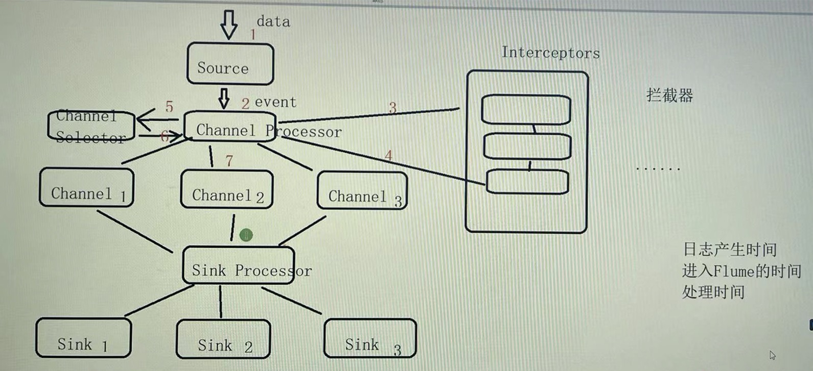
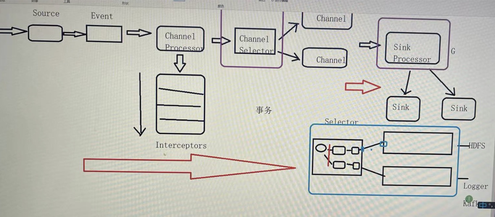
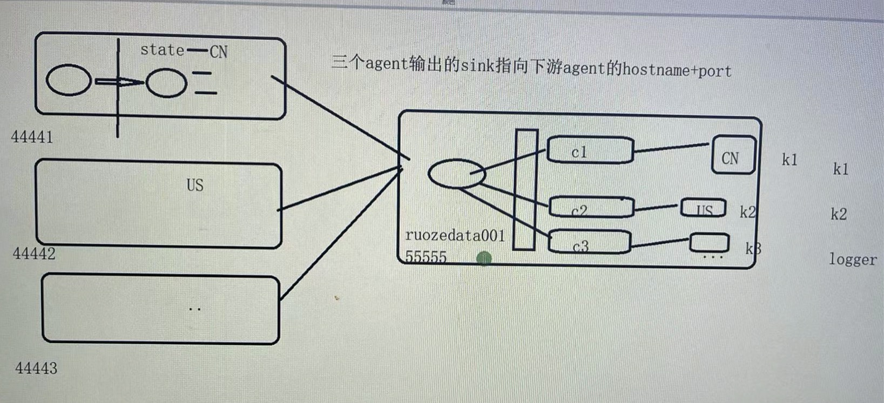

# 0 背景

- 时效性
- 完整性
- 监控
- 压缩
- 安全性


- 针对日志数据进行收集的一个框架  A ---> B
- 编写配置文件
- 有时使用build-in满足不了，需要二次开发

## 文档及处理过程

- User Guide 日常使用
- Developer Guide 二次开发
- access.log ==> Flume ==> HDFS ==>离线处理
- access.log ==> Flume ==> Kafka ==>实时处理
- ELK=> ES/Logstash/Kibana/Beats
- Fluentd


无集群概念 可以复杂架构高可用

## 版本

- ng: 
- og: 0.9
  	
- https://github.com/cloudera/	
- https://github.com/cloudera/flume-ng


# 1 Flume三个核心组件

- 数据收集工具
- 采集与收集区分
  - 数据采集：生成log日志
  - 数据收集：移动/传输


## Source

对接数据源    A
- avro         重要       
- exec
- Spooling Directory
- Taildir Source      *****重要
- kafka
- nc
- http
- Custom 

## Channel

Source和Sink之间的一个缓冲区

- memory
- file
- kafka
- jdbc

## Sink

对接目的地    B
- hdfs
- logger  测试
- avro               重要 
- kafka               ***** 重要
- Custom

日志 ==> 控制台
日志 ==> HDFS
日志 ==> Hive


# 2 配置文件

配置文件怎么写

- 根据场景对Source、Channel、Sink 串起来	
- 就是写Agent配置文件

## [配置说明](https://flume.apache.org/releases/content/1.9.0/FlumeUserGuide.html)

a1: Agent的名字

需求：监听localhost机器的44444端口，接收到数据sink到终端

- Name the components on this agent   配置各种名字

```properties
a1.sources = r1   # 配置source的名字
a1.sinks = k1     # 配置sink的名字
a1.channels = c1  # 配置channel的名字
```

- Describe/configure the source       配置source的基本属性

```properties
a1.sources.r1.type = netcat
a1.sources.r1.bind = localhost
a1.sources.r1.port = 44444
```

- Use a channel which buffers events in memory  配置channel的基本属性

```properties
a1.channels.c1.type = memory
```

- Describe the sink                  配置sink的基本属性

```properties
a1.sinks.k1.type = logger
```

- Bind the source and sink to the channel      连线

```properties
a1.sources.r1.channels = c1
a1.sinks.k1.channel = c1
```

- example.conf

```properties
a1.sources = r1  
a1.sinks = k1    
a1.channels = c1  

# source
a1.sources.r1.type = netcat
a1.sources.r1.bind = localhost
a1.sources.r1.port = 44444
# channel
a1.channels.c1.type = memory
# sink
a1.sinks.k1.type = logger

# bind
a1.sources.r1.channels = c1
a1.sinks.k1.channel = c1
```

## Spooling配置[#](https://flume.apache.org/releases/content/1.9.0/FlumeUserGuide.html#spooling-directory-source)

This source lets you ingest data by placing files to be ingested into a “spooling” directory on disk. This source will watch the specified directory for new files, and will parse events out of new files as they appear. The event parsing logic is pluggable. After a given file has been fully read into the channel, completion by default is indicated by renaming the file or it can be deleted or the trackerDir is used to keep track of processed files.

Unlike the Exec source, this source is reliable and will not miss data, even if Flume is restarted or killed. In exchange for this reliability, only immutable, uniquely-named files must be dropped into the spooling directory. Flume tries to detect these problem conditions and will fail loudly if they are violated:

1. **If a file is written to after being placed into the spooling directory, Flume will print an error to its log file and stop processing**.
2. **If a file name is reused at a later time, Flume will print an error to its log file and stop processing**.

To avoid the above issues, it may be useful to add a unique identifier (such as a timestamp) to log file names when they are moved into the spooling directory.


参数

- includePattern  匹配文件

## 环境搭建

- conf/flume-env.sh

```shell
# 增加一行
export JAVA_HOME=/home/hadoop/app/jdk1.8.0_91
```

- 运行

```shell
# 自建 config 目录
flume-ng agent \
--name a1 \
--conf $FLUME_HOME/conf \
--conf-file $FLUME_HOME/config/example.conf \
-Dflume.root.logger=INFO,console

# check
jps -m

$FLUME_HOME/bin/flume-ng
$FLUME_HOME/lib  # 依赖的jar包  后续二次开发，打的jar包，就传到这个目录下即可
```

> 友情提醒：全部用vi来搞定

- 测试

```shell
telnet localhost 44444
```


Flume中数据的传输单元：Event  == 一条数据
- headers：字节数组
- body： 字节数组

```shell
Event: { headers:{} body: 31 0D  1. }  # 最长显示16位
```


# 3 案例

## 案例1 文件=>HDFS

- 监控一个文件 ==> HDFS
  架构选型：
  	exec source 
  	memory channel
  	hdfs sink
- flume-exec-hdfs.conf 

```properties
#define agent
exec-hdfs-agent.sources = exec-source
exec-hdfs-agent.channels = exec-memory-channel
exec-hdfs-agent.sinks = hdfs-sink

#define source
exec-hdfs-agent.sources.exec-source.type = exec
exec-hdfs-agent.sources.exec-source.command = tail -F ~/data/data.log
exec-hdfs-agent.sources.exec-source.shell = /bin/sh -c

#define channel
exec-hdfs-agent.channels.exec-memory-channel.type = memory

#define sink
exec-hdfs-agent.sinks.hdfs-sink.type = hdfs
exec-hdfs-agent.sinks.hdfs-sink.hdfs.path = hdfs://hadoop000:8020/data2/flume/tail
exec-hdfs-agent.sinks.hdfs-sink.hdfs.fileType = DataStream
exec-hdfs-agent.sinks.hdfs-sink.hdfs.writeFormat = Text
exec-hdfs-agent.sinks.hdfs-sink.hdfs.batchSize = 10

#bind source and sink to channel
exec-hdfs-agent.sources.exec-source.channels = exec-memory-channel
exec-hdfs-agent.sinks.hdfs-sink.channel = exec-memory-channel
```

- 运行

```shell
flume-ng agent \
--name exec-hdfs-agent \
--conf $FLUME_HOME/conf \
--conf-file $FLUME_HOME/config/flume-exec-hdfs.conf \
-Dflume.root.logger=INFO,console


# 写数据
for i in {1..100}; do echo "ruozedata $i" >> /home/hadoop/data/data.log;sleep 0.1;done

# 查看结果
hdfs dfs -text /data2/flume/tail/*
hdfs dfs -ls /data2/flume/tail/
```


### 存在的问题

- sink到HDFS中文件的命名问题：FlumeData.1612619941165.tmp
 - 小文件问题
- 可靠性问题


## 案例2 文件夹=>logger

- 架构选型：
  	Spooling Directory  source 
  	memory channel
  	hdfs sink

- spooling-memory-logger.conf

```properties
# agent
a1.sources = r1
a1.sinks = k1
a1.channels = c1

# source
a1.sources.r1.type = spooldir
a1.sources.r1.spoolDir = /home/hadoop/data/spool
a1.sources.r1.fileHeader = true
a1.sources.r1.fileHeaderKey = ruozedata_header_key

# sink
a1.sinks.k1.type = logger

# channel
a1.channels.c1.type = memory

# Bind the source and sink to the channel
a1.sources.r1.channels = c1
a1.sinks.k1.channel = c1
```

> spoolDir 运行前要手动创建

- 运行

```shell
flume-ng agent \
--name a1 \
--conf $FLUME_HOME/conf \
--conf-file $FLUME_HOME/config/spooling-memory-logger.conf \
-Dflume.root.logger=INFO,console
```


- spool：
  - 监控文件夹下新增文件
  - 没有.COMPLETED 就代表未完成 服务挂了
  - collect： cp ==> spool


## 案例3 HDFS小文件问题

- 要hdfs分区 一定配时间localtime

- 设置参数

| 参数              | 阈值 | 解释                                                         |
| ----------------- | ---- | ------------------------------------------------------------ |
| hdfs.rollInterval | 30   | Number of seconds to wait before rolling current file (0 = never roll based on time interval) |
| hdfs.rollSize     | 1024 | File size to trigger roll, in bytes (0: never roll based on file size) 128Mb以下 |
| hdfs.rollCount    | 10   | Number of events written to file before it rolled (0 = never roll based on number of events) |

- 配置文件

```properties
#define agent
exec-hdfs-agent.sources = exec-source
exec-hdfs-agent.channels = exec-memory-channel
exec-hdfs-agent.sinks = hdfs-sink

#define source
exec-hdfs-agent.sources.exec-source.type = exec
exec-hdfs-agent.sources.exec-source.command = tail -F ~/data/data.log
exec-hdfs-agent.sources.exec-source.shell = /bin/sh -c

#define channel
exec-hdfs-agent.channels.exec-memory-channel.type = memory

#define sink
exec-hdfs-agent.sinks.hdfs-sink.type = hdfs
exec-hdfs-agent.sinks.hdfs-sink.hdfs.path = hdfs://hadoop000:8020/data2/flume/tail
exec-hdfs-agent.sinks.hdfs-sink.hdfs.fileType = DataStream
exec-hdfs-agent.sinks.hdfs-sink.hdfs.writeFormat = Text
exec-hdfs-agent.sinks.hdfs-sink.hdfs.batchSize = 10
# important
exec-hdfs-agent.sinks.hdfs-sink.hdfs.rollInterval = 20
exec-hdfs-agent.sinks.hdfs-sink.hdfs.rollSize = 100000000
exec-hdfs-agent.sinks.hdfs-sink.hdfs.rollCount = 0

#bind source and sink to channel
exec-hdfs-agent.sources.exec-source.channels = exec-memory-channel
exec-hdfs-agent.sinks.hdfs-sink.channel = exec-memory-channel
```

- 运行

```shell
flume-ng agent \
--name exec-hdfs-agent \
--conf $FLUME_HOME/conf \
--conf-file $FLUME_HOME/config/flume-exec-hdfs-2.conf \
-Dflume.root.logger=INFO,console
```

- 测试

```shell
# 加测试数据
for i in {1..100}; do echo "ruozedata $i" >> /home/hadoop/data/data.log;sleep 0.1;done

# 查数据
hdfs dfs -text /data2/flume/tail/*
hdfs dfs -ls /data2/flume/tail/
```


## 案例4 Spooling=>HDFS

```properties
#agent
spooling-hdfs-agent.sources = spooling-source
spooling-hdfs-agent.channels = spooling-memory-channel
spooling-hdfs-agent.sinks = hdfs-sink

#source
spooling-hdfs-agent.sources.spooling-source.type = spooldir
spooling-hdfs-agent.sources.spooling-source.spoolDir = /home/hadoop/data/logs
#channel
spooling-hdfs-agent.channels.spooling-memory-channel.type = memory

#define sink
spooling-hdfs-agent.sinks.hdfs-sink.type = hdfs
spooling-hdfs-agent.sinks.hdfs-sink.hdfs.path = hdfs://hadoop000:8020/data2/flume2/logs/%Y%m%d%H%M
spooling-hdfs-agent.sinks.hdfs-sink.hdfs.fileType = CompressedStream
spooling-hdfs-agent.sinks.hdfs-sink.hdfs.codeC = org.apache.hadoop.io.compress.GzipCodec
spooling-hdfs-agent.sinks.hdfs-sink.hdfs.filePrefix = page-views
spooling-hdfs-agent.sinks.hdfs-sink.hdfs.rollSize = 0
spooling-hdfs-agent.sinks.hdfs-sink.hdfs.rollCount = 100000
spooling-hdfs-agent.sinks.hdfs-sink.hdfs.rollInterval = 30
# important
spooling-hdfs-agent.sinks.hdfs-sink.hdfs.useLocalTimeStamp = true
spooling-hdfs-agent.sinks.hdfs-sink.hdfs.roundUnit = minute
spooling-hdfs-agent.sinks.hdfs-sink.hdfs.round = true
spooling-hdfs-agent.sinks.hdfs-sink.hdfs.roundValue = 1

#bind
spooling-hdfs-agent.sources.spooling-source.channels = spooling-memory-channel
spooling-hdfs-agent.sinks.hdfs-sink.channel = spooling-memory-channel
```

- 运行

```shell
flume-ng agent \
--name spooling-hdfs-agent \
--conf $FLUME_HOME/conf \
--conf-file $FLUME_HOME/config/spooling-memory-hdfs.conf \
-Dflume.root.logger=INFO,console

# 查数据
hdfs dfs -text /data2/flume2/logs/*
hdfs dfs -ls /data2/flume2/logs/
```


## 案例5 Taildir Source[#](https://flume.apache.org/releases/content/1.9.0/FlumeUserGuide.html#taildir-source)

- 文件断点续传: 用positionFile存储偏移量
- 文件不会丢，但可能会重
- taildir-memory-logger.conf

```properties
#agent
a1.sources = r1
a1.sinks = k1
a1.channels = c1

#source
a1.sources.r1.type = TAILDIR
a1.sources.r1.positionFile = /home/hadoop/tmp/flume/taildir_position.json
a1.sources.r1.filegroups = f1 f2
a1.sources.r1.filegroups.f1 = /home/hadoop/tmp/flume/test1/example.log
a1.sources.r1.headers.f1.headerKey1 = value1

a1.sources.r1.filegroups.f2 = /home/hadoop/tmp/flume/test2/.*log.*
a1.sources.r1.headers.f2.headerKey1 = value2
a1.sources.r1.headers.f2.headerKey2 = value2-2
a1.sources.r1.fileHeader = true

#sink
a1.sinks.k1.type = logger

#channel
a1.channels.c1.type = memory

# Bind the source and sink to the channel
a1.sources.r1.channels = c1
a1.sinks.k1.channel = c1
```

```shell
flume-ng agent \
--name a1 \
--conf $FLUME_HOME/conf \
--conf-file $FLUME_HOME/config/taildir-memory-logger.conf \
-Dflume.root.logger=INFO,console
```


## 案例6 avro 序列化 1

- 跨机房（跨agent）解决方案
- RPC remote procedure call 远程过程调用
- 序列化 将数据结构变成二进制
  - JDK：ObjectOutputStream
  - Hadoop： Writable
  - avro：thrift


- flume-avroclient.conf

```properties
#agent
avroclient-agent.channels = ch1
avroclient-agent.sources = avro-source1
avroclient-agent.sinks = log-sink1

#@channel
avroclient-agent.channels.ch1.type = memory
#source
avroclient-agent.sources.avro-source1.channels = ch1
avroclient-agent.sources.avro-source1.type = avro
avroclient-agent.sources.avro-source1.bind = 0.0.0.0  
avroclient-agent.sources.avro-source1.port = 44444

#bind
avroclient-agent.sinks.log-sink1.channel = ch1
avroclient-agent.sinks.log-sink1.type = logger
```

- 运行

```shell
# 启动服务端
flume-ng agent \
--name avroclient-agent \
--conf $FLUME_HOME/conf \
--conf-file $FLUME_HOME/config/flume-avroclient.conf \
-Dflume.root.logger=INFO,console

# 客户端 
# 无法解决增量数据（一次性）
flume-ng avro-client \
--host localhost \
--port 44444 \
--filename /home/hadoop/data/test.txt \
--conf $FLUME_HOME/conf
```

## 案例7 avro 序列化 2

将avro-sink数据写出到avro-source

先启动下游source，再启动上游的sink

### source

- flume-avro-source.conf

```properties
#define agent
avro-source-agent.sources = avro-source
avro-source-agent.channels = avro-memory-channel
avro-source-agent.sinks = logger-sink

#define source
avro-source-agent.sources.avro-source.type = avro
avro-source-agent.sources.avro-source.bind = 0.0.0.0
avro-source-agent.sources.avro-source.port = 55555

#define channel 
avro-source-agent.channels.avro-memory-channel.type = memory

#define sink 
avro-source-agent.sinks.logger-sink.type = logger

#bind source and sink to channel
avro-source-agent.sources.avro-source.channels = avro-memory-channel  
avro-source-agent.sinks.logger-sink.channel = avro-memory-channel
```

- 运行

```shell
flume-ng agent \
--name avro-source-agent \
--conf $FLUME_HOME/conf \
--conf-file $FLUME_HOME/config/flume-avro-source.conf \
-Dflume.root.logger=INFO,console
```


### sink

- flume-avro-sink.conf

```properties
#define agent
avro-sink-agent.sources = exec-source
avro-sink-agent.channels = avro-memory-channel
avro-sink-agent.sinks = avro-sink

#define source
avro-sink-agent.sources.exec-source.type = exec
avro-sink-agent.sources.exec-source.command = tail -F /home/hadoop/data/avro_access.data

#define channel 
avro-sink-agent.channels.avro-memory-channel.type = memory 

#define sink 
avro-sink-agent.sinks.avro-sink.type = avro
avro-sink-agent.sinks.avro-sink.hostname = 0.0.0.0
avro-sink-agent.sinks.avro-sink.port = 55555

#bind source and sink to channel
avro-sink-agent.sources.exec-source.channels = avro-memory-channel
avro-sink-agent.sinks.avro-sink.channel = avro-memory-channel
```

- 运行

```shell
flume-ng agent \
--name avro-sink-agent \
--conf $FLUME_HOME/conf \
--conf-file $FLUME_HOME/config/flume-avro-sink.conf \
-Dflume.root.logger=INFO,console
```


## 案例8 多channel 多sink






### 1 多channel

- channel-replicating-selector.conf

```properties
#agent
a1.sources = r1
a1.channels = c1 c2
a1.sinks = k1 k2

#source
a1.sources.r1.type = netcat
a1.sources.r1.bind = localhost
a1.sources.r1.port = 44444

a1.sources.r1.selector.type = replicating
a1.sources.r1.channels = c1 c2

#channel
a1.channels.c1.type = memory
a1.channels.c2.type = memory

#sink
a1.sinks.k1.type = hdfs
a1.sinks.k1.hdfs.path = /data2/flume/replicating/%Y%m%d%H%M
a1.sinks.k1.hdfs.filePrefix = hdfsflume
a1.sinks.k1.hdfs.fileType = DataStream
a1.sinks.k1.hdfs.writeFormat = Text
a1.sinks.k1.hdfs.round = true
a1.sinks.k1.hdfs.useLocalTimeStamp = true
a1.sinks.k1.hdfs.roundValue = 1
a1.sinks.k1.hdfsroundUnit = minute
a1.sinks.k1.hdfs.callTimeout = 6000

a1.sinks.k2.type = logger

#bind
a1.sinks.k1.channel = c1
a1.sinks.k2.channel = c2
```

- run

```sh
flume-ng agent \
--name a1 \
--conf $FLUME_HOME/conf \
--conf-file $FLUME_HOME/config/channel-replicating-selector.conf \
-Dflume.root.logger=INFO,console
```

- 测试

```shell
telnet localhost 44444
```


### 2 3个sink对接source

三个agent输的sink指定下游agent的hostname和port



- Agent1

```properties
#agent
a1.sources = r1
a1.channels = c1
a1.sinks = k1

#source
a1.sources.r1.type = netcat
a1.sources.r1.bind = localhost
a1.sources.r1.port = 44441

a1.sources.r1.interceptors = i1
a1.sources.r1.interceptors.i1.type = static
a1.sources.r1.interceptors.i1.key = state
a1.sources.r1.interceptors.i1.value = US
	
#channel
a1.channels.c1.type = memory 

#sink 
a1.sinks.k1.type = avro
a1.sinks.k1.hostname = 0.0.0.0
a1.sinks.k1.port = 55555

#bind 
a1.sources.r1.channels = c1  
a1.sinks.k1.channel = c1
```

- agent2

```properties
#agent
a2.sources = r1
a2.channels = c1
a2.sinks = k1

#source
a2.sources.r1.type = netcat
a2.sources.r1.bind = localhost
a2.sources.r1.port = 44442

a2.sources.r1.interceptors = i1
a2.sources.r1.interceptors.i1.type = static
a2.sources.r1.interceptors.i1.key = state
a2.sources.r1.interceptors.i1.value = CN
	
#channel
a2.channels.c1.type = memory 

#sink 
a2.sinks.k1.type = avro
a2.sinks.k1.hostname = 0.0.0.0
a2.sinks.k1.port = 55555

#bind 
a2.sources.r1.channels = c1  
a2.sinks.k1.channel = c1
```

- agent3

```properties
#agent
a3.sources = r1
a3.channels = c1
a3.sinks = k1

#source
a3.sources.r1.type = netcat
a3.sources.r1.bind = localhost
a3.sources.r1.port = 44443

a3.sources.r1.interceptors = i1
a3.sources.r1.interceptors.i1.type = static
a3.sources.r1.interceptors.i1.key = state
a3.sources.r1.interceptors.i1.value = RS
	
#channel
a3.channels.c1.type = memory 

#sink 
a3.sinks.k1.type = avro
a3.sinks.k1.hostname = 0.0.0.0
a3.sinks.k1.port = 55555

#bind 
a3.sources.r1.channels = c1  
a3.sinks.k1.channel = c1
```


- collector

```properties
#agent
collector.sources = r1
collector.sinks = k1 k2  k3
collector.channels = c1 c2 c3

#source
collector.sources.r1.type = avro
collector.sources.r1.bind = 0.0.0.0
collector.sources.r1.port = 55555

collector.sources.r1.selector.type = multiplexing
collector.sources.r1.selector.header = state
collector.sources.r1.selector.mapping.US = c1
collector.sources.r1.selector.mapping.CN = c2
collector.sources.r1.selector.default = c3
	
#channel
collector.channels.c1.type = memory 
collector.channels.c2.type = memory 
collector.channels.c3.type = memory 

#sink 
collector.sinks.k1.type = file_roll
collector.sinks.k2.type = file_roll
collector.sinks.k3.type = logger
collector.sinks.k1.sink.directory = /home/hadoop/tmp/multiplexing/k1
collector.sinks.k2.sink.directory = /home/hadoop/tmp/multiplexing/k2

#bind 
collector.sources.r1.channels = c1 c2 c3
collector.sinks.k1.channel = c1
collector.sinks.k2.channel = c2
collector.sinks.k3.channel = c3
```


- 运行

```shell
#collector
# 自建文件夹 k1 k2
flume-ng agent \
--name collector \
--conf $FLUME_HOME/conf \
--conf-file $FLUME_HOME/config/multi-collector.conf \
-Dflume.root.logger=INFO,console


#agent1
flume-ng agent \
--name a1 \
--conf $FLUME_HOME/conf \
--conf-file $FLUME_HOME/config/multi-selector-1.conf \
-Dflume.root.logger=INFO,console

#agent2
flume-ng agent \
--name a2 \
--conf $FLUME_HOME/conf \
--conf-file $FLUME_HOME/config/multi-selector-2.conf \
-Dflume.root.logger=INFO,console

#agent3
flume-ng agent \
--name a3 \
--conf $FLUME_HOME/conf \
--conf-file $FLUME_HOME/config/multi-selector-3.conf \
-Dflume.root.logger=INFO,console
```

- 测试

```shell
telnet localhost 44441

telnet localhost 44442

telnet localhost 44443
```


### 3 failover主备接收

- 2个接收端（主备）有优先级 数字大的优先级高

- 设置10s惩罚时间，优先级高的接收器挂掉，10s后回来依旧可以接收


- failoversink.conf

```properties
#agent
a1.sources = r1
a1.sinks = k1 k2
a1.channels = c1

#source
a1.sources.r1.type = netcat
a1.sources.r1.bind = localhost
a1.sources.r1.port = 44444

a1.sources.r1.interceptors = i1
a1.sources.r1.interceptors.i1.type = static
a1.sources.r1.interceptors.i1.key = state
a1.sources.r1.interceptors.i1.value = US
	
#channel
a1.channels.c1.type = memory 

#sink 
a1.sinkgroups = g1
a1.sinkgroups.g1.sinks = k1 k2
a1.sinkgroups.g1.processor.type = failover
a1.sinkgroups.g1.processor.priority.k1 = 5
a1.sinkgroups.g1.processor.priority.k2 = 10
a1.sinkgroups.g1.processor.maxpenalty = 10000

a1.sinks.k1.type = avro
a1.sinks.k1.hostname = 0.0.0.0
a1.sinks.k1.port = 55551

a1.sinks.k2.type = avro
a1.sinks.k2.hostname = 0.0.0.0
a1.sinks.k2.port = 55552

#bind 
a1.sources.r1.channels = c1  
a1.sinks.k1.channel = c1
a1.sinks.k2.channel = c1
```

- 接收1（failoversink-1.conf）

```properties
#agent
collector1.sources = r1
collector1.sinks = k1
collector1.channels = c1

#source
collector1.sources.r1.type = avro
collector1.sources.r1.bind = 0.0.0.0
collector1.sources.r1.port = 55551
	
#channel
collector1.channels.c1.type = memory

#sink 
collector1.sinks.k1.type = logger

#bind 
collector1.sources.r1.channels = c1
collector1.sinks.k1.channel = c1
```

- 接收2(failoversink-2.conf)

```properties
#agent
collector2.sources = r1
collector2.sinks = k1
collector2.channels = c1

#source
collector2.sources.r1.type = avro
collector2.sources.r1.bind = 0.0.0.0
collector2.sources.r1.port = 55552
	
#channel
collector2.channels.c1.type = memory

#sink 
collector2.sinks.k1.type = logger

#bind 
collector2.sources.r1.channels = c1
collector2.sinks.k1.channel = c1
```


- 运行

```shell
#collector1
flume-ng agent \
--name collector1 \
--conf $FLUME_HOME/conf \
--conf-file $FLUME_HOME/config/failoversink-1.conf \
-Dflume.root.logger=INFO,console

#collector2
flume-ng agent \
--name collector2 \
--conf $FLUME_HOME/conf \
--conf-file $FLUME_HOME/config/failoversink-2.conf \
-Dflume.root.logger=INFO,console


#sink
flume-ng agent \
--name a1 \
--conf $FLUME_HOME/conf \
--conf-file $FLUME_HOME/config/failoversink.conf \
-Dflume.root.logger=INFO,console
```

- 测试

```shell
telnet localhost 44444
```


### 4 拦截器

- other-interceptor.conf

```properties
#agent
a1.sources = r1
a1.channels = c1
a1.sinks = k1

#source
a1.sources.r1.type = netcat
a1.sources.r1.bind = 0.0.0.0
a1.sources.r1.port = 44442

a1.sources.r1.interceptors = i1 i2 i3
a1.sources.r1.interceptors.i1.type = static
a1.sources.r1.interceptors.i1.key = a
a1.sources.r1.interceptors.i1.value = aa
a1.sources.r1.interceptors.i1.key = b
a1.sources.r1.interceptors.i1.value = bb

a1.sources.r1.interceptors.i2.type = host
a1.sources.r1.interceptors.i2.useIP = false
a1.sources.r1.interceptors.i2.hostHeader = hostname

a1.sources.r1.interceptors.i3.type = org.apache.flume.sink.solr.morphline.UUIDInterceptor$Builder
a1.sources.r1.interceptors.i3.headerName = uuid
	
#channel
a1.channels.c1.type = memory 

#sink 
a1.sinks.k1.type = logger

#bind 
a1.sources.r1.channels = c1  
a1.sinks.k1.channel = c1
```

- run

```sh
flume-ng agent \
--name a1 \
--conf $FLUME_HOME/conf \
--conf-file $FLUME_HOME/config/other-interceptor.conf \
-Dflume.root.logger=INFO,console
```

- 测试

```shell
telnet localhost 44442

# 返回结果
Event: { headers:{b=bb, hostname=hadoop000, uuid=4ec782fa-7a80-4a60-98f7-d68edb556d5a} body: 61 0D                                           a. }
```


## 案例9 Java代码 log4j=>Flume[#](https://flume.apache.org/releases/content/1.9.0/FlumeUserGuide.html#log4j-appender)

启动Class Application

- flume-code.conf(相当于avro source)

```properties
#agent
agent1.sources = avro-source
agent1.channels = logger-channel
agent1.sinks = log-sink

#channel
agent1.channels.logger-channel.type = memory

#source
agent1.sources.avro-source.channels = logger-channel
agent1.sources.avro-source.type = avro
agent1.sources.avro-source.bind = 0.0.0.0
agent1.sources.avro-source.port = 44444

#sink
agent1.sinks.log-sink.channel = logger-channel
agent1.sinks.log-sink.type = logger
```

- run

```sh
flume-ng agent \
--name agent1 \
--conf $FLUME_HOME/conf \
--conf-file $FLUME_HOME/config/flume-code.conf \
-Dflume.root.logger=INFO,console
```

- java

```java
import org.apache.log4j.Logger;

public class RPCClientApp {

    private static Logger logger = Logger.getLogger(RPCClientApp.class);

    public static void main(String[] args) throws InterruptedException {
        int index = 0;

        while (true) {
            Thread.sleep(1000);
            logger.info("当前输出值：" + index++);
        }
    }
}
```

- log4j.properties

```properties
log4j.rootLogger=INFO, stdout, flume

log4j.appender.stdout = org.apache.log4j.ConsoleAppender
log4j.appender.stdout.target = System.out
log4j.appender.stdout.layout = org.apache.log4j.PatternLayout
log4j.appender.stdout.layout.ConversionPattern= "%d{yyyy-MM-dd HH:mm:ss} %p [%c:%L] - %m%n

log4j.appender.flume = org.apache.flume.clients.log4jappender.Log4jAppender
log4j.appender.flume.Threshold = INFO
log4j.appender.flume.Hostname = hadoop000
log4j.appender.flume.Port = 44444
log4j.appender.flume.UnsafeMode = true
#log4j.appender.flume.layout = org.apache.log4j.PatternLayout
#log4j.appender.flume.layout.ConversionPattern = %d{HH:mm:ss.SSS} [%thread] %-5level %logger{36} - %msg%n
```

- pom

```xml
<!--flume-->
<dependency>
  <groupId>org.apache.flume</groupId>
  <artifactId>flume-ng-node</artifactId>
  <version>1.6.0</version>
</dependency>

<dependency>
  <groupId>org.apache.flume.flume-ng-clients</groupId>
  <artifactId>flume-ng-log4jappender</artifactId>
  <version>1.6.0</version>
</dependency>
```


# 4 监控（了解）

[Ganglia](https://blog.csdn.net/zhugegod/article/details/84543511)

[graffin](https://www.liangzl.com/get-article-detail-39135.html)

[Zabbix](https://blog.csdn.net/xoofly/article/details/109331636)

```shell
flume-env.sh
JAVA_OPTS="-Dflume.monitoring.type=ganglia
-Dflume.monitoring.hosts=ruozedata001:8649
-Xms100m
-Xmx200m
"

flume-ng agent \
--name a1 \
--conf $FLUME_HOME/conf \
--conf-file $FLUME_HOME/config/example.conf \
-Dflume.root.logger=INFO,console \
-Dflume.monitoring.type=ganglia \
-Dflume.monitoring.hosts=hadoop000:8649 


http://hadoop000/ganglia
```


- 方案

```properties
一个agent ==> 一个业务线的日志  *****
一个agent ==> 多个业务线的日志


hostname key value ts(yyyyMMddHHmm) ==> es ==> kibana
				sink ==> HDFS 
						 ==> POST

FLUME到HDFS的元数据信息
				202101020300 ==> es 
				....
				202101020359
```


- Griffin

```properties
# 思路
定义一系列的规则
	emp  sal  定义的double    a b 
	同步、离线： ETL map/mapPartitions
	
		// TODO... 调用数据质量接口，获取到该表所对应的规则
		
		aDF.map(x => {
			常规操作: 拆字段、补字段、数据规整...
			
			// 规则
			
			定义好的某个/某些规则作用到row数据上面来
				符合规则：放行
				不符合规则：
					数据sink某个地方去
					数据：数据内容：sal字段不符合规则[某个/某些规则]
								
		}).filter....
		
		
# 方案
JAVAEE: 页面    CRUD ==> MySQL  excel模板导入 POI
	规则的列表
	规则的新增
	规则的修改
	规则的删除
	
	db: a: ts: yyyyMMddHHmm
	db: b: ts: MMddHHmm

	db: c: xx: distinct 获取第一条
	db: d: y: 非空


and or  between


只要上云全部都是表
				db table colname coltype colcomment ...
对表作用上我们自定义的数据质量规则
	质量不合格的数据==> es  不合格的数据和对应的规则 发给元数据管理
```

