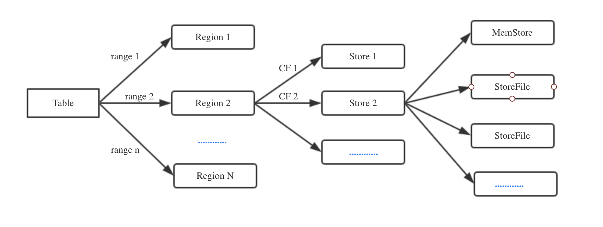
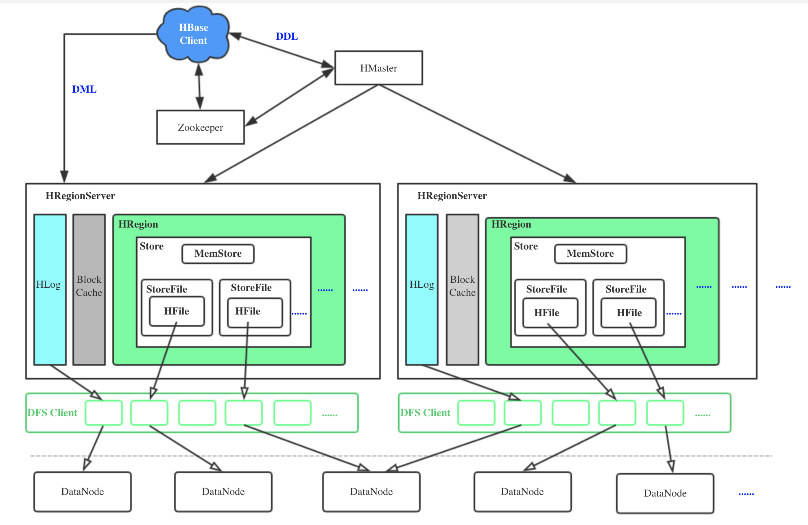
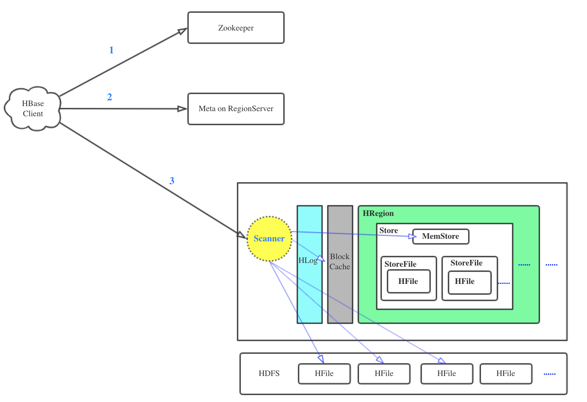
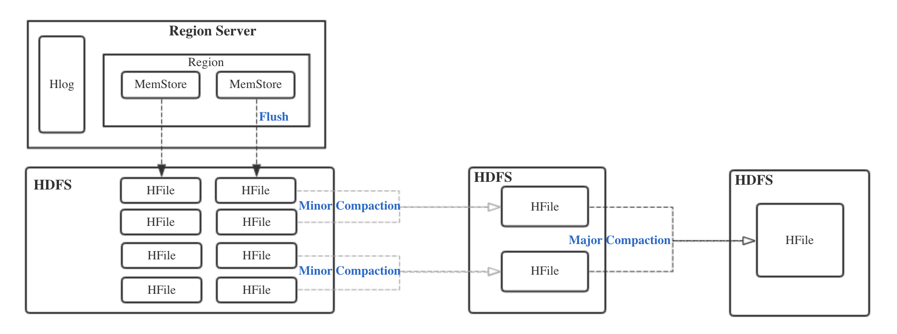

[toc]

# 1 [简介](hbase.apache.org)

- Use Apache HBase™ when you need **random, realtime read/write** access to your Big Data. This project's goal is the hosting of very large tables -- **billions of rows X millions of columns** -- atop clusters of commodity hardware. Apache HBase is an open-source, distributed, versioned, non-relational database modeled after Google's [Bigtable: A Distributed Storage System for Structured Data](https://research.google.com/archive/bigtable.html) by Chang et al. Just as Bigtable leverages the distributed data storage provided by the Google File System, Apache HBase provides Bigtable-like capabilities on top of Hadoop and HDFS.

- 不支持SQL API和shell命令难用 
- hbase二级索引 ： Phoenix

[hbasegroup  公众号](http://hbase.group/)

[hbase 范欣欣](http://hbasefly.com/)

[Java内存问题](https://blog.csdn.net/weixin_44641024/article/details/103248842)

## 版本

- Apache
  - 0.98  第一代 经典版本
  - 1.x --> 1.2  1.4
  - 2.x --> 2.3

- 使用HBase 要注意和 hadoop zk 版本兼容 

## 部署

先决条件: ZK、HDFS部署完成

```shell
tar -xzvf hbase-1.2.0-cdh5.16.2.tar.gz -C ../app/
cd ../app/
ln -s hbase-1.2.0-cdh5.16.2 hbase  # 软链接
```

- conf/hbase_env.sh
  
  ```shell
  export JAVA_HOME=/path/to/java/home  # 显性配置JAVA_HOME
  export HBASE_PID_DIR=/jome/hadoop/tmp
  export HBSAE_MANAGES_ZK=false        # 用自配的ZK
  ```
  
- hbase_site.xml

```xml
<configuration>
  <!--hbase.rootdir的前端与$HADOOP_HOME/conf/core-site.xml的fs.defaultFS一致 -->
  <property>
    <name>hbase.rootdir</name>
    <value>hdfs://hadoop000:8020</value>
  </property>
  <property>
    <name>hbase.cluster.distributed</name>
    <value>false</value>
  </property>

  <!--本地文件系统的临时文件夹。可以修改到一个更为持久的目录上。(/tmp会在重启时清除) -->
  <property>
    <name>hbase.tmp.dir<name>
    <value>/home/hadoop/tmp/hbase</value>
  </property>


  <!--这个参数用户设置 ZooKeeper 快照的存储位置，默认值为 /tmp，显然在重启的时候会清空。因为笔者的 ZooKeeper 是独立安装的，所以这里路径是指向了 $ZOOKEEPER_HOME/conf/zoo.cfg 中 dataDir 所设定的位置 -->
  <property>
    <name>hbase.zookeeper.property.dataDir</name>
    <value>/home/hadoop/tmp/zookeeper</value>
  </property>

  <property>
    <name>hbase.zookeeper.quorum</name>
    <value>hadoop000:2181</value>
  </property>
  <!--ZooKeeper 会话超时。Hbase 把这个值传递改 zk 集群，向它推荐一个会话的最大超时时间 -->
  <property>
    <name>zookeeper.session.timeout</name>
    <value>120000</value>
  </property>

  <!--当 regionserver 遇到 ZooKeeper session expired ， regionserver 将选择 restart 而不是 abort -->
  <property>
    <name>hbase.regionserver.restart.on.zk.expire</name>
    <value>true</value>
  </property>
  <property>
        <name>hbase.online.schema.update.enable</name>
        <value>true</value>
</property>

<property>
        <name>hbase.coprocessor.abortonerror</name>
        <value>false</value>
</property>
</configuration>
```

- 配置启动

```shell
# conf下配置
ln -s /home/hadoop/app/hadoop-2.6.0-cdh5.16.2/etc/hadoop/core-site.xml core-site.xml
ln -s /home/hadoop/app/hadoop-2.6.0-cdh5.16.2/etc/hadoop/hdfs-site.xml hdfs-site.xml

# 启动
bin/start-hbase.sh
```


> HMaster         老大
> HRegionServer   小弟
>
> http://hadoop000:60010 管理UI
>
> HBase web页面信息  是帮助你提升对hbase的理解 运维 问题快速判断 

## 故障

hbase集群  master 启动不起来，看日志是60010端口占用

- 通过 netstat -nlp | grep 60010**无法显示出 端口占用**
- 通过 netstat -tapn | grep 60010 显示隐藏的端口 ，会发现一个进程PID
- 通过 ps -ef | grep pid命令反查找到是 yarn resourcemanager进程(**与其他通信随机端口号占用**)

> -t, --tcp
> -a, --all
> -p, --programs
> -n, --numeric


# 2 表概念

## 2.1 表主要组成

- rowkey ： 是每一条数据的主键 
- column family： 列簇 列族  CF
- column ： 是属于列簇，可以动态添加
- version number: 类型是long  **默认是时间戳**  
- value:   是K-V结构的存储数据(K-V类型还有 redis、 json)


看图：

-  一行row数据 是可以包含1个或者多个CF，但是并不推荐一张表超过3个,  实际生产上 就1个默认的CF 
- column 是属于 cf的，一个cf可以包含1个或者多个column

 

## 2.2  region

- 一段数据的集合 
- 存储在hregionserver节点上

## 2.3 数据模型-逻辑视图


看图:

- 整个数据是由**rowkey**(相当于ID)，按【字典顺序】进行排序
- **null值 是不会存储的** 类似JSON
- **会按照rk 先进行字典排序，再横向切割**。切割的数据是存储在region里面。

## 2.4 数据模型-物理视图


- 数据是以K-V结构存储
- 每个K-V只存储一个单元格的数据
- 【不同的CF】数据是存储在【不同的文件里】

## 2.5 region划分



- 表按rowkey范围划分不同的region
- region按照CF划分不同的store
- store是包含memstore 和 storefile（存HDFS上）
- 经验
  - 建表时 默认是1个region，如果特意指定split key，就会有多个region
  - 当数据存储超过阈值，表会按水平方向分割2个region
  - 可以认为，region 就是表的子表
  - 不同的region被master会分配给合适的rs节点管理
  - 一个rs节点 管理多个region，而一个region管理1个或者多个 CF


## 2.6 数据模型-物理视图-多版本


将row2的skuname列从 红心火龙果 更新为 白心火龙果。
其实底层是存储了2条数据，是版本(timestamp)不一致。

- 默认只存放数据的1个版本，HBase支持多版本特性（最多100个版本），可以通过时间戳来实现；
- 每次【put】【delete】都会产生一个新的cell，都拥有一个版本；
- 查询默认返回是最新版本数据，可以通过指定版本号来获取旧的数据。


# 3 简单使用

```shell
 ./hbase shell
 help
```

## 3.1 shell命令汇总

- general
  -  status, table_help, version, whoami
- ddl
  - alter, alter_async, alter_status, create, describe, disable, disable_all, drop, drop_all, enable, enable_all, exists, get_table, is_disabled, is_enabled, list, locate_region, show_filters
- namespace
  -  alter_namespace, create_namespace, describe_namespace, drop_namespace, list_namespace, list_namespace_tables
- dml
  -   append, count, delete, deleteall, get, get_counter, get_splits, incr, put, scan, truncate, truncate_preserve
- tools
  - compact, major_compact, flush

- replication
- snapshots
- configuration
  -   update_all_config, update_config


## 3.2 CRUD

- 建表

```shell
# create 表名 列族1 列族2
create 'orderinfo', 'sku', 'order'

describe 'orderinfo'

# 压缩 snappy 速度快
```

- 插入

```shell
put 'orderinfo', 'row1', 'sku:skuname', '红心火龙果'
put 'orderinfo', 'row1', 'sku:skunum', '3'
put 'orderinfo', 'row1', 'sku:skusum', '75'

# update
put 'orderinfo', 'row1', 'sku:skuname', '白心火龙果'
```

- 查询

```shell
scan 'orderinfo'

# 这个是倒排，查看最新的1000条
scan 'rilc:asset_repay_plan', {REVERSED => TRUE,LIMIT=>1000}

scan 'rilc:asset_repay_plan',FILTER=>"ValueFilter(=,'substring:2021-05-25')"

# 单条查询 get 表名, rowkey, {COLUMN => '列族名:列名'}
get 'orderinfo', 'row1', {COLUMN => 'sku:skunum'}
```

- 删除

```shell
delete 'orderinfo', 'row1', 'sku:skunum'
```

- 删表

```shell
disable 'orderinfo'
drop 'orderinfo'
```

- 查询meta信息

```shell
scan 'hbase:meta'
```


### 多版本

- 可以存储历史数据（类似Hive分区存储）

```shell
create 'orderinfo2', 'sku', 'order'
alter 'orderinfo2', { NAME => 'sku', VERSIONS => 3 } # 最多只有3个版本

put 'orderinfo2', 'row1', 'sku:skunum', '3'
put 'orderinfo2', 'row1', 'sku:skusum', '75'

get 'orderinfo2', 'row1', {COLUMN => 'sku:skusum', VERSIONS=>2}
```

## 3.3 健康检查

```shell
hbase hbck

hadoop checknative
```


# 4 HBase架构设计




DFS参数 =>需要调优 不然扛不住读写

## 4.1 架构

### 1 hmaster

- 负责hbase table和region的管理 包含表的创建、修改等
- 负责hregionserver间的负载均衡、region的分布调整
- 负责hregion的分配及分裂后的region分配
- 负责hregionserver失效后的region迁移等

### 2 hregionserver

- 负责数据的路由、数据的读写和持久化
- 负责HBase的数据处理和计算的单元
- 负责region的split
- regionserver要和【DataNode】一起部署

#### 原理

- hregionserver内部管理了一系列的hregion对象，每个hregion对应table的一个region
- hregion是多个store组成，是通过CF划分的
  - 即：一个store管理一个region上的一个CF
- 每个store是包含 1个memstore 0个或多个storefile组成

### 3 zookeeper

- 存储<font color=red>【meta(元数据)表的地址】，而不是内容！！！</font>，meta信息量大 存储在regionserver机器上
- regionserver主动向zk注册，使得master可随时感知各个regionserver的健康状态
- 避免master单点故障(SPOF)

### 4 HBase client

- rpc机制

- client和master进行ddl管理类通信  

  client和rs进行数据的dml操作类通信

- 切记 读写不经过master ！！！

### 5 hlog

预写日志(WAL)  write ahead log

### 6 memstore 写缓存(读)

- memstore是一个内存结构  
- 一个CF只有1个memstore
- 其中memstore里面的数据也是根据rk进行字典排序的 

### 7 storefile 

- storefiles 合并后逐步形成越来越大的storefile文件
- 当region内所有的storefile(hfile)的总大小超过 **hbase.hregion.max.filesize**, 触发split, 一个region变为2个。 父region下线，新split的2个region被hmaster分配到合适的rs机器上。使得原先1个region的压力分流到2个region上。

### 8 blockcache 读缓存

- 是rs级别，一个rs只有一个blockcache
- 在rs启动时 完成blockcache的初始化工作


## 4.2 meta表

- 存储位置是记录在zk上

```shell
# 内容 
scan 'hbase:meta'
```

| ROW                                                          | COLUMN+CELL                                                  |
| ------------------------------------------------------------ | ------------------------------------------------------------ |
| hbase:namespace,,1636514539951.73224f8cc08bce64cf4648795cbfa5b9. | column=info:regioninfo, timestamp=1638358900419, value={ENCODED => 73224f8cc08bce64cf4648795cbfa5b9, NAME => 'hbase:namespace,,1636514539951.73224f8cc08bce64cf4648795cbfa5b9.', STARTKEY => '', ENDKEY => ''} |
| hbase:namespace,,1636514539951.73224f8cc08bce64cf4648795cbfa5b9. | column=info:server, timestamp=1638358900419, value=hadoop000:60020 |


### rowkey组成

- rowkey组成: namespace : table , region start key , region id
  
- region start key： 是region的第一个rowkey，这里需要注意
  - 这个地方为空，就表明是table的第一个region；并且这个region的start key和end key 都是空，说明这个表只有一个region
  - 在meta表，start key靠前的region 会排在start key靠后的region的前面。
  - hbase的key是按照字段的顺序来存放的  字典排序
  
- region id: 是region创建的时候的timestamp+.+region id

### value组成

- regioninfo
  - 包含 start key, end key
- server
  - 是分配在哪个rs节点上

> 抽象化:region映射关系表
> table  region    startkey    endkey   regionserver 
> t1       aaaa                          100         ruozedata001  <100
> t1       bbbb      100             300         ruozedata002  [100,300) 
> t1       cccc        300                             ruozedata003  >300


### 案例

```shell
create_namespace "test"
create 'test:table01', 'field01', SPLITS => ['10', '20', '30', '40']
scan 'hbase:meta'
```


## 4.3 写流程

- hbase是采取LSM树架构，天生的适合<font color=red>重写轻读的场景</font>
- 注意(由于底层hdfs文件只能做append操作，后期通过文件合并把老数据（update、delete数据）清除掉)
  - 对hbase来说 put（更新）、delete操作，<font color=red>在服务端看来 都是写操作</font>
  - put更新 是写一条 最新版本数据
  - delete  是写一条标记为deleted的kv的数据

### 流程


1. 先去zk获取hbase:meta表所在的rs节点
2. 在hbase:meta表根据rk确定所在的目标rs节点和region
3. hbase client将写的请求进行预处理，并根据元数据写入所在的rs节点
4. 将请求发送给对应的rs,rs接收到写的请求将数据解析：先写wal(预写日志)-->再写对应的region的store的memstore
5. 当memstore达到阈值，会异步flush，将内存的数据写入文件 为HFile


## 4.4 memstore flush触发条件(调优关键)

[参数参考](https://hbase.apache.org/1.4/book.html)

### 1 memstore级别限制

- 当region的任意一个store的memstore的size，达到**hbase.hregion.memstore.flush.size**(默认128M)，会触发memstore flush

### 2 region级别限制

- 当region所有的memstore的size和，达到

  ```properties
  hbase.hregion.memstore.block.multiplier * hbase.hregion.memstore.flush.size = 4*128 = 512M
  ```

- 会触发memstore flush，同时会**阻塞所有的写入该store的写请求**
- 继续对该region写请求，会**抛错  region too busy exception异常**

### 3 regionserver级别限制

1. 当rs节点上所有的memstore的size和 ，超过低水位线阈值，rs强制执行flush

   - 先flush memstore最大的region，再第二大的，直到总的memstore大小下降到低水位线的阈值

     ```properties
     # 低水位线阈值 计算
     ## Apache版参数
     hbase.regionserver内存大小 * 
     hbase.regionserver.global.memstore.size * hbase.regionserver.global.memstore.lowerLimit
     ## cdh版参数名称
     hbase.regionserver内存大小 * 
     hbase.regionserver.global.memstore.size * hbase.regionserver.global.memstore.size.lower.limit
     
     = 48G * 0.45 * 0.91 = 19.656G
     
     
     # hbase.regionserver.global.memstore.size
     ## Maximum size of all memstores in a region server before new updates are blocked and flushes are forced. Defaults to 40% of heap.
     ```

2. 如果此时写入非常繁忙，导致总的memstore大小超过 21.6G; rs会阻塞写 读的请求，并强制flush，降到低水位阈值(安全阈值)

   ```properties
   hbase.regionserver内存大小 * hbase.regionserver.global.memstore.size = 48G * 0.45 = 21.6G
   ```

### 4 Hlog级别限制

- 当rs的hlog数量达到**hbase.regionserver.max.logs** (生产设置参考 32)
- 会选择最早的hlog的对应的一个或多个region进行flush

### 5 定期(时间)级别限制

- **hbase.regionserver.optionalcacheflushinterval** 默认1h
- 为避免所有的memstore在同一个时间点进行flush导致的问题，定期的flush其实会有一定的随机时间延时（错峰）
- 设置为0 就是禁用
- <font color=red>CDH没有这个参数，需要高级代码 自定义配置</font>

### 6 手动级别限制

- flush 命令 可以封装脚本

```shell
flush 'TABLENAME'
flush 'REGIONNAME'
flush 'ENCODED_REGIONNAME'
```

### 总结

- 在生产上，唯独触发rs级别的限制导致flush,是属于灾难级别的，<font color=red>会阻塞所有落在该rs节点的读写请求</font>，直到总的memstore大小降到低水位线，阻塞时间较长。

- 其他的级别限制，只会阻塞对应的region的读写请求，阻塞时间较短。


## 4.5 读流程



1. 先去zk获取hbase:meta表所在的rs节点
2. 在hbase:meta表根据读rk确定所在的目标rs节点和region

3. 将读请求封装，发送给目标的rs节点，进行处理
4. 先到memstore查数据，查不到再到blockcache查，再查不到就访问磁盘的HFile读数据


## 4.6 compaction 合并(重要)



每次flush操作都是将一个memstore数据写到HFile文件。所以hdfs上有很多的hfile文件(只有触发memstore级别文件128M)。小文件多了对后面的读操作有影响，所以hbase会定时将hfile文件合并。

- minor compaction 小合并
  - 选取部分小的 相邻的hfile合并为一个更大的hfile
- major compaction 大合并
  - 将一个store的所有的hfile文件合并一个hfile

### 大合并 作用（这个过程【重之又重】）

- 清理TTL过期数据
- 版本号超过设定的数据会被清理(put)
- 被删除的数据(delete)

> 1  major compaction持续时间较长，整个过程消费大量的系统资源（带宽 和短时间的IO压力），
> 对上层业务会有较大的影响！
>
> 2 生产上尽可能的避免发生major compaction，一般通过关闭自动触发大合并，改为手动触发，
> 在业务低谷时期，执行。（一般在凌晨调度脚本，去执行）major_compact

### 总结

- 为什么要合并？

  - 随着hflie文件越来越多，查询需要更多的IO，读取延迟较大，所以需要compaction。

  - 这主要通过消费带宽和短时间的IO压力，来换取以后查询的低延迟。

- 合并作用：
  - 合并小文件  减少文件数量  减小稳定度的延迟
  - 消除无效数据 降低存储空间
  - 提高数据的本地化率

- 合并的触发条件：**先判断是否触发小合并，再判断是否大合并**
  
  1. memstore flush：合并根源来自flush，当memstore达到阈值或者其他条件就触发flush，将数据写到hflie
  
     - 正是因为文件多，才需要合并
  
     - 每次flush之后，就当前的store文件数进行校验判断，一旦store的总文件数超过
       **hbase.hstore.compactionThreshold**（默认3），就触发合并
  
  2. 后台线程定期检查
  
     - 后台线程compactchecker 定期检查是否需要执行合并。检查周期为
  
     ```properties
     # 在不做参数修改情况的下，compactchecker 大概是2h-46min-40s执行一次
     hbase.server.thread.wakefrequency * hbase.server.compactchecker.interval.multiplier = 10000ms * 1000
     ```
  
     - 当文件小于 **hbase.hstore.compaction.min.size**会被立即添加到合并的队列，
     - 当storefiles数量超过**hbase.hstore.compaction.min**时，就小合并启动
  
     - 生产上(如果CDH 只需要调整下面参数)：
  
     ```properties
     hbase.hregion.majorcompaction    = 0  # 大合并关闭 
     hbase.hstore.compactionThreshold = 6  #（默认3）小合并
     ```


# 5 HBase开发

## 5.1 CRUD API开发

- pom.xml

```xml
<dependency>
  <groupId>org.apache.hbase</groupId>
  <artifactId>hbase-client</artifactId>
  <version>1.2.12</version>
</dependency>
```

- config文件

```java
import lombok.extern.slf4j.Slf4j;
import org.apache.hadoop.conf.Configuration;
import org.apache.hadoop.hbase.HBaseConfiguration;
import org.apache.hadoop.hbase.HColumnDescriptor;
import org.apache.hadoop.hbase.HTableDescriptor;
import org.apache.hadoop.hbase.TableName;
import org.apache.hadoop.hbase.client.Admin;
import org.apache.hadoop.hbase.client.Connection;
import org.apache.hadoop.hbase.client.ConnectionFactory;

@Slf4j
public class HBaseConfig {
    public static Configuration conf;
    public static Connection connection;

    static {
        Configuration HBASE_CONFIG = new Configuration();
        HBASE_CONFIG.set("hbase.zookeeper.quorum", "hadoop000");
        HBASE_CONFIG.set("hbase.zookeeper.property.clientPort", "2181");
        conf = HBaseConfiguration.create(HBASE_CONFIG);
        try {
            connection = ConnectionFactory.createConnection(conf);
        } catch (IOException e) {
            e.printStackTrace();
        }
    }
}
```

- code

```java
/*
  创建表
	createTable("test:person", new String[]{"user", "work"});
*/
public static void createTable(String tableName, String[] family) throws IOException {
  Admin admin = connection.getAdmin();
  if (admin.tableExists(TableName.valueOf(tableName))) {
    log.info("table exists!");
  } else {
    HTableDescriptor tableDescriptor = new HTableDescriptor(TableName.valueOf(tableName));
    for (int i = 0; i < family.length; i++) {
      tableDescriptor.addFamily(new HColumnDescriptor(family[i]));
    }
    admin.createTable(tableDescriptor);
    log.info("create table "+ tableName + " success");
  }
}

/*
  插入数据
  putRecord("test:person", "row2", "user", "id", "1");
  putRecord("test:person", "row3", "user", "name", "andy");
*/
public static void putRecord(String tableName, String rowKey, String family, String qualifier, String id) throws IOException {
  Table table = connection.getTable(TableName.valueOf(tableName));
  Put put = new Put(Bytes.toBytes(rowKey));
  put.addColumn(Bytes.toBytes(family), Bytes.toBytes(qualifier), Bytes.toBytes(id));
  table.put(put);
  log.info("insert into "+rowKey+" to table "+tableName+" ok");
}

/*
  取单条数据
  getOneRecord("test:person", "row2");
*/
public static void getOneRecord(String tableName, String rowKey) throws IOException {
  Table table = connection.getTable(TableName.valueOf(tableName));
  Get get = new Get(rowKey.getBytes());
  Result result = table.get(get);
  for (Cell cell : result.rawCells()) {
    String row = Bytes.toString(cell.getRowArray(), cell.getRowOffset(), cell.getRowLength());
    String cf = Bytes.toString(cell.getFamilyArray(), cell.getFamilyOffset(), cell.getFamilyLength());
    String qualifier = Bytes.toString(cell.getQualifierArray(), cell.getQualifierOffset(), cell.getQualifierLength());
    String value = Bytes.toString(cell.getValueArray(), cell.getValueOffset(), cell.getValueLength());
    log.info("row: "+row+" cf: "+cf+" qualifier: "+qualifier+" value: "+value);
  }
}

/*
  取全部数据
  getAllRecord("test:person", "row2");
*/
public static void getAllRecord(String tableName, String rowKey) throws IOException {
  Table table = connection.getTable(TableName.valueOf(tableName));
  Scan scan = new Scan(rowKey.getBytes());
  ResultScanner results = table.getScanner(scan);
  for (Result result : results) {
    for (Cell cell : result.rawCells()) {
      String row = Bytes.toString(cell.getRowArray(), cell.getRowOffset(), cell.getRowLength());
      String cf = Bytes.toString(cell.getFamilyArray(), cell.getFamilyOffset(), cell.getFamilyLength());
      String qualifier = Bytes.toString(cell.getQualifierArray(), cell.getQualifierOffset(), cell.getQualifierLength());
      String value = Bytes.toString(cell.getValueArray(), cell.getValueOffset(), cell.getValueLength());
      log.info("row: "+row+" cf: "+cf+" qualifier: "+qualifier+" value: "+value);
    }
  }
}

/*
  删除数据
  deleteRecord("test:person", "row2");
*/
public static void deleteRecord(String tableName, String rowKey) throws IOException {
  Table table = connection.getTable(TableName.valueOf(tableName));
  List list = new ArrayList();
  Delete delete = new Delete(rowKey.getBytes());
  list.add(delete);
  table.delete(list);
  log.info("delete rowkey: "+rowKey);
}
```


## 5.2 多版本开发

```shell
create 'test:t1', { NAME => 'f1', VERSIONS => 3 }
describe 'test:t1'

put 'test:t1', 'r1', 'f1:c1', '1'
put 'test:t1', 'r1', 'f1:c1', '2'
put 'test:t1', 'r1', 'f1:c1', '3'

scan 'test:t1', {VERSIONS => 3}
```

- code

```java
public static void getAllRecordByVersion(String tableName, Integer version) throws IOException {
  Table table = connection.getTable(TableName.valueOf(tableName));
  Scan scan = new Scan();
  scan.setMaxVersions(version);  // 默认1，可设置为3 打印历史数据
  ResultScanner results = table.getScanner(scan);
  for (Result result : results) {
    for (Cell cell : result.rawCells()) {
      String row = Bytes.toString(cell.getRowArray(), cell.getRowOffset(), cell.getRowLength());
      String cf = Bytes.toString(cell.getFamilyArray(), cell.getFamilyOffset(), cell.getFamilyLength());
      String qualifier = Bytes.toString(cell.getQualifierArray(), cell.getQualifierOffset(), cell.getQualifierLength());
      String value = Bytes.toString(cell.getValueArray(), cell.getValueOffset(), cell.getValueLength());
      log.info("row: "+row+" cf: "+cf+" qualifier: "+qualifier+" value: "+value);
    }
  }
}


getAllRecordByVersion("test:t1", 3);  // main
```


## 5.3 region move 迁移(面试)

- 在生产上 某个rs节点有很多大的regions且读写请求比较繁忙，其他rs节点很空闲，导致请求不均匀(大部分由于rowkey设计不好)
  - 手动move region到负载低的rs节点上，让集群的资源充分利用。
- move是region迁移，是一个轻量级的操作！
  - 因为hbase的数据是在hdfs上，不需要独立管理数据，因此region在迁移过程 不需要实际迁移数据，只是把读写的服务迁移。


```shell
# move 'ENCODED_REGIONNAME', 'SERVER_NAME'
## ruozedata:t1,10,1590841183514.e17b39ca80fec455b6a3d4d605059a3f.
move 'e17b39ca80fec455b6a3d4d605059a3f', 'hadoop000,60020,1590821031895'

# region从源的rs下线 为unassign
# region到目标的rs上线 为assign
```


## 5.4 region split（CDH 了解）

[参考文章](https://blog.cloudera.com/apache-hbase-region-splitting-and-merging/)


- hbase.regionserver.region.split.policy： ConstantSizeRegionSplitPolicy 
  - 和待split的region的所属表 在当前的rs节点上的region个数有关系
  - 如果region个数=1, 切分的阈值是flush size * 2,否则max region file size。
  - 这种切分策略对于大集群的大表 、小表会比**IncreasingToUpperBoundRegionSplitPolicy**更加的友好，小表不会再产生大量的小的region，而是适当的。


- region in transition: rit

1. rs更改zk节点的/rit的region的状态为splitting
2. master通过watch去ls /hbase/region-in-transition 检测到region的状态改变，并修改内存中的region的状态，这时候master界面rit模块可以看到region执行split信息。
3. 在父级的目录创建子级目录.split  
4. 关闭父级region，触发flush操作，将写入的region的数据全部持久化到磁盘。在这期间客户端请求会抛异常： NotServingRegionException

总结：region生成2个子region，关闭父region

5. 在split文件夹下新建2个子文件夹，A  B
   - 在文件夹里生成 reference文件，分别指向父region的中对应的文件。
     /a/.split/A/reference_files
     /a/.split/B/reference_files

6. 父region分裂2个子的region，将A B拷贝到hbase根目录形成两个新的region
/A/reference_files
/B/reference_files

7. hbase meta下线a region的信息，不再提供服务。不会立即删除a region信息，而是标注split offline 和记录2个子region。

8. 开启A B region ，通知meta修改状态

9. A B region  正式对外提供服务

总结：下线父region，上线子region


## 5.5 region merge(rowkey设计不当)

- 某个region在长时间不会被写入 ，而且region的数据有可能ttl过期删除。这种场景下region是存在是没有任何意义的。
  
- 一旦空闲的region的很多，就会导致集群的运维成本上升，master。所以使用合并将 相邻的region 合并，减少空闲的region个数。

```shell
# merge_region 'ENCODED_REGIONNAME', 'ENCODED_REGIONNAME'
## 第二个region合并到第一个region
merge_region 'f354e509e1a0fd7ce8df6d6e1e73eec9','b54c42d144ce163b546a916da1e34bc1'
```

过程：

1. 客户端发送merge请求给master
2. master将待合并的所有region都move到同一个rs节点上
3. master发送合并请求 给rs
4. rs接收到请求，就启动本地事务执行merge操作
5. merge操作将合并的region下线，再合并
6. 将两个region的信息从meta删除，将新的region信息 写到meta表
7. 上线新的region


## 5.6 rowkey设计 

### 1 设计规范

- region的2个重要的属性： [**startkey**,**endkey**) 是表示region的key范围。

- rowkey是唯一标识 **相当于关系型的主键** PK

- 在hbase查询中，有几个方式

  - a.get  ，指定rk获取唯一一条记录

    ```sql
    select * from t where id = 100;
    ```

  - b.scan, 设置startkey endkey参数进行范围匹配

    ```sql
    select * from t where id > 'abc%';   # 查询abc开头的所有单词
    
    # 没有办法查询中间是mng或者结尾是ng的所有单词 除非翻译整个字典
    select * from t where id > '%abc%';  # 不支持
    select * from t where id > '%abc';   # 不支持
    ```
  
  - c.全表扫描 scan
  
    ```sql
    select * from t;  # 性能很低的 
    ```
  

### 2 长度规则

- rowkey是一个二进制的字符，最大长度是64kb。但是**在生产上建议越短越好，不要超过16个字节**

- 数据的持久化文件HFile是按照key value存储的，如果rk设计过长，比如超过100字节，1kw数据，光rk就存储占用 100字节*1kw=10亿字节=953m=1G ,这样会极大的影响hfile文件的存储效率。

- memstore:  如果rk过长，内存的利用率就降低，系统不能存储更多的数据，会频繁的触发memstore flush机制, 降低查询效率。

- 现在的操作系统是64位的，内存是8字节对齐，那么rk设计为16字节或者是8字节的整数倍，利用操作系统的特性。

### 3 salt (加盐)

**固定长度的随机数+原rk** ==> 新rk

- 优： 提高的写的吞吐量，保障数据在所有的region是负载均衡的。
- 缺： 因为添加的是随机数，基于原rk查询时，并不知道当初的赋予的随机数是什么，也就不知道新的rk是什么，那么在查收时，就要去各个region中查找，增加了读的开销。相同的rk随机数是不一样的，数据是重复的，是致命的 

```sql
create 'salt','order',SPLITS=>['a','b','c','d']

-- 原始数据
put 'salt','foo0001','order:amount','100'  # 由于f开头 数据只会落到最后一个分区

put 'salt','a-foo0001','order:amount','100'
put 'salt','b-foo0002','order:amount','100'
put 'salt','c-foo0003','order:amount','100'
put 'salt','d-foo0004','order:amount','100'
```

#### 总结

**生产上 不用Phoenix ，只使用hbase 盐表设计，有风险**

- phoenix: 相同的rk无论来了多少次，随机数是一样的 
- hbase：相反 ，稍有不慎 设计是致命的  可以滚蛋了！！！

```sql
# 第二条本应该覆盖第一条 但是rowkey不一致
Rowkey: a-0 Value: 0
Rowkey: b-0 Value: 0
```

- Phoenix

```sql
-- phoenix salt table
CREATE TABLE phoenixsalt 
(id VARCHAR PRIMARY KEY, name VARCHAR) 
SALT_BUCKETS = 4;

upsert into phoenixsalt values(1,'j')
```

### 4 hash

**只用HBase，不用Phoenix，可以使用hash**

- 基于rk的完整或者部分数据进行hash，将hash数值作为前缀。

- 算法包：md5 sha1 sha256 sha512

- 优点：
  - 使得同一行的rk hash之后，永远得到同一个前缀，不会重复数据，且也可以负载均衡。
  - 利于get操作
  
- 缺点：
  - 不利于scan操作，因为数据在原有的rk上自然顺序被打乱的
    
    ```sql
    # 比如：查询id为1-5的数据，在一个region会快，salt后被打乱
    aa-1
    bb-2
    cc-3
    dd-4
    rr-5
    ```

- 案例

```sql
create 'hashtable', 'order', {NUMREGIONS => 10, SPLITALGO => 'HexStringSplit'}

-- 测试结果
Rowkey: cfcd2084_0 Value: 0
Rowkey: cfcd2084_0 Value: 0
```

- code

```java
public static void hashing() throws Exception {
  System.out.println(MD5Hash.getMD5AsHex(Bytes.toBytes("foo0001")).substring(0,8))+"-foo0001";
  System.out.println(MD5Hash.getMD5AsHex(Bytes.toBytes("foo0002")).substring(0,8))+"-foo0002";
  System.out.println(MD5Hash.getMD5AsHex(Bytes.toBytes("foo0003")).substring(0,8))+"-foo0003";
  System.out.println(MD5Hash.getMD5AsHex(Bytes.toBytes("foo0004")).substring(0,8))+"-foo0004";

  HBaseCRUD.putRecord(
    "ruozehash",
    MD5Hash.getMD5AsHex(Bytes.toBytes("foo0001")).substring(0,8)+"-foo0001",
    "order",
    "OrderTotalAmount", String.valueOf("foo0001")
  );

  HBaseCRUD.putRecord(
    "ruozehash",
    MD5Hash.getMD5AsHex(Bytes.toBytes("foo0002")).substring(0,8)+"-foo0002",
    "order",
    "OrderTotalAmount", String.valueOf("foo0002")
  );

  HBaseCRUD.putRecord(
    "ruozehash",
    MD5Hash.getMD5AsHex(Bytes.toBytes("foo0003")).substring(0,8)+"-foo0003",
    "order",
    "OrderTotalAmount", String.valueOf("foo0003")
  );

  HBaseCRUD.putRecord(
    "ruozehash",
    MD5Hash.getMD5AsHex(Bytes.toBytes("foo0004")).substring(0,8)+"-foo0004",
    "order",
    "OrderTotalAmount", String.valueOf("foo0004")
  );

  String rowKey;
  for (int i = 0; i < 1000; i++) {
    // hash+rowkey==>newrowkey
    rowKey = MD5Hash.getMD5AsHex(Bytes.toBytes(String.valueOf(i))).substring(0, 8)+"_"+String.valueOf(i);
    System.out.println("Rowkey: " + rowKey + " Value: " + i * 100);

    HBaseCRUD.putRecord(
      "ruozehash",
      rowKey,
      "order",
      "OrderTotalAmount", String.valueOf(i * 100)
    );
  }
```

### 5 reverse

-  优点：
  -  如果初步设计的rowkey是设计不均匀的，但是尾部数据呈现良好的随机数，此时可以考虑rk的信息翻转。或者将尾部的几个字符提前到rk前面。
  - 反转是可以有效的使rk随机分布，但是牺牲了rk的有序性
  - 利于get （根据新的拼接出原有的数据）
  
- 缺点
  - 不利于scan操作，因为数据在原有的rk上自然顺序被打乱的

```sql
create 'reversetable','order',SPLITS=>['1','2','3','4','5','6','7','8','9']
```


### 6 单调递增的行键/时序数据

客户端的请求都在等待这个region，当这个region的数据写完了，就下一个region繁忙。
是因为使用单调递增 或者时序的key作为rk。

openTSDB
metrictype-timestamp

### 7 倒序时间戳


指标需求：求最近的时间的值

long.max_value-timestamp.long 差值

```sql
long.max_value = 200

100    100       
101    99
102    98  
103    97
104    96

==》   96
       97
       ..
       100
```

体会到无论rk怎么设计 ，总感觉都是写的优势，读是缺点


# 6 HBase调优

## 6.1 故障案例

[聊聊两周两次的非人为HBase的事故](https://mp.weixin.qq.com/s?__biz=MzU5OTQ1MDEzMA==&mid=2247483990&idx=1&sn=92d2eb5bc5015b1d1807b0cd0cf65cb7&scene=21#wechat_redirect).      
[排查生产环境HBase RegionServer节点无法启动问题](https://mp.weixin.qq.com/s?__biz=MzU5OTQ1MDEzMA==&mid=2247485171&idx=1&sn=983cb6008daaed152e01b83858f5150f&scene=21#wechat_redirect).   
[记录一次生产上暴力解决HBase RIT问题](https://mp.weixin.qq.com/s?__biz=MzU5OTQ1MDEzMA==&mid=2247484522&idx=1&sn=20ac60fd42cea5bfa5ae033d3af57559&scene=21#wechat_redirect).   
[记录2018年底最后1次HBase故障维护](https://mp.weixin.qq.com/s?__biz=MzU5OTQ1MDEzMA==&mid=2247485606&idx=1&sn=8cb10407f63f0cae54bb4d09d82eb916&chksm=feb5ffdbc9c276cdda8d5b979d8e02b45a8f17182faccda79c601e67300db2885067825509ad&token=63048113&lang=zh_CN#rd) 


全链路监控  数据是存储在hbase

0 inconsistencies detected.
Status: OK

## 6.2 协处理器

**observer** 关系型的触发器，当事件触发是该类协处理器会被server调用
endpoint 关系型的存储过程，会做一些计算

### 1 [elasticsearch搜索](https://www.bilibili.com/video/BV1ub411c7sX?from=search&seid=8338290194691272910&spm_id_from=333.337.0.0)

```sql
# 范式1
.... + kafka-->ss/sss/flink/-->hbase + phoenix作为二级索引 对外提供服务
                       双写  -->es 做实时查询指标 二级索引
		                   串写  -->hbase +phoenix对外的使用 作为二级索引 -->es
# 范式2
.... + kafka-->ss/sss/flink/-->elasticsearch 存储和搜索

# 案例
-- 智能决策系统IDSS 
spark 1h、5min伪实时    串写  -->hbase +phoenix对外的使用 作为二级索引 -->es-->java后端-->钉钉应用app
```


#### 安装ES

- bin/elasticsearch

```shell
# 配置jdk11
export JAVA_HOME=/usr/java/jdk-11.0.1
export PATH=$JAVA_HOME/bin:$PATH

# 添加jdk判断
if [ -x "$JAVA_HOME/bin/java" ]; then
	JAVA="/usr/java/jdk-11.0.1/bin/java"
else
	JAVA=`which java`
fi
```

- config/elasticsearch.yml 

```yml
# ---------------------------------- Cluster -----------------------------------#
# Use a descriptive name for your cluster:
cluster.name: hadoop_es

# ------------------------------------ Node ------------------------------------
# Use a descriptive name for the node
node.name: hadoop_es_node1

# ----------------------------------- Paths ------------------------------------
# Path to directory where to store the data (separate multiple locations by comma):
path.data: /home/hadoop/tmp/elasticsearch/data
# Path to log files:
path.logs: /home/hadoop/tmp/elasticsearch/log

# ---------------------------------- Network -----------------------------------
# Set the bind address to a specific IP (IPv4 or IPv6):
network.host: hadoop000
# Set a custom port for HTTP:
http.port: 9200

# --------------------------------- Discovery ----------------------------------
#discovery.seed_hosts: ["host1", "host2"]
# Bootstrap the cluster using an initial set of master-eligible nodes:
cluster.initial_master_nodes: ["hadoop_es_node1"]
```

- 启动

```shell
.bin/elasticsearch -d

# 验证
http://hadoop000:9200
```


#### 安装 kibana

- config/kibana.yml 

```yml
#Kibana is served by a back end server. This setting specifies the port to use.
#server.port: 5601
# The default is 'localhost', which usually means remote machines will not be able to connect.
# To allow connections from remote users, set this parameter to a non-loopback address.
server.host: "hadoop000"

# The Kibana server's name.  This is used for display purposes.
server.name: "hadoop000"

# The URLs of the Elasticsearch instances to use for all your queries.
elasticsearch.hosts: ["http://hadoop000:9200"]

# Specifies the path where Kibana creates the process ID file.
#pid.file: /var/run/kibana.pid
pid.file: /home/hadoop/app/elasticserach/kibana-6.6.2-linux-x86_64/kibana.pid

# Specifies locale to be used for all localizable strings, dates and number formats.
# Supported languages are the following: English - en , by default , Chinese - zh-CN .
i18n.locale: "zh-CN"
```

- 启动

```shell
nohup bin/kibana &

# 检查
tail -f nohuo.out
# http://hadoop000:5601/app/kibana
```

  

#### 常规使用

```shell
GET _search
{
  "query": {
    "match_all": {}
  }
}

# 建表规范
PUT idss_today_order
{
  "mappings": {
    "properties": {
     "create_time":{
	    "type":"long"
     },
     "hhmm":{
    	"type": "text",
        "fields": {
          "keyword": {
            "type": "keyword",
            "ignore_above": 256
          }
        }
     },
     "today":{
		    "type":"date"
     },
     "today_ordercount":{
		    "type":"long"
     }
    }
  }
}

#   索引/_doc/主键  7.x版本
PUT idss_today_order/_doc/1591513602
{
   "create_time":1591513602,
   "hhmm" : "15:00",
   "today" : "2020-06-07",
   "today_ordercount": 1500000
}

GET idss_today_order/_doc/_search


PUT idss_today_order/_doc/1591513920
{
   "create_time":1591513920,
   "hhmm" : "15:05",
   "today" : "2020-06-07",
   "today_ordercount": 1500100
}

DELETE  idss_today_order/_doc/1591513920
```

#### 代码解读和打包

- pom.xml

```xml
<dependency>
  <groupId>org.elasticsearch</groupId>
  <artifactId>elasticsearch</artifactId>
  <version>7.4.2</version>
</dependency>

<dependency>
  <groupId>org.elasticsearch.client</groupId>
  <artifactId>elasticsearch-rest-client</artifactId>
  <version>7.4.2</version>
</dependency>

<dependency>
  <groupId>org.elasticsearch.client</groupId>
  <artifactId>elasticsearch-rest-high-level-client</artifactId>
  <version>7.4.2</version>
</dependency>


<build>
  <plugins>
    <!-- 这是个编译java代码的 -->
    <plugin>
      <groupId>org.apache.maven.plugins</groupId>
      <artifactId>maven-compiler-plugin</artifactId>
      <version>3.0</version>
      <configuration>
        <source>8</source>
        <target>8</target>
        <encoding>UTF-8</encoding>
      </configuration>
      <executions>
        <execution>
          <phase>compile</phase>
          <goals>
            <goal>compile</goal>
          </goals>
        </execution>
      </executions>
    </plugin>

    <!-- 这是个编译scala代码的 -->
    <plugin>
      <groupId>net.alchim31.maven</groupId>
      <artifactId>scala-maven-plugin</artifactId>
      <version>3.2.1</version>
      <executions>
        <execution>
          <id>scala-compile-first</id>
          <phase>process-resources</phase>
          <goals>
            <goal>add-source</goal>
            <goal>compile</goal>
          </goals>
        </execution>
      </executions>
    </plugin>

    <plugin>
      <groupId>org.apache.maven.plugins</groupId>
      <artifactId>maven-assembly-plugin</artifactId>
      <version>2.5.5</version>
      <configuration>
        <!--        <archive>
                    <manifest>
                      <mainClass>com.xxg.Main</mainClass>
                    </manifest>
                  </archive>-->
        <descriptorRefs>
          <descriptorRef>jar-with-dependencies</descriptorRef>
        </descriptorRefs>
      </configuration>
      <executions>
        <execution>
          <id>make-assembly</id>
          <phase>package</phase>
          <goals>
            <goal>single</goal>
          </goals>
        </execution>
      </executions>
    </plugin>

  </plugins>
</build>
```

- ESClient

```java
import org.apache.http.HttpHost;
import org.apache.commons.lang3.StringUtils;
import org.apache.http.client.config.RequestConfig;
import org.apache.http.impl.nio.client.HttpAsyncClientBuilder;
import org.elasticsearch.client.RestClient;
import org.elasticsearch.client.RestClientBuilder;
import org.elasticsearch.client.RestHighLevelClient;
import java.io.IOException;
import java.lang.reflect.Field;
import java.util.ArrayList;
import java.util.List;

public class ESClient {

  // ElasticSearch的集群名称
  public static String clusterName;
  // ElasticSearch的host
  public static String nodeHost;
  // ElasticSearch的端口（Java API用的是Transport端口，也就是TCP）
  public static int nodePort;
  // ElasticSearch的索引名称
  public static String indexName;
  // ElasticSearch的类型名称
  public static String typeName;

  // ElasticSearch Client 7.x
  public static RestHighLevelClient client;

  /**
     * get Es config
     *
     * @return
     */
  public static String getInfo() {
    List<String> fields = new ArrayList<String>();
    try {
      for (Field f : ESClient.class.getDeclaredFields()) {
        fields.add(f.getName() + "=" + f.get(null));
      }
    } catch (IllegalAccessException ex) {
      ex.printStackTrace();
    }
    return StringUtils.join(fields, ", ");
  }

  /**
   * init ES client
   */
  public static void initEsClient() {
    try {

      client = new RestHighLevelClient(
        RestClient.builder(
          new HttpHost(ESClient.nodeHost, ESClient.nodePort, "http")
        ).setRequestConfigCallback(new RestClientBuilder.RequestConfigCallback() {
          @Override
          public RequestConfig.Builder customizeRequestConfig(RequestConfig.Builder builder) {
            //异步httpclient的连接延时配置
            builder.setConnectTimeout(180000);
            builder.setSocketTimeout(180000);
            builder.setConnectionRequestTimeout(180000);
            return builder;
          }
        }).setHttpClientConfigCallback(new RestClientBuilder.HttpClientConfigCallback() {
          @Override
          public HttpAsyncClientBuilder customizeHttpClient(HttpAsyncClientBuilder httpAsyncClientBuilder) {
            //异步httpclient的连接数配置
            httpAsyncClientBuilder.setMaxConnTotal(1000);
            httpAsyncClientBuilder.setMaxConnPerRoute(1000);

            return httpAsyncClientBuilder;
          }
        })
      );
    } catch (Exception e) {
      e.printStackTrace();
    }
  }

  /**
   * Close ES client
   */
  public static void closeEsClient() throws IOException {
    client.close();
  }
}
```

- HBaseElasticsearchObserver

```java
import org.apache.commons.logging.Log;
import org.apache.commons.logging.LogFactory;
import org.apache.hadoop.conf.Configuration;
import org.apache.hadoop.hbase.Cell;
import org.apache.hadoop.hbase.CellUtil;
import org.apache.hadoop.hbase.CoprocessorEnvironment;
import org.apache.hadoop.hbase.client.Delete;
import org.apache.hadoop.hbase.client.Durability;
import org.apache.hadoop.hbase.client.Put;
import org.apache.hadoop.hbase.coprocessor.BaseRegionObserver;
import org.apache.hadoop.hbase.coprocessor.ObserverContext;
import org.apache.hadoop.hbase.coprocessor.RegionCoprocessorEnvironment;
import org.apache.hadoop.hbase.regionserver.wal.WALEdit;
import org.apache.hadoop.hbase.util.Bytes;
import org.elasticsearch.action.DocWriteResponse;
import org.elasticsearch.action.delete.DeleteRequest;
import org.elasticsearch.action.delete.DeleteResponse;
import org.elasticsearch.action.index.IndexRequest;
import org.elasticsearch.action.index.IndexResponse;
import org.elasticsearch.client.RequestOptions;

import java.io.IOException;
import java.util.HashMap;
import java.util.List;
import java.util.Map;
import java.util.NavigableMap;

/**
 * Hbase Sync data to Es Class
 * https://blog.csdn.net/fxsdbt520/article/details/53884338
 */
public class HBaseElasticsearchObserver extends BaseRegionObserver {
  private static final Log LOG = LogFactory.getLog(HBaseElasticsearchObserver.class);
  /**
     * read es config from params
     */
  private static void readConfiguration(CoprocessorEnvironment env) {
    Configuration conf = env.getConfiguration();
    ESClient.clusterName = conf.get("es_cluster");
    ESClient.nodeHost = conf.get("es_host");
    ESClient.nodePort = conf.getInt("es_port", -1);
    ESClient.indexName = conf.get("es_index");
    ESClient.typeName = conf.get("es_type");
  }

  /**
     * start
     */
  @Override
  public void start(CoprocessorEnvironment e) throws IOException {
    // read config
    readConfiguration(e);
    // init ES client
    ESClient.initEsClient();
    LOG.error("------observer init EsClient ------" + ESClient.getInfo());
  }

  /**
     * stop
     */
  @Override
  public void stop(CoprocessorEnvironment e) throws IOException {
    // close es client
    ESClient.closeEsClient();
    // shutdown time task
    //ElasticSearchBulkOperator.shutdownScheduEx();
  }

  /**
     * Called after the client stores a value
     * after data put to hbase then prepare update builder to bulk  ES
     */
  @Override
  public void postPut(ObserverContext<RegionCoprocessorEnvironment> e, Put put, WALEdit edit, Durability durability) throws IOException {
    String indexId = new String(put.getRow());
    try {
      NavigableMap<byte[], List<Cell>> familyMap = put.getFamilyCellMap();
      Map<String, Object> map = new HashMap<String, Object>();

      for (Map.Entry<byte[], List<Cell>> entry : familyMap.entrySet()) {
        for (Cell cell : entry.getValue()) {
          String key = Bytes.toString(CellUtil.cloneQualifier(cell));
          String value = Bytes.toString(CellUtil.cloneValue(cell));
          map.put(key, value);
        }
      }

      //ElasticSearchBulkOperator.addUpdateBuilderToBulk(ESClient.client.prepareUpdate(ESClient.indexName, ESClient.typeName, indexId).setDocAsUpsert(true).setDoc(infoJson));
      IndexRequest indexRequest = new IndexRequest(ESClient.indexName).id(indexId);
      indexRequest.source(map);
      IndexResponse indexResponse =
        ESClient.client.index(indexRequest, RequestOptions.DEFAULT);

      if (indexResponse.getResult() == DocWriteResponse.Result.CREATED) {
        System.out.println("create success:" + ESClient.indexName + " : " + indexId);
      } else if (indexResponse.getResult() == DocWriteResponse.Result.UPDATED) {
        System.out.println("update success: " + ESClient.indexName + " : " + indexId);
      } else {
        System.out.println("create/update fail: " + ESClient.indexName + " : " + indexId + " : " + indexResponse.getResult().toString());
      }
    } catch (Exception ex) {
      LOG.error("observer put  a doc, index [ " + ESClient.indexName + " ]" + "indexId [" + indexId + "] error : " + ex.getMessage());
    }
  }


  /**
     * Called after the client deletes a value.
     * after data delete from hbase then prepare delete builder to bulk  ES
     *
     * @param e
     * @param delete
     * @param edit
     * @param durability
     * @throws IOException
     */
  @Override
  public void postDelete(ObserverContext<RegionCoprocessorEnvironment> e, Delete delete, WALEdit edit, Durability durability) throws IOException {
    String indexId = new String(delete.getRow());
    try {

      //ElasticSearchBulkOperator.addDeleteBuilderToBulk(ESClient.client.prepareDelete(ESClient.indexName, ESClient.typeName, indexId));

      DeleteRequest request = new DeleteRequest(
        ESClient.indexName,
        indexId);

      DeleteResponse deleteResponse = ESClient.client.delete(
        request, RequestOptions.DEFAULT);
      if (deleteResponse.getResult() == DocWriteResponse.Result.DELETED) {
        System.out.println("delete success: " + ESClient.indexName + " : " + indexId);
      } else {
        System.out.println("delete fail: " + ESClient.indexName + " : " + indexId + " : " + deleteResponse.getResult().toString());
      }
    } catch (Exception ex) {
      LOG.error(ex);
      LOG.error("observer delete  a doc, index [ " + ESClient.indexName + " ]" + "indexId [" + indexId + "] error : " + ex.getMessage());
    }
  }
}
```


#### 案例

- 上传hdfs

```shell
hdfs dfs -ls /

hdfs dfs -ls /hbasetoes
```

- hbase

```shell
create 'hbasetoes','info'

# 加协处理器
disable 'hbasetoes'

# 1001 优先级
alter 'hbasetoes', METHOD => 'table_att','coprocessor'=>'hdfs://hadoop000:8020/hbasetoes/bpp-1.0-SNAPSHOT-jar-with-dependencies.jar|com.data.hbase.observer.HBaseElasticsearchObserver|1001|es_cluster=data_es,es_host=data001,es_port=9200,es_index=hbasetoes_index,type=_doc'

enable 'hbasetoes'

# 删除协处理器
disable 'hbasetoes'
alter 'hbasetoes', METHOD => 'table_att_unset', NAME => 'coprocessor$1'
enable 'hbasetoes'

# 验证数据是否插入es
put 'hbasetoes','key1','info:c1','100'
```


不需要提前在es创建表结构，一个字 爽 
hbase 有1000个 动态的字段， 但是你要做1000个的coprocessor  alter，方案如下：

* 单写:  
  * 写一份到hbase  phoeinx 对外的   数据实时同步的 + （离线指标计算： 从hbase拉取数据作为外部数据源 写sql）
  * 写一份es 有 就是计算指标直接写到 es   对外 java后端查询


* 双写  ： 写一份到hbase 再写一份es   **离线计算结果**先写hbase 再写es 对外 java后端查询； es是保留3个月  hbase全量；java后端查询是3个月以内的走es  否则走hbase

- 串写（少 ）  :  写一份到hbase 触发到es     **实时计算**  大表同步


## 6.3 [HBase⽣产调优参数](https://hbase.apache.org/book.html)

### 1 Linux参数

```shell
#1.1 进程 ⽂件数 
echo "* soft nofile 960000" >> /etc/security/limits.conf
echo "* hard nofile 960000" >> /etc/security/limits.conf 
echo "* soft nproc 960000" >> /etc/security/limits.conf
echo "* hard nproc 960000" >> /etc/security/limits.conf

# 重新登录,检查是否⽣效 
ulimit -a 
## open files          (-n) 960000 
## max user processes  (-u) 960000


# 1.2 ⽹络、内核、进程能拥有的最多内存区域 
echo "net.core.somaxconn=32768" >> /etc/sysctl.conf
echo "kernel.threads-max=196605" >> /etc/sysctl.conf
echo "kernel.pid_max=196605" >> /etc/sysctl.conf
echo "vm.max_map_count=393210" >> /etc/sysctl.conf

# ⽣效 
sysctl -p

# 1.3 swap 
more /etc/sysctl.conf | vm.swappiness 
echo vm.swappiness = 0 >> /etc/sysctl.conf

#⽣效 
sysctl -p

# 1.4 关闭⼤⻚页⾯ 
echo never >> /sys/kernel/mm/transparent_hugepage/enabled 
echo never >> /sys/kernel/mm/transparent_hugepage/defrag

# 1.5 vm.min_free_kbytes 
vm.min_free_kbytes = 1048576 # (1G, 8G或者更多，取决于机器内存)

# 1.6 NUMA 
vm.zone_reclaim_mode = 0
```

### 2 HDFS参数

```properties
dfs.namenode.handler.count : 256 
dfs.datanode.handler.count : 128 
dfs.datanode.max.transfer.threads: 12288 
dfs.socket.timeout: 1800000ms 
dfs.client.socket-timeout: 1800000ms
```

### 3 Zookeeper参数

### 4 HBase参数

```properties
# regionserver gc参数
-XX:+UseG1GC
-XX:G1NewSizePercent=30
-XX:G1MaxNewSizePercent=60
-XX:+ParallelRefProcEnabled
-XX:InitiatingHeapOccupancyPercent=65
-XX:-ResizePLAB
-XX:MaxGCPauseMillis=500
-XX:+UnlockDiagnosticVMOptions
-XX:+G1SummarizeConcMark
-XX:G1HeapRegionSize=32m
-XX:G1HeapWastePercent=20
-XX:ConcGCThreads=16
-XX:ParallelGCThreads=38
-XX:MaxTenuringThreshold=2
-XX:G1MixedGCCountTarget=64
-XX:G1OldCSetRegionThresholdPercent=5
-XX:MetaspaceSize=300M
-Dcom.sun.management.jmxremote.port=39999
-Dcom.sun.management.jmxremote.ssl=false
-Dcom.sun.management.jmxremote.authenticate=false

dfs.socket.timeout: 1800000ms      # (有意思的参数，务必要加，否则扛不住写，可能GC时间长) 
dfs.client.socket-timeout: 1800000ms

zookeeper.session.timeout: 600000  # (10m,默认3m)

hbase.hregion.max.filesize: 10G
hbase.hregion.memstore.flush.size : 256m 
hbase.hregion.memstore.block.multiplier: 6
hbase.regionserver.global.memstore.upperLimit(hbase.regionserver.global.memstore.s ize): 0.45 
hbase.regionserver.global.memstore.lowerLimit(hbase.regionserver.global.memstore.s ize.lower.limit): 0.91

# 下面2个参数相加不能超过0.8，有oom⻛风险，约定俗成的
hfile.block.cache.size: 0.35                                                # 调高读的性能
hbase.regionserver.global.memstore.upperLimit+hfile.block.cache.size: 0.45  # 写的性能

hbase.hstore.compactionThreshold: 6 (默认3) 
hbase.hstore.blockingStoreFiles: 21 (默认7) 
hbase.hregion.majorcompaction: 0

hbase.regionserver.handler.count : 128 
hbase.regionserver.metahandler.count : 64 
regionserver heap memory: 48G  # Java的内存不要超过30G 否则压缩指针失效

# 计算集群region数量的公式：
((RS Xmx) * hbase.regionserver.global.memstore.size) / (hbase.hregion.memstore.flu sh.size * (# column families)) = 48G*0.45/256=86个
```


 1.hbase 集群部署 or 单点部署(文档)
 2.背 
 3.练习 ddl dml 和多版本 
 4.hbase 是天然的写优势 还是 读的优势谁更大？

可以通过参数调整读写 水平砝码：
重读轻写 
重写轻读


小实验：
建个ns:table，插数据
1.删除 zk的 /hbase目录，重启hbase，看看有没有问题
2.hbase停止，去hdfs删除meta表
/hbase/data/hbase/meta
启动看看能不能启动？
假如不能启动，执行  hbase org.apache.hbase.util.hbck.OfflineMetaRepair 命令，看看能不能启动
看看表 数据 丢不丢 


作业: 
1.使用shell命令 去创建 index  存放数据，不要在kibana web界面使用
2.B站的若泽大数据 ELK 看看
3.B站的若泽大数据的 elasticsearch  java 视频 看看
4.Elasticsearch 与 Solr 的比较
