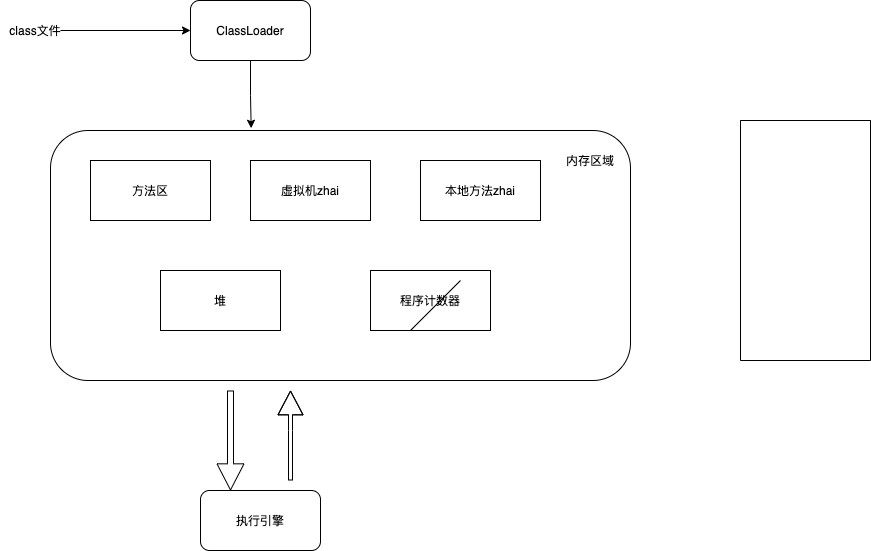
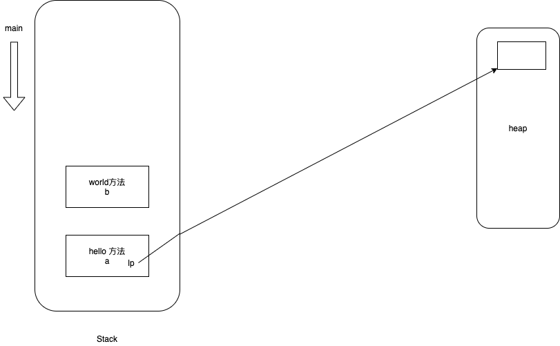
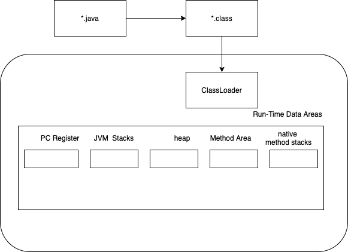
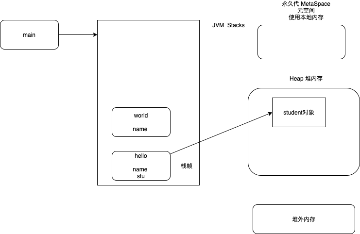

- 方法重载53，54
- 构造方法55，56
- 静态方法
  - 可以调用静态变量
    - **静态变量在哪里赋值？**
  - 不能用this自引用，调用成员变量
  - 当然在静态方法里面，也可以自己创建对象，或者通过参数，获得对象的引用，进而调用方法和访问成员变量
  - import static也可以使用通配符*来引入一个类里所有静态变量 
- 静态代码块执行与顺序有关
- 继承
  - 组合和继承69
  - 覆盖--> **签名**和**返回值**必须一致
  - Super72 
  - 父类、子类引用赋值73https://www.jianshu.com/p/8ee1834f2071
    - 父类的引用指向子类的对象？父类可以使用子类的功能
  - 多态74-77
    - overload
    - override
- instanceof可以判断是否为空
- protected
  - 可见性 = default + 对子类可见
  - 覆盖可以 不能让可见性更低 只能同级或更高（与多态有关）
- final
- 继承里的静态方法
  - 不要用引用调静态方法（用类名调）
- native修饰
  - 程序编译成适合操作系统的方法
- 比较对象 用equals方法
- Class类
  - .class;
- 反射！！！
  - 访问私有变量
- 面向对象3要素
  - 封装--解决数据层面（成员变量，方法）
  - 继承（组合）
  - 多态（覆盖、重载）
- 枚举enum
- 接口
  - 抽象类：接口和类的混合体
  - **<font color=red>有方法代码的接口96？？？</font>**
    - 不能有成员变量
- 异常Throwable
  - Error
  - Exception
- 泛型
  - 协变、逆变？？？？？

- 注解123
- Lambda


# 案例学习

```java
@Test
public void copyFromLocalBigFile() throws Exception {

        InputStream in = new BufferedInputStream(new FileInputStream(new File("/Users/andy/Downloads/bigdata/software/apache-maven-3.6.1-bin.tar.gz")));

        FSDataOutputStream out = fileSystem.create(new Path("/hdfsapi/test/maven.tgz"),
                new Progressable() {
                    public void progress() {
                        System.out.print(".");
                    }
                });

        IOUtils.copyBytes(in, out ,4096);
}

```

- I/O
  - [ ] InputStream
  - [ ] BufferedInputStream
  - [ ] FSDataOutputStream
- 类包
  - [ ] IOUtils


## Maven

- 几个主要phase
  - compile
  - test
  - package
  - install
- mvn clean install / mvn clean install -U
- mvn dependency:tree 
- 插件


### Intellij 更多功能介绍

- 快捷键
  - **Edit** ：Find：Find In Path，Replace In Path，Find Usage
  - **View**：Recent Files
  - **Navigate**：Back， Forward， Last Edit Location， Next Edit Location，Implementations，Class…，File Structure 
  - **Code**：Override Methods…，Generate…，Reformat Code
  - **Refactor**：Rename，Extract Method

- 插件
  - Maven Help
  - Markdown support
  - Grep Console

### 基础

- 计算机网络
- 计算机组成原理
- 数据结构和算法


# 基础语法 

编写 Java 程序时，应注意以下几点：

* **大小写敏感**：Java 是大小写敏感的，这就意味着标识符 Hello 与 hello 是不同的。
* **类名**：对于所有的类来说，类名的首字母应该大写。如果类名由若干单词组成，那么每个单词的首字母应该大写，例如 **MyFirstJavaClass** 。
* **方法名**：所有的方法名都应该以小写字母开头。如果方法名含有若干单词，则后面的每个单词首字母大写。
* **源文件名**：源文件名必须和类名相同。当保存文件的时候，你应该使用类名作为文件名保存（切记 Java 是大小写敏感的），文件名的后缀为 **.java**。（如果文件名和类名不相同则会导致编译错误）。
* **主方法入口**：所有的 Java 程序由 **public static void main(String []args)** 方法开始执行。

## Java 标识符

Java 所有的组成部分都需要名字。类名、变量名以及方法名都被称为标识符。
关于 Java 标识符，有以下几点需要注意：

* 所有的标识符都应该以字母（A-Z 或者 a-z）,美元符（$）、或者下划线（_）开始
* 首字符之后可以是字母（A-Z 或者 a-z）,美元符（$）、下划线（_）或数字的任何字符组合
* 关键字不能用作标识符
* 标识符是大小写敏感的
* 合法标识符举例：age、$salary、_value、__1_value
* 非法标识符举例：123abc、-salary

## Java修饰符

像其他语言一样，Java可以使用修饰符来修饰类中方法和属性。主要有两类修饰符：

* 访问控制修饰符 : default, public , protected, private
* 非访问控制修饰符 : final, abstract, static, synchronized
  在后面的章节中我们会深入讨论 Java 修饰符。

## Java 变量

Java 中主要有如下几种类型的变量

* 局部变量
* 类变量（静态变量）
* 成员变量（非静态变量）


# Java 对象和类

## Java中的类

类可以看成是创建Java对象的模板。
通过下面一个简单的类来理解下Java中类的定义：

```java
public class Dog{
  String breed;
  int age;
  String color;
  void barking(){
  }
 
  void hungry(){
  }
 
  void sleeping(){
  }
}
```

一个类可以包含以下类型变量：

* **局部变量**：在方法、构造方法或者语句块中定义的变量被称为局部变量。变量声明和初始化都是在方法中，方法结束后，变量就会自动销毁。
* **成员变量**：成员变量是定义在类中，方法体之外的变量。这种变量在创建对象的时候实例化。成员变量可以被类中方法、构造方法和特定类的语句块访问。
* **类变量**：类变量也声明在类中，方法体之外，但必须声明为static类型。

## 创建对象

对象是根据类创建的。在Java中，使用关键字new来创建一个新的对象。创建对象需要以下三步：

* **声明**：声明一个对象，包括对象名称和对象类型。
* **实例化**：使用关键字new来创建一个对象。
* **初始化**：使用new创建对象时，会调用构造方法初始化对象。

```java
public class Puppy{
   public Puppy(String name){
      //这个构造器仅有一个参数：name
      System.out.println(“小狗的名字是 : “ + name ); 
   }


   public static void main(String[] args){
      // 下面的语句将创建一个Puppy对象
      Puppy myPuppy = new Puppy( “Tommy” );
   }
}
```


## 访问实例变量和方法

通过已创建的对象来访问成员变量和成员方法，如下所示：

```java
/* 实例化对象 */
Object referenceVariable = new Constructor();
/* 访问类中的变量 */
referenceVariable.variableName;
/* 访问类中的方法 */
referenceVariable.methodName();
```

## 实例

下面的例子展示如何访问实例变量和调用成员方法：

```java
public class Puppy{
   int puppyAge;
   public Puppy(String name){
      // 这个构造器仅有一个参数：name
      System.out.println(“小狗的名字是 : “ + name ); 
   }
 
   public void setAge( int age ){
       puppyAge = age;
   }
 
   public int getAge( ){
       System.out.println(“小狗的年龄为 : “ + puppyAge ); 
       return puppyAge;
   }
 
   public static void main(String[] args){
      /* 创建对象 */
      Puppy myPuppy = new Puppy( “Tommy” );
      /* 通过方法来设定age */
      myPuppy.setAge( 2 );
      /* 调用另一个方法获取age */
      myPuppy.getAge( );
      /*你也可以像下面这样访问成员变量 */
      System.out.println(“变量值 : “ + myPuppy.puppyAge ); 
   }
}

```

## 源文件声明规则

在本节的最后部分，我们将学习源文件的声明规则。当在一个源文件中定义多个类，并且还有import语句和package语句时，要特别注意这些规则。

* 一个源文件中只能有一个public类
* 一个源文件可以有多个非public类
* 源文件的名称应该和public类的类名保持一致。例如：源文件中public类的类名是Employee，那么源文件应该命名为Employee.java。
* 如果一个类定义在某个包中，那么package语句应该在源文件的首行。
* 如果源文件包含import语句，那么应该放在package语句和类定义之间。如果没有package语句，那么import语句应该在源文件中最前面。
* import语句和package语句对源文件中定义的所有类都有效。在同一源文件中，不能给不同的类不同的包声明。
  类有若干种访问级别，并且类也分不同的类型：抽象类和final类等。这些将在访问控制章节介绍。
  除了上面提到的几种类型，Java还有一些特殊的类，如：内部类、匿名类。

## Java 基本数据类型

Java 的两大数据类型:

* 内置数据类型
* 引用数据类型

## 内置数据类型

Java语言提供了八种基本类型。六种数字类型（四个整数型，两个浮点型），一种字符类型，还有一种布尔型。

### **byte：**

* byte 数据类型是8位、有符号的，以二进制补码表示的整数；
* 最小值是 **-128（-2^7）**；
* 最大值是 **127（2^7-1）**；
* 默认值是 **0**；
* byte 类型用在大型数组中节约空间，主要代替整数，因为 byte 变量占用的空间只有 int 类型的四分之一；
* 例子：byte a = 100，byte b = -50。

### **short：**

* short 数据类型是 16 位、有符号的以二进制补码表示的整数
* 最小值是 **-32768（-2^15）**；
* 最大值是 **32767（2^15 - 1）**；
* Short 数据类型也可以像 byte 那样节省空间。一个short变量是int型变量所占空间的二分之一；
* 默认值是 **0**；
* 例子：short s = 1000，short r = -20000。

### **int：**

* int 数据类型是32位、有符号的以二进制补码表示的整数；
* 最小值是 **-2,147,483,648（-2^31）**；
* 最大值是 **2,147,483,647（2^31 - 1）**；
* 一般地整型变量默认为 int 类型；
* 默认值是 **0** ；
* 例子：int a = 100000, int b = -200000。

### **long：**

* long 数据类型是 64 位、有符号的以二进制补码表示的整数；
* 最小值是 **-9,223,372,036,854,775,808（-2^63）**；
* 最大值是 **9,223,372,036,854,775,807（2^63 -1）**；
* 这种类型主要使用在需要比较大整数的系统上；
* 默认值是 **0L**；
* 例子： long a = 100000L，Long b = -200000L。
  “L”理论上不分大小写，但是若写成”l”容易与数字”1”混淆，不容易分辩。所以最好大写。

### **float：**

* float 数据类型是单精度、32位、符合IEEE 754标准的浮点数；
* float 在储存大型浮点数组的时候可节省内存空间；
* 默认值是 **0.0f**；
* 浮点数不能用来表示精确的值，如货币；
* 例子：float f1 = 234.5f。

### **double：**

* double 数据类型是双精度、64 位、符合IEEE 754标准的浮点数；
* 浮点数的默认类型为double类型；
* double类型同样不能表示精确的值，如货币；
* 默认值是 **0.0d**；
* 例子：double d1 = 123.4。

### **boolean：**

* boolean数据类型表示一位的信息；
* 只有两个取值：true 和 false；
* 这种类型只作为一种标志来记录 true/false 情况；
* 默认值是 **false**；
* 例子：boolean one = true。

### **char：**

* char类型是一个单一的 16 位 Unicode 字符；
* 最小值是 **\u0000**（即为0）；
* 最大值是 **\uffff**（即为65,535）；
* char 数据类型可以储存任何字符；
* 例子：char letter = ‘A’;。

## 引用类型

* 在Java中，引用类型的变量非常类似于C/C++的指针。引用类型指向一个对象，指向对象的变量是引用变量。这些变量在声明时被指定为一个特定的类型，比如 Employee、Puppy 等。变量一旦声明后，类型就不能被改变了。
* 对象、数组都是引用数据类型。
* 所有引用类型的默认值都是null。
* 一个引用变量可以用来引用任何与之兼容的类型。
* 例子：Site site = new Site(“Runoob”)。

## Java 常量

常量在程序运行时是不能被修改的。
在 Java 中使用 final 关键字来修饰常量，声明方式和变量类似：

```java
final double PI = 3.1415927;

```

## 自动类型转换

**整型、实型（常量）、字符型数据可以混合运算。运算中，不同类型的数据先转化为同一类型，然后进行运算。**
转换从低级到高级。

```java
低  ------------------------------------>  高

byte,short,char—> int —> long—> float —> double 

```

数据类型转换必须满足如下规则：

* 1. 不能对boolean类型进行类型转换。

* 2. 不能把对象类型转换成不相关类的对象。

* 3. 在把容量大的类型转换为容量小的类型时必须使用强制类型转换。

* 4. 转换过程中可能导致溢出或损失精度

* 5. 浮点数到整数的转换是通过舍弃小数得到，而不是四舍五入


### **自动类型转换**

必须满足转换前的数据类型的位数要低于转换后的数据类型，例如: short数据类型的位数为16位，就可以自动转换位数为32的int类型，同样float数据类型的位数为32，可以自动转换为64位的double类型

```java
public class ZiDongLeiZhuan{
        public static void main(String[] args){
            char c1=‘a’;//定义一个char类型
            int i1 = c1;//char自动类型转换为int
            System.out.println(“char自动类型转换为int后的值等于”+i1);
            char c2 = ‘A’;//定义一个char类型
            int i2 = c2+1;//char 类型和 int 类型计算
            System.out.println(“char类型和int计算后的值等于”+i2);
        }
}
```

### 强制类型转换

* 1. 条件是转换的数据类型必须是兼容的。

* 2. 格式：(type)value type是要强制类型转换后的数据类型 实例：

```java
public class QiangZhiZhuanHuan{
    public static void main(String[] args){
        int i1 = 123;
        byte b = (byte)i1;//强制类型转换为byte
        System.out.println(“int强制类型转换为byte后的值等于”+b);
    }
}
```


# Java 变量类型

在Java语言中，所有的变量在使用前必须声明。声明变量的基本格式如下：

```java
type identifier [ = value][, identifier [= value] …] ;

// example
int a, b, c;         // 声明三个int型整数：a、 b、c
Int d = 3, e = 4, f = 5; // 声明三个整数并赋予初值
Byte z = 22;         // 声明并初始化 z
String s = “runoob”;  // 声明并初始化字符串 s
Double pi = 3.14159; // 声明了双精度浮点型变量 pi
Char x = ‘x’;        // 声明变量 x 的值是字符 ‘x’。
```

Java语言支持的变量类型有：

* 类变量：独立于方法之外的变量，用 static 修饰。
* 实例变量：独立于方法之外的变量，不过没有 static 修饰。
* 局部变量：类的方法中的变量。

```java
public class Variable{
    static int allClicks=0;    // 类变量
 
    String str=“hello world”;  // 实例变量
 
    public void method(){
 
        Int i =0;  // 局部变量
 
    }
}
```

### 实例变量

* 实例变量声明在一个类中，但在方法、构造方法和语句块之外；
* 当一个对象被实例化之后，每个实例变量的值就跟着确定；
* 实例变量在对象创建的时候创建，在对象被销毁的时候销毁；
* 实例变量的值应该至少被一个方法、构造方法或者语句块引用，使得外部能够通过这些方式获取实例变量信息；
* 实例变量可以声明在使用前或者使用后；
* 访问修饰符可以修饰实例变量；
* 实例变量对于类中的方法、构造方法或者语句块是可见的。一般情况下应该把实例变量设为私有。通过使用访问修饰符可以使实例变量对子类可见；
* 实例变量具有默认值。数值型变量的默认值是0，布尔型变量的默认值是false，引用类型变量的默认值是null。变量的值可以在声明时指定，也可以在构造方法中指定；
* 实例变量可以直接通过变量名访问。但在静态方法以及其他类中，就应该使用完全限定名：ObejectReference.VariableName。

```java
import java.io.*;
public class Employee{
   // 这个实例变量对子类可见
   public String name;
   // 私有变量，仅在该类可见
   private double salary;
   //在构造器中对name赋值
   public Employee (String empName){
      name = empName;
   }
   //设定salary的值
   public void setSalary(double empSal){
      salary = empSal;
   }  
   // 打印信息
   public void printEmp(){
      System.out.println(“名字 : “ + name );
      System.out.println(“薪水 : “ + salary);
   }
 
   public static void main(String[] args){
      Employee empOne = new Employee(“RUNOOB”);
      empOne.setSalary(1000.0);
      empOne.printEmp();
   }
}
```

### 类变量（静态变量）

* 类变量也称为静态变量，在类中以 static 关键字声明，但必须在方法之外。
* 无论一个类创建了多少个对象，类只拥有类变量的一份拷贝。
* 静态变量除了被声明为常量外很少使用。常量是指声明为public/private，final和static类型的变量。常量初始化后不可改变。
* 静态变量储存在静态存储区。经常被声明为常量，很少单独使用static声明变量。
* 静态变量在第一次被访问时创建，在程序结束时销毁。
* 与实例变量具有相似的可见性。但为了对类的使用者可见，大多数静态变量声明为public类型。
* 默认值和实例变量相似。数值型变量默认值是0，布尔型默认值是false，引用类型默认值是null。变量的值可以在声明的时候指定，也可以在构造方法中指定。此外，静态变量还可以在静态语句块中初始化。
* 静态变量可以通过：*ClassName.VariableName*的方式访问。
* 类变量被声明为public static final类型时，类变量名称一般建议使用大写字母。如果静态变量不是public和final类型，其命名方式与实例变量以及局部变量的命名方式一致

```java
import java.io.*;
 
public class Employee {
    //salary是静态的私有变量
    private static double salary;
    // DEPARTMENT是一个常量
    public static final String DEPARTMENT = “开发人员”;
    public static void main(String[] args){
    salary = 10000;
        System.out.println(DEPARTMENT+”平均工资:”+salary);
    }
}
```

#### 猜想

- [ ] 类变量可以被访问。实例变量不可以？


# Java 修饰符

Java语言提供了很多修饰符，主要分为以下两类：

* 访问修饰符
* 非访问修饰符
  修饰符用来定义类、方法或者变量，通常放在语句的最前端。我们通过下面的例子来说明：

```java
public class ClassName {
   // …
}
private boolean myFlag;
static final double weeks = 9.5;
protected static final int BOXWIDTH = 42;
public static void main(String[] arguments) {
   // 方法体
}
```

## 访问控制修饰符

Java中，可以使用访问控制符来保护对类、变量、方法和构造方法的访问。Java 支持 4 种不同的访问权限。

* **default** (即默认，什么也不写）: 在同一包内可见，不使用任何修饰符。使用对象：类、接口、变量、方法。
* **private** : 在同一类内可见。使用对象：变量、方法。 **注意：不能修饰类（外部类）**
* **public** : 对所有类可见。使用对象：类、接口、变量、方法
* **protected** : 对同一包内的类和所有子类可见。使用对象：变量、方法。 **注意：不能修饰类（外部类）**。

|           | 本类 | 同包 | 子类 | 任意位置 |
| --------- | ---- | ---- | ---- | -------- |
| public    |      |      |      |          |
| protected |      |      |      | N        |
| 默认      |      |      | N    | N        |
| private   |      | N    | N    | N        |


## 访问控制和继承

请注意以下方法继承的规则：

* 父类中声明为 public 的方法在子类中也必须为 public。

* 父类中声明为 protected 的方法在子类中要么声明为 protected，要么声明为 public，不能声明为 private。

* 父类中声明为 private 的方法，不能够被继承。

## 非访问修饰符

为了实现一些其他的功能，Java 也提供了许多非访问修饰符。

* Static 修饰符，用来修饰类方法和类变量。
* Final 修饰符，用来修饰类、方法和变量，final 修饰的类不能够被继承，修饰的方法不能被继承类重新定义，修饰的变量为常量，是不可修改的。
* Abstract 修饰符，用来创建抽象类和抽象方法。
* synchronized 和 volatile 修饰符，主要用于线程的编程。

## static 修饰符

* **静态变量：**
  Static 关键字用来声明独立于对象的静态变量，无论一个类实例化多少对象，它的静态变量只有一份拷贝。 静态变量也被称为类变量。局部变量不能被声明为 static 变量。

* **静态方法：**
  Static 关键字用来声明独立于对象的静态方法。静态方法不能使用类的非静态变量。静态方法从参数列表得到数据，然后计算这些数据。

对类变量和方法的访问可以直接使用 **classname.variablename** 和 **classname.methodname** 的方式访问。

```java
public class InstanceCounter {
   private static int numInstances = 0;
   protected static int getCount() {
      return numInstances;
   }
 
   private static void addInstance() {
      numInstances++;
   }
 
   InstanceCounter() {
      InstanceCounter.addInstance();
   }
 
   public static void main(String[] arguments) {
      System.out.println(“Starting with “ +
      InstanceCounter.getCount() + “ instances”);
      for (int I = 0; I < 500; ++i){
         new InstanceCounter();
          }
      System.out.println(“Created “ +
      InstanceCounter.getCount() + “ instances”);
   }
}
```

## final 修饰符

* **final 变量：**
  Final 表示”最后的、最终的”含义，变量一旦赋值后，不能被重新赋值。被 final 修饰的实例变量必须显式指定初始值。
  Final 修饰符通常和 static 修饰符一起使用来创建类常量。

```java
public class Test{
  final int value = 10;
  // 下面是声明常量的实例
  public static final int BOXWIDTH = 6;
  static final String TITLE = “Manager”;
 
  public void changeValue(){
     value = 12; //将输出一个错误
  }
}
```

* **final 方法**
  父类中的 final 方法可以被子类继承，但是不能被子类重写。
  声明 final 方法的主要目的是防止该方法的内容被修改。
  如下所示，使用 final 修饰符声明方法。

```java
public class Test{
    public final void changeName(){
       // 方法体
    }
}
```

* **final 类**
  Final 类不能被继承，没有类能够继承 final 类的任何特性。

## abstract 修饰符

**抽象类：**

* 抽象类不能用来实例化对象，声明抽象类的唯一目的是为了将来对该类进行扩充。
* 一个类不能同时被 abstract 和 final 修饰。如果一个类包含抽象方法，那么该类一定要声明为抽象类，否则将出现编译错误。
* 抽象类可以包含抽象方法和非抽象方法。

```java
abstract class Caravan{
   private double price;
   private String model;
   private String year;
   public abstract void goFast(); //抽象方法
   public abstract void changeColor();
}
```

**抽象方法**

* 抽象方法是一种没有任何实现的方法，该方法的的具体实现由子类提供。
* 抽象方法不能被声明成 final 和 static。
* 任何继承抽象类的子类必须实现父类的所有抽象方法，除非该子类也是抽象类。
* 如果一个类包含若干个抽象方法，那么该类必须声明为抽象类。抽象类可以不包含抽象方法。
* 抽象方法的声明以分号结尾，例如：**public abstract sample();**。

### 实践

- 定义模板（方法执行顺序）接口做不到

## synchronized 修饰符

Synchronized 关键字声明的方法同一时间只能被一个线程访问。synchronized 修饰符可以应用于四个访问修饰符。

## transient 修饰符

序列化的对象包含被 transient 修饰的实例变量时，java 虚拟机(JVM)跳过该特定的变量。
该修饰符包含在定义变量的语句中，用来预处理类和变量的数据类型。

## volatile 修饰符

Volatile 修饰的成员变量在每次被线程访问时，都强制从共享内存中重新读取该成员变量的值。而且，当成员变量发生变化时，会强制线程将变化值回写到共享内存。这样在任何时刻，两个不同的线程总是看到某个成员变量的同一个值。
一个 volatile 对象引用可能是 null。

# Java 运算符

计算机的最基本用途之一就是执行数学运算，作为一门计算机语言，Java也提供了一套丰富的运算符来操纵变量。我们可以把运算符分成以下几组：

* 算术运算符
* 关系运算符
* 位运算符
* 逻辑运算符
* 赋值运算符
* 其他运算符

## 条件运算符（?:）

条件运算符也被称为三元运算符。该运算符有3个操作数，并且需要判断布尔表达式的值。该运算符的主要是决定哪个值应该赋值给变量

```java
variable x = (expression) ? value if true : value if false

public class Test {
   public static void main(String[] args){
      int a , b;
      a = 10;
      // 如果 a 等于 1 成立，则设置 b 为 20，否则为 30
      b = (a == 1) ? 20 : 30;
      System.out.println( “Value of b is : “ +  b );
 
      // 如果 a 等于 10 成立，则设置 b 为 20，否则为 30
      b = (a == 10) ? 20 : 30;
      System.out.println( “Value of b is : “ + b );
   }
}
```

## instanceof 运算符

该运算符用于操作对象实例，检查该对象是否是一个特定类型（类类型或接口类型）。
instanceof运算符使用格式如下：

```java
( Object reference variable ) instanceof  (class/interface type)

String name = “James”;
boolean result = name instanceof String; // 由于 name 是 String 类型，所以返回真

```

## **Java运算符优先级**


# Java 循环结构 - for, while 及 do…while

顺序结构的程序语句只能被执行一次。如果您想要同样的操作执行多次,，就需要使用循环结构。
Java中有三种主要的循环结构：

* **while** 循环
* **do…while** 循环
* **for** 循环

## while 循环

While是最基本的循环，它的结构为：

```java
while( 布尔表达式 ) {
  //循环内容
}
```

## do…while 循环

对于 while 语句而言，如果不满足条件，则不能进入循环。但有时候我们需要即使不满足条件，也至少执行一次。
Do…while 循环和 while 循环相似，不同的是，do…while 循环至少会执行一次。

```java
do {
       //代码语句
}while(布尔表达式);

```

## for循环

虽然所有循环结构都可以用 while 或者 do…while表示，但 Java 提供了另一种语句 —— for 循环，使一些循环结构变得更加简单。
For循环执行的次数是在执行前就确定的。语法格式如下：

```java
for(初始化; 布尔表达式; 更新) {
    //代码语句
}
```

关于 for 循环有以下几点说明：

* 最先执行初始化步骤。可以声明一种类型，但可初始化一个或多个循环控制变量，也可以是空语句。
* 然后，检测布尔表达式的值。如果为 true，循环体被执行。如果为false，循环终止，开始执行循环体后面的语句。
* 执行一次循环后，更新循环控制变量。
* 再次检测布尔表达式。循环执行上面的过程。


# Java 条件语句 - if…else

一个 if 语句包含一个布尔表达式和一条或多条语句。

## 语法

If 语句的语法如下：

```java
if(布尔表达式)
{
   //如果布尔表达式为true将执行的语句
}else{
   //如果布尔表达式的值为false
}
```

## if...else if…else 语句

If 语句后面可以跟 else if…else 语句，这种语句可以检测到多种可能的情况。
使用 if，else if，else 语句的时候，需要注意下面几点：

* if 语句至多有 1 个 else 语句，else 语句在所有的 else if 语句之后。
* if 语句可以有若干个 else if 语句，它们必须在 else 语句之前。
* 一旦其中一个 else if 语句检测为 true，其他的 else if 以及 else 语句都将跳过执行。

```java
if(布尔表达式 1){
   //如果布尔表达式 1的值为true执行代码
}else if(布尔表达式 2){
   //如果布尔表达式 2的值为true执行代码
}else if(布尔表达式 3){
   //如果布尔表达式 3的值为true执行代码
}else {
   //如果以上布尔表达式都不为true执行代码
}
```


# Java switch case 语句

Switch case 语句判断一个变量与一系列值中某个值是否相等，每个值称为一个分支。

## 语法

switch case 语句语法格式如下：

```java
switch(expression){
    case value :
       //语句
       break; //可选
    case value :
       //语句
       break; //可选
    //你可以有任意数量的case语句
    default : //可选
       //语句
}
```


# 进阶

## 1 Object类

## 1.1 方法

### 1.1.1 toString()

- 默认实现：类名@对象内存地址转换为十六进制

```java
getClass().getName() + '@' + Integer.toHexString(hashCode())
```

- 设计目的：通过调用这个方法将java对象转换为字面信息
- **建议所有子类重写该方法**
- 输出引用时会自动调用toString方法（System.out.println()）

### 1.1.2 equals

- 判断2个对象是否相等

```java
// 默认实现
// 使用==判断 这个判断2个java对象内存地址
public boolean equals (Object obj) {
  return (this == obj);
}
```


- 判断2个基本数据类型相等 **==** **比较内存地址**

```java
class MyTime {
  int year;
  int month;
  int day;
  
  public MyTime() {}
  
  public MyTime(int year, int month, int day) {
    this.year = year;
    this.month = month;
    this.day = day;
  }
}
```

- 需要子类重写equals方法

```java
public Boolean equals(Object obj) {
  int year1 = this.year;
  int month1 = this.month;
  int day1 = this.day;
  
  if (obj instanceof MyTime) {
    MyTime t = (MyTime) obj;
    int year2 = t.year;
    int month2 = t.month;
    int day2 = t.day;
  }
  
  if (year1 == year2 && month1 == month2 && day1 == day2) {
    return true;
  }
  return false;
}
```

- 改良

```java
public Boolean equals(Object obj) {
  if (obj == null) {
    return false;
  }
  if (!(obj instanceof MyTime)) {
    return false;
  }
  // t1.equals(t1); 内存地址相同
  if (this == obj) {
    return true;
  }
  MyTime t = (MyTime) obj;
  if (this.year == t.year && this.month == t.month && this.day == t.day) {
    return true;
  }
  return false;
}
```

- String类

```java
public static void main(String[] args) {
  // 大部分情况下，采用这样方式创建字符串
  String a = "a";

  // String也是一个类，不属于基本数据类型
  // 存在构造方法
  String b = new String("test");
  String c = new String("test");
  System.out.println(b == c); // false
  // == 内存地址比较 基本数据类型可以

  // 比较字符串 用equals方法
  System.out.println(b.equals(c));

  // String 重写toString方法
  System.out.println(b.toString());
  System.out.println(b);
}
```

- 深层剖析

### 1.1.3 finalize() (JDK15已弃)

- Called by the garbage collector on an object when garbage collection determines that there are no more references to the object. A subclass overrides the `finalize`method to dispose of system resources or to perform other cleanup.

- 只有一个方法体，里面没有代码，JVM垃圾回收器调用

- 实际上Sun公司为程序员准备的一个时机，垃圾销毁时机。

  - 如果希望在对象销毁执行一段代码，写在finalize() 中

  - 静态代码块

  ```java
  // 在类加载时刻执行，只执行一次
  // 这是Sun准备的类加载时机
  static {
    
  }
  ```

  - Java的GC不是随时启动，有条件

    - ```
      System.gc();  // 建议启动GC
      ```

### 1.1.4 hashCode()

- 不是抽象方法，带有native关键字，底层调用c++程序
- java对象的内存地址，经过哈希算法，得出的值

### 1.1.5 Clone

- 深克隆
- 浅克隆


## 1.2 匿名内部类（不建议使用）

- 内部类
  - 类的内部有定义一个新的类
- 分类
  - 静态内部类：类似于静态变量
  - 实例内部类：类似于实例变量
  - 局部内部类：类似于局部变量 (包括匿名)

- 使用内部类可读性差
- 匿名内部类
  - 局部内部类一种
  - 没有名字

```java
public class test01 {
    /**
     * 因为static 静态内部类
     */
    static class Inner1 {}

    /**
     * 没有static 实例内部类
     */
    class Inner2 {}
    
    public void doSome() {
        /**
         * 局部变量
         */
        int a = 30;
        /**
         * 局部内部类
         */
        class Inner3 {
        }
    }
  
  // 匿名内部类
   myMath.MySum(new Compute() {
            @Override
            public int sum(int a, int b) {
                return a-b;
            }
        }, 100, 200);
}
```


# 2 数组

## 2.1 Array

- 属于引用数据类型，父类Object
- 是一个容器，同时容纳多个元素
- 数组是引用类型，数组对象存储在堆内存
- 数组中存java对象，存的是内存地址
- 数组一旦创建，长度不可变
- java要求数组元素类型统一
- 有length属性
- 数组存的内存地址是**连续的**（数据结构）
- 所有的数组都是拿第一个元素的内存地址作为数组对象的内存地址

- 优点（检索效率高）
  - 1 每个元素的内存地址是lianxude
  - 2 每个元素类型相同，占用空间大小一样
  - 3 知道第一个元素的内存地址，每个元素的占用空间大小，又知道小标，可以通过按数学表达式计算出（直接定位）
- 缺点
  - 为了保证每个元素内存地址连续，所以在数组上随机删除或者增加元素时，效率低，因为涉及向前或向后位移
  - 不适合存储大数据量，很难在内存中找到一块特别大的连续的内存空间
  - （另外）对最后一个元素操作，没有效率影响
- 初始化

```java
// 静态初始化
int[] array1 = {1,2,3,4,5};
// 动态 默认值 0
int[] array2 = new int[5];
```

- 默认值

| 数据类型     | 默认值 |
| ------------ | ------ |
| byte         | 0      |
| short        | 0      |
| int          | 0      |
| long         | 0L     |
| float        | 0.0F   |
| double       | 0.0    |
| boolean      | false  |
| char         | \u0000 |
| 引用数据类型 | null   |

## 排序

- Comparetor

```java
import java.util.ArrayList;
import java.util.Collections;
import java.util.Comparator;

public class MM {
    private String name;
    private int cup;

    public static void main(String[] args) {
        MM mm1 = new MM("a1", 1);
        MM mm2 = new MM("a2", 2);
        MM mm3 = new MM("a3", 3);
        MM mm4 = new MM("a4", 4);

        ArrayList<MM> mms = new ArrayList<>();
        mms.add(mm1);
        mms.add(mm2);
        mms.add(mm3);
        mms.add(mm4);

        /*
        比较方法
        */
        Collections.sort(mms, new Comparator<MM>() {
            @Override
            public int compare(MM o1, MM o2) {
                return o1.cup - o2.cup;
            }
        });

        for (MM mm : mms) {
            System.out.println(mm);
        }
    }

    // 以下：常规方法
    public MM(String name, int cup) {
        this.name = name;
        this.cup = cup;
    }

    public String getName() {
        return name;
    }

    public void setName(String name) {
        this.name = name;
    }

    public int getCup() {
        return cup;
    }

    public void setCup(int cup) {
        this.cup = cup;
    }

    @Override
    public String toString() {
        return "MM{" +
                "name='" + name + '\'' +
                ", cup=" + cup +
                '}';
    }
}
```

- 实现Comparable

```java
package com.ruozedata.spark.day02;

import java.util.ArrayList;
import java.util.Collections;
import java.util.Comparator;

public class MM implements Comparable<MM> {
    private String name;
    private int cup;

    public static void main(String[] args) {
        MM mm1 = new MM("a1", 1);
        MM mm2 = new MM("a2", 2);
        MM mm3 = new MM("a3", 3);
        MM mm4 = new MM("a4", 4);

        ArrayList<MM> mms = new ArrayList<>();
        mms.add(mm1);
        mms.add(mm2);
        mms.add(mm3);
        mms.add(mm4);

        for (MM mm : mms) {
            System.out.println(mm);
        }
    }

    public MM(String name, int cup) {
        this.name = name;
        this.cup = cup;
    }

    public String getName() {
        return name;
    }

    public void setName(String name) {
        this.name = name;
    }

    public int getCup() {
        return cup;
    }

    public void setCup(int cup) {
        this.cup = cup;
    }

    @Override
    public String toString() {
        return "MM{" +
                "name='" + name + '\'' +
                ", cup=" + cup +
                '}';
    }

    @Override
    public int compareTo(MM o) {
        return this.cup - o.cup;
    }
}
```


## 反射（runtime）

### 1 类

### 2 构造器

## 注解 Annotation


## IO（BIO/NIO/AIO）

### 字节流

- InputStream
- OutputStream

```java
import java.io.FileInputStream;
import java.io.FileNotFoundException;
import java.io.FileOutputStream;
import java.io.IOException;

/**
 * 字节流读写
 */
public class InputOutStreamApp {
    public static void main(String[] args) {

        // read();

        write();
    }

    private static void write() {
        FileInputStream fis = null;
        FileOutputStream fos = null;

        try {
            fis = new FileInputStream("data/wc.data");
            fos = new FileOutputStream("data/wc.txt");

            byte[] buffer = new byte[1024];
            int length = 0;
            while ((length=fis.read(buffer, 0, buffer.length)) != -1) {
                fos.write(buffer, 0, length);
                fos.flush();
            }
        } catch (Exception e) {
            e.printStackTrace();
        } finally {
            if (fos != null) {
                try {
                    fos.close();
                } catch (IOException e) {
                    e.printStackTrace();
                }
            }
        }
    }

    private static void read() {
        FileInputStream fis = null;
        try {
            fis = new FileInputStream("data/wc.data");

            byte[] buffer = new byte[1024];
            int length = 0;

            while ((length=fis.read(buffer, 0, buffer.length)) != -1) {
                String result = new String(buffer, 0 ,length);
                System.out.println(result);
            }
        } catch (FileNotFoundException e) {
            e.printStackTrace();
        } catch (IOException e) {
            e.printStackTrace();
        } finally {
            if (fis != null) {
                try {
                    fis.close();
                } catch (IOException e) {
                    e.printStackTrace();
                }
            }
        }
    }
}
```


### 字符流

- Reader
- Writer

```java
import java.io.FileNotFoundException;
import java.io.FileReader;
import java.io.FileWriter;
import java.io.IOException;
import java.lang.String;

public class ReadWriterApp {
    public static void main(String[] args) {
        read();
        write();
    }

    private static void write() {
        FileWriter writer = null;
        try {
            writer = new FileWriter("data/wc2.data");
            writer.write("ssss");
            writer.flush();
        } catch (IOException e) {
            e.printStackTrace();
        } finally {
            if (writer != null) {
                try {
                    writer.close();
                } catch (IOException e) {
                    e.printStackTrace();
                }
            }
        }
    }

    private static void read() {
        FileReader reader = null;

        try {
            reader = new FileReader("data/wc.data");

            char[] buffer = new char[1024];
            int length = 0;
            while ((length = reader.read(buffer, 0 ,buffer.length)) != -1) {
                String result = new String(buffer, 0, length);
                System.out.println(result);
            }
        } catch (FileNotFoundException e) {
            e.printStackTrace();
        } catch (IOException e) {
            e.printStackTrace();
        } finally {
            if (reader != null) {
                try {
                    reader.close();
                } catch (IOException e) {
                    e.printStackTrace();
                }
            }
        }
    }

}
```

### 字节流转字符流

- BufferedWriter
- BufferedReader

```java
import java.io.*;

public class BufferedApp {
    public static void main(String[] args) {

        read();

        writer();
    }

    private static void writer() {

        BufferedWriter writer = null;
        try {
            writer = new BufferedWriter(new OutputStreamWriter(new FileOutputStream("data/wc3.data", true)));
            writer.write("zzzzz.xxxx...\n");
        } catch (FileNotFoundException e) {
            e.printStackTrace();
        } catch (IOException e) {
            e.printStackTrace();
        } finally {
            if (writer != null) {
                try {
                    writer.close();
                } catch (IOException e) {
                    e.printStackTrace();
                }
            }
        }
    }

    private static void read() {
        // 字符流 文件读进来可以是字节流  字节流=> 字符流
        // InputStreamReader 装饰器模式
        BufferedReader reader = null;
        try {
            reader = new BufferedReader(new InputStreamReader(new FileInputStream("data/wc.data")));
            String message = null;
            while ((message = reader.readLine()) != null) {
                System.out.println(message);
            }
        } catch (FileNotFoundException e) {
            e.printStackTrace();
        } catch (IOException e) {
            e.printStackTrace();
        } finally {
            if (reader != null) {
                try {
                    reader.close();
                } catch (IOException e) {
                    e.printStackTrace();
                }
            }
        }

    }

}
```


### Socket

- client

```java
package io;

import java.io.*;
import java.net.Socket;

public class Client {
    public static void main(String[] args) {

        final int PORT = 8888;
        final String HOST = "localhost";
        Socket socket = null;

        try {
            socket = new Socket(HOST, PORT);

            // 创建IO相关
            BufferedReader reader = new BufferedReader(new InputStreamReader(socket.getInputStream()));
            BufferedWriter writer = new BufferedWriter(new OutputStreamWriter(socket.getOutputStream()));

            // 输入内容的流
            BufferedReader consoleReader = new BufferedReader(new InputStreamReader(System.in));

            while (true) {
                String requestMessage = consoleReader.readLine();

                // 将请求信息发送给服务器
                writer.write(requestMessage+"\n");
                writer.flush();

                // 服务器返回内容
                String responseMessage = reader.readLine();
                System.out.println("接收到服务器端返回的数据 "+ responseMessage);

                // 是否退出
                if ("quit".equals(requestMessage)) {
                    break;
                }
            }
        } catch (IOException e) {
            e.printStackTrace();
        } finally {
            if (socket != null) {
                try {
                    socket.close();
                    System.out.println("客户端已关闭"+socket.getPort());
                } catch (IOException e) {
                    e.printStackTrace();
                }
            }
        }
    }
}
```


- server

```java
package io;

import java.io.*;
import java.net.ServerSocket;
import java.net.Socket;

public class Server {

    public static void main(String[] args) {
        final int PORT = 8888;
        ServerSocket serverSocket = null;
        try {
            serverSocket = new ServerSocket(PORT);
            System.out.println("server start, port: " + PORT);

            while (true) {
                // 建立连接
                Socket socket = serverSocket.accept();  // 阻塞式
                System.out.println("客户端"+socket.getPort()+" 建立连接");

                // 创建IO相关
                BufferedReader reader = new BufferedReader(new InputStreamReader(socket.getInputStream()));
                BufferedWriter writer = new BufferedWriter(new OutputStreamWriter(socket.getOutputStream()));

                // 接收客户端数据
                String message;
                while ((message = reader.readLine()) != null) {
                    System.out.println("客户端"+socket.getPort()+"发送信息是："+message);

                    // 返回客户端数据
                    writer.write("---"+message+"\n");
                    writer.flush();
                }
            }

        } catch (IOException e) {
            e.printStackTrace();
        } finally {
            if (serverSocket != null) {
                try {
                    serverSocket.close();
                    System.out.println("服务器关闭。。。");
                } catch (IOException e) {
                    e.printStackTrace();
                }
            }
        }
    }
}
```


# JVM Java虚拟机

- 虚拟机：通过软件模拟的具有完整硬件系统功能的并且运行在一个完全隔离环境当中的一个计算机系统

- IDEA插件查看字节：jclasslib bytecode viewer

- 类加载器（classloader）
  - Java解释器
  - JIT编译器

- Class文件：JVM规范

- JVM：内存分配、字节码执行引擎、GC

[**arthas工具**](https://arthas.aliyun.com/doc/)

## 1 [JVM规范](https://docs.oracle.com/javase/specs/index.html)

- 为不同的硬件平台提供一种编译java技术代码的规范(虚拟机规范)
  - class --> ClassLoader --> JVM
  - 语法规范
- CGLIB
- ASM

### 1.1 [Run-Time Data Areas](https://docs.oracle.com/javase/specs/jvms/se8/html/jvms-2.html#jvms-2.5)



- pc Register
  - 每个线程私有
  - 指向下一条指令的地址
  - native方法：undefined
  - 很小的内存空间
  - 唯一一个不会出现OOM的区域
- Java Virtual Machine Stacks
  - 每个线程私有
  - stack stores frames（帧）
    - 涉及压入和弹出
  - 局部变量
  - If the computation in a thread requires a larger Java Virtual Machine stack than is permitted, the Java Virtual Machine throws a <font color=red>`StackOverflowError`</font>.
  - If Java Virtual Machine stacks can be dynamically expanded, and expansion is attempted but insufficient memory can be made available to effect the expansion, or if insufficient memory can be made available to create the initial Java Virtual Machine stack for a new thread, the Java Virtual Machine throws an<font color=red> `OutOfMemoryError`.</font>
- Heap
  - 线程共享
  - The heap is the run-time data area from which memory for all class instances and arrays is allocated
  - Heap storage for objects is reclaimed by an automatic storage management system (known as a <font color=red>*garbage collector*</font>)

```java
public void hello() {
  String a = "hello";
  
  LP lp = new LP("pk");
  lp.eat();
}

class LP{
  String name;
  
  public LP(String name){}
}
```




- Method Area
- Native Method Stacks
  - **StackOverflowError**
  - **OutOfMemoryError**





- 总结
  - 每个区什么名字
  - 线程私有还是共享
  - 存什么东西
  - 抛什么异常
  - 内存结构实现
    - 堆区：Young（S0 S1 Eden）  Old    ====>  GC
    - 非堆区：Metaspace  CCS  CodeCache


## 2 JVM相关常见异常

堆管存储

栈管执行

### 2.1 Stack

- StackOverflowError
  - 经典场景：自己调自己（递归调用）


## 3 JVM参数

### 3.1 标准参数

- 各版本很少变

### 3.2 X参数

- 变化少

```shell
# 解释执行
java -Xint -version
# 编译执行
java -Xcomp -version
```

- 重要参数

### 3.3 XX参数（重要）

JVM debug 调优

- Boolean  1/0
  - 公式：-XX:[+/-] <name>

```shell
-XX:-PrintGCDetails  # + 开启

jinfo -flag PrintGCDetails pid
```


- 非Boolean  k-v
  - 公式：-XX:<name>=<name>

```shell
jinfo -flag MetaspaceSize pid
```


- 重要参数
  - -XX:+PrintFlagsInitial                     查看初始默认值
  - -XX:+PrintFlagsFinal                       查看修改后
  - -XX:+PrintCommandLineFlags      打印命令行参数
  - -Xms heap初始化大小                   -XX:InitialHeapSize
  - -Xmx heap最大的大小                   -XX:MaxhHeapSize
  - -Xss   -XX:ThreadStackSize           1024k

## 4 [字节码](https://docs.oracle.com/javase/specs/jvms/se8/html/jvms-4.html)



```shell
javac a.java
# 查看字节码文件
javap -v -c a.class
```

- 案例

```shell
Ljava/lang/String; = String
[Ljava/lang/String; = String[]
```

栈：

- 调用执行任何方法都会给对应的方法创建栈帧，然后入栈
- StackOverFlow


堆：Heap

- OutOfMemoryError  有多种原因

```java
public static void main(String[] args) {}

public void hello() {
  String name = "pk";
  world(name);
  Student stu = new Student(name);
  stu.study();
}

public void world(String name) {
  String world = name + "world...";
}

class Student{
  String name;
  
  public Student(String name) {
    this.name = name;
  }
  
  public void study() {}
}
```


## 5 GC

> 1 哪些对象要被回收
>
> 2 什么时候
>
> 3 采用什么方式


- 1 判断一个对象是否可以回收
  - 1）引用计数法：引用指向对象
    - 父类引用指向子类对象   JavaSE
  - 枚举根节点可达性分析
    - 其原理简单来说，就是将对象及其引用关系看作一个图，选定活动的对象作为 GC Roots，然后跟踪引用链条，如果一个对象和 GC Roots 之间不可达，也就是不存在引用链条，那么即可认为是可回收对象。
    - GC ROOT
      - 虚拟机栈：引用
      - 方法区：static final
      - 本地方法栈：native


- GC算法
  - 标记清除
    - 标记：GCROOT=>可达对象
    - 清除：不可达对象
    - 缺点：内存碎片
  - 复制: 分为2个片区，在同一个时间点只能使用一个区域（适用新生代）
    - 优点：弥补标记清除导致的内存碎片问题
    - 缺点：只能用一半内存
  - 标记整理
    - 标记：和标记清除的标记阶段一样
    - 整理
    - 弥补标记清除内存碎片，也弥补复制算法内存仅使用一半的问题
  - 分代
    - 夭折对象
    - 长寿对象
    - 不死对象


- minor gc  young
- major gc  old
- full      gc


新生代：存放刚出生不久的对象

老年代：存放比较活跃、经常被引用的对象

垃圾回收机制在新生代比较频繁

## 问题

- 静态代理，动态代理
  - 静态代理 太多 内存会炸掉（缺点）


# 多线程

## 创建方式

- 继承Thread类

```java
/**
 * 线程开启不会立即执行
 */
public class StartThread extends Thread {
    @Override
    public void run() {
        for (int i = 0; i<10; i++) {
            System.out.println("多线程: "+i);
        }
    }

    public static void main(String[] args) {
        StartThread startThread = new StartThread();
        // 调用start开启线程
        startThread.start();

        for (int i=0; i<1000; i++) {
            System.out.println("main: "+i);
        }
    }
}
```


- 实现Runnable接口(推荐)
  - 静态代理


```java
public class ThreadApp implements Runnable {

    @Override
    public void run() {
        for (int i = 0; i<10; i++) {
            System.out.println("多线程: "+i);
        }
    }

    public static void main(String[] args) {
        // 创建runnable接口的实现类对象
        ThreadApp threadApp = new ThreadApp();

        // 创建线程对象，通过线程对象来开启我们的线程  代理
        Thread thread = new Thread(threadApp);
        thread.start();

        for (int i=0; i<50; i++) {
            System.out.println("main: "+i);
        }
    }
}
```


- 实现Callable接口

```java
import java.util.concurrent.*;

public class TestThread4 implements Callable<Boolean> {
    String TName;

    public TestThread4(String name) {
        TName = name;
    }

    @Override
    public Boolean call() throws Exception {
        for (int i=0;i<10;i++) {
            System.out.println(TName+": "+i);
        }
        return true;
    }

     public static void main(String[] args) throws ExecutionException, InterruptedException {
         TestThread4 thread1 = new TestThread4("A");
         TestThread4 thread2 = new TestThread4("B");
       
         ExecutorService ser = Executors.newFixedThreadPool(2);
         Future<Boolean> submit1 = ser.submit(thread1);
         Future<Boolean> submit2 = ser.submit(thread2);
         Boolean res1 = submit1.get();
         Boolean res2 = submit2.get();
       
         ser.shutdown();
     }
}
```


## 停止线程

- 不推荐使用JDK提供的stop(), destroy()方法
- 推荐线程自己停下来
- 建议使用一个标志位
  - 当flag=false，终止线程

```java
/**
 * 1 建议线程正常停止-->利用次数，不建议死循环
 * 2 建议使用标志位
 */
public class TestStop implements Runnable {

    private Boolean flag = true;

    @Override
    public void run() {
        int i = 0;
        while (flag) {
            System.out.println("run thread  " + i++);
        }
    }

    // 停止 设置标志位
    public void stop() {
        this.flag = false;
    }

    public static void main(String[] args) {
        TestStop testStop = new TestStop();
        new Thread(testStop).start();

        for (int i = 0;i<1000;i++) {
            System.out.println("main "+i);
            if (i==900) {
                testStop.stop();
                System.out.println("thread stop ");
            }
        }
    }
}
```


## 线程休眠

- sleep指定当前阻塞毫秒数
- sleep存在异常InterrException
- sleep时间达到后 线程进入就绪状态
- sleep可以模拟网络延时，倒计时（放大问题发生性）
- 每个对象都有一个锁，sleep不会释放锁

```java
public class TestSleep implements Runnable {

    private int ticketNums = 10;

    @Override
    public void run() {
        while (ticketNums > 0) {
            try {
                Thread.sleep(100);
            } catch (InterruptedException e) {
                e.printStackTrace();
            }

            System.out.println(Thread.currentThread().getName() + " get No " + ticketNums--);
        }
    }

    public static void main(String[] args) {
        TestSleep ticket = new TestSleep();

        new Thread(ticket, "A").start();
        new Thread(ticket, "B").start();
        new Thread(ticket, "C").start();
    }
}
```


## yield线程礼让

- 让当前正在执行的线程暂停，但不阻塞
- 线程从运行状态转为就绪状态
- 让cpu重新调度（重新竞争），礼让不一定成功！！

```java
public class TestYield {
    public static void main(String[] args) {
        MyYield myYield = new MyYield();

        new Thread(myYield,"a").start();
        new Thread(myYield, "b").start();
    }

}

class MyYield implements Runnable {
    @Override
    public void run() {
        System.out.println(Thread.currentThread().getName()+" thread start");
        Thread.yield();
        System.out.println(Thread.currentThread().getName()+" thread stop");
    }
}
```


## Join合并线程

- join合并线程，待此线程执行完毕后，再执行其他线程，其他线程阻塞

```java
public class TestJoin implements Runnable {
    @Override
    public void run() {
        for (int i=0; i<200; i++) {
            System.out.println("vip thread "+i);
        }
    }
}

class Test {
    public static void main(String[] args) throws InterruptedException {
        // 启动线程
        TestJoin testJoin = new TestJoin();
        Thread thread = new Thread(testJoin);
        thread.start();

        // 主线程
        for (int i=0; i < 500; i++) {
            if (i==100) {
                thread.join();  // 插队
            }
            System.out.println("main "+i);
        }
    }
}
```


## 线程状态


###  1 新建状态(New) 

- 当用new操作符创建一个线程时， 例如new Thread(r)，线程还没有开始运行，此时线程处在新建状态。 
- 当一个线程处于新生状态时，程序还没有开始运行线程中的代码

###  2 就绪状态(Runnable)

- 一个新创建的线程并不自动开始运行，要执行线程，必须调用线程的start()方法。当线程对象调用start()方法即启动了线程，start()方法创建线程运行的系统资源，并调度线程运行run()方法。当start()方法返回后，线程就处于就绪状态。
- 处于就绪状态的线程并不一定立即运行run()方法，线程还必须同其他线程竞争CPU时间，只有获得CPU时间才可以运行线程。因为在单CPU的计算机系统中，不可能同时运行多个线程，一个时刻仅有一个线程处于运行状态。因此此时可能有多个线程处于就绪状态。对多个处于就绪状态的线程是由Java运行时系统的线程调度程序(thread scheduler)来调度的。


### 3 运行状态(Running)

- 当线程获得CPU时间后，它才进入运行状态，真正开始执行run()方法.

### 4 阻塞状态(Blocked)

线程运行过程中，可能由于各种原因进入阻塞状态, 所谓阻塞状态是正在运行的线程没有运行结束，暂时让出CPU，这时其他处于就绪状态的线程就可以获得CPU时间，进入运行状态:

1. 线程通过调用sleep方法进入睡眠状态；
2. 线程调用一个在I/O上被阻塞的操作，即该操作在输入输出操作完成之前不会返回到它的调用者；
3. 线程试图得到一个锁，而该锁正被其他线程持有；
4. 线程在等待某个触发条件；    


### 5 死亡状态(Dead)

有两个原因会导致线程死亡：

1. run方法正常退出而自然死亡，
2. 一个未捕获的异常终止了run方法而使线程猝死。


为了确定线程在当前是否存活着（就是要么是可运行的，要么是被阻塞了），需要使用isAlive方法。如果是可运行或被阻塞，这个方法返回true； 如果线程仍旧是new状态且不是可运行的， 或者线程死亡了，则返回false.


```java
/*
NEW
RUNNABLE
TIMED_WAITING
TIMED_WAITING
TIMED_WAITING
TIMED_WAITING
TIMED_WAITING
TIMED_WAITING
TIMED_WAITING
TIMED_WAITING
TIMED_WAITING
........
TIMED_WAITING
TIMED_WAITING
TIMED_WAITING
TIMED_WAITING
TIMED_WAITING
TIMED_WAITING
TIMED_WAITING
TIMED_WAITING
TIMED_WAITING
TIMED_WAITING
........
TERMINATED
*/
public class TestState {

    public static void main(String[] args) throws InterruptedException {
        Thread thread = new Thread(() -> {
            for (int i = 0; i < 2; i++) {
                try {
                    Thread.sleep(1000);
                } catch (InterruptedException e) {
                    e.printStackTrace();
                }

                System.out.println("........");
            }
        });

        // 观察状态
        Thread.State state = thread.getState();
        System.out.println(state);  // NEW

        thread.start();  // 启动
        state = thread.getState();
        System.out.println(state);  // Run

        while (state != Thread.State.TERMINATED) {
            Thread.sleep(100);
            state = thread.getState();
            System.out.println(state);
        }
    }
}
```


## 优先级

- 1-10,默认5

```java
package threads;

public class TestPriority implements Runnable{
    public static void main(String[] args) {
        System.out.println(Thread.currentThread().getName()+" --> "+Thread.currentThread().getPriority());

        TestPriority testPriority = new TestPriority();
        Thread t1 = new Thread(testPriority);
        Thread t2 = new Thread(testPriority);
        Thread t3 = new Thread(testPriority);
        Thread t4 = new Thread(testPriority);
        Thread t5 = new Thread(testPriority);

        t1.start();

        t2.setPriority(1);
        t2.start();

        t3.setPriority(4);
        t3.start();

        t4.setPriority(Thread.MAX_PRIORITY);
        t4.start();

        // t5.setPriority(-1);
        // t5.start();

    }

    @Override
    public void run() {
        System.out.println(Thread.currentThread().getName()+" --> "+Thread.currentThread().getPriority());
    }
}
```


## 守护线程（daemon）

- 线程分为 用户线程 和 守护线程
- 虚拟机必须确保用户线程执行完毕
- 虚拟机不用等待守护线程执行完毕

```java
public class TestDaemon {
    public static void main(String[] args) {
        God god = new God();
        You you = new You();

        Thread thread = new Thread(god);
        thread.setDaemon(true);
        thread.start();  // 守护线程启动

        new Thread(you).start();
    }
}

class God implements Runnable {
    @Override
    public void run() {
        while (true) {
            System.out.println("----------God--------");
        }
    }
}

class You implements Runnable {
    @Override
    public void run() {
        for (int i=0; i< 30000; i++) {
            System.out.println("--------good-------");
        }
        System.out.println("-----------bye------------");
    }
}
```


## 线程同步（并发）

多个线程操作同一个资源

性能与安全不能兼得


### 队列

### 锁 synchronized

-   由于同一进程的多个线程共享一块存储空间，在带来方便的同时，也带来访问冲突问题，为了保证数据在方法被访问的正确性，在访问时加入锁机制，当一个线程获得对象的排它锁，独占资源，其他线程必须等待，使用后释放锁即可，存在以下问题：
  - 一个线程持有锁会导致其他所有需要此锁的线程挂起
  - 在多线程竞争下，加锁，释放锁会导致比较多的上下文切换 和 延时调度，引起性能问题
  - 如果一个优先级高的线程等待一个优先级低的线程释放锁 会导致优先级倒置，引起性能问题

#### 死锁

- 多个线程各自占有一些共享资源，并旦互相等待其他线程占有的资源才能运行，而导致两个或者多个线程都在等待对方释放资源，都停止执行的情形． 某一个同步块同时拥有 “两个以上对象的锁”时，就可能会发生“死锁” 的问题

- 产生死锁的四个必要条件：
  - 1 互斥条件：一个资源每次只能被一个进程使用。
  - 2 请求与保持条件：一个进程因请求资源而阳塞时，对已获得的资源保持不放。
  - 3 不剥夺条件：进程已获得的资源，在末使用完之前，不能强行剥夺。
  - 4 循环等待条件：若干进程之间形成一种头尾相接的循环等待资源关系。

```java
public class DeadLock {
    public static void main(String[] args) {
        Makeup g1 = new Makeup(0, "A");
        Makeup g2 = new Makeup(1, "B");
        g1.start();
        g2.start();
    }
}

class Lipstick {}
class Mirror {}

class Makeup extends Thread {

    // 需要的资源只有一份，用static来保证只有一份
    static Lipstick lipstick = new Lipstick();
    static Mirror mirror = new Mirror();

    int choice; // 选择
    String girlName; // 使用化妆品的人

    Makeup (int choice, String girlName) {
        this.choice = choice;
        this.girlName = girlName;
    }

    // 化妆，互相持有对方的锁，就是需要拿到对方的资源
    private void makeup() throws InterruptedException {
        if (choice==0) {
            synchronized (lipstick) { // 获得口红的锁
                System.out.println(this.girlName+" get lipstick");
                Thread.sleep(1000);
                synchronized (mirror) { // 一秒钟后想获得镜子
                    System.out.println(this.girlName+"get mirror");
                }
            }
        } else {
            synchronized (mirror) { // 获得镜子的锁
                System.out.println(this.girlName+" get mirror");
                Thread.sleep(1000);
                synchronized (lipstick) { // 一秒钟后想获得口红
                    System.out.println(this.girlName+"get lipstick");
                }
            }
        }
    }
    @Override
    public void run() {
        // 化妆
        try {
            makeup();
        } catch (InterruptedException e) {
            e.printStackTrace();
        }
    }
}
```


#### Lock锁

- 从JDK 50开始，dava是快了重组大的线程同拉切制)一一通过品式定义同步锁对象来实现同步。同步锁使用Lock对象充当

- java. util.concurrent.locks.Lock接口是控制多个线程对共享资源进行访问的工具。锁提供了对共享资源的独占访问，每次只能有一个线程对Lock对象加锁，线程开始访问共享资源之前应先获得Lock对象
- ReentrantLock（可重入锁） 类实现了 Lock，它拥有与 synchronized 相同的并发性和内存语义，在实现线程安全的控制中，比较常用的是Reentrantlock，可以显式加锁、释放锁。


synchronized 与 Lock 对比

- Lock是显式锁（手动开启和关闭锁，别忘记关闭锁) synchronized是隐式锁，出了作用域自动释放
-  Lock只有代码块锁，synchronized有代码块锁和方法锁
- 使用Lock锁，JVM将花费较少的时间来调度线程，性能更好。并且具有更好的扩展性（提供更多的子类）
- 优先使用顺序：
  - Lock＞同步代码块（已经进入了方法体，分配了相应资源)＞同步方法（在方法体之外）

```java
import java.util.concurrent.locks.ReentrantLock;

public class TestLock {
    public static void main(String[] args) {
        TestLock2 testLock2 = new TestLock2();
        new Thread(testLock2).start();
        new Thread(testLock2).start();
        new Thread(testLock2).start();
    }
}

class TestLock2 implements Runnable {

    private int tickNUms = 10;
    // 定义lock锁
    private final ReentrantLock lock = new ReentrantLock();

    @Override
    public void run() {
        while (true) {
            try {
                lock.lock();  // 加锁
                if (tickNUms > 0) {
                    try {
                        Thread.sleep(100);
                    } catch (InterruptedException e) {
                        e.printStackTrace();
                    }
                    System.out.println(tickNUms--);
                }else {
                    break;
                }
            } finally {
                lock.unlock();  // 解锁
            }
        }
    }
}
```


### 同步方法

- 由于我们可以通过 private 关键字来保证数据对象只能被方法访问，所以我们只需要针对方法提出一套机制，这套机制就是 synchronized 关键字，它包括两种用法：

  - synchronized 方法 和synchronized 块

  - 同步方法：

    ```java
    public synchronized void method(int args)
    ```

    

- synchronized方法控制对"对象”的访问，每个对象对应一把锁，每个synchronized方法都必须获得调用该方法的对象的锁才能执行，否则线程会阻塞，方法一旦执行，就独占该锁，直到该方法返回才释放锁，后面被阻塞的线程才能获得这个锁，继续执行

  - 缺陷：若将一个大的方法申明为synchronized 将会影响效率

```java
public class UnsafeBuyTicket {
    public static void main(String[] args) {
        BuyTicket station = new BuyTicket();

        new Thread(station, "A").start();
        new Thread(station, "B").start();
        new Thread(station, "C").start();
    }
}

class BuyTicket implements Runnable {

    private int ticketNums = 10;
    private boolean flag = true;  // 外部停止方式

    @Override
    public void run() {
        // 买票
        while (flag) {
            try {
                buy();
            } catch (InterruptedException e) {
                e.printStackTrace();
            }
        }
    }

    // 同步方法 锁的是this
    private synchronized void buy() throws InterruptedException {
        // 判断是否有票
        if (ticketNums <= 0) {
            flag = false;
            return;
        }
        // 模拟延时
        Thread.sleep(10);
        // 买票
        System.out.println(Thread.currentThread().getName()+" get "+ticketNums--);
    }
}
```

### 同步块

- 同步块：synchronized (obj){}   (0bj是锁变化的量，增删改)
- 0bj 称之为 **同步监视器**
  - 0bj可以是任何对象，但是推荐使用共享资源作为同步监视器
  - 同步方法中无需指定同步监视器，因为同步方法的同步监视器就是this，就是这个对象本身，或者是 class[ 反射中讲解]
- 同步监视器的执行过程
  - 1 第一个线程访问，锁定同步监视器，执行其中代码
  - 2 第二个线程访问，发现同步监视器被锁定，无法访问
  - 3 第一个线程访问完毕，解锁同步监视器
  - 4 第二个线程访问，发现同步监视器没有锁，然后锁定并访问

```java
import java.util.ArrayList;

public class UnsafeList {
    public static void main(String[] args) throws InterruptedException {
        ArrayList<String> list = new ArrayList<>();
        for (int i=0; i<1000000; i++) {

            new Thread(() -> {
                synchronized (list) {
                    list.add(Thread.currentThread().getName());
                }
            }).start();
        }
        Thread.sleep(1000);
        System.out.println(list.size());
    }
}
```


### Java.util.concurrent

```java
import java.util.concurrent.CopyOnWriteArrayList;

public class UnsafeList {
    public static void main(String[] args) throws InterruptedException {
        CopyOnWriteArrayList<String> list = new CopyOnWriteArrayList<>();

        for (int i=0; i<1000000; i++) {

            new Thread(() -> {
                list.add(Thread.currentThread().getName());
            }).start();

        }
        Thread.sleep(1000);
        System.out.println(list.size());
    }
}
```


​	

## 问题

```java
/**
 * 多个线程同时操作一个对象
 *
 * A get No. 10
 * C get No. 10
 * B get No. 10
 * C get No. 8
 * A get No. 9
 * C get No. 6
 * B get No. 7
 * C get No. 4
 * A get No. 5
 * C get No. 2
 * B get No. 3
 * A get No. 1
 */
public class TestThread4 implements Runnable {

    int ticketnums = 10;

    @Override
    public void run() {
        while (ticketnums > 0) {
            System.out.println(Thread.currentThread().getName() + " get No. " + ticketnums);
            ticketnums--;
        }
    }

    public static void main(String[] args) {
        TestThread4 t = new TestThread4();
        new Thread(t, "A").start();
        new Thread(t, "B").start();
        new Thread(t, "C").start();
    }
}
```

### ArrayList线程不安全

```java
import java.util.ArrayList;

public class UnsafeList {
    public static void main(String[] args) throws InterruptedException {
        ArrayList<String> list = new ArrayList<>();
        for (int i=0; i<1000000; i++) {
            new Thread(() -> {
               list.add(Thread.currentThread().getName()); // 2个线程同一瞬间操作了同一个位置 被覆盖 999984
            }).start();
        }
        Thread.sleep(3000);
        System.out.println(list.size());
    }
}
```


# 面试

## int和Integer的区别

- Integer是int的包装类；int是基本数据类型。
- Integer变量必须实例化后才能使用；int变量不需要。
- Integer实际是对象的引用，当new一个Integer时，实际上是生成一个指针指向此对象；而int则是直接存储数据值。
- Integer的默认值是null；int的默认值是0


## 接口和抽象类有什么区别

1. 抽象类要被子类继承，接口要被类实现。

2. 接口只能做方法声明，抽象类中可以作方法声明，也可以做方法实现。

3. 接口里定义的变量只能是公共的静态的常量，抽象类中的变量是普通变量。接口是设计的结果，抽象类是重构的结果。抽象类和接口都是用来抽象具体对象的，但是接口的抽象级别最高。
4. 抽象类可以有具体的方法和属性，接口只能有抽象方法和不可变变量

## ArrayList、LinkedList有何区别

1、数据结构不同

ArrayList是Array(动态数组)的数据结构，LinkedList是Link(链表)的数据结构。

ArrayList在创建时，其初始容量应为**0**，即，底层是一个空数组，而我们第一次往其中存入元素的时候，会进行第一次扩容，在这第一个扩容中，扩容为10，而之后的第二次，第三次，第N次扩容，均为前一次容量的1.5倍。

2、效率不同

- 当随机访问List（get和set操作）时，ArrayList比LinkedList的效率更高，因为LinkedList是线性的数据存储方式，所以需要移动指针从前往后依次查找。
- 当对数据进行增加和删除的操作(add和remove操作)时，LinkedList比ArrayList的效率更高，因为ArrayList是数组，所以在其中进行增删操作时，会对操作点之后所有数据的下标索引造成影响，需要进行数据的移动。
