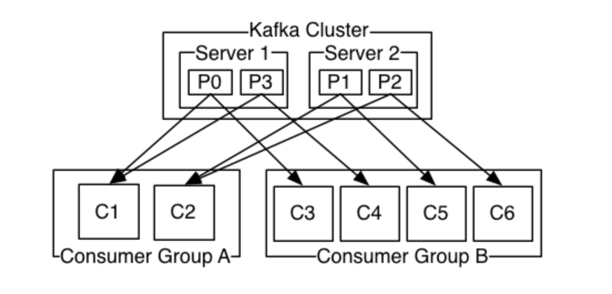
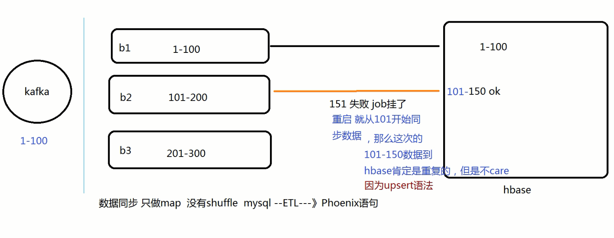
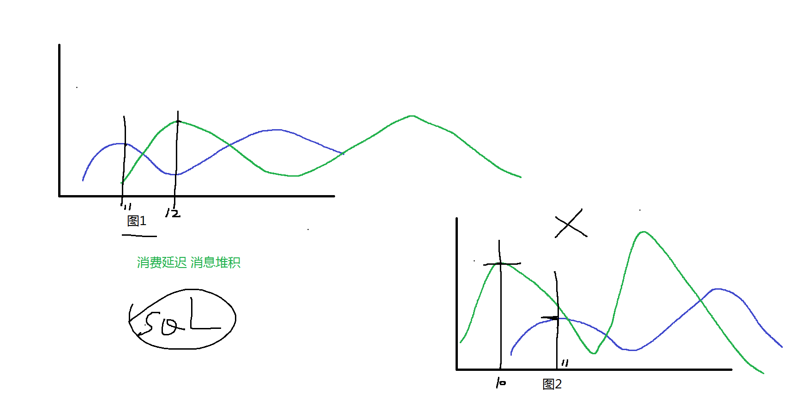

[toc]

# [简介](https://kafka.apache.org/)

- 消息中间件
  - 起缓冲作用 稳定消费
  - 场景举例：flume ---> kafka ---> flink/ss
  - 90% 消息中间件
  - 10% 流式平台开发   不适合市场 

- distributed event streaming platform


- 1-1：Apache Kafka
- 1-2：Confluent Kafka
- 1-3：CDH/HDP kafka


- [博客](https://www.cnblogs.com/huxi2b/)

## 版本

- 0.7版本:
  只有基础消息队列功能，无副本；打死也不使用
- 0.8版本:
  增加了副本机制，新的producer API；建议使用0.8.2.2版本；不建议使用0.8.2.0之后的producer API
- 0.9版本:
  增加权限和认证，新的consumer API，Kafka Connect功能；不建议使用consumer API；
- 0.10版本:
  引入Kafka Streams功能，bug修复；建议版本0.10.2.2；建议使用新版consumer API
- 0.11版本:
  producer API**幂等**，事物API，消息格式重构；建议版本0.11.0.3；谨慎对待消息格式变化
- 1.0和2.0版本:
  Kafka Streams改进；建议版本2.0；
- 3.0 不再需要zk，建议新的功能 生产还是等等

## 监控及压力测试

- 监控
  - [滴滴开源](https://github.com/didi/Logi-KafkaManager)
  - JMXTrans + InfluxDB + Grafana
- 压力测试
  - Kafka自己提供了 kafka-producer-perf-test 和 kafka-consumer-perf-test 脚本可以做producer和consumer的性能测试
  - [kafka-monitor的端到端系统测试工具](https://github.com/linkedin/kafka-monitor)

# [Kafka架构](https://kafka.apache.org/)
* producer：生产者 数据下发给Kafka
* consumer：消费者 从Kafka消费数据
* broker：消息处理节点 kafka进程
* topic：主题 相同属性的数据 放到一起
* partition 分区 : 划分3个分区    
  * 是topic的物理的分组，一个主题必须至少有1个分区【有序】<font color=red>【分区内有序，但是全局无序 】</font>
  * 其实就是一个Linux文件夹而已，命名规则是 topic名称-序号


## 核心概念



### consumers消费者们

consumer group： 消费组

```shell
"group.id" -> "use_a_separate_group_id_for_each_stream"
```

- 容错性的消费机制
  -  一个组内，共享一个公共的group.id 如SS定义；
  -  组内的所有消费者协调在一起，去消费指定的topic的所有分区；
  - 每个分区只能由一个消费组的一个消费者来消费，绝对不会出现 => 比如p0分区被C1消费，也同时被C2，这样就会导致“重复消费”；

### segment分段

- 一个分区被切割多个相同大小的文件

  ```shell
  log.segment.bytes=1048576
  ```

- 一个segment是对应三个文件(索引index  数据文件log  时间索引timeindex)

  - index文件 是索引文件，维护log文件数据对应的offset和对应的物理地址  偏移量 字节 是稀疏存储的

  - 命名规则

    - 该分区的第一个segment名称是从00000000000000000000开始；
    - 后续每个segment文件名称是上一个segment文件的最后一条消息的offset+1，或者是自己本身文件的第一条消息的offset命名

    ```shell
    # LOG文件
    kafka-run-class.sh  \
    kafka.tools.DumpLogSegments \
    --files /home/hadoop/tmp/kafka_logs/test01-0/00000000000000000000.log  \
    --print-data-log \
    > 0.log 
    
    # INDEX文件
    kafka-run-class.sh  \
    kafka.tools.DumpLogSegments \
    --files /home/hadoop/tmp/kafka_logs/test01-0/00000000000000000000.index  \
    --print-data-log \
    > 0.index
    ```

- offset：消息的标识ID 

  - 每个分区都是由一系列**有序的 不可变的**消息组成, 消息被连续追加 append到分区中。
  - 分区内的消息都有一个连续的序列号称为offset, 目的是为了标识这个消息 

- 与关系型数据库类比

```shell
topic     = database
partition = table
offset    = parmarykey
value     = column
```

- 全局会乱序  但是分区内是有序（offset）

### producer

#### [交付语义](https://kafka.apache.org/documentation/#semantics)

kafka在生产者与消费者之间提供语义保障。 


- At most once—Messages may be lost but are never redelivered.   最多一次
- At least once—Messages are never lost but may be redelivered.  至少一次  
- Exactly once—this is what people actually want, each message is delivered once and only onc  精准一次

> 注意，这个语义其实是分为两个部分，一个是发布消息  一个是消费消息

- producer生产者  kafka官方做好了  是幂等性的 ==> 精准一次
  - **Prior to 0.11.0.0**, if a producer failed to receive a response indicating that a message was committed, it had little choice but to resend the message. 
  - This provides **at-least-once** delivery semantics since the message may be written to the log again during resending if the original request had in fact succeeded.
  - **Since 0.11.0.0**, the Kafka producer also supports an **idempotent** delivery option which guarantees that resending will not result in duplicate entries in the log.

### cousumer消费者

消费哪条 我就记录对应消息的 offset 

[经典的 ss+kafka](http://spark.apache.org/docs/latest/streaming-kafka-integration.html)

[offset维护](https://spark.apache.org/docs/latest/streaming-kafka-0-10-integration.html#obtaining-offsets)

- Checkpoints  学习使用 生产不用  会小文件+代码变更导致之前offset无法识别

- Kafka itself 官方推荐和J哥推荐 2行code 

  - 这种方式是 <font color=red>At least once消费语义  >=1次 </font>，直接使用kafka自身维护

  - offset(**__consumer_offsets** topic)，代码简单方便

    ```shell
    # zkCli.sh
    ls /kafka2/brokers/topics/__consumer_offset
    
    # 参数
    # enable.auto.commit=true  # 时间5s 自动维护offset信息到kafka自身
    enable.auto.commit=false # (官方)+在业务处理后，手工官方api异步提交offset
    # code
    stream.asInstanceOf[CanCommitOffsets].commitAsync(offsetRanges)
    ```

- 外部存储: 150行code  
  - zk hbase mysql redis，一般需要精准一次消费语义的生产业务，会选择这个。
  - 但是需要维护额外的存储服务+复杂代码 不方便维护！

#### 总结

1. 至于交付语义的前半段 producer：ack=all retries=100  无需关心，关键在于后半段consumer的offset如何选择！

2. 我司是 MySQL-->maxwell-->kafka-->ss+phoenix-->phoenix+hbase架构

   - 那么在设计上 选择kafka的自身维护offset的方式  至少1次消费语义-->【断批还原】

   - 且巧妙的使用**upsert**语法(hbase的put-->Phoenix的upsert语法)，让批次数据无论是异常中断重复或者业务/maxwell重复发送数据，那么要巧妙的设计PK主键，使已存在的数据做update，不存在的数据做insert。

   - 不会让数据变成多条，始终和源端一致/始终重复计算结果保存不重复，从而做到真正的**幂等性**


map  mysql1条数据--》Phoenix 1条数据  没有shuffle 

3. 但是假如选择【**外部存储，精准消费一次语义**】，那么代码级别是很难实现 事务性的 。因为这是【两段式】提交，并没有事务回滚机制。比如数据结果更新失败，但是offset已经维护完成，这是很致命的。**想要达到事务级别： 数据、offset要不一起保存成功，要不一起失败**。
   - 所以一般会巧妙设计、数据+offset结合，一次性输出，以保证数据和offset都被更新或者两者不被更新。
     - 比如主键含有offset的值, 相同主键数据就会存在多条；
     - 反之offset不设置为主键字段，仅仅作为数据的补充部分，那么数据不会重复。
     - 当然需要巧妙设计表结构，利用主键，且语法支持类似hbase put语法，才是最完美的

3-1：一个batch批次里消费一条map(**非聚合计算**)，就更新这条 offset+数据；

```sql
数据             topic_p_offset  
110 s哥1 1000KW  data_0_10
111 s哥2 1000KW  data_1_9
112 s哥3 1000KW  data_2_8  
110 s哥1 1100KW  data_0_22 
```

3-2:  一个批次消费所有的多条数据计算完成后 **聚合计算**，只需更新最后一条offset+数据即可

```sql
# kafka源
## 第一批次 44条    [,)
topic-partition-fromoffset-untiloffset    条数
data-0-1947-1961			                    14
data-1-134-147                            13
data-2-163-180                            17

## 第二批次 44条
data-0-1961-1976		                   	  15
data-1-147-160			                      13
data-2-180-196                            16


# 结果表
date        city   ordercount	topic     all_partition_untiloffset    batchtime
## 第一批次
2020-04-18  上海市  10		      data      0@1961|1@147|2@180           2020-04-18 12:00:00              
2020-04-18  杭州市  20		      data      0@1961|1@147|2@180           2020-04-18 12:00:00               
2020-04-18  北京市  14		      data      0@1961|1@147|2@180           2020-04-18 12:00:00         
## 第二批次         (第二批次结果=第一批次数+第二批次数)
2020-04-18  上海市  13=10+3	  data      0@1976|1@160|2@196           2020-04-18 12:00:05
2020-04-18  杭州市  61=20+41	  data      0@1976|1@160|2@196           2020-04-18 12:00:05


# 当第二个批次计算完成 落库：数据和offset --> job挂了
## job重启，先从库里找到最新的offset ,取时间最新的记录 limit 1,即：找到 ruozedata 0@1976|1@160|2@196 开始端-->kafka读取数据【断点还原】
```

 

# 参数配置

## 1 broker级别

- 配置存储信息

```properties
# 在线上生产环境中一定要为log.dirs配置多个路径，具体格式是一个 CSV 格式，也就是用逗号分隔的多个路径，比如/home/kafka1,/home/kafka2,/home/kafka3这样。如果有条件的话你最好保证这些目录挂载到不同的物理磁盘上
log.dirs=/home/kafka1,/home/kafka2,/home/kafka3
```

- 提升读写性能：比起单块磁盘，多块物理磁盘同时读写数据有更高的吞吐量。

- 能够实现故障转移：即 Failover。
  - 这是 Kafka 1.1 版本新引入的强大功能。以前，只要 Kafka Broker 使用的任何一块磁盘挂掉了，整个 Broker 进程都会关闭。
  - 但是自 1.1 开始，这种情况被修正了，坏掉的磁盘上的数据会自动地转移到其他正常的磁盘上，而且 Broker 还能正常工作。这个改进正是我们舍弃 RAID 方案的基础：没有这种 Failover 的话，我们只能依靠 RAID 来提供保障。


- 与zookeeper相连

```properties
# 切记 chroot 只需要写一次，而且是加到最后的
zookeeper.connect=zk1:2181,zk2:2181,zk3:2181/kafka1
```


- Broker 连接相关的

```properties
# listeners：学名叫监听器，其实就是告诉外部连接者要通过什么协议访问指定主机名和端口开放的 Kafka 服务
listeners=PLAINTEXT://hadoop000:9092

# 和 listeners 相比多了个 advertised。Advertised 的含义表示宣称的、公布的，就是说这组监听器是 Broker 用于对外发布的。
## 主要是为外网访问用的。如果clients在内网环境访问Kafka不需要配置这个参数。
### 常见的玩法是：你的Kafka Broker机器上配置了双网卡，一块网卡用于内网访问（即我们常说的内网IP）；另一个块用于外网访问。那么你可以配置listeners为内网IP，advertised.listeners为外网IP。
advertised.listeners
```

- 从构成上来说，它是若干个逗号分隔的三元组，每个三元组的格式为<协议名称，主机名，端口号>。这里的协议名称可能是标准的名字，比如 PLAINTEXT 表示明文传输、SSL 表示使用 SSL 或 TLS 加密传输等
- 一旦你自己定义了协议名称，你必须还要指定listener.security.protocol.map参数告诉这个协议底层使用了哪种安全协议
- Broker 源代码中也使用的是主机名，如果你在某些地方使用了 IP 地址进行连接，可能会发生无法连接的问题


- topic相关

```properties
## 是否允许自动创建 Topic
auto.create.topics.enable
## 是否允许 Unclean Leader 选举
unclean.leader.election.enable
## 是否允许定期进行 Leader 选举
auto.leader.rebalance.enable：
```

- auto.create.topics.enable参数我建议最好设置成 false，即不允许自动创建 Topic。
- unclean.leader.election.enable是关闭 Unclean Leader 选举的。
  - 何谓 Unclean？还记得 Kafka 有多个副本这件事吗？每个分区都有多个副本来提供高可用。在这些副本中只能有一个副本对外提供服务，即所谓的 Leader 副本。那么问题来了，这些副本都有资格竞争 Leader 吗？显然不是，只有保存数据比较多的那些副本才有资格竞选，那些落后进度太多的副本没资格做这件事。
  - 好了，现在出现这种情况了：假设那些保存数据比较多的副本都挂了怎么办？我们还要不要进行 Leader 选举了？此时这个参数就派上用场了。
  - 如果设置成 false，那么就坚持之前的原则，坚决不能让那些落后太多的副本竞选 Leader。这样做的后果是这个分区就不可用了，因为没有 Leader 了。反之如果是 true，那么 Kafka 允许你从那些“跑得慢”的副本中选一个出来当 Leader。这样做的后果是数据有可能就丢失了，因为这些副本保存的数据本来就不全，当了 Leader 之后它本人就变得膨胀了，认为自己的数据才是权威的。
  - 这个参数在最新版的 Kafka 中默认就是 false,最好显示指定
- auto.leader.rebalance.enable的影响貌似没什么人提，但其实对生产环境影响非常大。设置它的值为 true 表示允许 Kafka 定期地对一些 Topic 分区进行 Leader 重选举，当然这个重选举不是无脑进行的，它要满足一定的条件才会发生。严格来说它与上一个参数中 Leader 选举的最大不同在于，它不是选 Leader，而是换 Leader！比如 Leader A 一直表现得很好，但若auto.leader.rebalance.enable=true，那么有可能一段时间后 Leader A 就要被强行卸任换成 Leader B。


- 数据留存

```properties
# 这是个“三兄弟”，都是控制一条消息数据被保存多长时间。从优先级上来说 ms 设置最高、minutes 次之、hours 最低。
## 虽然 ms 设置有最高的优先级，但是通常情况下我们还是设置 hours 级别的多一些，
### 比如log.retention.hours=168表示默认保存 7 天的数据，自动删除 7 天前的数据
log.retention.{hours|minutes|ms}
# 这是指定 Broker 为消息保存的总磁盘容量大小。
log.retention.bytes
# 控制 Broker 能够接收的最大消息大小
message.max.bytes
```

- log.retention.bytes。
  - 这个值默认是 -1，表明你想在这台 Broker 上保存多少数据都可以，至少在容量方面 Broker 绝对为你开绿灯，不会做任何阻拦。
  - 这个参数真正发挥作用的场景其实是在云上构建多租户的 Kafka 集群：设想你要做一个云上的 Kafka 服务，每个租户只能使用 100GB 的磁盘空间，为了避免有个“恶意”租户使用过多的磁盘空间，设置这个参数就显得至关重要了。
- message.max.bytes。
  - 实际上今天我和你说的重要参数都是指那些不能使用默认值的参数，这个参数也是一样，默认的 1000012 太少了，还不到 1MB。实际场景中突破 1MB 的消息都是屡见不鲜的，因此在线上环境中设置一个比较大的值还是比较保险的做法。


## 2 topic级别

- Topic 级别参数会覆盖全局 Broker 参数的值，而每个 Topic 都能设置自己的参数值，这就是所谓的 Topic 级别参数

- retention.ms：规定了该 Topic 消息被保存的时长。默认是 7 天，即该 Topic 只保存最近 7 天的消息。一旦设置了这个值，它会覆盖掉 Broker 端的全局参数值。
- retention.bytes：规定了要为该 Topic 预留多大的磁盘空间。和全局参数作用相似，这个值通常在多租户的 Kafka 集群中会有用武之地。当前默认值是 -1，表示可以无限使用磁盘空间。
- max.message.bytes。它决定了 Kafka Broker 能够正常接收该 Topic 的最大消息大小

```shell
# 设置topic
## 方式1
kafka-topics.sh --bootstrap-server hadoop000:9092 --create --topic transaction --partitions 1 --replication-factor 1 --config retention.ms=15552000000 --config max.message.bytes=5242880

## 方式2
## 推荐
kafka-configs.sh --zookeeper hadoop000:2181 --entity-type topics --entity-name transaction --alter --add-config max.message.bytes=10485760
```


## 3 JVM级别

- 将你的 JVM 堆大小设置成 6GB 
  - 这是目前业界比较公认的一个合理值。我见过很多人就是使用默认的 Heap Size 来跑 Kafka，说实话默认的 1GB 有点小，毕竟 Kafka Broker 在与客户端进行交互时会在 JVM 堆上创建大量的 ByteBuffer 实例，Heap Size 不能太小
- GC机制
  - 使用 Java 8，那么可以手动设置使用 G1 收集器。
    - 在没有任何调优的情况下，G1 表现得要比 CMS 出色，主要体现在更少的 Full GC，需要调整的参数更少等

```shell
# 通过环境变量配置
export KAFKA_HEAP_OPTS=--Xms6g  --Xmx6g
export KAFKA_JVM_PERFORMANCE_OPTS= -server -XX:+UseG1GC -XX:MaxGCPauseMillis=20 -XX:InitiatingHeapOccupancyPercent=35 -XX:+ExplicitGCInvokesConcurrent -Djava.awt.headless=true
# 再启动
kafka-server-start.sh config/server.properties
```


## 4 操作系统级别

- 文件描述符
  - ulimit -n。我觉得任何一个 Java 项目最好都调整下这个值。
  - 实际上，文件描述符系统资源并不像我们想象的那样昂贵，你不用太担心调大此值会有什么不利的影响。
  - 通常情况下将它设置成一个超大的值是合理的做法，比如ulimit -n 1000000
  - 其实设置这个参数一点都不重要，但不设置的话后果很严重，比如你会经常看到“Too many open files”的错误
- 限制文件系统类型
  - 这里所说的文件系统指的是如 ext3、ext4 或 XFS 这样的日志型文件系统。
  - 根据官网的测试报告，XFS 的性能要强于 ext4，所以生产环境最好还是使用 XFS。
- Swappiness
  - 将 swap 完全禁掉以防止 Kafka 进程使用 swap 空间。我个人反倒觉得还是不要设置成 0 比较好，我们可以设置成一个较小的值。为什么呢？因为一旦设置成 0，当物理内存耗尽时，操作系统会触发 OOM killer 这个组件，它会随机挑选一个进程然后 kill 掉，即根本不给用户任何的预警。
  - 但如果设置成一个比较小的值，当开始使用 swap 空间时，你至少能够观测到 Broker 性能开始出现急剧下降，从而给你进一步调优和诊断问题的时间。
  - 基于这个考虑，我个人建议将 swappniess 配置成一个接近 0 但不为 0 的值，比如 1。
- 提交时间
  - 提交时间或者说是 Flush 落盘时间。向 Kafka 发送数据并不是真要等数据被写入磁盘才会认为成功，而是只要数据被写入到操作系统的页缓存（Page Cache）上就可以了，随后操作系统根据 LRU 算法会定期将页缓存上的“脏”数据落盘到物理磁盘上。
  - 这个定期就是由提交时间来确定的，默认是 5 秒。一般情况下我们会认为这个时间太频繁了，可以适当地增加提交间隔来降低物理磁盘的写操作。
  - 当然你可能会有这样的疑问：如果在页缓存中的数据在写入到磁盘前机器宕机了，那岂不是数据就丢失了。的确，这种情况数据确实就丢失了，但鉴于 Kafka 在软件层面已经提供了多副本的冗余机制，因此这里稍微拉大提交间隔去换取性能还是一个合理的做法。

## 5 ack

- acks=0 
  - If set to zero then the producer will not wait for any acknowledgment from the server at all. 
  - The record will be immediately added to the socket buffer and considered sent. 
  - No guarantee can be made that the server has received the record in this case, and the retries configuration will not take effect (as the client won't generally know of any failures). 
  - The offset given back for each record will always be set to -1.
- acks=1 
  - This will mean the leader will write the record to its local log but will respond without awaiting full acknowledgement from all followers. 
  - In this case should the leader fail immediately after acknowledging the record but before the followers have replicated it then the record will be lost.
- **acks=all** 
  - This means the leader will wait for the full set of in-sync replicas to acknowledge the record. 
  - This guarantees that the record will not be lost as long as at least one in-sync replica remains alive. 
  - This is the strongest available guarantee.

> 生产上 建议大家 就是使用all 先不管性能 先保障数据完全副本都成功写入 


## 6 生产者

### 每个请求发送数据个数 

**max.in.flight.requests.per.connection**

Allowing retries without setting `max.in.flight.requests.per.connection` to 1 will potentially change the ordering of records because if two batches are sent to a single partition, and the first fails and is retried but the second succeeds, then the records in the second batch may appear first.

### retries

设置100

# 部署

## 单节点部署
* ~/.bash_profie
```bash
# Kafka
export KAFKA_HOME=/home/hadoop/app/kafka_2.11-0.9.0.0
export PATH=$KAFKA_HOME/bin:$PATH
```
* server.properties
```bash
# 修改内容
broker.id=0
listeners=PLAINTEXT://hadoop000:9092
log.dirs=/home/hadoop/tmp/kafka-logs
zookeeper.connect=hadoop000:2181/kafka
```
* 启动
```shell
# start 2种方式
kafka-server-start.sh $KAFKA_HOME/config/server.properties
sh bin/kafka-server-start.sh -daemon  config/server.properties
```
## 单节点多broker

- 配置文件

```shell
cp config/server.properties config/server-1.properties
cp config/server.properties config/server-2.properties
cp config/server.properties config/server-3.properties
```

```properties
# 配置文件修改
## server-1.properties
log.dirs=/home/hadoop/app/tmp/kafka-logs-1
listeners=PLAINTEXT://:9093
broker.id=1

## server-2.properties
log.dirs=/home/hadoop/app/tmp/kafka-logs-2
listeners=PLAINTEXT://:9094
broker.id=2

## server-3.properties
log.dirs=/home/hadoop/app/tmp/kafka-logs-3
listeners=PLAINTEXT://:9095
broker.id=3
```

- 启动

```shell
kafka-server-start.sh -daemon $KAFKA_HOME/config/server-1.properties &
kafka-server-start.sh -daemon $KAFKA_HOME/config/server-2.properties &
kafka-server-start.sh -daemon $KAFKA_HOME/config/server-3.properties &
```
- 命令

```shell
kafka-topics.sh --create --zookeeper hadoop000:2181/kafka --replication-factor 3 --partitions 1 --topic my-replicated-topic

kafka-console-producer.sh --broker-list hadoop000:9093,hadoop000:9094,hadoop000:9095 --topic my-replicated-topic
kafka-console-consumer.sh --zookeeper hadoop000:2181/kafka --topic my-replicated-topic

kafka-topics.sh --describe --zookeeper hadoop000:2181/kafka --topic my-replicated-topic
```


## 集群部署

### 条件

- 3台服务器
- 部署jdk
- 部署zookeeper

- 最新版本 不用zk 新版本 不心急
- 注意
  - kafka的日志log 指的是数据

### 部署

- 配置文件修改 config/server.properties

```shell
# 另外2台相同配置，注意修改 broker.id、host.name参数即可
broker.id=1
host.name=hadoop001
port=9092
log.dirs=/home/hadoop/tmp/kafka-logs
# 小尾巴
zookeeper.connect=hadoop001:2181,hadoop002:2181,hadoop003:2181/kafka
```

- 分别启动

```shell
sh kafka-server-start.sh -daemon ../config/server.properties
```

- 检查

```shell
less logs/server.log
```


# 常用命令

## topic相关

- 创建:

```shell
 # 3台 3个分区
 kafka-topics.sh \
 --create \
 --zookeeper hadoop000:2181/kafka \
 --replication-factor 1 \
 --partitions 3 \
 --topic g10
 
 # 创建topic: zk
kafka-topics.sh --create --zookeeper hadoop000:2181/kafka2 --replication-factor 1 --partitions 1 --topic hello_topic
```

- 删除topic（会有问题）

```shell
# delete.topic.enable=true 执行以下命令  会立即删除topic
kafka-topics.sh --delete --zookeeper hadoop000:2181/kafka --topic test01

# 未来真的删除，删除不干净怎么办？暴力删除
# logs
rm -rf /home/hadoop/tmp/kafka-logs/test01*
# 删除zk里的
rmr  /kafka/brokers/topics/test01
rmr  /kafka/config/topics/test01
rmr  /kafka/admin/delete_topics/test01  # 如果有命令标识的话
```

- 修改

```shell
# 目前 Kafka 不允许减少某个主题的分区数。你可以使用 kafka-topics 脚本，结合 --alter 参数来增加某个主题的分区数
kafka-topics.sh --bootstrap-server hadoop000:9092 --alter --topic <topic_name> --partitions <新分区数>

# 修改主题级别参数
kafka-configs.sh --zookeeper zookeeper_host:port --entity-type topics --entity-name <topic_name> --alter --add-config max.message.bytes=10485760
```

- 查看

```shell
# 查看所有topic
kafka-topics.sh --list --zookeeper hadoop000:2181/kafka2
# 查看所有topic的详细信息
kafka-topics.sh --describe --zookeeper hadoop000:2181/kafka2
# 查看指定topic的详细信息
kafka-topics.sh --describe --zookeeper hadoop000:2181/kafka2 --topic hello_topic
```

### 案例详解

```shell
# Leader：               是读写节点
# Replicas:              2,4,8  是复制该分区数据的节点列表
# ISR(in-sync replicas): 2,1,0  当前活跃的副本列表  是有可能成为leader
kafka-topics.sh --describe \
--zookeeper hadoop001:2181,hadoop002:2181,hadoop003:2181/kafka \
--topic g10

Topic:g10       PartitionCount:3        ReplicationFactor:3     Configs:
Topic: g10      Partition: 0    Leader: 2       Replicas: 2,1,0 Isr: 2,1,0
Topic: g10      Partition: 1    Leader: 0       Replicas: 0,2,1 Isr: 0,2,1
Topic: g10      Partition: 2    Leader: 1       Replicas: 1,0,2 Isr: 1,0,2

# 当2号挂
Topic: g10      Partition: 0    Leader: 1       Replicas: 2,1,0 Isr: 1,0
Topic: g10      Partition: 1    Leader: 0       Replicas: 0,2,1 Isr: 0,1
Topic: g10      Partition: 2    Leader: 1       Replicas: 1,0,2 Isr: 1,0
```

## group相关

```shell
# 发送消息: broker
kafka-console-producer.sh --broker-list hadoop000:9092 --topic hello_topic

# 消费消息: zk
# --from-beginning的使用 --> 从头开始消费
kafka-console-consumer.sh --bootstrap-server hadoop000:9092 --topic hello_topic --from-beginning

# group
# list group
kafka-consumer-groups.sh --bootstrap-server hadoop000:9092 --list
# 查看某个group
kafka-consumer-groups.sh --bootstrap-server hadoop000:9092 --describe --group xxx
```

## partition相关

```shell
# 修改分区数
kafka-topics.sh \
--alter \
--zookeeper hadoop001:2181,hadoop002:2181,hadoop003:2181/kafka \
--partitions 8 \
--topic g10
```


## 注意

### 案例：(缺失)

 ```shell
 kafka-topics.sh \
 --create \
 --zookeeper hadoop000:2181/kafka \
 --replication-factor 1 \
 --partitions 1 \
 --topic ruoze
 ```

- 压测：
  Sent message: (352, www.ruozedata.com352)


0.11+

```shell
ll -h
total 1.3M
-rw-rw-r-- 1 hadoop hadoop 2.0K Apr 16 21:54 00000000000000000000.index
-rw-rw-r-- 1 hadoop hadoop 1.0M Apr 16 21:54 00000000000000000000.log
-rw-rw-r-- 1 hadoop hadoop  10M Apr 16 21:55 00000000000000017661.index
-rw-rw-r-- 1 hadoop hadoop 231K Apr 16 21:55 00000000000000017661.log

# LOG文件
/home/hadoop/app/kafka_2.12-2.7.0/bin/kafka-run-class.sh  \
kafka.tools.DumpLogSegments \
--files /home/hadoop/tmp/kafka-logs/ruoze-0/00000000000000000000.log  \
--print-data-log \
>0.txt

offset: 17660 position: 1048494 isvalid: true payloadsize: 22 
magic: 1 compresscodec: NoCompressionCodec crc: 1283997313 keysize: 4 key: D
payload: www.ruozedata.com17661

# INDEX文件
[hadoop@ruozedata001 ruoze-0]$ /home/hadoop/app/kafka/bin/kafka-run-class.sh  \

> kafka.tools.DumpLogSegments \
> --files /home/hadoop/tmp/kafka-logs/ruoze-0/00000000000000000000.index  \
> --print-data-log \
>
> >0.index

more 0.index 
Dumping /home/hadoop/tmp/kafka-logs/ruoze-0/00000000000000000000.index
offset: 73 position: 4152
offset: 145 position: 8302
offset: 216 position: 12420
offset: 287 position: 16538
# index文件 是索引文件，维护log文件数据对应的offset和对应的物理地址  偏移量 字节 是稀疏存储的 
```

# 生产参考

## 1 kafka分区策略

- [DefaultPartitioner](https://github.com/apache/kafka/blob/6cfed8ad0061cdb2c71df03001cbd485491d6dfa/clients/src/main/java/org/apache/kafka/clients/producer/internals/DefaultPartitioner.java)

  ```java
  Utils.toPositive(Utils.murmur2(keyBytes)) % numPartitions  // 经典
  ```

- [StickyPartitionCache](https://github.com/apache/kafka/blob/88087e91dd4eed1ee3c3e12961db84b7b56c34a0/clients/src/main/java/org/apache/kafka/clients/producer/internals/StickyPartitionCache.java)

  ```java
  public int nextPartition(String topic, Cluster cluster, int prevPartition) {
    List<PartitionInfo> partitions = cluster.partitionsForTopic(topic);
    Integer oldPart = indexCache.get(topic);
    Integer newPart = oldPart;
    // Check that the current sticky partition for the topic is either not set or that the partition that 
    // triggered the new batch matches the sticky partition that needs to be changed.
    if (oldPart == null || oldPart == prevPartition) {
      List<PartitionInfo> availablePartitions = cluster.availablePartitionsForTopic(topic);
      if (availablePartitions.size() < 1) {
        Integer random = Utils.toPositive(ThreadLocalRandom.current().nextInt());
        newPart = random % partitions.size();
      } else if (availablePartitions.size() == 1) {
        newPart = availablePartitions.get(0).partition();
      } else {
        while (newPart == null || newPart.equals(oldPart)) {
          Integer random = Utils.toPositive(ThreadLocalRandom.current().nextInt());
          newPart = availablePartitions.get(random % availablePartitions.size()).partition();
        }
      }
      // Only change the sticky partition if it is null or prevPartition matches the current sticky partition.
      if (oldPart == null) {
        indexCache.putIfAbsent(topic, newPart);
      } else {
        indexCache.replace(topic, prevPartition, newPart);
      }
      return indexCache.get(topic);
    }
    return indexCache.get(topic);
  }
  ```


- 轮询策略（Round-robin 策略）
- 随机策略（Randomness）
- Key-ordering 策略

## 2 调优

[参数配置](https://kafka.apache.org/21/documentation/#configuration) 

### Producer

```properties
acks: all
buffer.memory: 536870912
compression.type: snappy
retries: 100
max.in.flight.requests.per.connection: 1

batch.size: 10240                  # 字节 不是条数 
max.request.size = 2097152
request.timeout.ms = 360000        # 大于 replica.lag.time.max.ms 
metadata.fetch.timeout.ms= 360000
timeout.ms = 360000

linger.ms: 5s                      # (生产不用)
max.block.ms: 1800000
```

### Broker: CDH 

```properties
message.max.bytes: 2560KB            # 1条消息的大小
zookeeper.session.timeout.ms: 180000
replica.fetch.max.bytes: 5M          # 大于message.max.bytes
num.replica.fetchers: 6
replica.lag.max.messages: 6000
replica.lag.time.max.ms: 15000

log.flush.interval.messages: 10000
log.flush.interval.ms: 5s
```

### Consumer

[jira参考](https://issues.apache.org/jira/browse/SPARK-22968)

```yml
max.partition.fetch.bytes: 5242880        # default: 1048576
request.timeout.ms:        90000          # default: 60000
session.timeout.ms:        60000          # default: 30000
heartbeat.interval.ms:     5000
receive.buffer.bytes:      10485760
```

## 3 监控CDH


> 蓝色  receive  生产者  (数据大小)

> 绿色  fetch     消费者（数据大小）

- 看图：
  
  1. 写和读趋势是否一样？ => 一样 
  2. 写和读趋势假如是一样，同一个时间为什么 读的曲线 比 写的高（数据量大）？
     - 写的时候只有value，但是读的时候涉及 topic、partition、offset、time、key，最会才是value
  
  3. 这幅图充分说明了什么？
     - kafka抗的住压力，消费及时，消息没有堆积



> - 图2不会出现(未卜先知)
> - SQL做的监控

## 4.故障案例

### 4.1 kafka磁盘目录撑爆  => kafka起不来，zk的文件EOF错误(zk文件未写完整)

解决（针对CDH解决方案）

- 删除 /var/lib/zookeeper/version-2文件夹
- 创建version-2文件夹  修改用户用户组 zookeeper
- 启动

- **预警很重要** 

### 4.2 断电

现象: kafka进程是绿色 ok， 但是生产者、消费者 无法ok 抛exception：kafka.common.notAssigndReplicaException

解决

- 服务down  rm删除kafka数据目录
- zk的kafka元数据清空
- 重新装kafka 建topic
- 重新刷数据
  - mysql的binlog文件/usr/local/mysql/arch文件夹下 查看时间，确定需要恢复的数据时间范围
  - **upsert语法 无需关心重复数据 是幂等性**

### 总结

- 基于kafka的平台，在我司是经典架构：Flume/maxwell/ogg/-->kafka-->ss/sss/flink
- 其中kafka是作为消息中间件，提供实时写读的特性
- 面对上游的高峰业务数据，能够起到有效的缓冲，避免下游的数据同步job 和 指标计算job的压力井喷，导致夯住 假死状态！
- 要稳稳的消费（利用反压机制）


## 5 Kafka控制器(Controller)


# 问题

## 1 消息中间件除了Kafka，还有啥？大概区别

## 2 分区内有序，全局无序？

- 分区内有序
  - 数据存储磁盘文件，是追加模式，append

- 消费紊乱

  - 比业务数据多（业务中间delete）
  - 条数相同，数据不同

- 解决方案

  - 哪怕多个kafka节点，只设置1个分区（性能差）
  - sql分组排序（Spark Streaming批处理 麻烦）：
    - 分组：db table 联合主键
    - 排序：时间戳
  - <font color=blue>特征数据</font>
    - db table 联合主键
    - [了解kafka写数据的代码](https://github.com/apache/kafka/blob/trunk/clients/src/main/java/org/apache/kafka/clients/producer/internals/DefaultPartitioner.java)，能深入了解
    - key的作用：将相同特征数据 根据算法写入同一个分区（恰巧同一个分区内是有序的）
  
  ```java
  // api
  send(key, value)
  send(null, insert...);
  send(null, update...);
  
  // 算法
  hash("db1-tb1-100") % 3 = 34... 0 // 0就是下标 oms-0分区
    
  // 一个月后数据又对不上(小概率)
  // 每个请求发送数据个数 
  // 默认 5  生产上设置为 1
  // Allowing retries without setting max.in.flight.requests.per.connection to 1 will potentially change the ordering of records because if two batches are sent to a single partition, and the first fails and is retried but the second succeeds, then the records in the second batch may appear first.
  max.in.flight.requests.per.connection
    
  retries  // 设置100
  ```
  
  

## 3 spark从kafka的主题的单个分区读取最大数据量  且 开启背压参数 

org.apache.spark.streaming.StreamingConf

org.apache.spark.streaming.kafka010

```shell
spark.streaming.backpressure.enabled = true \ # 开启sparkStreaming的背压
spark.streaming.kafka.maxRatePerPartition = 100 \ # 每个partition每秒最多消费的数据条目数
spark.streaming.kafka.initialRate = 100 \ # 初始化的第一个批次每个partition最大的消费速率
```


## 4 如何找到offset为18000的对应消息？(二分查找)

1. **二分查找**偏移量<=18000的最大segment的文件组， 比如：00000000000000017661（此文件最小offset为17661）；

2.  去17661的index文件，**二分查找**<=18000的最大offset  比如： **offset: 17937 position(物理偏移量): 16560**；

3. 根据16560物理偏移量，磁盘磁头迅速定位到 17937 offset的消息，按**顺序查找**，一直找到offset为18000的消息。


## 5 无消息丢失配置怎么实现？

- 1 不要使用 producer.send(msg)，而要使用 producer.send(msg, callback)。记住，一定要使用带有回调通知的 send 方法。
- 2 设置 acks = all。acks 是 Producer 的一个参数，代表了你对“已提交”消息的定义。如果设置成 all，则表明所有副本 Broker 都要接收到消息，该消息才算是“已提交”。这是最高等级的“已提交”定义。
- 3 设置 retries 为一个较大的值。这里的 retries 同样是 Producer 的参数，对应前面提到的 Producer 自动重试。当出现网络的瞬时抖动时，消息发送可能会失败，此时配置了 retries > 0 的 Producer 能够自动重试消息发送，避免消息丢失。
- 4 设置 unclean.leader.election.enable = false。这是 Broker 端的参数，它控制的是哪些 Broker 有资格竞选分区的 Leader。如果一个 Broker 落后原先的 Leader 太多，那么它一旦成为新的 Leader，必然会造成消息的丢失。故一般都要将该参数设置成 false，即不允许这种情况的发生。
- 5 设置 replication.factor >= 3。这也是 Broker 端的参数。其实这里想表述的是，最好将消息多保存几份，毕竟目前防止消息丢失的主要机制就是冗余。
- 6 设置 min.insync.replicas > 1。这依然是 Broker 端参数，控制的是消息至少要被写入到多少个副本才算是“已提交”。设置成大于 1 可以提升消息持久性。在实际环境中千万不要使用默认值 1。
- 7 确保 replication.factor > min.insync.replicas。如果两者相等，那么只要有一个副本挂机，整个分区就无法正常工作了。我们不仅要改善消息的持久性，防止数据丢失，还要在不降低可用性的基础上完成。
  - 推荐设置成 replication.factor = min.insync.replicas + 1。
- 8 确保消息消费完成再提交。Consumer 端有个参数 enable.auto.commit，最好把它设置成 false，并采用手动提交位移的方式。就像前面说的，这对于单 Consumer 多线程处理的场景而言是至关重要的。

> https://www.cnblogs.com/huxi2b/p/7089854.html
>
> 推荐读一下Flink Kafka Connector的源码
>
> min.insync.replicas只有在acks=-1时才生效

## 6 如何避免rebalance？

- Rebalance 发生的时机有三个：
  - 组成员数量发生
  - 变化订阅主题数量发生变化
  - 订阅主题的分区数发生变化


- 只能最大限度的设置更为合理的参数，来避免非必要的rebalance，比如这些参数
  - 1：session.timeout.ms
  - 2：heartbeat.interval.ms
  - 3：max.poll.interval.ms
  - 4：GC参数

- 设置方案
  - 设置 session.timeout.ms = 6s。
  - 设置 heartbeat.interval.ms = 2s。
  - 要保证 Consumer 实例在被判定为“dead”之前，能够发送至少 3 轮的心跳请求，即 session.timeout.ms >= 3 * heartbeat.interval.ms。

## 7 删除topic

- 建立topic：
  a. 名称要规范 英文字母小写 
  b. 不要有强迫症 去删除，因为踩坑，删除后集群挂了
  c. topic的数据  是有效期的 默认7天

```shell
# 创建topic
kafka-topics.sh \
--create \
--zookeeper hadoop001:2181,hadoop002:2181,hadoop003:2181/kafka \
--replication-factor 3 \
--partitions 3 \
--topic g10

kafka-topics.sh --list --zookeeper hadoop001:2181,hadoop002:2181,hadoop003:2181/kafka

# delete.topic.enable=true 
## 执行以下命令 会立即删除topic
bin/kafka-topics.sh \
--delete \
--zookeeper hadoop001:2181,hadoop002:2181,hadoop003:2181/kafka \
--topic g10
```

- 未来真的删除，删除不干净怎么办？暴力删除

```shell
# 删除 log文件
rm -rf /home/hadoop/tmp/kafka-logs/g10*
# 删除 zk里的
rmr  /kafka/brokers/topics/g10
rmr  /kafka/config/topics/g10
rmr  /kafka/admin/delete_topics/g10  # 如果打过标签有的话
```


## 8 生产上建议分区设置多少 

- 只有3台机器：副本数最大只能设置3分，但是分区可以自由设置
- 1:1 correspondence between Kafka partitions and Spark partitions
- 我司就8个分区

  - 参数：spark从kafka的主题的单个分区读取最大数据量  1250

  - 生产上:  3s 一个批次 ,  每个批次消费量 8 * **1250** * 3 = 3W  


```shell
# 例子
MySQL--> maxwell--> Kafka--> SS--> Hbase/Redis
# 三件事
Kafka读出数据
ETL数据
输出数据

# 观察：2s以内能完成这3件事？
如果每一个3s作业： 都延迟2s -> 会慢慢堆积 -> 雪崩 -> 夯住
```

> https://github.com/zendesk/maxwell
>
> https://github.com/alibaba/canal

```shell
# 详细信息
kafka-topics.sh --describe --zookeeper hadoop000:2181/kafka --topic test01

# 修改分区数
kafka-topics.sh --alter --zookeeper hadoop000:2181/kafka --partitions 8 --topic test01
```


## 9 [kafka的topic分区 迁移](https://kafka.apache.org/documentation/#basic_ops_automigrate) 

所有topic 迁移到新的broker节点，旧机器可以下架

```shell
cat topics-to-move.json
{
	"topics": [
		{"topic": "foo1"},
		{"topic": "foo2"}
  ],
	"version":1
}
 
kafka-reassign-partitions.sh \
--bootstrap-server localhost:9092 \
--topics-to-move-json-file topics-to-move.json \
--broker-list "5,6" --generate

kafka-reassign-partitions.sh \
--bootstrap-server localhost:9092 \
--reassignment-json-file expand-cluster-reassignment.json \
--execute
```

## 10 code

```java
/**
 * pom文件加入:
   <!-- https://mvnrepository.com/artifact/org.apache.kafka/kafka-clients -->
    <dependency>
      <groupId>org.apache.kafka</groupId>
      <artifactId>kafka-clients</artifactId>
      <version>2.2.1</version>
    </dependency>
 * 生产者 压测
 */
import org.apache.kafka.clients.producer.Callback;
import org.apache.kafka.clients.producer.KafkaProducer;
import org.apache.kafka.clients.producer.ProducerRecord;
import org.apache.kafka.clients.producer.RecordMetadata;
import org.apache.kafka.clients.producer.ProducerConfig;
import org.apache.kafka.common.serialization.IntegerSerializer;
import org.apache.kafka.common.serialization.StringSerializer;

import java.util.Properties;
import java.util.concurrent.ExecutionException;

public class Producer extends Thread {
    private final KafkaProducer<Integer, String> producer;
    private final String topic;
    private final Boolean isAsync;
    private final int sendCount;

    public Producer(String topic, Boolean isAsync, int sendCount) {
        Properties props = new Properties();
        props.put(ProducerConfig.BOOTSTRAP_SERVERS_CONFIG, "hadoop000:9092");
        props.put(ProducerConfig.CLIENT_ID_CONFIG, "ruozedataProducer");
        props.put(ProducerConfig.KEY_SERIALIZER_CLASS_CONFIG, IntegerSerializer.class.getName());
        props.put(ProducerConfig.VALUE_SERIALIZER_CLASS_CONFIG, StringSerializer.class.getName());
        props.put(ProducerConfig.ACKS_CONFIG,"all");
        props.put(ProducerConfig.RETRIES_CONFIG,100);
        props.put(ProducerConfig.BATCH_SIZE_CONFIG,1000);
        props.put(ProducerConfig.BUFFER_MEMORY_CONFIG,32*1024*1024L);
        props.put(ProducerConfig.MAX_BLOCK_MS_CONFIG,600000);
        producer = new KafkaProducer<>(props);
        this.topic = topic;
        this.isAsync = isAsync;
        this.sendCount = sendCount;
    }

    @Override
    public void run() {
        int messageNo = 1;
        String messageStr = "";
        long startTime = 0L;

        while (true) {
            messageStr = "www.hadoop.com"+String.valueOf(messageNo);
            startTime = System.currentTimeMillis();

            if (isAsync) { // Send asynchronously
                producer.send(new ProducerRecord<>(topic, messageNo, messageStr), 
                              new CallBack(startTime, messageNo, messageStr));

            } else { // Send synchronously
                try {
                    producer.send(new ProducerRecord<>(topic, messageNo, messageStr)).get();
                    System.out.println("Sent message: (" + messageNo + ", " + messageStr + ")");
                } catch (InterruptedException | ExecutionException e) {
                    e.printStackTrace();
                }
            }

            if(messageNo-sendCount==0) {
                System.out.println("Send message count:"+sendCount);
                break;
            }
            ++messageNo;
        }
    }

    public static void main(String[] args) {
        //异步提交
        new Producer("ruoze",false,30000).run();
    }
}

class CallBack implements Callback {

    private final long startTime;
    private final int key;
    private final String message;

    public CallBack(long startTime, int key, String message) {
        this.startTime = startTime;
        this.key = key;
        this.message = message;
    }

    /**
     * A callback method the user can implement to provide asynchronous handling of request completion. This method will
     * be called when the record sent to the server has been acknowledged. When exception is not null in the callback,
     * metadata will contain the special -1 value for all fields except for topicPartition, which will be valid.
     *
     * @param metadata  The metadata for the record that was sent (i.e. the partition and offset). Null if an error
     *                  occurred.
     * @param exception The exception thrown during processing of this record. Null if no error occurred.
     */
    @Override
    public void onCompletion(RecordMetadata metadata, Exception exception) {
        long elapsedTime = System.currentTimeMillis() - startTime;
        if (metadata != null) {
            System.out.println("message(" + key + ", " + message + ") sent to partition(" + metadata.partition() +"), " + "offset(" + metadata.offset() + ") in " + elapsedTime + " ms");
        } else {
            exception.printStackTrace();
        }
    }
}
```


## 最佳实践

- ack=all
- 特征数据
- max.in.flight.requests.per.connection=1
- maxwell 补充： https://www.bilibili.com/video/BV1zb411N7jj