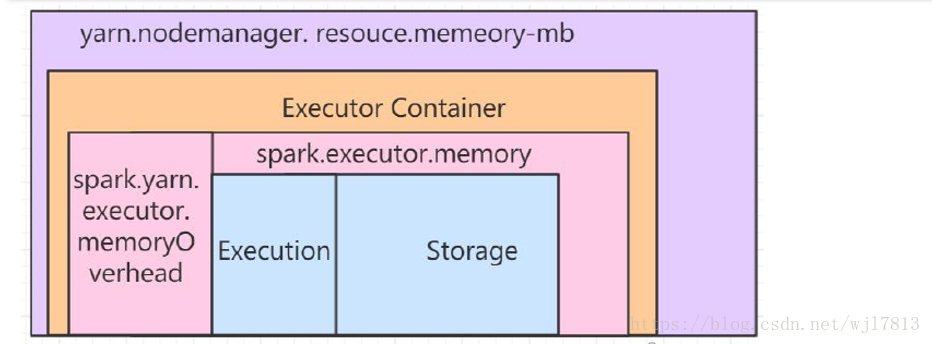

[toc]

# 1 大数据简介

[Hadoop十年解读与发展预测-InfoQ](https://www.infoq.cn/article/hadoop-ten-years-interpretation-and-development-forecast/)

## 基本特征-4V
* 数据量volume
* 速度velovity
* 复杂性variety
* 基于高度分析的新价值value

## 现存模式
* 手握大数据，没有大数据思维： 电信
* 没有大数据，有大数据思维： 咨询企业
* 既有大数据，又有大数据思维：Google

## 技术概念
* 单机： CPU  Memory  Disk
* 分布式并行计算/处理
* 数据采集：Flume  Sqoop
*  数据处理 ：Hadoop
* 数据存储 ：HDFS，Hive，Hbase，Kudu+Impala(cloudera  cdh)
* 资源调度：yarn、k8s
* 数据可视化（精细化处理）专门团队

## 挑战
* 数据库管理技术
* 经典数据库技术没有考虑多类别
* 实时性技术挑战
* 网络架构，数据中心，运维挑战

# 2  Hadoop
## 2.1 概述
* 官网：[Apache Hadoop](http://hadoop.apache.org/)
* The Apache™ Hadoop® project develops open-source software for reliable, scalable, distributed computing.
* 提供分布式存储（一个文件被拆分成多个快，并且以副本的方式存储在各个节点）和计算
* 一个分布式的系统基础架构：用户可以在不了解分布式底层细节的情况下进行使用
* 模块
	* 文件系统：HDFS将文件分布式存储在多服务器上
	* 计算框架：MapReduce实现对多机器上分布式并行计算
	* 资源调度框架：YARN实现集群资源管理及作业调度
* Hadoop生态
  * 广义：大数据生态圈
  * 3大组件

## 2.2 核心组件
* HDFS
	* 源自Google的GFS论文，2003年10月
	* HDFS是GFS克隆版
	* 特点：扩展性&容错性&海量存储
	* 文件、块、副本
		* 文件： test.log 200M
		* 块（block）：默认blocksize是128M，2个块 = 1个128M + 1个72M
		* 副本：默认3个
			* node1： blk1
			* node2： blk2
			* node3： blk1，blk2

* MapReduce
	* 源自Google的MapReduce论文，2004年12月
	* MapReduce是Google MapReduce的克隆版
	* 特点：扩展性&容错性&海量数据离线处理

* YARN
	* Yet Another Resoure Negotiator
	* 负责整个集群资源的管理和调度
	* 特点：扩展性&容错性&多框架资源统一调度

## 2.3 优势
* 高可靠性： 数据块多副本
* 高扩展性：横向扩展
* 去IoE
* 成熟的生态圈

## 2.4 发行版选择
* Apache版
	* 纯开源
	* 不同版本/不同框架之间整合   jar冲突。。。。
* 	CDH
	* [Cloudera | The enterprise data cloud company](https://www.cloudera.com/)
	* 优点：cm（cloudra manager）通过页面一键安装各种框架，升级棒棒，impala
	* 缺点：不开源，与社区版有出入
* Hortonworks：HDP  企业发布自己的数据平台可以直接基于页面框架进行改造  ===> 不少公司一键部署根据该公司**Ambari**
	改造
	* 优点：原装Hadoop，纯开源，支持tez
	* 缺点：企业级安全不开源
* MapR


# 3 分布式文件系统HDFS
## 3.1 概述
* https://hadoop.apache.org/docs/stable/hadoop-project-dist/hadoop-hdfs/HdfsDesign.html
* 分布式
* commodity hardware
* fault-tolerant 容错
* high throughout
* large data sets

### 3.1.1 普通文件系统 vs 分布式文件系统
* 单机
* 横跨多个机器

## 3.2 设计目标
* Hardware Failure 硬件故障
	* 每个机器只存储部分数据，bloksize=128M
	* 存放在不同机器上，由于容错，HDFS默认采用3副本机制
* Streaming Data Access 流式数据访问
	* The emphasis is on high throughput of data access rather than low latency（低延时） of data access 不适合做实时流处理
* Large Data Sets
* Moving Computation is Cheaper than Moving Data

## 3.3 架构
* 1 NameNode（master） and DataNodes（slave）
* 2 master/slave架构
* 3 NN：
	1. the file system namespace
		* /home/hadoop/software
	2. regulates access to files by clients
* 4 DN：storage
* 5 HDFS exposes a file system namespace and allows user data to be stored in files
* 6 a file is split into one or more blocks
	* blocksize： 128M  150M拆成2个block
* 7 blocks are stored in a set of DataNodes
	* 容错性
* 8 namespace operations like opening, closing, and renaming files and directories.
* 9 determines the mapping of blocks to DataNodes（用户不感知）
	* a.txt   150M    blocksize=128M
	* a.txt 拆分成2个block 一个是block1：128M    另一个是block2：22M
		* block1： 128M，192.168.199.1
		* block1： 22M，192.168.199.2
* 10 通常 一个node部署一个组件
	
		 

- 文件系统namespace

- 副本机制data replication


## 3.4 HDFS部署

### 1 Linux环境

```shell
mkdir software  # 存放课程使用的软件包
mkdir app  # 存放课程所有软件的安装目录
mkdir data  # 数据
mkdir lib  # 开发过的作业jar
mkdir shell  # 脚本
mkdir maven_resp  # 课程中使用到的maven依赖
sudo -i  # 从hadoop用户切换到root用户
su hadoop  # 从root切换到hadoop
```
### 2 Hadoop部署环境

- 部署方式

  | 模式     | 机器数 | 进程数 |
  | -------- | ------ | ------ |
  | 本地     | 1      | 1      |
  | 伪分布式 | 1      | 多个   |
  | 集群     | 多台   | 多个   |


- Hadoop安装前置要求
  - Java  1.8+
- ssh
```shell
ssh-keygen -t rsa
cd .ssh
cat id_rsa.pub >> authorized_keys
chmod 600 authorized_keys
```

- JDK1.8

```shell
wget https://download.oracle.com/otn/java/jdk/8u241-b07/1f5b5a70bf22433b84d0e960903adac8/jdk-8u241-linux-x64.tar.gz
vim .bash_profile
export JAVA_HOME=/usr/lib/jvm/java-1.8.0-openjdk-1.8.0.242.b08-0.el7_7.x86_64/jre
export PATH=$JAVA_HOME/bin:$PATH
```

- ~/.bash_profile

```shell
export JAVA_HOME=/home/hadoop/app/jdk1.8.0_91
export PATH=$JAVA_HOME/bin:$PATH

export HADOOP_HOME=/home/hadoop/app/hadoop-2.6.0-cdh5.15.1
export PATH=$HADOOP_HOME/bin:$PATH

export HIVE_HOME=/home/hadoop/app/hive-1.1.0-cdh5.15.1
export PATH=$HIVE_HOME/bin:$PATH
```


### 4 Hadoop安装目录&&配置

#### 常见目录说明：
1. bin：Hadoop客户端命令
2. etc/hadoop :  配置文件
3. sbin : 启动hadoop相关进程的脚本
4. share : 例子   

#### 配置文件

- hadoop-env.sh

```shell
vi hadoop-env.sh
export JAVA_HOME=/usr/lib/jvm/java-1.8.0-openjdk-1.8.0.242.b08-0.el7_7.x86_64/jre
```
- core-site.xml

```xml
<property>
    <name>fs.defaultFS</name>
    <value>hdfs://hadoop000:8020</value>
</property>

<-- 回收站 生产上必须要回收站，且回收站默认时间尽量长，7天 --/>
 <property>
        <name>fs.trash.interval</name>
        <value>10080</value>
 </property>
```
- hdfs-site.xml

```xml
<property>
        <name>dfs.replication</name>
        <value>1</value>
</property>

<property>
        <name>dfs.datanode.data.dir</name>
        <value>/home/hadoop/tmp/dfs/data</value>
</property>

<property>
        <name>dfs.namenode.name.dir</name>
        <value>/home/hadoop/tmp/dfs/name</value>
</property>

<property>
        <name>dfs.permissions</name>
        <value>false</value>
</property>

<property>
        <name>hadoop.tmp.dir</name>
        <value>/home/hadoop/tmp</value>
</property>

<property>
        <name>dfs.encrypt.data.transfer</name>
        <value>false</value>
</property>

<property>
        <name>dfs.data.transfer.protection</name>
        <value>authentication</value>
</property>
```
- yarn-site.xml

```xml
<property>
  <name>yarn.nodemanager.aux-services</name>
  <value>mapreduce_shuffle</value>
</property>

<property>
  <name>yarn.resourcemanager.hostname</name>
  <value>hadoop000</value>
</property>
```

- mapred-site.xml

```xml
<property>
   <name>mapreduce.framework.name</name>
   <value>yarn</value>
</property>
```

- /etc/hadoop/slave

```shell
# 修改  
hadoop000
```
* 启动HDFS

```shell
# 第一次执行时 一定要格式化文件系统，不要重复执行  
hdfs namenode -format

# 启动集群
cd sbin
./start-dfs.sh

# 验证 方法1
jps

# 验证 方法2
# http://hadoop000:50070
## 如果发现jps ok， 但是浏览器不ok？大概率是防火墙问题
## 检查防火墙
firewall-cmd --state
systemctl stop firewall.service

# 启动yarn
./sbin/start-yarn.sh
# 启动yarn historyserver
./mr-jobhistory-daemon.sh start historyserver
```

* start/stop-dfs.sh 与 hadoop-daemons.sh的关系
* start-dfs.sh = 
	* hadoop-daemons.sh start namenode
	* hadoop-daemons.sh start datanode
	* hadoop-daemons.sh start secondarynamenode

###  5 Hadoop命令行操作详解
```shell
hadoop fs -ls /
hadoop fs -put
hadoop fs -copyFromLocal
hadoop fs -moveFromLocal
hadoop fs -cat
hadoop fs -text
hadoop fs -get
hadoop fs -mkdir
hadoop fs -mv
hadoop fs -getmerge
hadoop fs -rm
hadoop fs -rmdir
hadoop fs -rm -r
hadoop fsck /  # 健康检查
```


### 6 API编程之开发环境搭建


### 7 副本摆放策略
* https://archive.cloudera.com/cdh5/cdh/5/hadoop-2.6.0-cdh5.15.1/hadoop-project-dist/hadoop-hdfs/HdfsDesign.html#Data_Replication

* 1-本rack的一个节点
* 2-另外一个rack的节点
* 3-与2相同rack的另外一个节点

* 1-本rack的一个节点
* 2-本rack的另一个节点
* 3-不同rack的一个节点

### 8 HDFS的元数据管理
* 元数据：HDFS的目录结构以及每个文件的BLOCK信息（id，副本系数，block存放在那个DN地方）
* 存在什么地方：对应的配置${hadoop.tmp.dir}/name/…
* 元数据存在文件中：

### 9 safenode


### 10 预警

```shell
curl http://hadoop000:50070/jmx

http://hadoop000:50070/jmx?qry=Hadoop:service=NameNode,name=NameNodeInfo
http://hadoop000:50070/jmx?qry=Hadoop:service=NameNode,name=JvmMetrics
http://hadoop000:50070/jmx?qry=Hadoop:service=NameNode,name=FSNamesystem
```


# 4 分布式计算框架MapReduce
### 执行步骤
* 1）准备map处理的输入数据
* 2）Mapper处理
* 3）Shuffle
* 4）Reduce处理


### 核心概念
* split
* InputFormat
* OutputFormat
* Combiner
* Partitioner

### 4-10 Combiner操作

* 优点：减少IO，提升作业执行能力
* 局限性：求平均数（除法操作）


# 5 资源调度框架YARN
* MapReduce1.x ==> MapReduce2.x
	* master/slave : JobTracter/TaskTracker
	* JobTracter 单点、压力大
	* 仅仅能够支持mapreduce作业
* 资源利用率
	* 所有计算框架运行一个集群中，共享一个集群上的资源，按需分配

## 概述
* Yet Another Resource Negotiator
* 通用资源管理系统
* 为上层应用提供统一的资源管理和调度

* master：resource management =》ResourceManager (*RM*)
* job scheduling/monitoring =》per-application ApplicationMaster (*AM*)
* slave：NodeManager (*NM*)

## 架构
* Client、ResourceManager、NodeManager、ApplicationMaster
* master/slave：RM/NM

* Client：向RM提交任务，杀死任务等
* ApplicationMaster
	* 每个应用程序对应一个AM
	* AM向RM申请资源用于在NM上启动对应Task
	* 数据切分
	* 为每个task申请资源（container）
	* NodeManager通信
	* 任务的监控
* NodeManager：多个
	* 干活
	* 向RM发送心跳信息、任务执行情况
	* 接受来自RM的请求来 启动任务
	* 处理来自AM的命令
* ResourceManager：集群中同一时刻对外提供服务的只有1个，负责资源相关
	* 处理来自客户端的请求：提交，kill
	* 启动、监控AM
	* 监控NM
* container：任务的运行抽象
	* memory、cpu....
	* task是运行在container里面
	* 可以运行AM，也可以map/reduce task

## 提交案例到YARN上运行
* 本地项目
```shell
# 在本地项目目录下打包成jar
# windows/MAc/Linux ==> Maven
mvn clean package -DskipTests

# jar上传到服务器上
scp target/hadoop-train-v2-1.0.jar hadoop000:~/lib/
# 数据传上服务器
scp …
```
* 服务器上
```shell
# 执行作业 hadoop jar xxx.jar 完整的类名 args 。。。。
hadoop jar hadoop-train-v2-1.0.jar com.imooc.bigdata.hadoop.mr.access.AccessYarnApp /access/input/access.log /access/out2/

# 到YARN url：8088 上去观察作业

# 到输出目录查看
```

## Yarn资源计算



- Spark的Excutor的Container内存有两大部分组成：堆外内存和Excutor内存。
  - **堆外内存**
    - 由spark.yarn.executor.memoryOverhead参数设置。 主要用于JVM自身的开销。默认：MAX(executorMemory*0.10,384MB)
      这里384 的含义为，JVM自身开销，最小的需求是384MB
  - **Excutor内存**
    - 由spark.executor.memory参数设置，分为两部分。
      Execution:shuffle、排序、聚合等用于计算的内存
      Storage：用于集群中缓冲和传播内部数据的内存（cache、广播变量）

```scala
var executorMemory = 1024 // 默认值，1024MB
val MEMORY_OVERHEAD_FACTOR = 0.10  // OverHead 比例参数，默认0.1
val MEMORY_OVERHEAD_MIN = 384

val executorMemoryOverhead = sparkConf.getInt("spark.yarn.executor.memoryOverhead",
math.max((MEMORY_OVERHEAD_FACTOR * executorMemory).toInt, MEMORY_OVERHEAD_MIN))
// 假设有设置参数，即获取参数，否则使用executorMemoryOverhead 的默认值

val executorMem = args.executorMemory + executorMemoryOverhead
// 最终分配的executor 内存为 两部分的和
// 但是还有个规整化因子
```

- 它规定了最小可申请资源量、最大可申请资源量和资源规整化因子，如果应用程序申请的资源量小于最小可申请资源量，则YARN会将其大小改为最小可申请量，
  - 也就是说，应用程序获得资源不会小于自己申请的资源，但也不一定相等；如果应用程序申请的资源量大于最大可申请资源量，则会抛出异常，无法申请成功；
  - 规整化因子是用来规整化应用程序资源的，应用程序申请的资源如果不是该因子的整数倍，则将被修改为最小的整数倍对应的值，公式为ceil(a/b)*b，其中a是应用程序申请的资源，b为规整化因子
  - 对于规整化因子，不同调度器不同，具体如下：
    - FIFO和Capacity Scheduler，规整化因子等于最小可申请资源量，不可单独配置。
    - Fair Scheduler：规整化因子通过参数yarn.scheduler.increment-allocation-mb和yarn.scheduler.increment-allocation-vcores设置，默认是1024和1。


# 6 Hadoop集群部署?
* 集群规划
	* HFDS：NN   DN
	* YARN:   RM   NM

hadoop000：192.168.101.31
	NN
	DN
hadoop001：192.168.101.3x
	DN	NM
hadoop002：192.168.101.3y
	DN	NM

```shell
# 修改hostname(hodoop000/hadoop001….)
vi /etc/hostname

# 修改ip和hostname映射关系
vi /etc/hosts

192.168.101.31 hadoop000
192.168.101.3x hadoop001
192.168.101.3y hadoop002
192.168.101.31 localhost
```

* 前置安装
	* ssh免密码登录（每台）
```shell
ssh-keygen -t rsa
```
- 在hadoop000机器上进行操作

```shell
ssh-copy-id -i /home/hadoop/.ssh/id_rsa.pub hadoop000 
ssh-copy-id -i /home/hadoop/.ssh/id_rsa.pub hadoop001 
ssh-copy-id -i /home/hadoop/.ssh/id_rsa.pub hadoop002 
```

* JDK安装（每台）
	* 1）先在hadoop000机器上部署jdk
	* 2）将jdk bin配置到系统环境变量
	* 3）将jdk拷贝到其他节点
```shell
# 解压
tar -zvxf jdk-8u91-linux-x64.tar.gz -C ~/app/

# 添加系统环境变量
# .bash_profile
export JAVA_HOME=/home/hadoop/app/jdk1.8.0_91
export PATH=$JAVA_HOME/bin:$PATH

# step3-1 拷贝到其他节点(从hadoop000出发)
scp -r ~/app/jdk1.8.0_91/ hadoop@hadoop001:~/app/
scp -r ~/app/jdk1.8.0_91/ hadoop@hadoop002:~/app/

# step3-2 拷贝环境变量
scp -r ~/.bash_profile hadoop@hadoop001:~/
scp -r ~/.bash_profile hadoop@hadoop002:~/
```

* Hadoop安装
	* 1）hadoop-env.sh
		* JAVA_HOME
	* 2）core-site.xml
	  * 这是指定NameNode启动
	  * 看step2
	* 3）hdfs-site.xml
		* 3个备份
	* 4）yarn-site.xml
	* 5）mapred-site.xml
		* 默认没有，需要将模板改
	* 6）slaves
	  * 这是指定dataNode启动
	* 7）分发hadoop到其他机器
	* 8）NN格式化: hadoop namenode -format
```shell
## master

# 解压
tar -zxvf ~/software/hadoop-2.6.0-cdh5.15.1.tar.gz -C ~/app/
# hadoop配置文件
vi ~/app/hadoop-2.6.0-cdh5.15.1/etc/hadoop/hadoop-env.sh
# step 1 => 配置JAVA_HOME 其实也可以不用操作
export JAVA_HOME=/home/hadoop/app/jdk1.8.0_91
# step 2 => 配置core-site.xml
vi core-site.xml
<property>
    <name>fs.defaultFS</name>
    <value>hdfs://hadoop000:8020</value>
</property>
# step 3 => hdfs-site.xml
# 不用改
<property>
    <name>dfs.replication</name>
    <value>3</value>
</property>
# step 4 => yarn-site.xml
<property>
  <name>yarn.nodemanager.aux-services</name>
  <value>mapreduce_shuffle</value>
</property>

<property>
  <name>yarn.resourcemanager.hostname</name>
  <value>hadoop000</value>
</property>
# step 5 => mapred-site.xml
# 先复制
cp  ~/app/hadoop-2.6.0-cdh5.15.1/etc/hadoop/mapred-site.xml.template ~/app/hadoop-2.6.0-cdh5.15.1/etc/hadoop/mapred-site.xml
# 增加配置
<property>
   <name>mapreduce.framework.name</name>
   <value>yarn</value>
</property>

# step 6 => 配置从节点
vi ~/app/hadoop-2.6.0-cdh5.15.1/etc/hadoop/slaves
hadoop000  # master/slave
hadoop001
hadoop002
```

```shell
# 7 分发
# hadoop-2.6.0-cdh5.15.1
scp -r ~/app/hadoop-2.6.0-cdh5.15.1 hadoop@hadoop001:~/
scp -r ~/app/hadoop-2.6.0-cdh5.15.1 hadoop@hadoop002:~/

# 添加系统环境变量
# .bash_profile
export HADOOP_HOME=/home/hadoop/app/hadoop-2.6.0-cdh5.15.1
export PATH=$HADOOP_HOME/bin:$PATH
# 拷贝环境变量
scp -r ~/.bash_profile hadoop@hadoop001:~/
scp -r ~/.bash_profile hadoop@hadoop002:~/
# 在各机器上source

# step 8
#NN格式化: 在hadoop000上执行就行  执行一次就行 切记
hadoop namenode -format
```
- 9 启动HDFS

```shell
cd ~/app/hadoop-2.6.0-cdh5.15.1/sbin/

# 方式一 一个一个起
./hadoop-daemon.sh start namenode

# 方式二
./start-dfs.sh

# 验证
jps

# 如果发现有缺失的进程，找到对应日志
# example
cat /home/hadoop/app/hadoop-2.6.0-cdh5.15.1/logs/hadoop-hadoop-secondarynamenode-hadoop000.log
```

- stop

```shell
# 停先停datanode 起的时候反过来
cd ~/app/hadoop-2.6.0-cdh5.15.1/sbin/

./hadoop-daemon.sh stop datanode
```

- 10）启动YARN

```shell
# 在hadoop000
# 启动HDFS
./app/hadoop-2.6.0-cdh5.15.1/sbin/start-dfs.sh

# 启动YARN 默认端口8088
./app/hadoop-2.6.0-cdh5.15.1/sbin/start-yarn.sh
# ./sbin/mr-jobhistory-daemon.sh start historyserver
```


# 7 问题集锦

## 1 MapReduce

* Hive：SQL on Hadoop
	* SQL =》MapReduce/Spark       explain


* Interview：描述如何使用MapReduce来实现join的功能？
	* 考察点：
		* 1）MapReduce执行流程
		* 2）JOIN的底层实习
		* 3）JOIN的多种实现：ReduceJoin（shuffle）、MapJoin（没有Reduce，换句话说没有Shuffle）


* ReduceJoin
	* 数据通过Mapper加载过来，然后经过shuffle阶段，在Reduce端完成真正的join操作
	
	* 有些数据比较小（几十兆或者内存存的下），是否真的有必要全部进行shuffle呢？
	* Shuffle是整个大数据处理过程中非常耗时、非常损耗性能的地方
	* 能规避shuffle的地方就不要使用shuffle
	
* MapJoin


## 2 小文件问题
* Hadoop存储TB甚至更大级别的数据集（热集群，冷集群 ……）
	* file => block => 3
		* ==> DN directory
* 以上为元数据信息  NameNode  存在内存中
	* 100M vs 1kb 都有元数据
	* blocks ==> 元数据信息

### 小文件怎么产生？
* 故障： 解决 ===》 为什么会产生这个故障？ ==》 如何解决这个故障
* 1）通过某种手段把数据采集过来的
	* Flume    采集到HFDS的数据是会有很多小文件 raw  源数据
	* Logstash  
	* WebServer  ==>  HDFS
* 2）MR/Hive/Spark（Core/SQL/Streaming）
	* ETL 产生很多小文件 轮次
	* Stat （表到表）数据仓库  分好几层  又是一堆小文件

reducer个数  ==》 文件输出个数
* 多 ==》files
* 少 ===》skew


### 怎么解决？
* 删？
	* 原始数据 可以
	* ETL 1年 2年   ======》迁移 distcp  mr作业
	* Stat  X
* 合？
	* SequenceFile 优点、缺点  （无用）
	* CombineFileInputFormat  文本、列式（ORC、Parquet）
	* Hive合并小文件的参数控制  性能 没使用
	* Hadoop追加
		* 离线处理1d batch  ETL==》 目录
		* 数据错的==》重跑  append
	* Hbase
	* Spark/Flink:  一个task处理多少数据


* 仅有Map， 不需要reduce 场景：MapJoin   ETL  Sqoop

* 自己造数据（特征 ）   ！！！！！


## 3 归档
* [archive](https://hadoop.apache.org/docs/stable/hadoop-archives/HadoopArchives.html)
  * 对HDFS压力变小（处理小文件）
  * 对MR压力不变
```shell
# 归档小文件
hadoop archive -archiveName name -p <parent> [-r <replication factor>] <src>* <dest>

hadoop archive -archiveName pksmall.har -p /small /pksmallhar

# 
hadoop fs -ls har:///pksmallhar/pksmall.har
```


## 4 distcp/scp

- HDFS数据：删 定时备份
- Mac-rz sz--> scp

- distcp缺陷
  - hive包含2部分：元数据（mysql）+数据（hdfs）
    - 可能会导致备份数据查找不到


## 5 回收站

- 生产上要开启
  - 删除东西到垃圾桶，但是东西还在HDFS
  - 清空回收站
    - 1 hadoop fs -rmr /.Trash
    - 2 hadoop fs -expunge
- HDFS API delete 数据会被直接删除

## 6 process information unavailable

- 用jps做脚本状态检测，当看到这个不代表进程存在或不存在

- 一般使用 ps -ef | grep xxx 命令去查看进程是否存在，这才是真正状态检测
- 但是，比如spark thriftserver + hive 会启动一个driver，进程110，默认端口  10000.由于该程序内存泄漏或某种bug，导致进程ps是存在的，10000端口号下线，就不能对外提供服务。


总结：未来做任何程序的状态检测，必须通过端口号来

## 7 CDH用户切换问题

CDH root用户，jps查看或有很多 Process information unavailable

ps -ef | grep xxx 查看是正确的

那么想看正确的表述，需要切换对应的用户，

比如 su - hdfs （有可能你切换不过去，需要/etc/passwd文件的修正）

## 8 压缩在大数据使用

- 好处
  - 减少HDFS读写数据量 DISK IO
  - 提升网络传输效率 网络IO
- **Shuffle是所有分布式计算框架主要技术瓶颈**

- 注意事项
  - 压缩：原始数据==>压缩的技术手段==>目标数据
    - 输入和输出的内容是“一样”的，但是体积是不一样的
  - 解压缩：原始数据==>解压缩的技术手段==>目标数据
  - 技术手段：算法
  - 反面：
    - 处理压缩和解压缩的过程，有资源（CPU）消耗

### 使用场景

Input ===> xxxxx ===> output

- 流式
  - Spark/Flink: 无界（MQ：Kafka...）===> Stream ===> Kafka/NoSQL/SQL
- 离线
  - Input : HDFS
  - 分布式处理引擎：MR  map作为中间状态，它的输出
  - output：HDFS
- 问题？
  - MR在进行压缩数据处理时，是否需要手工添加一个步骤去处理？
    - 不要受手工处理
    - 但是，MR执行过程肯定是需要有一个动作去进行数据的压缩或解压缩（自动）

### 常见压缩格式

- GZIP
- BZIP2
- LZO
- SNAPPY

参数：

- 压缩比：原始数据大小：压缩后数据大小
- 速度：压缩和解压过程中耗费时间（机器配置有关）
- 压缩实例

```java
public class CompressionApp {
    /**
     * 1 通过输入流读入
     * 2 通过输出流写出
     * 3 使用IOUtils.copyBytes
     */
    public static void main(String[] args) throws Exception {
        String filename = "access/input/trackinfo_20130721.data";
        String method = "org.apache.hadoop.io.compress.BZip2Codec";
        long start = System.currentTimeMillis();

        compress(filename, method);
        System.out.println((System.currentTimeMillis() - start)/1000);
        System.out.println("metnod2");

        method = "org.apache.hadoop.io.compress.GzipCodec";
        start = System.currentTimeMillis();

        compress(filename, method);
        System.out.println((System.currentTimeMillis() - start)/1000);
    }

    private static void compress(String filename, String method) throws IOException, ClassNotFoundException {
        // 读取数据 待压缩
        FileInputStream fis = new FileInputStream(new File(filename));
        Class<?> codecClass = Class.forName(method);

        CompressionCodec codec = (CompressionCodec) ReflectionUtils.newInstance(codecClass, new Configuration());

        // TODO 压缩
        FileOutputStream fos = new FileOutputStream(new File(filename + codec.getDefaultExtension()));
        CompressionOutputStream cos = codec.createOutputStream(fos);

        IOUtils.copyBytes(fis, cos, 1024*1024*5);
        cos.close();
        fos.close();
        fis.close();
    }
}
```

- 解压实例

```java
private static void decompression(String filename) throws IOException {
        CompressionCodecFactory factory = new CompressionCodecFactory(new Configuration());
        CompressionCodec codec = factory.getCodec(new Path(filename));

        CompressionInputStream fis = codec.createInputStream(new FileInputStream(new File(filename)));
        FileOutputStream fos = new FileOutputStream(new File(filename) + ".decode");

        fos.close();
        fis.close();
    }
```

- 压缩在编码设置

```java
// mapreduce.output.fileoutputformat.compress.codec
// mapreduce.output.fileoutputformat.compress

configuration.setBoolean("mapreduce.output.fileoutputformat.compress", true);
configuration.setClass("mapreduce.output.fileoutputformat.compress.codec", BZip2Codec.class, CompressionCodec.class);
```


- 压缩在配置文件上
  - Core-site.xml

```xml
<property>
  <name>io.compression.codecs</name>
  <value>
    org.apache.hadoop.io.compress.GzipCodec,
    org.apache.hadoop.io.compress.DefaultCodec,
    org.apache.hadoop.io.compress.BZip2Codec,
    org.apache.hadoop.io.compress.SnappyCodec
  </value>
</property>
```

- mapred-site.xml

```xml
<property>
  <name>mapreduce.output.fileoutputformat.compress</name>
  <value>true</value>
</property>

<property>
  <name>mapreduce.output.fileoutputformat.compress.codec</name>
  <value>org.apache.hadoop.io.compress.BZip2Codec</value>
</property>

<property>
  <name>mapreduce.map.output.compress</name>
  <value>true</value>
</property>

<property>
  <name>mapreduce.map.output.compress.codec</name>
  <value>org.apache.hadoop.io.compress.BZip2Codec</value>
</property>
```

## 9 Hadoop监控

- http://hadoop000:50070/jmx
- http://hadoop000:50070/jmx?qry=Hadoop:service=NameNode,name=NameNodeInfo
- http://hadoop000:50070/jmx?qry=Hadoop:service=NameNode,name=FSNamesystem


## Hadoop 3.x

### 新特性
[3.0 GA版本](https://hadoop.apache.org/docs/r3.0.0/index.html)
* JDK8
* Erasure Coding
	* 数据保护技术
	* 通信行业中数据传输中数据恢复的一种编码容错技术
	* 核心思想： 加入一种校验数据
		* 出现问题，借助EC技术恢复
* YARN Timeline Service v.2


## 源码分析

### NameNode

- 职责是什么？
- 启动过程做了哪些？

```shell
hadoop-daemon.sh start namenode 
--> bin/dfs 
--> org.apache.hadoop.hdfs.server.namenode.NameNode (hadoop-client)

 The NameNode controls two critical tables:
 *   1)  filename->blocksequence (namespace)
 					文件到block的映射
 *   2)  block->machinelist ("inodes")
 				  block到DN的映射
```

#### NameNode组成

- NameNode
  - 处理外部远程调用、HTTPServer
- NameNode server
  - 执行文件系统管理
- FSNamesystem
  - RPC请求相关
  - mkdir、ls等


```java
// 入口 main方法
public static void main(String argv[]) throws Exception {
  
  NameNode namenode = createNameNode(argv, null);
    if (namenode != null) {
      namenode.join();
    }
}

// 解析命令
// hadoop namenode -format
// hadoop-daemin.sh start namenode
createNameNode {
  StartupOption startOpt = parseArguments(argv);
  
  switch(startOpt) {
    default:
      new NameNode(conf); { // 主要就是初始化
        initialize(conf); {
          // 1
          startHttpServer(conf);{
            infoHost = bindAddress.getHostName();  // 0.0.0.0:50070
            initWebHdfs(conf);
            
            httpServer = new NameNodeHttpServer
            setupServlets(httpServer, conf);
    				httpServer.start();
          }
          // 2
          loadNamesystem(conf);   // 加载元数据
            {
							loadFromDisk(conf) {
                FSImage fsImage;
                FSNamesystem namesystem;
                
                namesystem.loadFSImage(startOpt);
                		new TranslatorPB...
              }
          }
          // 3
          createRpcServer(conf);  // remote procedure call 远程过程调用
          // 4 通过网络调用其他机器上的服务
          startCommonServices(conf);
        }
      }
  }
}
namenode.join(); 
// 解析参数
parseArguments()
```

#### NameNode核心成员变量

- FSNamesystem namesystem; 
- Configuration conf;
- NamenodeRole role;
- HAState state;
- boolean haEnabled
- HAContext haContext
- NameNodeHttpServer httpServer;
- NameNodeRpcServer rpcServer

#### 记载元数据

- edits_...-...                  操作记录
- edits_inprogress
- fsimage_...                 镜像文件

```java
loadNamesystem(conf);
```

#### RPC服务

```java
NameNodeRpcServer{
  // client --> NN
  ClientNamenodeProtocolServerSideTranslatorPB
    
  // DN --> NN
  DatanodeProtocolServerSideTranslatorPB
    
  // NN 
  NamenodeProtocolServerSideTranslatorPB
    
  // 注册DN、心跳
  serviceRpcServer
  // HDFS客户端 ls mkdir rmr ... 
  clientRpcServer
}

// 构造器中实例化各种协议
```


# Hadoop离线数仓项目


## 架构

- Hadoop： HDFS  MR YARN
- ​	MR：日志清洗  last
- ​	Hive： SQL
- ​	日志生成： SB NG
- ​	Flume：
- ​	MySQL：
- ​	调度：Azkaban


## 日志数据进行讲解

- 数据：	
  - 日志数据	
  - 业务数据：数据库

LogServer ==>  Flume  ==> HDFS ==> 离线
                      ==> Kafka ==> 流处理


LogServer ==>  Flume  ==> Kafka  ==> HDFS ==> 离线
								 ==> 流处理

#### nginx

```conf
#user  nobody;
worker_processes  1;

#error_log  logs/error.log;
#error_log  logs/error.log  notice;
#error_log  logs/error.log  info;

#pid        logs/nginx.pid;


events {
    worker_connections  1024;
}


http {

   upstream bigdata.com {
          server hadoop000:16666;
          server hadoop000:18888;
    }

    include       mime.types;
    default_type  application/octet-stream;

    #log_format  main  '$remote_addr - $remote_user [$time_local] "$request" '
    #                  '$status $body_bytes_sent "$http_referer" '
    #                  '"$http_user_agent" "$http_x_forwarded_for"';

    #access_log  logs/access.log  main;

    sendfile        on;
    #tcp_nopush     on;

    #keepalive_timeout  0;
    keepalive_timeout  65;

    #gzip  on;

    server {
        listen       6789;
        server_name  localhost;

        #charset koi8-r;

        #access_log  logs/host.access.log  main;

        location / {
        proxy_pass http://bigdata.com;
            proxy_redirect default;
        }

        #error_page  404              /404.html;

        # redirect server error pages to the static page /50x.html
        #
        error_page   500 502 503 504  /50x.html;
        location = /50x.html {
            root   html;
        }

        # proxy the PHP scripts to Apache listening on 127.0.0.1:80
        #
        #location ~ \.php$ {
        #    proxy_pass   http://127.0.0.1;
        #}

        # pass the PHP scripts to FastCGI server listening on 127.0.0.1:9000
        #
        #location ~ \.php$ {
        #    root           html;
        #    fastcgi_pass   127.0.0.1:9000;
        #    fastcgi_index  index.php;
        #    fastcgi_param  SCRIPT_FILENAME  /scripts$fastcgi_script_name;
        #    include        fastcgi_params;
        #}

        # deny access to .htaccess files, if Apache's document root
        # concurs with nginx's one
        #
        #location ~ /\.ht {
        #    deny  all;
        #}
    }


    # another virtual host using mix of IP-, name-, and port-based configuration
    #
    #server {
    #    listen       8000;
    #    listen       somename:8080;
    #    server_name  somename  alias  another.alias;

    #    location / {
    #        root   html;
    #        index  index.html index.htm;
    #    }
    #}


    # HTTPS server
    #
    #server {
    #    listen       443 ssl;
    #    server_name  localhost;

    #    ssl_certificate      cert.pem;
    #    ssl_certificate_key  cert.key;

    #    ssl_session_cache    shared:SSL:1m;
    #    ssl_session_timeout  5m;

    #    ssl_ciphers  HIGH:!aNULL:!MD5;
    #    ssl_prefer_server_ciphers  on;

    #    location / {
    #        root   html;
    #        index  index.html index.htm;
    #    }
    #}
}
```

bigdata.ruozedata.com 你要配置在hosts

## Code

### fileUtils

```java
import org.apache.hadoop.conf.Configuration;
import org.apache.hadoop.fs.FileSystem;
import org.apache.hadoop.fs.Path;

import java.io.IOException;

public class FileUtils {
    public static void deleteOutput(Configuration configuration, String output) throws IOException {
        FileSystem fileSystem = FileSystem.get(configuration);
        Path outputPath = new Path(output);
        if (fileSystem.exists(outputPath)) {
            fileSystem.delete(outputPath, true);
        }
    }
}
```


作业：造数据

```shell
[11/06/2021:20:51:07 +0800]	182.90.24.6	-	111	-	POST	http://www.ruozedata.com	200	38	821	HIT
倒数第二个字段：造10%的脏数据【字符串类型】
```

> https://help.aliyun.com/document_detail/27142.htm?spm=a2c4g.11186623.2.4.68b4f625hzxEUK#task-187634


## 小盘换大盘

- （数据盘）软链接（系统盘）
- 注意用户文件夹及文件权限（用户 用户组）


# 数据中台

1. 包含组件
   1. 消息队列、hadoop相关、api、web应用
2. 具备的能力：可以管理多套集群（3套CDH 集群ID）
3. console整个数据中台的核心：对集群元数据的管理
   1. 区域（集群） 集群ID hadoop集群 es集群、kafka集群、管理他的配置信息
   2. 资源 hiveJDBC地址 hive  metastore地址 、hdfs namespace、 site.xml的一些
   3. 工作空间：一个区域对应多个工作空间 资源隔离（每个工作空间 对应一个yarn队列）
      1. 赋予Hive default库只读权限 UDF
4. 数据集成 数据中转
   1. 接入 log/db/文件  => hdfs/hive/数仓
   2. 数据互导
      1. mysql => hive
      2. Hive => mongo等等
      3. hdfs => hdfs distcp
      4. source的SparkSession => target的SparkSession 主要是SparkContext 1资源 2 配置（hdfs -site core-site hive-site ...）
5. 调度
   1. 通过工作空间找到它属于的集群
   2. 依赖调度
   3. 任务日志收集 Spark日志：driver （am那台机器） 、executor（nm机器）  flume采集日志、log4j=>写到kafka=>es (不太好 kafka冲突 放到环境)、log4j=>http(SpringBoot Server) => kafka=> flink=>es
      1. rdd.foreach(println) executor执行
      2. collect driver执行
      3. yarn上的任务，如何查看executor打印的日志
   4. 数据开发  调度的上层
      1. 通过页面配置作业  adhoc查询 生成报表  Persto/SparkSQL   支持多数据源 mysql、es、mongodb
6. 资产管理
   1. 权限审批
   2. 血缘管理
   3. 表热度
   4. 文件大小，小文件分布，数据更新时间 分区信息