# 1 复杂度


# 2 数组

数组（Array）是一种线性表数据结构。它用一组连续的内存空间，来存储一组具有相同类型的数据。这个定义里有几个关键词，

## 线性表

- 线性表（Linear List）。顾名思义，线性表就是数据排成像一条线一样的结构。每个线性表上的数据最多只有前和后两个方向。其实除了数组，**链表、队列、栈**等也是线性表结构。

- 非线性表，比如二叉树、堆、图等。之所以叫非线性，是因为，在非线性表中，数据之间并不是简单的前后关系

## 随机访问

- **连续的内存空间和相同类型的数据**，正是因为这两个限制，它才有了一个堪称“杀手锏”的特性：“**随机访问**”。
- 但有利就有弊，这两个限制也让数组的很多操作变得非常低效，比如要想在数组中删除、插入一个数据，为了保证连续性，就需要做大量的数据搬移工作。

- 数组支持随机访问，根据下标随机访问的时间复杂度为 O(1)。

## 低效的“插入”和“删除”

### 插入操作

假设数组的长度为 n，现在，如果我们需要将一个数据插入到数组中的第 k 个位置。为了把第 k 个位置腾出来，给新来的数据，我们需要将第 k～n 这部分的元素都顺序地往后挪一位。

- 如果在数组的末尾插入元素，那就不需要移动数据了，这时的时间复杂度为 O(1)。
- 但如果在数组的开头插入元素，那所有的数据都需要依次往后移动一位，所以最坏时间复杂度是 O(n)。 
- 因为我们在每个位置插入元素的概率是一样的，所以平均情况时间复杂度为 (1+2+...n)/n=O(n)。
- 如果数组中的数据是有序的，我们在某个位置插入一个新的元素时，就必须按照刚才的方法搬移 k 之后的数据。
- 但是，如果数组中存储的数据并没有任何规律，数组只是被当作一个存储数据的集合。在这种情况下，如果要将某个数据插入到第 k 个位置，为了避免大规模的数据搬移，我们还有一个简单的办法就是，直接将第 k 位的数据搬移到数组元素的最后，把新的元素直接放入第 k 个位置。

### 删除操作

- 如果我们要删除第 k 个位置的数据，为了内存的连续性，也需要搬移数据，不然中间就会出现空洞，内存就不连续了。
- 和插入类似，如果删除数组末尾的数据，则最好情况时间复杂度为 O(1)；
- 如果删除开头的数据，则最坏情况时间复杂度为 O(n)；
- 平均情况时间复杂度也为 O(n)。
- 多次删除集中在一起，提高删除效率
  - 记录下已经被删除的数据，每次的删除操作并不是搬移数据，只是记录数据已经被删除，当数组没有更多的存储空间时，再触发一次真正的删除操作。即**JVM标记清除垃圾回收算法**

## 总结(数组与容器)

1. Java ArrayList （容器）无法存储基本类型，比如 int、long，需要封装为 Integer、Long 类，而 Autoboxing、Unboxing（装箱拆箱） 则有一定的性能消耗，所以如果特别关注性能，或者希望使用基本类型，就可以选用数组
2. 如果数据大小事先已知，并且对数据的操作非常简单，用不到 ArrayList 提供的大部分方法，也可以直接使用数组。
3.  表示多维数组时，数组往往更加直观
4. 业务开发容器即可，底层开发，如网络框架，性能优化。选择数组。


# 3 链表(Linked list)

## 定义

1. 和数组一样，链表也是一种线性表。
2. 从内存结构来看，链表的内存结构是**不连续的内存空间**，是将一组零散的内存块串联起来，从而进行数据存储的数据结构。
3. 链表中的每一个内存块被称为节点**Node**。节点除了存储数据外，还需记录链上下一个节点的地址，即后继指针**next**

## 链表的特点

1. 插入、删除数据效率高O(1)级别（只需更改指针指向即可），随机访问效率低O(n)级别（需要从链头至链尾进行遍历）。
2. 和数组相比，内存空间消耗更大，因为每个存储数据的节点都需要额外的空间存储后继指针。

## 常用链表

### 1.单链表

1. 每个节点只包含一个指针，即后继指针。
2. 单链表有两个特殊的节点，即首节点和尾节点。为什么特殊？用首节点地址表示整条链表，尾节点的后继指针指向空地址null。
3. 性能特点：插入和删除节点的时间复杂度为O(1)，查找的时间复杂度为O(n)。

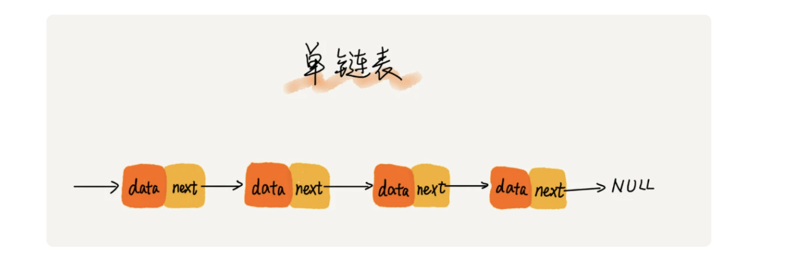

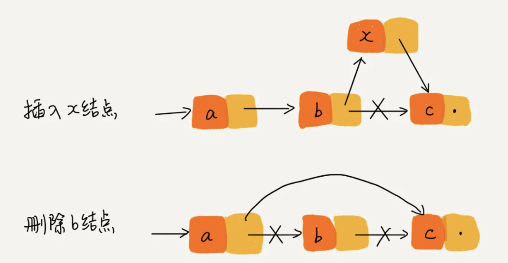

### 2.循环链表

1. 除了**尾节点的后继指针指向首节点的地址**外均与单链表一致。
2. 适用于存储有循环特点的数据，比如[约瑟夫问题](https://zh.wikipedia.org/wiki/%E7%BA%A6%E7%91%9F%E5%A4%AB%E6%96%AF%E9%97%AE%E9%A2%98)。

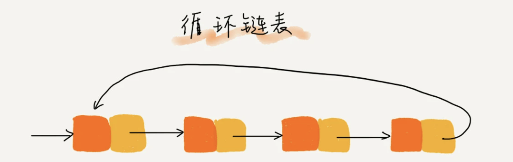

### 3.双向链表

- 节点除了存储数据外，还有两个指针分别指向前一个节点地址（前驱指针prev）和下一个节点地址（后继指针next）
- 首节点的前驱指针prev和尾节点的后继指针均指向空地址。

#### 性能特点

- 和单链表相比，存储相同的数据，需要消耗更多的存储空间。
- 插入、删除操作比单链表效率更高O(1)级别。
  - 以删除操作为例，删除操作分为2种情况：**给定数据值删除对应节**点和**给定节点地址删除节点**。
    - 对于前一种情况，单链表和双向链表都需要从头到尾进行遍历从而找到对应节点进行删除，时间复杂度为O(n)。
    - 对于第二种情况，要进行删除操作必须找到前驱节点，单链表需要从头到尾进行遍历直到p->next = q，时间复杂度为O(n)，而双向链表可以直接找到前驱节点，时间复杂度为O(1)。
- 对于一个有序链表，双向链表的按值查询效率要比单链表高一些。因为我们可以记录上次查找的位置p，每一次查询时，根据要查找的值与p的大小关系，决定是往前还是往后查找，所以平均只需要查找一半的数据。
  - **用空间换时间**的设计思想。当内存空间充足的时候，如果我们更加追求代码的执行速度，我们就可以选择空间复杂度相对较高、但时间复杂度相对很低的算法或者数据结构。相反，如果内存比较紧缺，比如代码跑在手机或者单片机上，这个时候，就要反过来用时间换空间的设计思路。

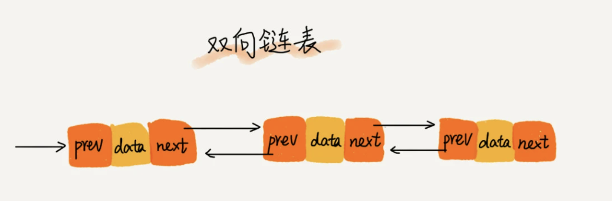

### 4.双向循环链表

首节点的前驱指针指向尾节点，尾节点的后继指针指向首节点。

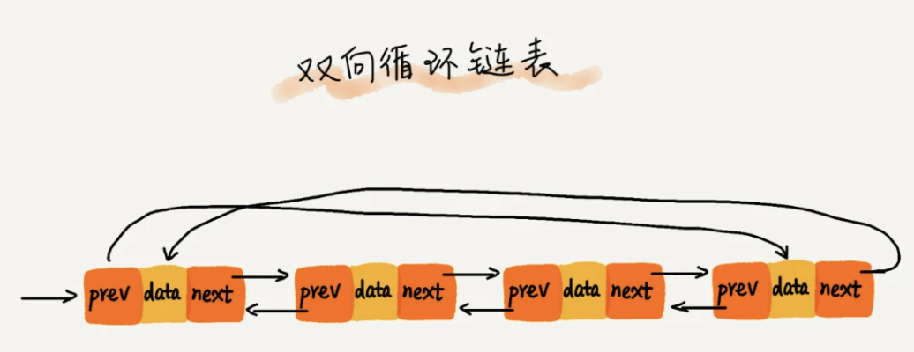

## 选择数组还是链表？

1. 插入、删除和随机访问的时间复杂度
   数组：插入、删除的时间复杂度是O(n)，随机访问的时间复杂度是O(1)。
   链表：插入、删除的时间复杂度是O(1)，随机访问的时间复杂端是O(n)。
2. 数组缺点
   1）若申请内存空间很大，比如100M，但若内存空间没有100M的连续空间时，则会申请失败，尽管内存可用空间超过100M。
   2）大小固定，若存储空间不足，需进行扩容，一旦扩容就要进行数据复制，而这时非常费时的。
3. 链表缺点
   1）内存空间消耗更大，因为需要额外的空间存储指针信息。
   2）对链表进行频繁的插入和删除操作，会导致频繁的内存申请和释放，容易造成内存碎片，如果是Java语言，还可能会造成频繁的GC（自动垃圾回收器）操作。
4. 如何选择？
   1. 数组简单易用，在实现上使用连续的内存空间，可以借助CPU的缓冲机制预读数组中的数据，所以访问效率更高，
   2. 而链表在内存中并不是连续存储，所以对CPU缓存不友好，没办法预读。
   3. 如果代码对内存的使用非常苛刻，那数组就更适合。


## code实践

### 1 理解指针或引用的含义

将某个变量（对象）赋值给指针（引用），实际上就是就是将这个变量（对象）的地址赋值给指针（引用）。

```shell
p—>next = q # 表示p节点的后继指针存储了q节点的内存地址。
p—>next = p—>next—>next # 表示p节点的后继指针存储了p节点的下下个节点的内存地址。
```


### 2 警惕指针丢失和内存泄漏（单链表）

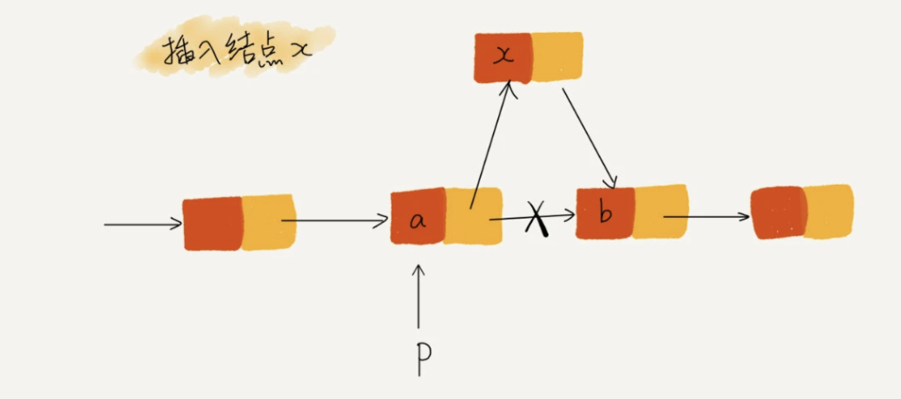

- 插入节点: 在节点a和节点b之间插入节点x，b是a的下一节点，p指针指向节点a，

```shell
# 则造成指针丢失和内存泄漏的代码
p—>next = x;
x—>next = p—>next; # 显然这会导致x节点的后继指针指向自身。

# 正确的写法是2句代码交换顺序，即：
x—>next = p—>next; p—>next = x;
```

- 删除节点: 在节点a和节点b之间删除节点b

```shell
# b是a的下一节点，p指针指向节点a
p—>next = p—>next—>next;
```

### 3 利用“哨兵”简化实现难度

1. 什么是“哨兵”？
   链表中的“哨兵”节点是解决边界问题的，不参与业务逻辑。如果我们引入“哨兵”节点，则不管链表是否为空，head指针都会指向这个“哨兵”节点。我们把这种有“哨兵”节点的链表称为带头链表，相反，没有“哨兵”节点的链表就称为不带头链表。

2. 未引入“哨兵”的情况

   ```shell
   # 如果在p节点后插入一个节点，只需2行代码即可搞定：
   new_node—>next = p—>next;
   p—>next = new_node;
   
   # 但，若向空链表中插入一个节点，则代码如下：
   if(head == null){
   head = new_node;
   }
   
   
   # 如果要删除节点p的后继节点，只需1行代码即可搞定：
   p—>next = p—>next—>next;
   
   # 但，若是删除链表的最有一个节点（链表中只剩下这个节点），则代码如下：
   if(head—>next == null){
   head = null;
   }
   ```

   从上面的情况可以看出，针对链表的插入、删除操作，需要对插入第一个节点和删除最后一个节点的情况进行特殊处理。这样代码就会显得很繁琐，所以引入“哨兵”节点来解决这个问题。

3. 引入“哨兵”的情况
   “哨兵”节点不存储数据，无论链表是否为空，head指针都会指向它，作为链表的头结点始终存在。这样，插入第一个节点和插入其他节点，删除最后一个节点和删除其他节点都可以统一为相同的代码实现逻辑了。
4. “哨兵”还有哪些应用场景？
   这个知识有限，暂时想不出来呀！但总结起来，哨兵最大的作用就是简化边界条件的处理。

### 4 重点留意边界条件处理

经常用来检查链表是否正确的边界4个边界条件：

1. 如果链表为空时，代码是否能正常工作？
2. 如果链表只包含一个节点时，代码是否能正常工作？
3. 如果链表只包含两个节点时，代码是否能正常工作？
4. 代码逻辑在处理头尾节点时是否能正常工作？

### 5 举例画图，辅助思考

核心思想：释放脑容量，留更多的给逻辑思考，这样就会感觉到思路清晰很多。

### 6 多写多练，没有捷径

### 5个常见的链表操作

1.单链表反转
2.链表中环的检测
3.两个有序链表合并
4.删除链表倒数第n个节点
5.求链表的中间节点


# 4 栈(Stack)

## 一、什么是栈？

1.后进者先出，先进者后出，这就是典型的“栈”结构。
2.从栈的操作特性来看，是一种“操作受限”的线性表，只允许在端插入和删除数据。

## 二、为什么需要栈？

1.栈是一种操作受限的数据结构，其操作特性用数组和链表均可实现。
2.但，任何数据结构都是对特定应用场景的抽象，数组和链表虽然使用起来更加灵活，但却暴露了几乎所有的操作，难免会引发错误操作的风险。
3.所以，当某个数据集合只涉及在某端插入和删除数据，且满足后进者先出，先进者后出的操作特性时，我们应该首选栈这种数据结构。

### 三、如何实现栈？

1.栈的API

```java
public class Stack<Item> {
  //压栈
  public void push(Item item){}
  
  //弹栈
  public Item pop(){}
  
  //是否为空
  public boolean isEmpty(){}
  
  //栈中数据的数量
  public int size(){}
  
  //返回栈中最近添加的元素而不删除它
  public Item peek(){}
}
```

2.数组实现（自动扩容）
时间复杂度分析：根据均摊复杂度的定义，可以得数组实现（自动扩容）符合大多数情况是O(1)级别复杂度，个别情况是O(n)级别复杂度，比如自动扩容时，会进行完整数据的拷贝。
空间复杂度分析：在入栈和出栈的过程中，只需要一两个临时变量存储空间，所以O(1)级别。我们说空间复杂度的时候，是指除了原本的数据存储空间外，算法运行还需要额外的存储空间。
实现代码：（见另一条留言）

```java
public class StackOfArray<Item> implements Iterable<Item>{
  //存储数据的数组
  Item[] a = (Item[])new Object[1];
  //记录元素个数N
  int N = 0;
  
  //构造器
  public StackOfArray(){}
  
  //添加元素
  public void push(Item item){
    //自动扩容
    if (N == a.length ) resize(2*a.length );
    a[N++] = item;
  }
  
  //删除元素
  public Item pop(){
    Item item = a[--N];
    a[N] = null;
    if (N > 0 && N == a.length / 4) resize(a.length / 2);
    return item;
    }
  
    //是否为空
    public boolean isEmpty(){
    	return N == 0;
    }
  
    //元素个数
    public int size(){
    	return N;
    }

    //改变数组容量
    private void resize(int length) {
      Item[] temp = (Item[])new Object[length];
      for (int i = 0; i < N; i++) {
      	temp[i] = a[i];
      }
      a = temp;
    }
  
    //返回栈中最近添加的元素而不删除它
    public Item peek(){
    	return a[N-1];
    }
  
    @Override
    public Iterator<Item> iterator() {
    	return new ArrayIterator();
    }
  
    //内部类
    class ArrayIterator implements Iterator{
      //控制迭代数量
      int i = N;
      @Override
      public boolean hasNext() {
        return i > 0;
      }

      @Override
      public Item next() {
        return a[--i];
    	}
  	}
}
```


3.链表实现
时间复杂度分析：压栈和弹栈的时间复杂度均为O(1)级别，因为只需更改单个节点的索引即可。
空间复杂度分析：在入栈和出栈的过程中，只需要一两个临时变量存储空间，所以O(1)级别。我们说空间复杂度的时候，是指除了原本的数据存储空间外，算法运行还需要额外的存储空间。
实现代码：（见另一条留言）

```java
public class StackOfLinked<Item> implements Iterable<Item> {
  //定义一个内部类，就可以直接使用类型参数
  private class Node{
    Item item;
    Node next;
  }
  private Node first;
  private int N;
  //构造器
  public StackOfLinked(){}
  
  //添加
  public void push(Item item){
    Node oldfirst = first;
    first = new Node();
    first.item = item;
    first.next = oldfirst;
    N++;
  }
  //删除
  public Item pop(){
    Item item = first.item;
    first = first.next;
    N--;
    return item;
  }
  
  //是否为空
  public boolean isEmpty(){
  	return N == 0;
  }
  
  //元素数量
  public int size(){
  	return N;
  }
  
  //返回栈中最近添加的元素而不删除它
  public Item peek(){
  	return first.item;
  }
  
  @Override
  public Iterator<Item> iterator() {
  	return new LinkedIterator();
  }
  
  //内部类：迭代器
  class LinkedIterator implements Iterator{
    int i = N;
    Node t = first;
    
    @Override
    public boolean hasNext() {
    	return i > 0;
    }
    
    @Override
    public Item next() {
      Item item = (Item) t.item;
      t = t.next;
      i--;
      return item;
    }
  }
}
```


## 四、栈的应用

### 1.栈在函数调用中的应用

操作系统给每个线程分配了一块独立的内存空间，这块内存被组织成“栈”这种结构，用来存储函数调用时的临时变量。每进入一个函数，就会将其中的临时变量作为栈帧入栈，当被调用函数执行完成，返回之后，将这个函数对应的栈帧出栈。

### 2.栈在表达式求值中的应用（比如：34+13*9+44-12/3）

利用两个栈，其中一个用来保存操作数，另一个用来保存运算符。我们从左向右遍历表达式，当遇到数字，我们就直接压入操作数栈；当遇到运算符，就与运算符栈的栈顶元素进行比较，若比运算符栈顶元素优先级高，就将当前运算符压入栈，若比运算符栈顶元素的优先级低或者相同，从运算符栈中取出栈顶运算符，从操作数栈顶取出2个操作数，然后进行计算，把计算完的结果压入操作数栈，继续比较。

### 3.栈在括号匹配中的应用（比如：{}{[()]()}）

用栈保存为匹配的左括号，从左到右一次扫描字符串，当扫描到左括号时，则将其压入栈中；当扫描到右括号时，从栈顶取出一个左括号，如果能匹配上，则继续扫描剩下的字符串。如果扫描过程中，遇到不能配对的右括号，或者栈中没有数据，则说明为非法格式。
当所有的括号都扫描完成之后，如果栈为空，则说明字符串为合法格式；否则，说明未匹配的左括号为非法格式。

### 4.如何实现浏览器的前进后退功能？

我们使用两个栈X和Y，我们把首次浏览的页面依次压如栈X，当点击后退按钮时，再依次从栈X中出栈，并将出栈的数据一次放入Y栈。当点击前进按钮时，我们依次从栈Y中取出数据，放入栈X中。当栈X中没有数据时，说明没有页面可以继续后退浏览了。当Y栈没有数据，那就说明没有页面可以点击前进浏览了。

## 五、思考

- 我们在讲栈的应用时，讲到用函数调用栈来保存临时变量，为什么函数调用要用“栈”来保存临时变量呢？用其他数据结构不行吗？
  答：因为函数调用的执行顺序符合后进者先出，先进者后出的特点。比如函数中的局部变量的生命周期的长短是先定义的生命周期长，后定义的生命周期短；还有函数中调用函数也是这样，先开始执行的函数只有等到内部调用的其他函数执行完毕，该函数才能执行结束。
  正是由于函数调用的这些特点，根据数据结构是特定应用场景的抽象的原则，我们优先考虑栈结构。
- 我们都知道，JVM 内存管理中有个“堆栈”的概念。栈内存用来存储局部变量和方法调用，堆内存用来存储 Java 中的对象。那 JVM 里面的“栈”跟我们这里说的“栈”是不是一回事呢？如果不是，那它为什么又叫作“栈”呢？
  答：JVM里面的栈和我们这里说的是一回事，被称为方法栈。和前面函数调用的作用是一致的，用来存储方法中的局部变量。


# 5 队列

## 一、什么是队列？

1. 先进者先出，这就是典型的“队列”结构。
2. 支持两个操作：入队enqueue()，放一个数据到队尾；出队dequeue()，从队头取一个元素。
3. 所以，和栈一样，队列也是一种操作受限的线性表。

## 二、队列类型

### 1 顺序队列

用数组实现的队列叫作顺序队列

```java
public interface Queue<T> {
  public void enqueue(T item); //入队
  public T dequeue(); //出队
  public int size(); //统计元素数量
  public boolean isNull(); //是否为空
}
```

操作

- 当 a、b、c、d 依次入队之后，队列中的 head 指针指向下标为 0 的位置，tail 指针指向下标为 4 的位置。

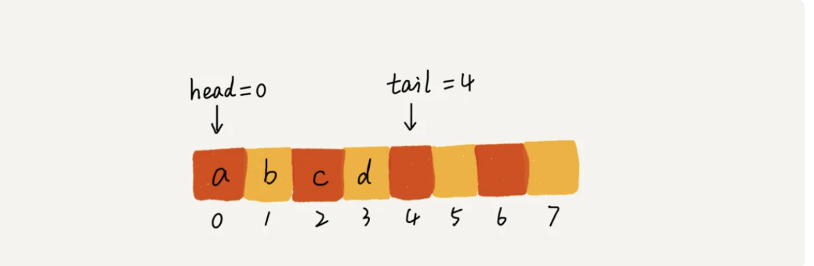

- 当我们调用两次出队操作之后，队列中 head 指针指向下标为 2 的位置，tail 指针仍然指向下标为 4 的位置。

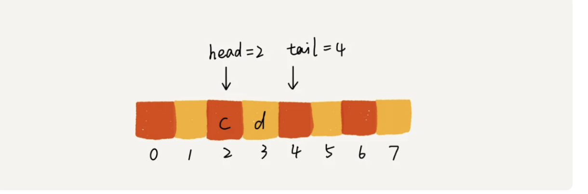

### 2 链式队列

- 用链表实现的队列叫作链式队列

- 基于链表的实现，我们同样需要两个指针：head 指针和 tail 指针。它们分别指向链表的第一个结点和最后一个结点。

  ```json
  # 如图所示，
  入队时，tail -> next = new_node, tail = tail -> next；
  出队时，head = head -> next。
  ```

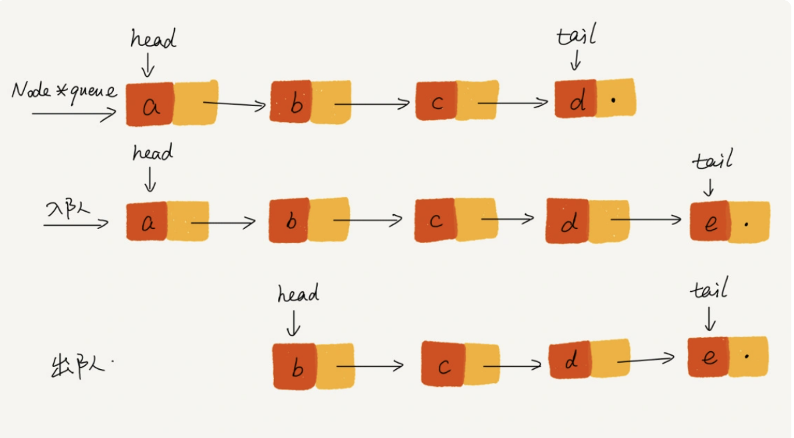

### 3 循环队列

队列为空的判断条件是 head == tail

当队满时判断条件，(tail+1)%n=head

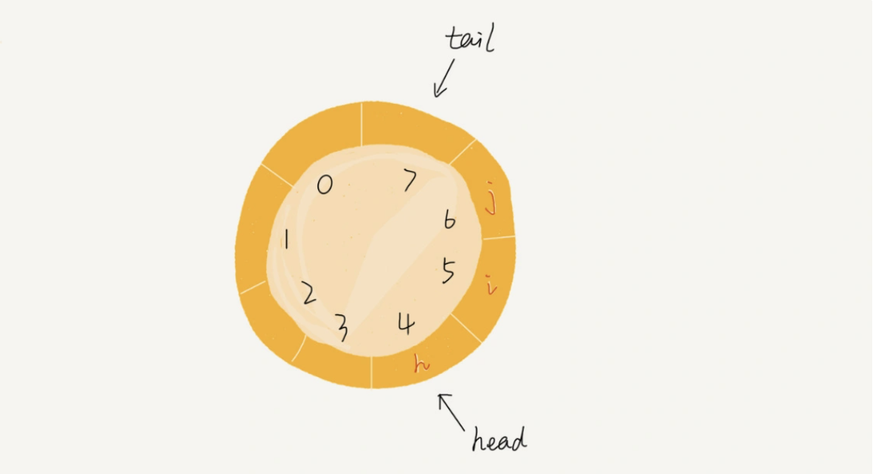

```java
public class CircularQueue {
  // 数组：items，数组大小：n
  private String[] items;
  private int n = 0;
  // head表示队头下标，tail表示队尾下标
  private int head = 0;
  private int tail = 0;

  // 申请一个大小为capacity的数组
  public CircularQueue(int capacity) {
    items = new String[capacity];
    n = capacity;
  }

  // 入队
  public boolean enqueue(String item) {
    // 队列满了
    if ((tail + 1) % n == head) return false;
    items[tail] = item;
    tail = (tail + 1) % n;
    return true;
  }

  // 出队
  public String dequeue() {
    // 如果head == tail 表示队列为空
    if (head == tail) return null;
    String ret = items[head];
    head = (head + 1) % n;
    return ret;
  }
}
```


### 4 阻塞队列

阻塞队列其实就是在队列基础上增加了阻塞操作。简单来说，就是在队列为空的时候，从队头取数据会被阻塞。因为此时还没有数据可取，直到队列中有了数据才能返回；如果队列已经满了，那么插入数据的操作就会被阻塞，直到队列中有空闲位置后再插入数据，然后再返回。

### 5 并发队列

线程安全的队列我们叫作并发队列。最简单直接的实现方式是直接在 enqueue()、dequeue() 方法上加锁，但是锁粒度大并发度会比较低，同一时刻仅允许一个存或者取操作。实际上，基于数组的循环队列，利用 CAS 原子操作，可以实现非常高效的并发队列。这也是循环队列比链式队列应用更加广泛的原因。在实战篇讲 Disruptor 的时候，我会再详细讲并发队列的应用。

### 6 优先队列

|              | 入队    | 出队（拿最大数） |
| ------------ | ------- | ---------------- |
| 普通线性结构 | O(1)    | O(n)             |
| 顺序线性结构 | O(n)    | O(1)             |
| 堆           | O(logn) | O(logn)          |


## 三、队列有哪些常见的应用？

1. 阻塞队列
   1）在队列的基础上增加阻塞操作，就成了阻塞队列。
   2）阻塞队列就是在队列为空的时候，从队头取数据会被阻塞，因为此时还没有数据可取，直到队列中有了数据才能返回；如果队列已经满了，那么插入数据的操作就会被阻塞，直到队列中有空闲位置后再插入数据，然后在返回。
   3）从上面的定义可以看出这就是一个“生产者-消费者模型”。这种基于阻塞队列实现的“生产者-消费者模型”可以有效地协调生产和消费的速度。当“生产者”生产数据的速度过快，“消费者”来不及消费时，存储数据的队列很快就会满了，这时生产者就阻塞等待，直到“消费者”消费了数据，“生产者”才会被唤醒继续生产。不仅如此，基于阻塞队列，我们还可以通过协调“生产者”和“消费者”的个数，来提高数据处理效率，比如配置几个消费者，来应对一个生产者。
2. 并发队列
   1）在多线程的情况下，会有多个线程同时操作队列，这时就会存在线程安全问题。能够有效解决线程安全问题的队列就称为并发队列。
   2）并发队列简单的实现就是在enqueue()、dequeue()方法上加锁，但是锁粒度大并发度会比较低，同一时刻仅允许一个存或取操作。
   3）实际上，基于数组的循环队列利用CAS原子操作，可以实现非常高效的并发队列。这也是循环队列比链式队列应用更加广泛的原因。
   3.线程池资源枯竭是的处理
   在资源有限的场景，当没有空闲资源时，基本上都可以通过“队列”这种数据结构来实现请求排队。


# 6 递归

## 一、什么是递归？

1.递归是一种非常高效、简洁的编码技巧，一种应用非常广泛的算法，比如DFS深度优先搜索、前中后序二叉树遍历等都是使用递归。
2.方法或函数调用自身的方式称为递归调用，调用称为递，返回称为归。
3.基本上，所有的递归问题都可以用递推公式来表示，比如
f(n) = f(n-1) + 1;
f(n) = f(n-1) + f(n-2);
f(n)=n*f(n-1);

## 二、为什么使用递归？递归的优缺点？

1.优点：代码的表达力很强，写起来简洁。
2.缺点：空间复杂度高、有堆栈溢出风险、存在重复计算、过多的函数调用会耗时较多等问题。

## 三、什么样的问题可以用递归解决呢？

一个问题只要同时满足以下3个条件，就可以用递归来解决：

1. 问题的解可以分解为几个子问题的解。何为子问题？就是数据规模更小的问题。
2. 问题与子问题，除了数据规模不同，求解思路完全一样
3. 存在递归终止条件

## 四、如何实现递归？

1.递归代码编写
写递归代码的关键就是找到如何将大问题分解为小问题的规律，并且基于此写出递推公式，然后再推敲终止条件，最后将递推公式和终止条件翻译成代码。
2.递归代码理解
对于递归代码，若试图想清楚整个递和归的过程，实际上是进入了一个思维误区。
那该如何理解递归代码呢？如果一个问题A可以分解为若干个子问题B、C、D，你可以假设子问题B、C、D已经解决。而且，你只需要思考问题A与子问题B、C、D两层之间的关系即可，不需要一层层往下思考子问题与子子问题，子子问题与子子子问题之间的关系。屏蔽掉递归细节，这样子理解起来就简单多了。
因此，理解递归代码，就把它抽象成一个递推公式，不用想一层层的调用关系，不要试图用人脑去分解递归的每个步骤。

## 五、递归常见问题及解决方案

1.警惕堆栈溢出：可以声明一个全局变量来控制递归的深度，从而避免堆栈溢出。
2.警惕重复计算：通过某种数据结构来保存已经求解过的值，从而避免重复计算。

## 六、如何将递归改写为非递归代码？

笼统的讲，所有的递归代码都可以改写为迭代循环的非递归写法。如何做？抽象出递推公式、初始值和边界条件，然后用迭代循环实现。


# 7 排序

## 一、几种经典排序算法及其时间复杂度级别

|                  |          |            |
| ---------------- | -------- | ---------- |
| 冒泡、插入、选择 | O(n^2)   | 基于比较   |
| 快排、归并       | O(nlogn) | 基于比较   |
| 计数、基数、桶   | O(n)     | 不基于比较 |

- 测试案例

```java
public static void main(String[] args) {
  Integer[] arr = {1,4,5,6,3,2,7};
  SelectionSort2.sort(arr);

  StringBuilder builder = new StringBuilder();
  for (int i : arr) {
    builder.append(i).append(" ");
  }
  System.out.println(builder);
}
```


### 1 冒泡排序（Bubble Sort）

#### 1.排序原理

1）冒泡排序只会操作相邻的两个数据。
2）对相邻两个数据进行比较，看是否满足大小关系要求，若不满足让它俩互换。
3）一次冒泡会让至少一个元素移动到它应该在的位置，重复n次，就完成了n个数据的排序工作。
4）优化：若某次冒泡不存在数据交换，则说明已经达到完全有序，所以终止冒泡。

#### 2.代码实现

```java
public class BubbleSort {
    private BubbleSort() {}

    public static <E extends Comparable<E>> void sort(E[] arr) {
        for(int i = 0; i+1 < arr.length; i++) {
            // arr[n - i, n) 已经排好序
            // 通过冒泡在 arr[n-i-1] 位置放上合适的元素 => j+1 <= arr.length-i-1
           for (int j=0; j < arr.length-i-1; j++) {
               if (arr[j].compareTo(arr[j+1]) > 0) {  // 有逆序对就交换位置
                   swap(arr, j, j+1);
               }
           }
        }
    }

    private static <E> void swap(E[] arr, int i, int j) {
        E t = arr[i];
        arr[i] = arr[j];
        arr[j] = t;
    }
}
```

#### 3.性能分析

1）执行效率：最小时间复杂度、最大时间复杂度、平均时间复杂度
最小时间复杂度：数据完全有序时，只需进行一次冒泡操作即可，时间复杂度是O(n)。
最大时间复杂度：数据倒序排序时，需要n次冒泡操作，时间复杂度是O(n^2)。
平均时间复杂度：通过有序度和逆序度来分析。
什么是有序度？
有序度是数组中具有有序关系的元素对的个数，比如[2,4,3,1,5,6]这组数据的有序度就是11，分别是[2,4][2,3][2,5][2,6][4,5][4,6][3,5][3,6][1,5][1,6][5,6]。同理，对于一个倒序数组，比如[6,5,4,3,2,1]，有序度是0；对于一个完全有序的数组，比如[1,2,3,4,5,6]，有序度为n*(n-1)/2，也就是15，完全有序的情况称为满有序度。
什么是逆序度？逆序度的定义正好和有序度相反。核心公式：逆序度=满有序度-有序度。
排序过程，就是有序度增加，逆序度减少的过程，最后达到满有序度，就说明排序完成了。
冒泡排序包含两个操作原子，即比较和交换，每交换一次，有序度加1。不管算法如何改进，交换的次数总是确定的，即逆序度。
对于包含n个数据的数组进行冒泡排序，平均交换次数是多少呢？最坏的情况初始有序度为0，所以要进行n*(n-1)/2交换。最好情况下，初始状态有序度是n*(n-1)/2，就不需要进行交互。我们可以取个中间值n*(n-1)/4，来表示初始有序度既不是很高也不是很低的平均情况。
换句话说，平均情况下，需要n*(n-1)/4次交换操作，比较操作可定比交换操作多，而复杂度的上限是O(n^2)，所以平均情况时间复杂度就是O(n^2)。
以上的分析并不严格，但很实用，这就够了。
2）空间复杂度：每次交换仅需1个临时变量，故空间复杂度为O(1)，是原地排序算法。
3）算法稳定性：如果两个值相等，就不会交换位置，故是稳定排序算法。

### 2 插入排序

#### 1.算法原理

1. 首先，我们将数组中的数据分为2个区间，即已排序区间和未排序区间。
2. 初始已排序区间只有一个元素，就是数组的第一个元素。
3. 插入算法的核心思想就是取未排序区间中的元素，在已排序区间中找到合适的插入位置将其插入，并保证已排序区间中的元素一直有序。重复这个过程，直到未排序中元素为空，算法结束。

#### 2.代码实现

```java
public class InsertionSort {
    private InsertionSort() {}

    public static <E extends Comparable<E>> void sort(E[] arr) {
        for (int i = 0; i < arr.length; i++) {
            // 将 arr[i] 插入到合适位置
          
            // 方案1
            for (int j = i; j - 1 >= 0; j--){          // j-1>=0 保证前面有元素
                if (arr[j].compareTo(arr[j-1]) < 0) {  // 如果前面的元素大于当前的元素，则交换位置
                    swap(arr, j, j-1);
                } else {
                    break;
                }
            }
            
            // 方案2 去掉break
            for (int j = i; j-1 >= 0 && arr[j].compareTo(arr[j-1]) < 0; j--){
                swap(arr, j, j-1);
            }
        }
    }

     private static <E> void swap(E[] arr, int i, int j) {
        E t = arr[i];
        arr[i] = arr[j];
        arr[j] = t;
    }
}
```

#### 3.性能分析

1）时间复杂度：最好、最坏、平均情况
如果要排序的数组已经是有序的，我们并不需要搬移任何数据。只需要遍历一遍数组即可，所以时间复杂度是O(n)。如果数组是倒序的，每次插入都相当于在数组的第一个位置插入新的数据，所以需要移动大量的数据，因此时间复杂度是O(n^2)。而在一个数组中插入一个元素的平均时间复杂都是O(n)，插入排序需要n次插入，所以平均时间复杂度是O(n^2)。
2）空间复杂度：从上面的代码可以看出，插入排序算法的运行并不需要额外的存储空间，所以空间复杂度是O(1)，是原地排序算法。
3）算法稳定性：在插入排序中，对于值相同的元素，我们可以选择将后面出现的元素，插入到前面出现的元素的后面，这样就保持原有的顺序不变，所以是稳定的。


### 3 选择排序（Selection Sort）

#### 1.算法原理

选择排序算法的实现思路有点类似插入排序，也分已排序区间和未排序区间。但是选择排序每次会从未排序区间中找到最小的元素，将其放到已排序区间的末尾。

选择排序空间复杂度为 O(1)，是一种原地排序算法。选择排序的最好情况时间复杂度、最坏情况和平均情况时间复杂度都为 O(n^2)。

#### 2.代码实现

```java
public class SelectionSort2 {
    private SelectionSort2() {}

    public static <E extends Comparable<E>> void sort(E[] arr) {
        for(int i = 0; i< arr.length; i++) {
            // 选择arr[i,n) 中最小值的索引
            int minIndex = i;
            for (int j = i; j < arr.length; j++) {
                if (arr[j].compareTo(arr[minIndex]) < 0){
                    minIndex = j;
                }
            }
            swap(arr, i, minIndex);
        }
    }

    private static <E> void swap(E[] arr, int i, int j) {
        E t = arr[i];
        arr[i] = arr[j];
        arr[j] = t;
    }
}
```


### 4 归并排序（Merge Sort）

####  1.算法原理

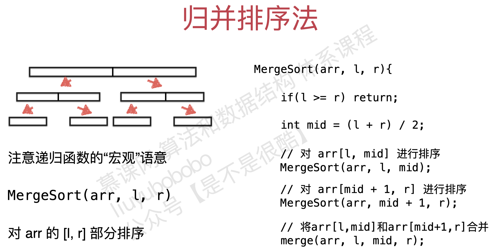

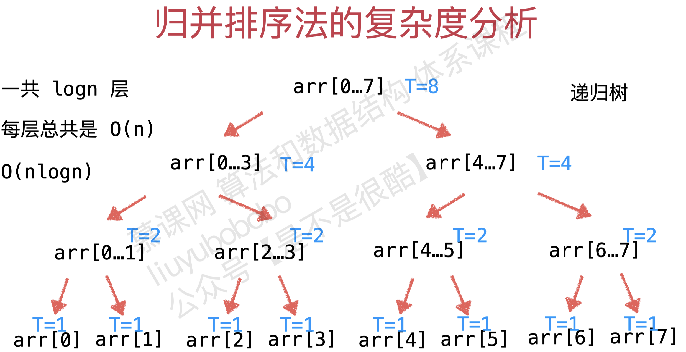

#### 2.代码实现

- 自顶向下

```java
public class MergeSort {
    private MergeSort() {}

    public static <E extends Comparable<E>> void sort(E[] arr) {
        sort(arr, 0, arr.length - 1);  // 闭区间
    }

    private static <E extends Comparable<E>> void sort(E[] arr, int l, int r) {
        if (l >= r) return;
        int mid = (l + r) / 2;
        sort(arr, l, mid);
        sort(arr, mid + 1, r);
        merge(arr, l, mid, r);
    }

    // 合并2个有序区间 arr[l, mid], arr[mid=1, l]
    private static <E extends Comparable<E>> void merge(E[] arr, int l, int mid, int r) {
        E[] tmp = Arrays.copyOfRange(arr, l, r + 1);
        int i = l;
        int j = mid+1;

        // 每轮循环为 arr[k] 赋值
        for (int k = i; k <= r; k++) {
            if (i > mid) {
                arr[k] = tmp[j - l]; j++;
            } else if (j > r) {
                arr[k] = tmp[i - l]; i++;
            } else if (tmp[i-l].compareTo(tmp[j  - l]) <= 0) {
                arr[k] = tmp[i - l]; i++;
            } else {
                arr[k] = tmp[j - l]; j++;
            }
        }
    }
}
```

- 自底向上版本

```java
// 自底向上
public static <E extends Comparable<E>> void sortBU(E[] arr) {
    int n = arr.length;

    // 遍历合并的区间长度
    for (int sz=1; sz<n; sz += sz) {
        // 遍历合并的两个区间的起始位置 i
        // arr[i, i+sz-1] arr[i+sz, i+sz+sz-1]
        for (int i = 0; i+sz < n; i += 2*sz) {
            if (arr[i+sz-1].compareTo(arr[i+sz]) > 0)
                merge(arr, i, i+sz-1, Math.min(i+2*sz-1, n-1));
        }
    }
}
```

#### 3.性能分析

时间复杂度 O(nlogn)

空间复杂度 O(n)


### 5 快速排序

#### 1.算法原理

快排的思想是这样的：

- 如果要排序数组中下标从p到r之间的一组数据，我们选择p到r之间的任意一个数据作为pivot（分区点）。然后遍历p到r之间的数据，将小于pivot的放到左边，将大于pivot的放到右边，将povit放到中间。

- 经过这一步之后，数组p到r之间的数据就分成了3部分，前面p到q-1之间都是小于povit的，中间是povit，后面的q+1到r之间是大于povit的。

- 根据分治、递归的处理思想，我们可以用递归排序下标从p到q-1之间的数据和下标从q+1到r之间的数据，直到区间缩小为1，就说明所有的数据都有序了。
  - 递推公式：quick_sort(p…r) = quick_sort(p…q-1) + quick_sort(q+1, r)
  - 终止条件：p >= r

#### 2.代码实现

```java
public class QuickSort {
    private QuickSort() {}

    public static <E extends Comparable<E>> void sort(E[] arr) {
        sort(arr, 0, arr.length - 1);  // 闭区间
    }

    private static <E extends Comparable<E>> void sort(E[] arr, int l, int r) {

        if (l >= r) return;
        int p = partition(arr, l, r);
        sort(arr, l, p - 1);
        sort(arr, p + 1, r);
    }

    private static <E extends Comparable<E>> int partition(E[] arr, int l, int r) {
        // 生成 [l, r] 之间的随机索引
        int p = l + (new Random()).nextInt(r - l + 1);
        swap(arr, l, p);

        // arr[l+1...j] < v ; arr[j+1...i] >= v
        int j = l;
        for(int i = l + 1; i <= r; i ++)
            if(arr[i].compareTo(arr[l]) < 0){
                j ++;
                swap(arr, i, j);
            }

        swap(arr, l, j);
        return j;
    }

    private static <E> void swap(E[] arr, int i, int j) {
        E t = arr[i];
        arr[i] = arr[j];
        arr[j] = t;
    }
}
```

#### 3.性能分析

1）算法稳定性：
因为分区过程中涉及交换操作，如果数组中有两个8，其中一个是pivot，经过分区处理后，后面的8就有可能放到了另一个8的前面，先后顺序就颠倒了，所以快速排序是不稳定的排序算法。比如数组[1,2,3,9,8,11,8]，取后面的8作为pivot，那么分区后就会将后面的8与9进行交换。
2）时间复杂度：最好、最坏、平均情况
快排也是用递归实现的，所以时间复杂度也可以用递推公式表示。
如果每次分区操作都能正好把数组分成大小接近相等的两个小区间，那快排的时间复杂度递推求解公式跟归并的相同。
T(1) = C； n=1 时，只需要常量级的执行时间，所以表示为 C。
T(n) = 2*T(n/2) + n； n>1
所以，快排的时间复杂度也是O(nlogn)。
如果数组中的元素原来已经有序了，比如1，3，5，6，8，若每次选择最后一个元素作为pivot，那每次分区得到的两个区间都是不均等的，需要进行大约n次的分区，才能完成整个快排过程，而每次分区我们平均要扫描大约n/2个元素，这种情况下，快排的时间复杂度就是O(n^2)。
前面两种情况，一个是分区及其均衡，一个是分区极不均衡，它们分别对应了快排的最好情况时间复杂度和最坏情况时间复杂度。那快排的平均时间复杂度是多少呢？T(n)大部分情况下是O(nlogn)，只有在极端情况下才是退化到O(n^2)，而且我们也有很多方法将这个概率降低。
3）空间复杂度：快排是一种原地排序算法，空间复杂度是O(1)


是一个随机算法

递归层级O(logn)

#### 双路快速排序


### 6 希尔排序


### 总结

#### 归并排序与快速排序的区别

归并和快排用的都是分治思想，递推公式和递归代码也非常相似，那它们的区别在哪里呢？
1.归并排序，是先递归调用，再进行合并，合并的时候进行数据的交换。所以它是自下而上的排序方式。何为自下而上？就是先解决子问题，再解决父问题。
2.快速排序，是先分区，在递归调用，分区的时候进行数据的交换。所以它是自上而下的排序方式。何为自上而下？就是先解决父问题，再解决子问题。

#### 思考

1.O(n)时间复杂度内求无序数组中第K大元素，比如4，2，5，12，3这样一组数据，第3大元素是4。
我们选择数组区间A[0...n-1]的最后一个元素作为pivot，对数组A[0...n-1]进行原地分区，这样数组就分成了3部分，A[0...p-1]、A[p]、A[p+1...n-1]。
如果如果p+1=K，那A[p]就是要求解的元素；如果K>p+1，说明第K大元素出现在A[p+1...n-1]区间，我们按照上面的思路递归地在A[p+1...n-1]这个区间查找。同理，如果K<p+1，那我们就在A[0...p-1]区间查找。
时间复杂度分析？
第一次分区查找，我们需要对大小为n的数组进行分区操作，需要遍历n个元素。第二次分区查找，我们需要对大小为n/2的数组执行分区操作，需要遍历n/2个元素。依次类推，分区遍历元素的个数分别为n、n/2、n/4、n/8、n/16......直到区间缩小为1。如果把每次分区遍历的元素个数累加起来，就是等比数列求和，结果为2n-1。所以，上述解决问题的思路为O(n)。
2.有10个访问日志文件，每个日志文件大小约为300MB，每个文件里的日志都是按照时间戳从小到大排序的。现在需要将这10个较小的日志文件合并为1个日志文件，合并之后的日志仍然按照时间戳从小到大排列。如果处理上述任务的机器内存只有1GB，你有什么好的解决思路能快速地将这10个日志文件合并？

## 二、如何分析一个排序算法？

执行效率：从以下3个方面来衡量
1）最好情况、最坏情况、平均情况时间复杂度
2）时间复杂度的系数、常数、低阶：排序的数据量比较小时考虑
3）比较次数和交换（或移动）次数
4.内存消耗：通过空间复杂度来衡量。针对排序算法的空间复杂度，引入原地排序的概念，原地排序算法就是指空间复杂度为O(1)的排序算法。
5.稳定性：如果待排序的序列中存在值等的元素，经过排序之后，相等元素之间原有的先后顺序不变，就说明这个排序算法时稳定的。


# 8 二分查找


```java
public class BinarySearch {
    private BinarySearch() {}

    public static <E extends Comparable<E>> int search(E[] arr, E target) {
        return search(arr, 0, arr.length - 1, target);
    }

    private static <E extends Comparable<E>> int search(E[] arr, int l, int r, E target) {
        if (l > r) return -1;  // 终止条件
        int mid = l + (r - l) / 2;
        if (arr[mid].compareTo(target) == 0) return mid;
        if (arr[mid].compareTo(target) < 0) {
            return search(arr, mid + 1, r, target);
        }
        return search(arr, l, mid - 1, target);
    }


     public static void main(String[] args) {
        Integer[] arr = {1,2,3,4,5,6,7};
         System.out.println(BinarySearch.search(arr, 4));  // 3
     }
}
```

- 非递归

```java
public static <E extends Comparable<E>> int search(E[] arr, E target) {
    int l =0, r = arr.length - 1;

    // 在data[l,r] 的范围查找 target
    while (l<=r) {
        int mid = l + (r - l) / 2;
        if (arr[mid].compareTo(target) == 0) return mid;
        if (arr[mid].compareTo(target) < 0) {
            l = mid + 1;
        } else {
            r = mid - 1;
        }

    }
    return -1;
}
```


# 9 二叉树

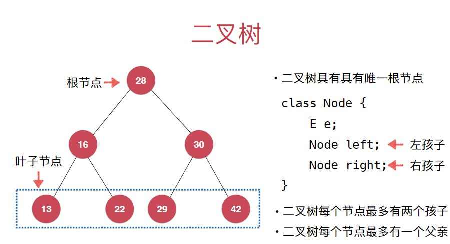

- 前序遍历
- 中序遍历结果是顺序的数组
- 后序遍历

```java
public class BST<E extends Comparable<E>> {

    private class Node {
        public E e;
        public Node left, right;

        public Node(E e) {
            this.e = e;
            left = null;
            right = null;
        }
    }

    private Node root;
    private int size;

    public BST(){
        root = null;
        size = 0;
    }

    public int size(){
        return size;
    }

    public boolean isEmpty(){
        return size == 0;
    }

    // 向二分搜索树中添加新的元素e
    public void add(E e){
        root = add(root, e);
    }

    // 向以node为根的二分搜索树中插入元素e，递归算法
    // 返回插入新节点后二分搜索树的根
    private Node add(Node node, E e){
        if(node == null){
            size ++;
            return new Node(e);
        }

        if(e.compareTo(node.e) < 0)
            node.left = add(node.left, e);
        else if(e.compareTo(node.e) > 0)
            node.right = add(node.right, e);

        return node;
    }

    // 看二分搜索树中是否包含元素e
    public boolean contains(E e){
        return contains(root, e);
    }

    // 看以node为根的二分搜索树中是否包含元素e, 递归算法
    private boolean contains(Node node, E e){

        if(node == null)
            return false;

        if(e.compareTo(node.e) == 0)
            return true;
        else if(e.compareTo(node.e) < 0)
            return contains(node.left, e);
        else // e.compareTo(node.e) > 0
            return contains(node.right, e);
    }

    // 二分搜索树的前序遍历
    public void preOrder(){
        preOrder(root);
    }

    // 前序遍历以node为根的二分搜索树, 递归算法
    private void preOrder(Node node){
        if(node == null)
            return;

        System.out.println(node.e);
        preOrder(node.left);
        preOrder(node.right);
    }

    @Override
    public String toString(){
        StringBuilder res = new StringBuilder();
        generateBSTString(root, 0, res);
        return res.toString();
    }

    // 生成以node为根节点，深度为depth的描述二叉树的字符串
    private void generateBSTString(Node node, int depth, StringBuilder res){

        if(node == null){
            res.append(generateDepthString(depth) + "null\n");
            return;
        }

        res.append(generateDepthString(depth) + node.e + "\n");
        generateBSTString(node.left, depth + 1, res);
        generateBSTString(node.right, depth + 1, res);
    }

    private String generateDepthString(int depth){
        StringBuilder res = new StringBuilder();
        for(int i = 0 ; i < depth ; i ++)
            res.append("--");
        return res.toString();
    }
}
```


# 10 堆

## 二叉堆

二叉堆是一棵完全二叉树

完全二叉树：

- 把元素一层层顺序排列成树的形状
- 堆中某个节点的值总是不大于其父节点的值
- 最大堆（相应的可以定义最小堆）


# 11 线段数 Tire

## 线段树

基于区间统计查询


线段树不是完全二叉树

线段树是平衡二叉树

对于n个元素 开4n空间数组即可存储

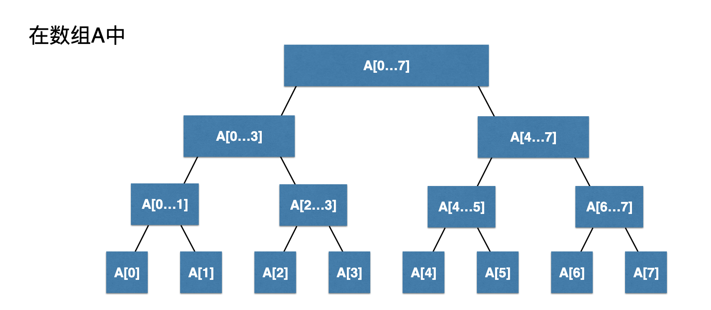

## Tire 字典树 前缀树

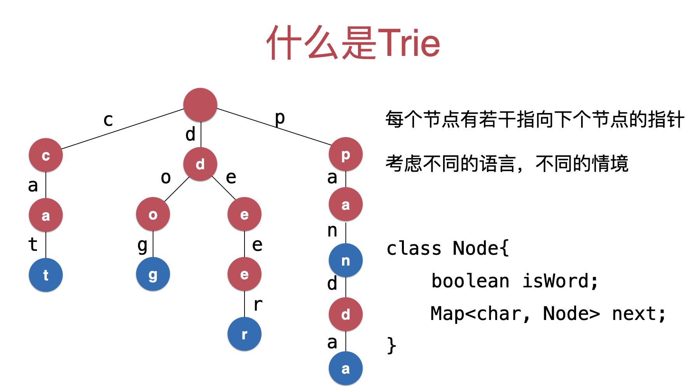


# AVL树

平衡二叉树

对于任意一个节点，左子树和右子树的高度差不能超过1（比线段树，堆 对于平衡 条件宽松）

# 红黑树

算法4（教材）

平衡二叉树

条件：

1. 每个节点要么黑，要么红
2. 根节点是heide
3. 每个叶子节点（最后的空节点）是黑的
4. 如果一个节点的红色的，那么他的孩子节点是黑色的
5. 从任意一个节点到叶子节点，经过的黑色节点是一样的


treemap底层是红黑树

## 2-3树

绝对平衡树


# 并查集

连接问题 -> 网络中2点间的连接问题


# 哈希表

用空间换时间

解决哈希冲突：链地址法Seperate chaining

## 设计

对于一个大整数(浮点数，字符串 都可以转型整型处理) => 取模（素数）

http://planetmath.org/goodhashtableprimes


原则

1. 一致性：如果a==b，则hash(a) == hash(b)

2. 高效性：计算高效便捷
3. 均匀性：哈希值分布均匀


# SQRT

一种数据结构

使用分块思想

1. 把含有n个元素的数组分成sqrt（n）份（向上取整）

解决区间问题:使用线段树O(logn)

O(sqrt(n))


# 非比较排序

主要是字符串排序

## 计数排序

稳定性

适用于小的数据范围

## 基数排序


## 桶排序


## 模式匹配

1. 暴力求解
2. 哈希法
3. 滚动哈希
4. Rabin-Karp算法


# Leedcode

使用高级数据结构 可以实现动态维护

## 数组

### 26

### 80

### 283[#](https://leetcode-cn.com/problems/move-zeroes/)

给定一个数组 nums，编写一个函数将所有 0 移动到数组的末尾，同时保持非零元素的相对顺序。

示例:

输入: [0,1,0,3,12]
输出: [1,3,12,0,0]

```java
public void moveZeroes(int[] nums) {
    int n = nums.length;
    ArrayList<Integer> nonZero = new ArrayList<>();
    // 获取所有非零元素
    for (int i = 0; i < n; i++) {
        if (nums[i] != 0) nonZero.add(nums[i]);
    }
    // 在原数组中 填入非零元素
    for (int i = 0; i < nonZero.size() ; i++){
        nums[i] = nonZero.get(i);
    }
    // 在原数组中 填入零元素
    for (int i = nonZero.size(); i < n; i++) {
        nums[i] = 0;
    }
}
```

- 原地排序、双指针

```java
public void moveZeroes(int[] nums) {
    int n = nums.length;
    int j = 0;  // [0, j) 元素均为非0元素

    // 遍历到第i个元素后，保证[0, i]所有非0元素 都按照顺序排列在[0,k)中
    for (int i = 0; i < n; i++) {
        if (nums[i] != 0) {
            nums[j] = nums[i];
            j++;
        }
    }
    // 将nums剩余的位置放置0
    for (int i = j; i < n; i++){
        nums[i] = 0;
    }
}

// 优化
 public void moveZeroes(int[] nums) {
        int n = nums.length;
        int j = 0;  // [0, j) 元素均为非0元素

        for (int i = 0; i < n; i++) {
            if (nums[i] != 0) {
                int temp = nums[j];
                nums[j] = nums[i];
                nums[i] = temp;
                j++;
            }
        }
    }
```

## 8 二分查找

### 704