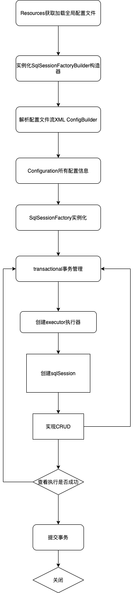

# 1 Mybatis

- [文档](https://mybatis.org/mybatis-3/zh/index.html)

## 1 在Springboot中配置
- 第一步：Maven里面添加mybatis的引用jar包
```xml
<dependency>
    <groupId>org.mybatis.spring.boot</groupId>
    <artifactId>mybatis-spring-boot-starter</artifactId>
    <version>1.3.2</version>
</dependency>
<dependency>
    <groupId>mysql</groupId>
    <artifactId>mysql-connector-java</artifactId>
    <version>5.1.47</version>
</dependency>
<dependency>
    <groupId>org.mybatis</groupId>
    <artifactId>mybatis</artifactId>
    <version>3.5.7</version>
</dependency>
```

- 第二步：在application.yml文件里面添加如下代码
```yml
server:
  port: 8888
spring:
  datasource:
    driver-class-name: com.mysql.jdbc.Driver
    url: jdbc:mysql://hadoop000:3306/test?useUnicode-true&characterEncoding=UTF8&useSSL=false&serverTimezone=Asia/Shanghai
    username: root
    password: xxxxxxxx

mybatis:
  mapper-locations: classpath:mapper/*Mapper.xml
  type-aliases-package: com.bigdata.demo.entity
  
  configuration:
    cache-enabled: true  # 使全局的映射器启用或禁用缓存
    lazy-loading-enabled: true  # 全局启用或禁用延迟加载。当禁用时，所有关联对象都会即时加载
    aggressive-lazy-loading: true  # 当启用时，有延迟加载属性的对象在被调用时将会完全加载任意属性。否则，每种属性将会按需要加载
    multiple-result-sets-enabled: true  # 是否允许单条sql 返回多个数据集  (取决于驱动的兼容性) default:true
    use-column-label: true  # 是否可以使用列的别名 (取决于驱动的兼容性) default:true
    use-generated-keys: true # 允许JDBC 生成主键。需要驱动器支持。如果设为了true，这个设置将强制使用被生成的主键，有一些驱动器不兼容不过仍然可以执行。  default:false
    auto-mapping-behavior: partial  # 指定 MyBatis 如何自动映射 数据基表的列 NONE：不隐射\u3000PARTIAL:部分  FULL:全部
    default-executor-type: simple  # 这是默认的执行类型  （SIMPLE: 简单； REUSE: 执行器可能重复使用prepared statements语句；BATCH: 执行器可以重复执行语句和批量更新）
    map-underscore-to-camel-case: true  # 使用驼峰命名法转换字段
    local-cache-scope: session  # 设置本地缓存范围 session:就会有数据的共享  statement:语句范围 (这样就不会有数据的共享 ) defalut:session
    jdbc-type-for-null: null  # 置但JDBC类型为空时,某些驱动程序 要指定值,default:OTHER，插入空值时不需要指定类型
    call-setters-on-nulls: true  # 如果数据为空的字段，则该字段省略不显示，可以通过添加配置文件，规定查询数据为空是则返回null。


```

- 第三步：设置启动类
```java
@MapperScan("com.bigdata.demo.dao")  // 扫描的配置mapper
@SpringBootApplication
public class DemoApplication {

    public static void main(String[] args) {
        SpringApplication.run(DemoApplication.class, args);
    }

}
```

- 第四步：添加mapper文件和编写dao代码以及service和controller代码
  - 1、在resources文件夹下新建mapper文件夹，下面保存所有数据库访问的sql。
  - 2、新建实体类，我是在entity文件夹下创建的
  - 3、在dao层下新建mapper里面的方法
  - 4、在service层新建调用dao层类的逻辑代码
  - 5、在controller层新建调用service层的逻辑代码

> 接口名和xml名一致？


1 src/main/resources/mapper/UserMapper.xml
```xml
<?xml version="1.0" encoding="UTF-8"?>
<!DOCTYPE mapper PUBLIC "-//mybatis.org//DTD Mapper 3.0//EN" "http://mybatis.org/dtd/mybatis-3-mapper.dtd">
<mapper namespace="com.bigdata.demo.mapper.UserMapper">

    <resultMap id="BaseResultMap" type="com.bigdata.demo.dao.UserDao">
        <result column="id" jdbcType="INTEGER" property="id" />
        <result column="name" jdbcType="VARCHAR" property="name" />
        <result column="pwd" jdbcType="VARCHAR" property="pwd" />
    </resultMap>

    <select id="Sel" resultType="com.bigdata.demo.dao.UserDao">
        select * from user where id = #{id}
    </select>
</mapper>
```

2 com/bigdata/demo/entity/UserDao.java
```java
@Data
@NoArgsConstructor
@AllArgsConstructor
public class UserDao {
    private Integer id;
    private String name;
    private String pwd;
}
```

3 com/bigdata/demo/dao/UserMapper.java
```java
@Repository
public interface UserMapper {

    UserDao Sel(int id);
}
```

4 com/bigdata/demo/service/UserService.java
```java
@Service
public class UserService {
    @Autowired
    UserMapper userMapper;
    public UserDao Sel(int id){
        return userMapper.Sel(id);
    }
}
```

5 controller层
```java
@Component
@EnableScheduling
public class ScheduleTask {

    @Autowired
    private DbService dbService;
    @Autowired
    private UserService userService;

    @Scheduled(cron = "0 0/1 * * * ?")
    public void addTestData() {
        System.out.println("定时任务：" + new Date());

        System.out.println(userService.Sel(1));
    }
}
```

- 第五步：单元测试
```java
@RunWith(SpringRunner.class)
@SpringBootTest(classes = DemoApplication.class)
public class TestControllerTest {

    @Autowired
    private UserService userService;

    @Test
    public void test01() {
        System.out.println(userService.Sel(1));
    }
}
```


## 2 CRUD
### 2.1 namespace
- namespace中的包名要和Dao/接口的包名一致
- resultMap
```xml
<!--column不做限制，可以为任意表的字段，而property须为type 定义的pojo属性-->
<resultMap id="唯一的标识" type="映射的pojo对象">
  <id column="表的主键字段，或者可以为查询语句中的别名字段" jdbcType="字段类型" property="映射pojo对象的主键属性" />
  <result column="表的一个字段（可以为任意表的一个字段）" jdbcType="字段类型" property="映射到pojo对象的一个属性（须为type定义的pojo对象中的一个属性）"/>
  <association property="pojo的一个对象属性" javaType="pojo关联的pojo对象">
    <id column="关联pojo对象对应表的主键字段" jdbcType="字段类型" property="关联pojo对象的主席属性"/>
    <result  column="任意表的字段" jdbcType="字段类型" property="关联pojo对象的属性"/>
  </association>
  <!-- 集合中的property须为oftype定义的pojo对象的属性-->
  <collection property="pojo的集合属性" ofType="集合中的pojo对象">
    <id column="集合中pojo对象对应的表的主键字段" jdbcType="字段类型" property="集合中pojo对象的主键属性" />
    <result column="可以为任意表的字段" jdbcType="字段类型" property="集合中的pojo对象的属性" />  
  </collection>
</resultMap>
```

### 2.2 select/delete/create/update
- id 对应namespace中的方法名
- resultType sql执行的返回值
- parameterType 参数类型
```java
@Repository
public interface UserMapper {
    // 查询单个
    UserDao Sel(int id);
    
    // 查询全部
    List<UserDao> getUserList();

    // insert一个用户
    int addUser(UserDao userDao);

    // update
    int updateUser(UserDao userDao);

    // delete
    int delete(int id);
}
```

```xml
<?xml version="1.0" encoding="UTF-8"?>
<!DOCTYPE mapper PUBLIC "-//mybatis.org//DTD Mapper 3.0//EN" "http://mybatis.org/dtd/mybatis-3-mapper.dtd">
<mapper namespace="com.bigdata.demo.dao.UserMapper">

    <resultMap id="BaseResultMap" type="com.bigdata.demo.entity.UserDao">
        <result column="id" jdbcType="INTEGER" property="id" />
        <result column="name" jdbcType="VARCHAR" property="name" />
        <result column="pwd" jdbcType="VARCHAR" property="pwd" />
    </resultMap>

    <!--    对象中的属性可以直接取出来    -->
    <insert id="addUser" parameterType="com.bigdata.demo.entity.UserDao">
        insert into test.user (id,name,pwd) values(#{id}, #{name}, #{pwd})
    </insert>

    <update id="updateUser" parameterType="com.bigdata.demo.entity.UserDao">
        update test.user set name=#{name}, pwd = #{pwd} where id = #{id}
    </update>

    <delete id="delete" parameterType="int">
        delete from test.user where id = #{id}
    </delete>

    <select id="Sel" resultType="com.bigdata.demo.entity.UserDao">
        select * from user where id = #{id}
    </select>

    <select id="getUserList" resultType="com.bigdata.demo.entity.UserDao">
        select * from user
    </select>
</mapper>
```


## 3 XML配置 

### 1 properties属性

### 2 settings设置

```yml
mybatis:
  mapper-locations: classpath:mapper/*Mapper.xml
  type-aliases-package: com.bigdata.demo.entity
  
  configuration:
    cache-enabled: true  # 使全局的映射器启用或禁用缓存
    lazy-loading-enabled: true  # 全局启用或禁用延迟加载。当禁用时，所有关联对象都会即时加载
    aggressive-lazy-loading: true  # 当启用时，有延迟加载属性的对象在被调用时将会完全加载任意属性。否则，每种属性将会按需要加载
    multiple-result-sets-enabled: true  # 是否允许单条sql 返回多个数据集  (取决于驱动的兼容性) default:true
    use-column-label: true  # 是否可以使用列的别名 (取决于驱动的兼容性) default:true
    use-generated-keys: true # 允许JDBC 生成主键。需要驱动器支持。如果设为了true，这个设置将强制使用被生成的主键，有一些驱动器不兼容不过仍然可以执行。  default:false
    auto-mapping-behavior: partial  # 指定 MyBatis 如何自动映射 数据基表的列 NONE：不隐射\u3000PARTIAL:部分  FULL:全部
    default-executor-type: simple  # 这是默认的执行类型  （SIMPLE: 简单； REUSE: 执行器可能重复使用prepared statements语句；BATCH: 执行器可以重复执行语句和批量更新）
    map-underscore-to-camel-case: true  # 使用驼峰命名法转换字段
    local-cache-scope: session  # 设置本地缓存范围 session:就会有数据的共享  statement:语句范围 (这样就不会有数据的共享 ) defalut:session
    jdbc-type-for-null: null  # 置但JDBC类型为空时,某些驱动程序 要指定值,default:OTHER，插入空值时不需要指定类型
    call-setters-on-nulls: true  # 如果数据为空的字段，则该字段省略不显示，可以通过添加配置文件，规定查询数据为空是则返回null。
```


### 3 设置别名（typeAliases）

- 类型别名可为 Java 类型设置一个缩写名字。
- 它仅用于 XML 配置，意在降低冗余的全限定类名书写

- [文档](https://mybatis.org/mybatis-3/zh/configuration.html#typeAliases)


### 4 映射器（mappers）


## 4 生命周期和作用域


## 5 [resultMap](https://mybatis.org/mybatis-3/zh/sqlmap-xml.html#Result_Maps)（结果集映射）

- 对简单的语句做到零配置，对于复杂一点的语句，只需要描述语句之间的关系就行了


## 6 日志

| logImpl | 指定 MyBatis 所用日志的具体实现，未指定时将自动查找。 | SLF4J \| LOG4J \| LOG4J2 \| JDK_LOGGING \| COMMONS_LOGGING \| STDOUT_LOGGING \| NO_LOGGING |
| ------- | ----------------------------------------------------- | ------------------------------------------------------------ |

- pom.xml

```xml
<dependency>
  <groupId>org.springframework.boot</groupId>
  <artifactId>spring-boot-starter-log4j2</artifactId>
</dependency>
```


## 7 分页

```xml
<dependency>
  <groupId>com.github.pagehelper</groupId>
  <artifactId>pagehelper</artifactId>
  <version>5.0.0</version>
</dependency>
```

- [文档](https://pagehelper.github.io/)

## 8 注解


```java
import org.apache.ibatis.annotations.Param;
import org.apache.ibatis.annotations.Select;
import org.springframework.stereotype.Repository;

import java.util.List;

@Repository
public interface UserMapper {
    // 查询单个
    // 方法存在多个参数，一定用注解
    UserDao Sel(@Param("id") int id);
  
    // 查询全部
    List<UserDao> getUserList();

    // 查询全部
    @Select("select * from test.person")
    List<UserDao> getUserList2();
}
```


## 9 执行原理




## 10 一对多场景

1、关联-association

2、集合-collection

3、所以association是用于一对一和多对一，而collection是用于一对多的关系


- 建表

```sql
CREATE TABLE IF NOT EXISTS `teacher` (
`id` INT(10) NOT NULL,
`name` VARCHAR(30) DEFAULT NULL,
PRIMARY KEY (`id`)
) ENGINE=INNODB DEFAULT CHARSET=utf8;

CREATE TABLE IF NOT EXISTS `student` (
`id` INT(10) NOT NULL,
`name` VARCHAR(30) DEFAULT NULL,
`tid` INT(10) DEFAULT NULL,
PRIMARY KEY (`id`),
KEY `fktid` (`tid`),
CONSTRAINT `fktid` FOREIGN KEY (`tid`) REFERENCES `teacher` (`id`)
) ENGINE=INNODB DEFAULT CHARSET=utf8;


INSERT INTO teacher(`id`, `name`) VALUES (1, '秦老师');

INSERT INTO `student` (`id`, `name`, `tid`) VALUES ('1', '小明', '1');
INSERT INTO `student` (`id`, `name`, `tid`) VALUES ('2', '小红', '1');
INSERT INTO `student` (`id`, `name`, `tid`) VALUES ('3', '小张', '1');
INSERT INTO `student` (`id`, `name`, `tid`) VALUES ('4', '小李', '1');
INSERT INTO `student` (`id`, `name`, `tid`) VALUES ('5', '小王', '1');
```

- Student.java

```java
@Data
public class Student {
    private int id;
    private String name;
    private Teacher teacher;  // 多个学生可以是同一个老师，即多对一
}
```

- Teacher.java

```java
@Data
public class Teacher {
    private int id;
    private String name;
}
```

- StudentMapper.java

```java
@Repository
public interface StudentMapper {
    //获取所有学生及对应老师的信息
    public List<Student> getStudents();
}
```

### 方式1 按查询嵌套处理

-  需求：获取所有学生及对应老师的信息
- 思路：
  - 1. 获取所有学生的信息
       2. 根据获取的学生信息的老师ID->获取该老师的信息
    3. 思考问题，这样学生的结果集中应该包含老师，该如何处理呢，数据库中我们一般使用关联查询？
       1. 做一个结果集映射：StudentTeacher
       2. StudentTeacher结果集的类型为 Student
       3. 学生中老师的属性为teacher，对应数据库中为tid。
          多个 [1,...）学生关联一个老师=> 一对一，一对多
       4. 查看官网找到：association – 一个复杂类型的关联；使用它来处理关联查询
- StudentMapper.xml

```xml
<select id="getStudents" resultMap="TeacherStudent">
  select * from student
</select>

<resultMap id="TeacherStudent" type="com.bigdata.demo.entity.Student">
  <result property="id" column="id"/>
  <result property="name" column="name"/>
   <!--association关联属性 property属性名 javaType属性类型 column在多的一方的表中的列名-->
  <association property="teacher" column="tid" javaType="com.bigdata.demo.entity.Teacher" select="getTeacher"/>
</resultMap>

<!--
   这里传递过来的id，只有一个属性的时候，下面可以写任何值
   association中column多参数配置：
       column="{key=value,key=value}"
       其实就是键值对的形式，key是传给下个sql的取值名称，value是片段一中sql查询的字段名。
-->
<select id="getTeacher" resultType="com.bigdata.demo.entity.Teacher">
  select * from teacher where id = #{id}
</select>
```

### 方式2 按结果嵌套处理

```xml
<select id="getStudents" resultMap="StudentTeacher2">
  select s.id sid, s.name sname, t.name tname  from student s, teacher t
  where s.tid = t.id
</select>

<resultMap id="StudentTeacher2" type="com.bigdata.demo.entity.Student">
  <result property="id" column="sid"/>
  <result property="name" column="sname"/>
  <association property="teacher" javaType="com.bigdata.demo.entity.Teacher">
    <result property="name" column="tname"/>
  </association>
</resultMap>
```


## 11 多对一场景

Teacher.java

```java
@Data
public class Teacher {
    private int id;
    private String name;
    //一个老师多个学生
    private List<Student> students;
}
```

Student.java

```java
@Data
public class Student {

    private int id;
    private String name;
    private int tid;
}
```

TeacherMapper.java

```java
@Repository
public interface TeacherMapper {
    List<Teacher> getTeachers(@Param("id") int id);
}
```

### 方式1 按查询嵌套处理

TeacherMapper.xml

```xml
<select id="getTeacher2" resultMap="TeacherStudent2">
select * from teacher where id = #{id}
</select>
<resultMap id="TeacherStudent2" type="Teacher">
   <!--column是一对多的外键 , 写的是一的主键的列名-->
   <collection property="students" javaType="ArrayList" ofType="Student" column="id" select="getStudentByTeacherId"/>
</resultMap>
<select id="getStudentByTeacherId" resultType="Student">
  select * from student where tid = #{id}
</select>
```


### 方式2 按结果嵌套处理

- 思路:     
-     1. 从学生表和老师表中查出学生id，学生姓名，老师姓名
    2. 对查询出来的操作做结果集映射
      1. 集合的话，使用collection！
          JavaType和ofType都是用来指定对象类型的
          JavaType是用来指定pojo中属性的类型
          ofType指定的是映射到list集合属性中pojo的类型。

TeacherMapper.xml

```xml
<select id="getTeachers" resultMap="TeacherStudent">
  select s.id sid, s.name sname , t.name tname, t.id tid
  from student s,teacher t
  where s.tid = t.id and t.id=#{id}
</select>

<resultMap id="TeacherStudent" type="com.bigdata.demo.entity.Teacher">
  <result  property="name" column="tname"/>
  <collection property="students" ofType="com.bigdata.demo.entity.Student">
    <result property="id" column="sid" />
    <result property="name" column="sname" />
    <result property="tid" column="tid" />
  </collection>
</resultMap>
```


## 12 [动态SQL](https://mybatis.org/mybatis-3/zh/dynamic-sql.html)

配置：

```yml
map-underscore-to-camel-case: true  # 使用驼峰命名法转换字段
```

SQL

```sql
CREATE TABLE `blog` (
`id` varchar(50) NOT NULL COMMENT '博客id',
`title` varchar(100) NOT NULL COMMENT '博客标题',
`author` varchar(30) NOT NULL COMMENT '博客作者',
`create_time` datetime NOT NULL COMMENT '创建时间',
`views` int(30) NOT NULL COMMENT '浏览量'
) ENGINE=InnoDB DEFAULT CHARSET=utf8;
```


实体类

Blog.java

```java
@Data
public class Blog {
    public String id;
    public String title;
    public String author;
    public Date createTime;
    public int views;
}
```

###  IF

```xml
<sql id="if-title-author">
  <if test="title != null">
    and title = #{title}
  </if>
  <if test="author != null">
    and author = #{author}
  </if>
</sql>

<--使用代码片段/-->
<select id="queryIF" parameterType="map" resultType="com.bigdata.demo.entity.Blog">
  select * from blog where 1=1
  <include refid="if-title-author"/>
</select>
```


### choose、when、otherwise

- 有时候，我们不想使用所有的条件，而只是想从多个条件中选择一个使用。针对这种情况，MyBatis 提供了 choose 元素，它有点像 Java 中的 switch 语句。

- 还是上面的例子，但是策略变为：传入了 “title” 就按 “title” 查找，传入了 “author” 就按 “author” 查找的情形。若两者都没有传入，就返回标记为 featured 的 BLOG（这可能是管理员认为，与其返回大量的无意义随机 Blog，还不如返回一些由管理员精选的 Blog）。

```xml
<select id="findActiveBlogLike" resultType="com.bigdata.demo.entity.Blog">
  SELECT * FROM BLOG WHERE id = '1'
  <choose>
    <when test="title != null">
      AND title like #{title}
    </when>
    <when test="author != null">
      AND author like #{author}
    </when>
    <otherwise>
      AND views = 10
    </otherwise>
  </choose>
</select>
```

### where

- *where* 元素只会在子元素返回任何内容的情况下才插入 “WHERE” 子句。而且，若子句的开头为 “AND” 或 “OR”，*where* 元素也会将它们去除

```xml
<select id="findActiveBlogLike" resultType="com.bigdata.demo.entity.Blog">
  SELECT * FROM BLOG
  <where>
    <if test="id != null">
         id = #{id}
    </if>
    <if test="title != null">
        AND title like #{title}
    </if>
    <if test="author != null">
        AND author like #{author}
    </if>
  </where>
</select>
```

### set

- *set* 元素会动态地在行首插入 SET 关键字，并会删掉额外的逗号（这些逗号是在使用条件语句给列赋值时引入的）

```xml
<update id="updateAuthorIfNecessary">
  update Author
    <set>
      <if test="username != null">username=#{username},</if>
      <if test="password != null">password=#{password},</if>
      <if test="email != null">email=#{email},</if>
      <if test="bio != null">bio=#{bio}</if>
    </set>
  where id=#{id}
</update>
```

### trim

- *prefixOverrides* 属性会忽略通过管道符分隔的文本序列（注意此例中的空格是必要的）。上述例子会移除所有 *prefixOverrides* 属性中指定的内容，并且插入 *prefix* 属性中指定的内容

### foreach

```xml
<select id="queryAll" parameterType="map" resultType="com.bigdata.demo.entity.Blog">
  select * from blog
  <where>
    <foreach collection="ids" item="id" open="and (" separator="OR" close=")">
      id = #{id}
    </foreach>
  </where>
</select>
```


# 2 Mybatis Generator

