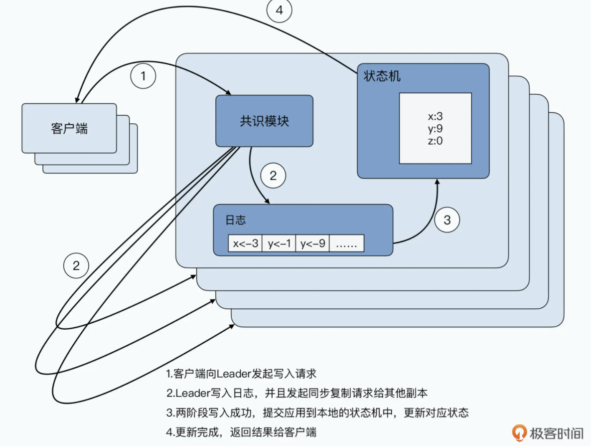

2013 年发表的一篇论文[《In Search of an Understandable Consensus Algorithm》](https://web.stanford.edu/~ouster/cgi-bin/papers/raft-atc14)

状态机复制（State Machine Replication）”问题，简称 SMR 问题

[TiDB](https://www.vldb.org/pvldb/vol13/p3072-huang.pdf),  [TiDB解释](https://blog.csdn.net/maowenbei/article/details/112236958)

# Raft 算法拆解

Paxos 算法本身在理论上并没有什么问题，它的主要问题是，不太容易理解。那么，Raft 算法是为什么可以让我们容易理解的呢？我觉得有三点原因

- Paxos 算法的出发点，是为了达成分布式共识。状态机复制，只是分布式共识的一个特例，所以如果我们看原始的 Paxos 算法，去理解 Chubby 乃至 ZooKeeper 的实现，会有一个转化过程，不容易理解。而 Raft 算法，则是直接就从状态机复制的问题出发，算法和需要解决的问题直接对应。
- 因为是分布式共识问题，所以 Paxos 算法可以从任何一个节点发起数据写入，我们就需要考虑各种数据写入时序情况下的共识问题。而 Raft 算法则把问题拆分成了一个个独立的子问题，比如 Leader 选举（Leader Election）、日志复制（Log Replication）、安全（Safety）和成员变化（Membership Changes）等等。这些子问题都解决了，状态机复制的问题自然就解决了。我们只要能够理解和证明每一个子问题就够了，这个对于问题分而治之的办法，降低了理解问题的复杂度。
- 最后，Raft 算法加强了系统里的限制，使得问题在很多状态下被简化了。比如，Raft 算法是有一个强 Leader 的，而 Paxos 算法是无 Leader 或者弱 Leader 的。而因为有了强 Leader，Raft 算法就可以进一步地要求日志里面不能有空洞。这使得我们不需要像 Megastore 的论文里那样，面临某一个数据副本有“空洞”的情况，再通过 no-op 这样的操作，再去同步这些空洞的数据。

## Raft 算法的思路

- 首先是让系统里始终有一个 Leader，所有的数据写入，都是发送到 Leader。一方面，Leader 会在本地写入，另一方面，Leader 需要把对应的数据写入复制到其他的服务器上。这样，问题就变简单了，我们只需要确保两点，第一个是系统里始终有 Leader 可用；第二个，是基于 Leader 向其他节点复制数据，始终能确保一致性就好了。
- 因为 Leader 所在的服务器可能会挂掉，那么挂掉之后，我们需要尽快确认一个新 Leader，所以我们就需要解决第一个子问题，就是 Leader 选举问题。
- 我们需要保障分布式共识，所以 Leader 需要把日志复制到其他节点上，并且确保所有节点的日志始终是一致的。这个，就带来了第二个问题，也就是日志复制问题。
- 同时，在 Leader 挂掉，切换新 Leader 之后，我们会遇到一个挑战，新的 Leader 可能没有同步到最新的日志写入。而这可能会导致，新的 Leader 会尝试覆盖之前 Leader 已经写入的数据。这个问题就是我们需要解决的第三个问题，也就是“安全性”问题。

## 基本概念和算法框架

- Leader，它会接收外部客户端数据写入，并且向 Follower 请求同步日志的服务器。同一时间，在整个 Raft 集群里，只会有一个 Leader。
- Follower，它会接收 Leader 同步的日志，然后把日志在本地复制一份。
- Candidate，这是一个临时角色，在 Leader 选举过程中才会出现。

### Leader 选举

- 在 Raft 里，Leader 会定期向 Follower 发送心跳。Follower 也会设置一个超时时间，如果超过超时时间没有接收到心跳，那么它就会认为 Leader 可能挂掉了，就会发起一轮新的 Leader 选举。
- Follower 发起选举，会做两个动作。第一个，是先给自己投一票；第二个，是向所有其他的 Follower 发起一个 RequestVote 请求，也就是要求那些 Follower 为自己投票。这个时候，Follower 的角色，就转变成了 Candidate。
- 在每一个 RequestVote 的请求里，除了有发起投票的服务器信息之外，还有一个任期（Term）字段。这个字段，本质上是一个 Leader 的“版本信息”或者说是“逻辑时钟”。
- 每个 Follower，在本地都会保留当前 Leader 是哪一个任期的。当它要发起投票的时候，会把任期自增 1，和请求一起发出去。
- 其他 Follower 在接收到 RequestVote 请求的时候，会去对比请求里的任期和本地的任期。如果请求的任期更大，那么它会投票给这个 Candidate。不然，这个请求会被拒绝掉。
- 除了对比任期之外，Candidate 还需要满足后面我们讨论的一些“安全性”要求，那就是选举出来的 Leader 上，一定要有最新的已经提交的日志，这个我们在这里先不聊，后面在讲解安全性的时候会深入讲解。
- 在一个任期里，一台服务器最多给一个 Candidate 投票，所以投票过程是先到先得，两个服务器都发起了 RequestVote，我们的 Follower 也只能投给一台。

### 日志复制

Leader 选出来了，那我们自然就可以向 Leader 发送写入数据的请求。既然是一个“状态机复制”的方案，写入请求其实就是一条操作日志的追加写。在 Raft 里，就是通过一个 AppendEntries 的 RPC 调用实现的。

我们追加写入的每一条日志，都包含三部分信息：

- 第一个，是日志的索引，这是一个随着数据写入不断自增的字段。
- 第二个，是日志的具体内容，也就是具体的状态机更新的操作是什么。
- 第三个，就是这一次数据写入，来自 Leader 的哪一个任期。

我们在追加写入日志的时候，不只是单单追加最新的一条日志，还需要做一个校验，确保对应的 Follower 的数据和 Leader 是一致的：

- 首先，在发起追加写入日志的复制请求的时候，Leader 的 AppendEntries 的 RPC 里，不仅会有最新的一条日志，还会有上一条日志里的日志索引和任期信息。
- Follower 会先对比日志索引和任期信息，在自己的日志里寻找相同索引和任期的日志所在的位置。
  - 如果找到了，Follower 会把这个位置之后的日志都删除掉。然后把新日志追加上去。
  - 如果找不到，Follower 会拒绝新追加的日志。然后，Leader 就知道，这个 Follower 没有同步到最新的日志，那么 Leader 会在自己的日志里，找到前一条日志，再重新发送给 Follower。
- Leader 会不断重复这个过程，确保找到和 Follower 的同步点，找到了之后，就会把这个位置之后的日志都删除掉，然后把同步点之后的日志一条条复制过去。

> 本质上，Raft 的复制操作，是让 Leader 为每一个 Follower 都从 Leader 的尾部往头部循环，找到 Follower 最新同步到哪里的日志。然后从这个位置开始，往后复制 Leader 的日志，直到最新一条的日志。通过这个过程，我们把每一次 Leader 的日志复制，都变成了一次强制所有 Follower 和当前 Leader 日志同步的过程。

### 安全性

首先要注意，Raft 里，每一个服务器写入的日志，会有两种状态，一种是未提交的，一种是已提交的。我们这里所说的最新，指的是已提交的日志。我们想要确保 Leader 的日志是最新的，只需要在 Leader 选举的时候，让只有最新日志的 Leader 才能被选上就好了。

而要做到这一点，也并不困难，Raft 的做法是，直接在选举的 RPC 里，顺便完成 Leader 是否包含所有最新的日志就好了